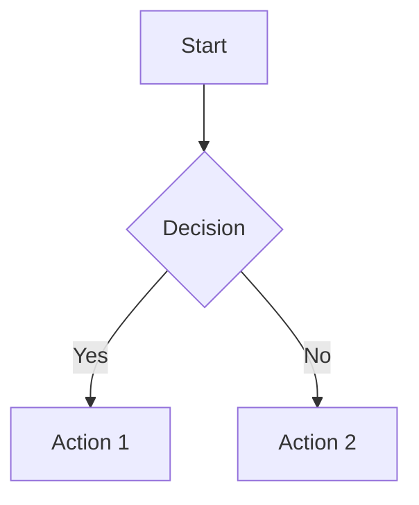

# Mermaid-to-Excalidraw Script Documentation

## Overview & Purpose

The `Mermaid-to-Excalidraw.md` script converts Mermaid diagram syntax into Excalidraw elements within Obsidian. It reads Mermaid code from a companion file (`to_convert.md`), processes it through the ExcalidrawAutomate API, and renders the result on the Excalidraw canvas.

### Input/Output Flow

```
to_convert.md (Mermaid syntax)
        │
        ▼
  Mermaid-to-Excalidraw.md (this script)
        │
        ▼
  Excalidraw Canvas (visual diagram)
```

### Supported Mermaid Diagram Types

| Diagram Type | Syntax Keyword | Output Type |
|--------------|----------------|-------------|
| Flowchart | `graph`, `flowchart` | Native elements (editable) |
| Sequence Diagram | `sequenceDiagram` | SVG image |
| Class Diagram | `classDiagram` | SVG image |
| State Diagram | `stateDiagram` | SVG image |
| Entity Relationship | `erDiagram` | SVG image |
| Pie Chart | `pie` | SVG image |
| Mindmap | `mindmap` | SVG image |
| Git Graph | `gitGraph` | SVG image |

---

## Script Architecture (Line-by-Line Breakdown)

### Lines 1-5: File Path Resolution

```javascript
const scriptFile = app.vault.getAbstractFileByPath(
  "Excalidraw/Scripts/Yours/Mermaid-to-Excalidraw.md"
);
const folderPath = scriptFile.parent.path;
```

**What it does:**
- `app.vault.getAbstractFileByPath()` retrieves a file or folder object from the Obsidian vault using its path
- `.parent` returns the parent `TFolder` object
- `.path` extracts the string path of that folder

**Why it matters:**
This allows the script to locate sibling files (like `to_convert.md`) relative to itself, making the script portable within the vault structure.

---

### Lines 7-15: Input File Reading

```javascript
const targetFile = app.vault.getAbstractFileByPath(folderPath + "/to_convert.md");

if (!targetFile) {
  new Notice("Error: to_convert.md not found in " + folderPath);
  return;
}

let mermaidCode = await app.vault.read(targetFile);
```

**What it does:**
- Constructs the path to `to_convert.md` in the same folder
- Checks if the file exists; shows error notification if not
- `app.vault.read()` reads the raw file content from disk

**Key behaviors:**
- `app.vault.read()` always reads fresh content from disk (not cached)
- `new Notice()` displays a toast notification in Obsidian's UI
- Early `return` prevents script execution if file is missing

---

### Lines 17-21: Markdown Fence Stripping

```javascript
mermaidCode = mermaidCode
  .replace(/^```(?:mermaid)?\s*\n?/gm, "")
  .replace(/```\s*$/gm, "")
  .trim();
```

**Regex breakdown:**

| Pattern | Meaning |
|---------|---------|
| `^```(?:mermaid)?\s*\n?` | Match ` ``` ` or ` ```mermaid ` at line start |
| `(?:mermaid)?` | Non-capturing group, optional "mermaid" |
| `\s*\n?` | Optional whitespace and newline |
| `gm` flags | Global (all matches) + Multiline (^ matches line starts) |
| ````\s*$` | Match closing ` ``` ` at line end |

**Why it matters:**
Users can paste Mermaid code with or without markdown fences. This normalization ensures the Mermaid parser receives clean syntax.

---

### Lines 23-26: ExcalidrawAutomate Initialization

```javascript
ea = ExcalidrawAutomate;
ea.reset();
ea.setView("first");
```

**What each method does:**

| Method | Purpose |
|--------|---------|
| `ea = ExcalidrawAutomate` | Reference the global ExcalidrawAutomate object |
| `ea.reset()` | Clear any previous element state (critical for clean runs) |
| `ea.setView("first")` | Target the first open Excalidraw view for output |

**`setView()` options:**
- `"first"` - First open Excalidraw tab
- `"active"` - Currently active view (must be Excalidraw)
- `"auto"` - Automatically select appropriate view

---

### Lines 28-30: Mermaid Conversion

```javascript
await ea.addMermaid(mermaidCode);
ea.addElementsToView();
```

**What happens internally:**

1. **`ea.addMermaid()`** - The core conversion function:
   - Parses Mermaid syntax
   - Detects diagram type
   - Converts to Excalidraw element skeletons
   - Stores elements in internal state

2. **`ea.addElementsToView()`** - Renders to canvas:
   - Takes stored element skeletons
   - Creates actual Excalidraw elements
   - Adds them to the target view

---

### Line 32: User Feedback

```javascript
new Notice("Mermaid diagram converted!");
```

Displays a success toast notification to confirm completion.

---

## Deep Dive: `ea.addMermaid()` Internals

The `addMermaid()` function implements a three-stage pipeline:

### Stage 1: Mermaid Parsing

```
Mermaid Code String
        │
        ▼
┌───────────────────┐
│ Mermaid Library   │
│ Initialization    │
└─────────┬─────────┘
          │
          ▼
┌───────────────────┐
│ SVG Rendering     │
│ (temporary DOM)   │
└─────────┬─────────┘
          │
          ▼
┌───────────────────┐
│ Diagram Type      │
│ Detection         │
└───────────────────┘
```

- Mermaid library renders the diagram to an SVG in a temporary DOM element
- Diagram type is detected via `diagram.type` property
- This determines which conversion path to use

### Stage 2: Type-Specific Data Extraction

**For Flowcharts:**
```
SVG + Mermaid AST
        │
        ▼
┌─────────────────────────┐
│ parseMermaidFlowChart   │
│ Diagram()               │
└───────────┬─────────────┘
            │
            ▼
┌─────────────────────────┐
│ Semantic Data:          │
│ - Node positions        │
│ - Node shapes           │
│ - Edge connections      │
│ - Labels                │
└─────────────────────────┘
```

**For Other Types:**
- Full SVG is captured as a base64-encoded image
- No semantic data extraction occurs

### Stage 3: Excalidraw Conversion

**Flowchart path:**
```
Semantic Data
        │
        ▼
┌─────────────────────────┐
│ graphToExcalidraw()     │
└───────────┬─────────────┘
            │
            ▼
┌─────────────────────────┐
│ ExcalidrawElement       │
│ Skeleton Array:         │
│ - Rectangles            │
│ - Diamonds              │
│ - Ellipses              │
│ - Arrows                │
│ - Text labels           │
└─────────────────────────┘
```

**Other types path:**
```
SVG String
        │
        ▼
┌─────────────────────────┐
│ Base64 Encoding         │
└───────────┬─────────────┘
            │
            ▼
┌─────────────────────────┐
│ Single Image Element    │
│ (embedded SVG)          │
└─────────────────────────┘
```

---

## Conversion Behavior by Diagram Type

### Flowcharts (Native Elements)

Only flowcharts produce native, editable Excalidraw elements:

| Mermaid Shape | Excalidraw Element |
|---------------|-------------------|
| `[text]` Rectangle | Rectangle |
| `{text}` Diamond | Diamond |
| `((text))` Circle | Ellipse |
| `([text])` Stadium | Rectangle with rounded ends |
| `-->` Arrow | Arrow with binding |
| Subgraph | Grouped elements |

**Example flowchart:**


Produces:
- 4 shape elements (editable rectangles/diamonds)
- 3 arrow elements (with connection bindings)
- 4 text labels (editable)

### All Other Types (SVG Images)

Sequence diagrams, class diagrams, state diagrams, etc. are rendered as single SVG images embedded in Excalidraw. These are:
- Viewable but not editable as shapes
- Scalable without quality loss
- Not decomposable into individual elements

---

## Data Flow Diagram

```
┌─────────────────────┐
│   to_convert.md     │  Raw Mermaid code (with or without fences)
└──────────┬──────────┘
           │ app.vault.read()
           ▼
┌─────────────────────┐
│   Regex Cleanup     │  Strip ```mermaid fences
└──────────┬──────────┘
           │
           ▼
┌─────────────────────┐
│   ea.addMermaid()   │  Mermaid to Excalidraw conversion
└──────────┬──────────┘
           │
     ┌─────┴─────┐
     ▼           ▼
┌─────────┐ ┌─────────┐
│Flowchart│ │  Other  │
│ Parser  │ │  Types  │
└────┬────┘ └────┬────┘
     │           │
     ▼           ▼
┌─────────┐ ┌─────────┐
│ Native  │ │  SVG    │
│Elements │ │ Image   │
└────┬────┘ └────┬────┘
     └─────┬─────┘
           ▼
┌─────────────────────┐
│ea.addElementsToView │  Render to canvas
└──────────┬──────────┘
           ▼
┌─────────────────────┐
│  Excalidraw Canvas  │  Visual output
└─────────────────────┘
```

---

## API Reference

### Obsidian Vault API

| Method | Description |
|--------|-------------|
| `app.vault.getAbstractFileByPath(path)` | Returns `TFile` or `TFolder` at the given path, or `null` if not found |
| `app.vault.read(file)` | Reads file content fresh from disk (async) |
| `app.vault.cachedRead(file)` | Reads cached content (faster, may be stale) |
| `file.parent` | Returns parent `TFolder` object |
| `folder.path` | Returns string path of folder |

### ExcalidrawAutomate API

| Method | Description |
|--------|-------------|
| `ea.reset()` | Clears internal element state; call before each script run |
| `ea.setView(target)` | Sets target view: `"first"`, `"active"`, or `"auto"` |
| `ea.addMermaid(code)` | Converts Mermaid code to Excalidraw elements |
| `ea.addElementsToView()` | Renders stored elements to the target canvas |
| `ea.getExcalidrawAPI()` | Returns the low-level Excalidraw API object |
| `ea.addRect(...)` | Adds a rectangle element |
| `ea.addDiamond(...)` | Adds a diamond element |
| `ea.addEllipse(...)` | Adds an ellipse element |
| `ea.addArrow(...)` | Adds an arrow element |
| `ea.addText(...)` | Adds a text element |

### Obsidian Notifications

```javascript
new Notice(message, duration?)
```

| Parameter | Type | Description |
|-----------|------|-------------|
| `message` | string | Text to display |
| `duration` | number (optional) | Milliseconds to show (default ~5000) |

---

## Troubleshooting

### "to_convert.md not found"

**Cause:** The `to_convert.md` file doesn't exist in the same folder as the script.

**Solution:** Create `to_convert.md` in `Excalidraw/Scripts/Yours/` and paste your Mermaid code.

---

### Diagram doesn't appear

**Possible causes:**
1. Invalid Mermaid syntax
2. No Excalidraw view open
3. Script state not reset

**Solutions:**
1. Validate syntax at [mermaid.live](https://mermaid.live)
2. Open an Excalidraw file before running
3. The script calls `ea.reset()` automatically, but check for errors

---

### Elements not editable

**Cause:** Only flowcharts (`graph` or `flowchart`) produce native Excalidraw elements. All other diagram types render as SVG images.

**Workaround:** For editable diagrams, restructure your data as a flowchart when possible.

---

### Arrow connections not working

**Cause:** After conversion, arrows may appear visually connected but lack binding data.

**Solution:** Click on arrow endpoints and re-bind to shapes manually, or use the Excalidraw binding tools.

---

### Large diagrams appear cut off

**Cause:** Very complex diagrams may exceed rendering limits.

**Solutions:**
1. Break into smaller subdiagrams
2. Simplify node/edge count
3. Use the zoom-to-fit feature after rendering

---

## Usage Example

### 1. Create `to_convert.md`

```markdown
graph TD
    A[User Request] --> B{Valid?}
    B -->|Yes| C[Process]
    B -->|No| D[Error]
    C --> E[Response]
    D --> E
```

### 2. Open an Excalidraw file

Ensure at least one `.excalidraw` file is open in Obsidian.

### 3. Run the script

Use the Excalidraw script runner or command palette to execute `Mermaid-to-Excalidraw`.

### 4. Result

The flowchart appears on your Excalidraw canvas with:
- 5 editable shape nodes
- 5 connected arrows
- All text labels editable

---

## Version Information

- **Script version:** Documented from source
- **Requires:** Obsidian with Excalidraw plugin
- **ExcalidrawAutomate:** Built into Excalidraw plugin
