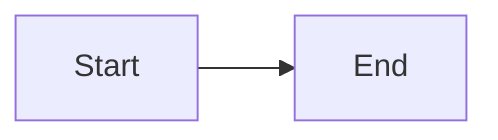
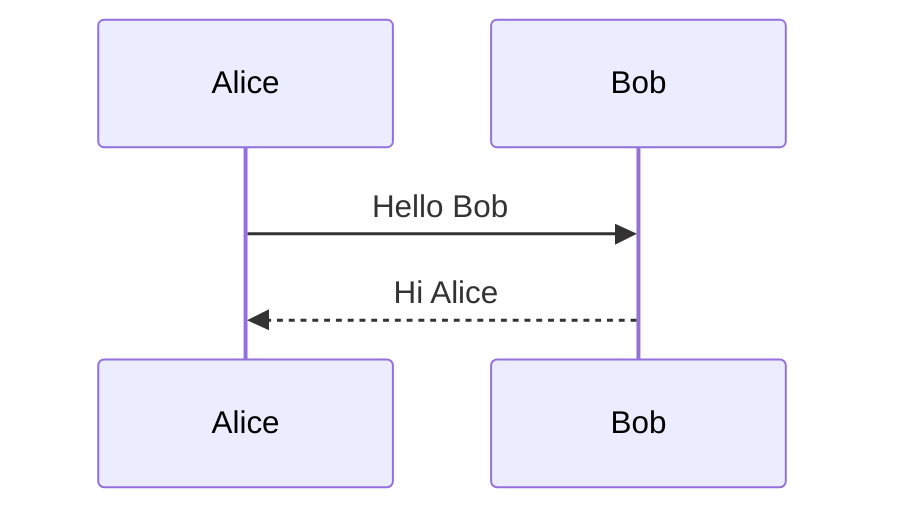
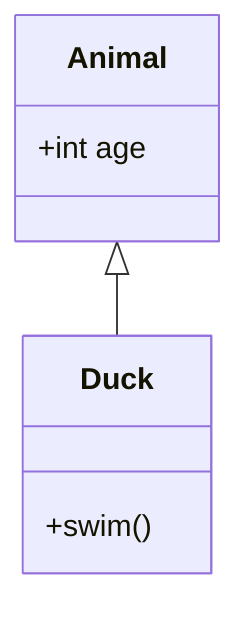
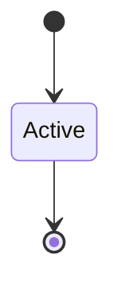
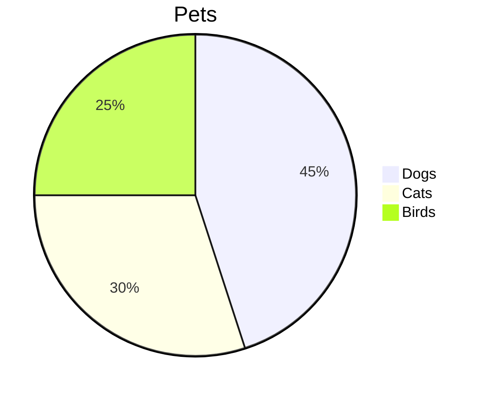
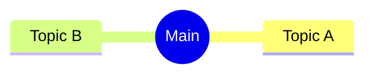

# Mermaid Test Diagrams

Test diagrams for verifying Mermaid-to-Excalidraw script compatibility.
Copy one diagram at a time to `to_convert.md` and run the script.

---

## 1. Flowchart (Native Excalidraw elements)

---

## 2. Sequence Diagram

---

## 3. Class Diagram

---

## 4. State Diagram

---

## 5. Pie Chart

---

## 6. Mindmap

---

## Verification Results (2026-01-24)

| Diagram Type | Status |
|--------------|--------|
| Flowchart | ✓ Native elements |
| Sequence Diagram | ✓ Image |
| Class Diagram | ✓ Image |
| State Diagram | ✓ Image |
| Pie Chart | ✓ Image |
| Mindmap | ✓ Image |
