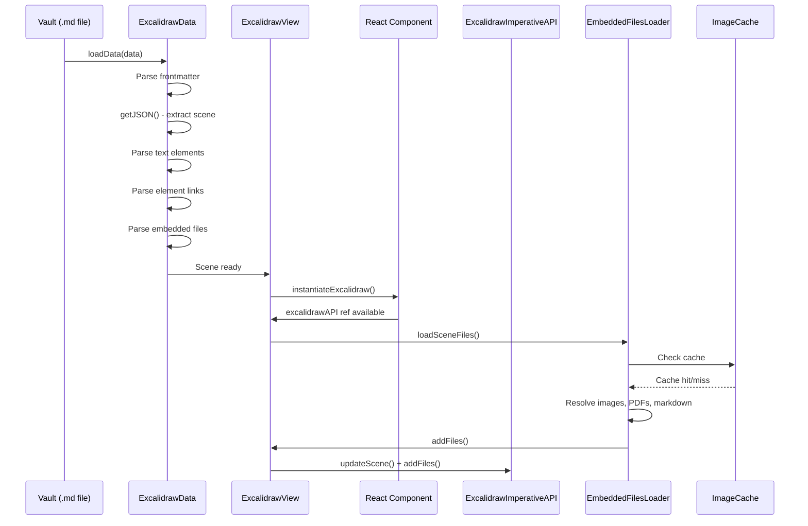
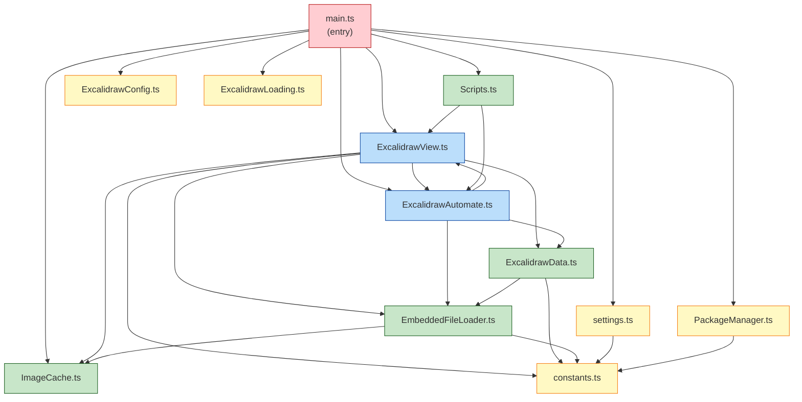

# Codebase Orientation & Mental Model

> **obsidian-excalidraw-plugin** -- A deep-dive learning guide
> Author of plugin: Zsolt Viczian
> This document: Codebase orientation, terminology, architecture, and reading order.

---

## Table of Contents

1. [What This Plugin Does](#1-what-this-plugin-does)
2. [Key Terminology Table](#2-key-terminology-table)
3. [High-Level Architecture Diagram](#3-high-level-architecture-diagram)
4. [Annotated Source Layout](#4-annotated-source-layout)
5. [The Seven Managers](#5-the-seven-managers)
6. [Recommended Reading Order](#6-recommended-reading-order)
7. [Key Numbers](#7-key-numbers)
8. [Build & Development Quick Reference](#8-build--development-quick-reference)
9. [Coordinate Systems & Rendering Pipeline](#9-coordinate-systems--rendering-pipeline)
10. [File Format Deep Primer](#10-file-format-deep-primer)
11. [Cross-File Dependency Map](#11-cross-file-dependency-map)
12. [Glossary of Recurring Patterns](#12-glossary-of-recurring-patterns)

---

## 1. What This Plugin Does

Obsidian-Excalidraw is a plugin for [Obsidian.md](https://obsidian.md) that integrates the
[Excalidraw](https://excalidraw.com/) whiteboard drawing tool as a first-class
citizen within the Obsidian knowledge-management ecosystem.

What makes this plugin remarkable is not merely that it embeds a drawing canvas
-- it is the depth of integration with Obsidian's linking, transclusion, and
metadata features.

### Core Capabilities

| Capability | Description |
|---|---|
| **Markdown-native storage** | Drawings are `.md` files. The YAML frontmatter marks them as Excalidraw files; the JSON scene data is stored in a fenced code block (optionally LZString-compressed). This means standard Obsidian search, backlinks, tags, and graph view all work. |
| **Bidirectional linking** | Text elements can contain `[[wiki-links]]` and `[markdown](links)`. These are parsed in `parsed` text mode, and raw markup is shown in `raw` mode. Element-level links allow clicking shapes to navigate. |
| **Transclusion** | Markdown files, images, PDFs, and even other Excalidraw drawings can be embedded inside a drawing as image elements. The `EmbeddedFileLoader` resolves these at load time. |
| **LaTeX equations** | LaTeX formulas are rendered via MathJax (built separately in `MathjaxToSVG/`) and stored as image elements with the formula as metadata. |
| **PDF embedding** | PDF pages are rendered into image elements with per-page crop support and page-view property tracking. |
| **Image caching** | Rendered previews are cached in IndexedDB (`ImageCache`) so re-rendering is fast. Backup drawing data is also stored for crash recovery. |
| **Scripting engine** | A configurable folder of `.md` script files are discovered at startup. Each script receives a pre-configured `ExcalidrawAutomate` (EA) instance. The community maintains 80+ scripts in `ea-scripts/`. |
| **ExcalidrawAutomate API** | A 4000+ line public API class that external plugins (ExcaliBrain, Templater scripts, Dataview scripts) use to programmatically create and modify drawings. |
| **Multi-window support** | Obsidian supports popout windows. Each window gets its own React/ReactDOM/ExcalidrawLib instances via `PackageManager`. |
| **Embeddable views** | Markdown files can be embedded as live editable views inside the drawing canvas (not just images). |
| **Custom fourth font** | Users can load a custom font from the vault. CJK (Chinese/Japanese/Korean) font support is built in. |
| **Auto-export** | Drawings can be automatically exported as SVG/PNG alongside the `.md` file for use in other tools. |

### The Excalidraw Fork

The plugin uses `@zsviczian/excalidraw`, a fork of the upstream Excalidraw library
maintained by Zsolt Viczian. This fork adds Obsidian-specific hooks such as:

- `obsidianUtils` integration for link handling
- Custom embeddable support
- Modified event handling for Obsidian's workspace model
- Font registration APIs for the fourth font and CJK fonts

The fork is NOT bundled via normal imports. It is compressed at build time and
eval'd at runtime -- see `PackageManager` and `rollup.config.js` for details.

---

## 2. Key Terminology Table

Understanding these terms is essential before reading any source code.

| Term | Where Defined | Description |
|---|---|---|
| **ExcalidrawPlugin** | `src/core/main.ts:114` | The main plugin class extending Obsidian's `Plugin`. Singleton -- one instance for the entire plugin lifecycle. Owns all managers, the global EA instance, settings, and master maps. |
| **ExcalidrawView** | `src/view/ExcalidrawView.ts:289` | Per-tab view extending `TextFileView`. Renders the Excalidraw React component. At ~6678 lines, this is the largest file in the codebase. Each open drawing tab has its own `ExcalidrawView` instance. |
| **ExcalidrawAutomate (EA)** | `src/shared/ExcalidrawAutomate.ts:182` | The public scripting API. NOT the scene itself -- it is a **staging area** ("workbench"). You create/modify elements in EA, then commit them to the scene via `addElementsToView()`. External plugins access it via `window.ExcalidrawAutomate`. |
| **ExcalidrawData** | `src/shared/ExcalidrawData.ts:472` | Parses and serializes the markdown file format. Manages `textElements` map (raw/parsed text), `elementLinks` map, `files` map (embedded images), `equations` map, and `mermaids` map. Each `ExcalidrawView` owns one instance. |
| **TextMode** | `src/shared/TextMode.ts` | An enum with two values: `parsed` (markdown links are expanded into display text) and `raw` (original markup is shown). Controlled by the `excalidraw-plugin` frontmatter key. |
| **PackageManager** | `src/core/managers/PackageManager.ts:17` | Manages per-window React/Excalidraw package instances. Maintains `Map<Window, Packages>`. When a popout window opens, it eval's compressed JS strings in that window's context. Validates packages contain essential methods (`restoreElements`, `exportToSvg`). |
| **EmbeddedFileLoader** | `src/shared/EmbeddedFileLoader.ts` | Resolves and loads images, PDFs, markdown embeds, and URLs embedded in drawings. Handles recursion watchdog for circular embeds. Manages color-map replacement for SVG recoloring. |
| **EmbeddedFile** | `src/shared/EmbeddedFileLoader.ts` | A class representing a single embedded file reference within a drawing. Stores the `fileId`, resolved `TFile`, `DataURL`, mime type, size, and rendering state. |
| **ScriptEngine** | `src/shared/Scripts.ts:24` | Discovers `.md` files in the configured script folder, registers them as Obsidian commands, watches for file changes (create/rename/delete), and executes scripts with a pre-configured EA instance. |
| **ImageCache** | `src/shared/ImageCache.ts:38` | Singleton IndexedDB-based cache with two object stores: `imageCache` (rendered preview SVG/PNG blobs) and `drawingBAK` (backup drawing data). Keyed by composite keys including filepath, theme, scale, and format. |
| **hookServer** | `src/view/ExcalidrawView.ts:304` | The EA instance that provides event hooks for a specific view. Defaults to `plugin.ea` but can be overridden per-view via `setHookServer()`. Scripts can register `onViewModeChange`, `onLinkClick`, and other callbacks on this instance. |
| **Semaphores** | `src/view/ExcalidrawView.ts:315-333` | A `ViewSemaphores` object on each `ExcalidrawView` containing boolean/numeric flags for concurrency control: `saving`, `dirty`, `viewloaded`, `autosaving`, `preventReload`, `isEditingText`, `justLoaded`, etc. |
| **Frontmatter marker** | YAML frontmatter | The key `excalidraw-plugin: parsed` or `excalidraw-plugin: raw` in the file's YAML frontmatter. This is how the plugin identifies which `.md` files are Excalidraw drawings and which text mode to use. Checked via `FRONTMATTER_KEYS["plugin"]` at `src/constants/constants.ts`. |
| **filesMaster** | `src/core/main.ts:137` | A `Map<FileId, FileMasterInfo>` on the plugin instance. A master list of all known file IDs across all open drawings. Used to facilitate copy/paste of images between drawings. |
| **equationsMaster** | `src/core/main.ts:139` | A `Map<FileId, string>` mapping file IDs to LaTeX formula strings. Global across all views. |
| **mermaidsMaster** | `src/core/main.ts:140` | A `Map<FileId, string>` mapping file IDs to Mermaid diagram text. Global across all views. |
| **Packages** | `src/types/types.ts` | A type `{react, reactDOM, excalidrawLib}` representing the three runtime packages needed to render Excalidraw. Each window has its own set. |
| **DEVICE** | `src/constants/constants.ts` | A global object tracking platform capabilities: `isMobile`, `isIOS`, `isMacOS`, `isLinux`, `isWindows`. Used extensively for platform-specific behavior. |
| **excalidrawFileModes** | `src/core/main.ts:123` | A `{[file: string]: string}` dictionary tracking whether each file should open as `"excalidraw"` or `"markdown"`. Keyed by leaf ID or file path. Cleaned up on leaf detach. |
| **compatibilityMode** | `src/view/ExcalidrawView.ts:339` | A boolean flag on the view. When `true`, the drawing was loaded from a legacy `.excalidraw` JSON file rather than the markdown format. |
| **autosaveTimer** | `src/view/ExcalidrawView.ts:336` | A `setInterval` timer on each view that triggers `save()` periodically if the `dirty` semaphore is set. Interval is configurable in settings. |

---

## 3. High-Level Architecture Diagram

```mermaid
graph TB
    subgraph "Obsidian Host Application"
        OBS_API["Obsidian API<br/>(Plugin, Workspace, Vault, MetadataCache)"]
    end

    subgraph "Plugin Singleton (ExcalidrawPlugin)"
        PLUGIN["ExcalidrawPlugin<br/>src/core/main.ts:114"]

        subgraph "Manager Layer"
            FM["PluginFileManager<br/>src/core/managers/FileManager.ts"]
            EM["EventManager<br/>src/core/managers/EventManager.ts"]
            CM["CommandManager<br/>src/core/managers/CommandManager.ts"]
            PM["PackageManager<br/>src/core/managers/PackageManager.ts"]
            OM["ObserverManager<br/>src/core/managers/ObserverManager.ts"]
            SM["StylesManager<br/>src/core/managers/StylesManager.ts"]
            MPP["MarkdownPostProcessor<br/>src/core/managers/MarkdownPostProcessor.ts"]
        end

        SE["ScriptEngine<br/>src/shared/Scripts.ts:24"]
        EA_GLOBAL["Global EA Instance<br/>(plugin.ea)"]
        SETTINGS["ExcalidrawSettings<br/>src/core/settings.ts"]
        CONFIG["ExcalidrawConfig<br/>src/shared/ExcalidrawConfig.ts"]
        EDITOR["EditorHandler<br/>src/core/editor/EditorHandler.ts"]
    end

    subgraph "Per-View Instances (one per open tab)"
        VIEW["ExcalidrawView<br/>src/view/ExcalidrawView.ts:289"]
        DATA["ExcalidrawData<br/>src/shared/ExcalidrawData.ts:472"]
        LOADER["EmbeddedFilesLoader<br/>src/shared/EmbeddedFileLoader.ts"]
        DROP["DropManager<br/>src/view/managers/DropManager.ts"]
        CNF["CanvasNodeFactory<br/>src/view/managers/CanvasNodeFactory.ts"]
        REACT["React Component<br/>(Excalidraw)"]
        HOOKS["hookServer (EA)"]
    end

    subgraph "Singletons"
        IC["ImageCache<br/>src/shared/ImageCache.ts:38"]
        LATEX["LaTeX (MathJax)<br/>src/shared/LaTeX.ts"]
    end

    subgraph "External Consumers"
        SCRIPTS["User Scripts<br/>ea-scripts/*.md"]
        EXT_PLUGINS["External Plugins<br/>(ExcaliBrain, Templater)"]
        WIN_EA["window.ExcalidrawAutomate"]
    end

    OBS_API --> PLUGIN
    PLUGIN --> FM
    PLUGIN --> EM
    PLUGIN --> CM
    PLUGIN --> PM
    PLUGIN --> OM
    PLUGIN --> SM
    PLUGIN --> MPP
    PLUGIN --> SE
    PLUGIN --> EA_GLOBAL
    PLUGIN --> SETTINGS
    PLUGIN --> CONFIG
    PLUGIN --> EDITOR

    PLUGIN -->|"registerView factory"| VIEW
    VIEW --> DATA
    VIEW --> LOADER
    VIEW --> DROP
    VIEW --> CNF
    VIEW --> REACT
    VIEW --> HOOKS

    PM -->|"provides Packages"| VIEW
    SE -->|"executes with EA"| SCRIPTS
    EA_GLOBAL --> WIN_EA
    WIN_EA --> EXT_PLUGINS

    VIEW --> IC
    VIEW --> LATEX
    DATA --> IC

    HOOKS -.->|"defaults to"| EA_GLOBAL

    classDef singleton fill:#e1f5fe,stroke:#01579b
    classDef perview fill:#f3e5f5,stroke:#4a148c
    classDef external fill:#fff3e0,stroke:#e65100
    classDef manager fill:#e8f5e9,stroke:#1b5e20

    class PLUGIN,IC,LATEX,SE,EA_GLOBAL,SETTINGS,CONFIG,EDITOR singleton
    class VIEW,DATA,LOADER,DROP,CNF,REACT,HOOKS perview
    class SCRIPTS,EXT_PLUGINS,WIN_EA external
    class FM,EM,CM,PM,OM,SM,MPP manager
```



### Reading the Diagram

- **Blue nodes (singleton)**: One instance for the entire plugin lifecycle.
- **Purple nodes (per-view)**: Created/destroyed as tabs open/close. Multiple can exist simultaneously.
- **Green nodes (managers)**: Decomposed responsibilities of the plugin. Created during `onLayoutReady`.
- **Orange nodes (external)**: Consumers that interact with the plugin via the public API.

Key relationships:
1. `ExcalidrawPlugin` creates managers during startup and stores them as private fields.
2. The `registerView` factory at `main.ts:281-290` decides whether to create `ExcalidrawLoading` (pre-init placeholder) or `ExcalidrawView` (full view) based on `plugin.isReady`.
3. Each `ExcalidrawView` owns its own `ExcalidrawData`, `DropManager`, `CanvasNodeFactory`, and React root.
4. The `hookServer` on each view defaults to the global `plugin.ea` but can be overridden.
5. `PackageManager` maintains `Map<Window, Packages>` and provides React/ExcalidrawLib to views.

---

## 4. Annotated Source Layout

```
obsidian-excalidraw-plugin/
├── src/
│   ├── core/                          # PLUGIN LIFECYCLE, SETTINGS, MANAGERS
│   │   ├── main.ts                    # ExcalidrawPlugin class (1561 lines)
│   │   │                              #   - Constructor: lines 157-175
│   │   │                              #   - onload(): lines 279-332
│   │   │                              #   - onloadOnLayoutReady(): lines 353-506
│   │   │                              #   - onunload(): lines 1188-1261
│   │   │                              #   - registerMonkeyPatches(): lines 963-1063
│   │   │                              #   - initializeFonts(): lines 538-593
│   │   │
│   │   ├── settings.ts                # ExcalidrawSettings interface + settings tab (3433 lines)
│   │   │                              #   - DEFAULT_SETTINGS object
│   │   │                              #   - ExcalidrawSettingTab class (100+ setting options)
│   │   │                              #   - Settings migration logic
│   │   │
│   │   ├── index.ts                   # Library entry point - exports getEA() for npm consumers
│   │   │
│   │   ├── editor/                    # CodeMirror 6 Extensions
│   │   │   ├── EditorHandler.ts       # Registers CM6 extensions for markdown editing
│   │   │   └── Fadeout.ts             # Hides Excalidraw markup in the markdown editor
│   │   │                              #   (fades out the JSON/compressed data sections)
│   │   │
│   │   └── managers/                  # Decomposed plugin responsibilities (7 managers)
│   │       ├── CommandManager.ts      # Obsidian command palette registrations (60+ commands)
│   │       ├── EventManager.ts        # Workspace/vault event handlers
│   │       │                          #   - active-leaf-change, rename, modify, delete
│   │       │                          #   - editor-paste, layout-change, file-menu
│   │       │                          #   - click-to-save handler
│   │       ├── FileManager.ts         # File operations, isExcalidraw checks, file cache
│   │       │                          #   - Maintains Set<TFile> of excalidraw files
│   │       │                          #   - createDrawing, openDrawing, embedDrawing
│   │       ├── MarkdownPostProcessor.ts # Renders excalidraw embeds in reading view
│   │       │                          #   - Transclusion rendering (![[drawing]])
│   │       │                          #   - Hover preview for excalidraw links
│   │       ├── ObserverManager.ts     # MutationObserver management
│   │       │                          #   - Theme change observer
│   │       │                          #   - File explorer icon observer
│   │       │                          #   - Modal container observer
│   │       │                          #   - Mobile workspace drawer observer
│   │       ├── PackageManager.ts      # Runtime React/Excalidraw package loading (228 lines)
│   │       │                          #   - eval's compressed strings per window
│   │       │                          #   - Validates package integrity
│   │       │                          #   - Cleanup on window close
│   │       └── StylesManager.ts       # Dynamic CSS injection for embeddable styling
│   │                                  #   - Harvests CSS variables from Obsidian theme
│   │                                  #   - Injects light/dark variants for each window
│   │
│   ├── view/                          # EXCALIDRAW VIEW + REACT COMPONENTS
│   │   ├── ExcalidrawView.ts          # Main view class (6678 lines)
│   │   │                              #   - Class definition: line 289
│   │   │                              #   - Constructor: lines 376-383
│   │   │                              #   - semaphores: lines 315-333
│   │   │                              #   - hookServer: line 304
│   │   │                              #   - setViewData / loadDrawing
│   │   │                              #   - instantiateExcalidraw (React rendering)
│   │   │                              #   - save / autosave logic
│   │   │                              #   - onChange handler (dirty detection)
│   │   │                              #   - Link click handling
│   │   │                              #   - Image drag & drop
│   │   │                              #   - Export functions (SVG, PNG, PDF)
│   │   │
│   │   ├── ExcalidrawLoading.ts       # Loading placeholder view (55 lines)
│   │   │                              #   - Shown before PackageManager is ready
│   │   │                              #   - switchToExcalidraw() converts to real view
│   │   │
│   │   ├── components/                # React TSX Components
│   │   │   ├── menu/
│   │   │   │   ├── ObsidianMenu.tsx   # Obsidian-specific toolbar buttons
│   │   │   │   ├── ToolsPanel.tsx     # Script engine tool buttons
│   │   │   │   └── EmbeddableActionsMenu.tsx
│   │   │   └── CustomEmbeddable.tsx   # Renders embedded web/markdown views
│   │   │
│   │   ├── managers/
│   │   │   ├── DropManager.ts         # Handles drag-and-drop onto canvas
│   │   │   └── CanvasNodeFactory.ts   # Creates ObsidianCanvasNode for embeddables
│   │   │
│   │   └── sidepanel/
│   │       ├── Sidepanel.ts           # ExcalidrawSidepanelView (right sidebar)
│   │       └── SidepanelTab.ts        # Individual tabs within the sidepanel
│   │
│   ├── shared/                        # CORE DOMAIN LOGIC (shared across view and plugin)
│   │   ├── ExcalidrawAutomate.ts      # Public scripting API (4076 lines)
│   │   │                              #   - Class declaration: line 182
│   │   │                              #   - JSDoc class description: lines 131-181
│   │   │                              #   - elementsDict, imagesDict, style, canvas: lines 532-557
│   │   │                              #   - Constructor: lines 561-565
│   │   │
│   │   ├── ExcalidrawData.ts          # Parse/serialize excalidraw markdown (2333 lines)
│   │   │                              #   - Class declaration: line 472
│   │   │                              #   - REGEX_LINK: line 101 (link parsing regex)
│   │   │                              #   - DRAWING_REG / DRAWING_COMPRESSED_REG: lines 151-156
│   │   │                              #   - getJSON(): line 201
│   │   │                              #   - getMarkdownDrawingSection(): line 245
│   │   │                              #   - getExcalidrawMarkdownHeader(): line 309
│   │   │
│   │   ├── EmbeddedFileLoader.ts      # Load embedded files (1274 lines)
│   │   │                              #   - replaceSVGColors(): line 61
│   │   │                              #   - markdownRendererRecursionWatchdog: line 51
│   │   │
│   │   ├── ExcalidrawConfig.ts        # Runtime config derived from settings
│   │   ├── ImageCache.ts              # Singleton IndexedDB image cache (525 lines)
│   │   │                              #   - DB_NAME, CACHE_STORE, BACKUP_STORE: lines 8-10
│   │   │                              #   - ImageKey type: lines 16-25
│   │   │
│   │   ├── LaTeX.ts                   # LaTeX equation rendering via MathJax
│   │   ├── Scripts.ts                 # Script Engine (412 lines)
│   │   │                              #   - ScriptEngine class: line 24
│   │   │                              #   - loadScripts, executeScript, registerEventHandlers
│   │   │
│   │   ├── Frontmatter.ts            # Frontmatter parsing for excalidraw files
│   │   ├── TextMode.ts               # TextMode enum (parsed | raw)
│   │   ├── WeakArray.ts              # WeakRef-based array for EA instance tracking
│   │   │
│   │   ├── Dialogs/                   # Modal dialogs
│   │   │   ├── Prompt.ts             # Generic input, link, template, multi-option prompts
│   │   │   ├── ExportDialog.ts       # SVG/PNG export settings
│   │   │   ├── ReleaseNotes.ts       # Version release notes display
│   │   │   ├── ColorPicker.ts        # Color picker dialog
│   │   │   ├── InsertLinkDialog.ts   # Insert link modal
│   │   │   ├── InsertImageDialog.ts  # Insert image modal
│   │   │   ├── ScriptInstallPrompt.ts # Community script installer
│   │   │   └── UniversalInsertFileModal.ts # Universal file insert
│   │   │
│   │   ├── Suggesters/               # Autocomplete suggesters
│   │   │   ├── FieldSuggester.ts     # Field/property autocomplete
│   │   │   └── InlineLinkSuggester.ts # [[link]] autocomplete in inputs
│   │   │
│   │   ├── svgToExcalidraw/          # SVG import conversion
│   │   │   └── parser.ts            # Converts SVG elements to Excalidraw elements
│   │   │
│   │   └── Workers/
│   │       └── compression-worker.ts # Web Worker for async LZString compression
│   │
│   ├── utils/                         # PURE-ISH UTILITY FUNCTIONS (30+ files)
│   │   ├── utils.ts                   # General grab-bag utilities
│   │   ├── fileUtils.ts               # File I/O helpers
│   │   ├── obsidianUtils.ts           # Obsidian API wrappers
│   │   ├── excalidrawViewUtils.ts     # View-related helpers
│   │   ├── excalidrawAutomateUtils.ts # EA helper functions
│   │   ├── sceneDataUtils.ts          # Scene data compression, linking, frontmatter
│   │   ├── pathUtils.ts               # Path parsing (block refs, section headings)
│   │   ├── debugHelper.ts            # Debug logging, CustomMutationObserver
│   │   ├── modifierkeyHelper.ts      # Keyboard modifier key detection
│   │   ├── dynamicStyling.ts         # Dynamic color/style computation
│   │   ├── AIUtils.ts                # OpenAI API integration
│   │   ├── CJKLoader.ts             # CJK font loading
│   │   ├── exportUtils.ts           # SVG/PNG/PDF export helpers
│   │   ├── mermaidUtils.ts           # Mermaid diagram utilities
│   │   ├── PDFUtils.ts              # PDF page/crop utilities
│   │   ├── ErrorHandler.ts          # Centralized error handling
│   │   └── ...                       # Many more specialized util files
│   │
│   ├── constants/                     # CONSTANTS, ICONS, SETTINGS TAGS
│   │   ├── constants.ts               # Central constants file
│   │   │                              #   - VIEW_TYPE_EXCALIDRAW, FRONTMATTER_KEYS
│   │   │                              #   - DEVICE global, JSON_parse
│   │   │                              #   - Re-exports from excalidrawLib
│   │   └── actionIcons.tsx           # SVG icon definitions, Rank/Sword colors
│   │
│   ├── lang/                          # I18N TRANSLATIONS
│   │   ├── helpers.ts                 # t() function for translations
│   │   └── locale/
│   │       ├── en.ts                 # English (source of truth)
│   │       ├── zh-cn.ts             # Simplified Chinese
│   │       ├── zh-tw.ts             # Traditional Chinese
│   │       ├── ru.ts                # Russian
│   │       └── es.ts                # Spanish
│   │                                 # (Non-English locales compressed at build time)
│   │
│   └── types/                         # TYPESCRIPT TYPE DEFINITIONS
│       ├── types.ts                  # Packages, DeviceType, ConnectionPoint, etc.
│       ├── excalidrawLib.ts          # Type definition for the excalidrawLib API
│       ├── excalidrawViewTypes.ts    # ViewSemaphores, Position, AutoexportConfig
│       ├── excalidrawAutomateTypes.ts # ImageInfo, KeyBlocker, etc.
│       ├── embeddedFileLoaderTypes.ts # ColorMap, ImgData, FileData, etc.
│       ├── exportUtilTypes.ts        # PageSize, PDFExportScale, ExportSettings
│       ├── utilTypes.ts              # PreviewImageType, FILENAMEPARTS, etc.
│       └── declarations.d.ts         # Global type declarations
│
├── ea-scripts/                        # COMMUNITY AUTOMATION SCRIPTS (82 scripts)
│   ├── README.md                     # Script documentation index
│   ├── index-new.md                  # Script index for installer
│   ├── Auto Layout.md               # Example: auto-layout elements
│   ├── Boolean Operations.md        # Example: boolean ops on shapes
│   ├── Mindmap format.md            # Example: format as mindmap
│   └── ...                          # 79 more scripts
│
├── MathjaxToSVG/                      # SUB-PACKAGE: LaTeX rendering
│   ├── package.json                  # Separate npm package
│   └── src/                          # MathJax SVG conversion
│
├── dist/                              # BUILD OUTPUT
│   ├── main.js                       # Bundled plugin (with inline React/Excalidraw)
│   ├── styles.css                    # Merged CSS
│   └── manifest.json                 # Obsidian plugin manifest
│
├── rollup.config.js                   # BUILD CONFIG (unusual -- see CLAUDE.md)
├── tsconfig.json                      # TypeScript config (baseUrl: ".")
├── package.json                       # Dependencies and scripts
└── CLAUDE.md                          # AI assistant instructions
```

---

## 5. The Seven Managers

The plugin's responsibilities are decomposed into seven manager classes, all
created during `onLayoutReady()` at `src/core/main.ts:353-506`. This is a
deliberate architectural pattern to reduce the size and complexity of the main
plugin class.

```mermaid
graph LR
    PLUGIN["ExcalidrawPlugin"]

    FM["PluginFileManager<br/>File operations & cache"]
    EM["EventManager<br/>Workspace events"]
    CM["CommandManager<br/>Command palette"]
    PM["PackageManager<br/>React/Excalidraw packages"]
    OM["ObserverManager<br/>MutationObservers"]
    SM["StylesManager<br/>Dynamic CSS"]
    MPP["MarkdownPostProcessor<br/>Embed rendering"]

    PLUGIN -->|"line 169 (constructor)"| FM
    PLUGIN -->|"line 364"| EM
    PLUGIN -->|"line 366"| CM
    PLUGIN -->|"line 363"| PM
    PLUGIN -->|"line 365"| OM
    PLUGIN -->|"line 397"| SM
    PLUGIN -->|"line 879 (onload)"| MPP

    style FM fill:#c8e6c9
    style EM fill:#c8e6c9
    style CM fill:#c8e6c9
    style PM fill:#c8e6c9
    style OM fill:#c8e6c9
    style SM fill:#c8e6c9
    style MPP fill:#c8e6c9
```



| Manager | Created At | Purpose | Key Methods |
|---|---|---|---|
| **PluginFileManager** | Constructor (line 169) | File cache, isExcalidraw check, create/open/embed drawings | `isExcalidrawFile()`, `createDrawing()`, `openDrawing()`, `initialize()` |
| **PackageManager** | onLayoutReady (line 363) | Per-window React/Excalidraw package management | `getPackage(win)`, `deletePackage(win)`, `destroy()` |
| **EventManager** | onLayoutReady (line 364) | Workspace event registration and handling | `initialize()`, `onActiveLeafChangeHandler()`, `registerEvents()` |
| **ObserverManager** | onLayoutReady (line 365) | MutationObserver lifecycle | `initialize()`, `addThemeObserver()`, `experimentalFileTypeDisplayToggle()` |
| **CommandManager** | onLayoutReady (line 366) | Obsidian command palette commands (60+) | `initialize()`, `forceSaveCommand` |
| **StylesManager** | onLayoutReady (line 397) | Dynamic CSS variable injection | `harvestStyles()`, `copyPropertiesToTheme()` |
| **MarkdownPostProcessor** | onload (line 879) | Render excalidraw embeds in reading view | `markdownPostProcessor()`, `hoverEvent()` |

Note that `PluginFileManager` and `MarkdownPostProcessor` are created earlier
than the other managers because they are needed before `onLayoutReady`. The
`PluginFileManager` is needed for `isExcalidrawFile()` checks, and the
`MarkdownPostProcessor` must be registered during `onload()` per Obsidian API
requirements (see the comment from Licat at `main.ts:322`).

---

## 6. Recommended Reading Order

For a developer trying to understand this codebase, I recommend the following
reading order. Each step builds on the previous.

### Phase 1: Orientation (you are here)

| Step | Document | What You Learn |
|---|---|---|
| 1 | **00-overview.md** (this file) | Mental model, terminology, architecture, file layout |
| 2 | **01-architecture-deep-dive.md** | Component ownership, EA workbench model, data flow diagrams |
| 3 | **02-plugin-lifecycle.md** | Exact startup/shutdown sequence with line numbers |

### Phase 2: Core Systems (future documents)

| Step | Topic | Key Files |
|---|---|---|
| 4 | Data layer | `ExcalidrawData.ts` -- understand the markdown file format |
| 5 | View & React | `ExcalidrawView.ts` -- understand the rendering layer |
| 6 | Build system | `rollup.config.js` -- understand the unusual build pipeline |
| 7 | Scripting API | `ExcalidrawAutomate.ts` -- master the EA API |
| 8 | Script patterns | `Scripts.ts` + `ea-scripts/` -- write your own scripts |
| 9 | Hooks & integration | EA hooks, `window.ExcalidrawAutomate`, external plugin API |
| 10 | Managers reference | Deep dive into each of the 7 managers |
| 11 | Contributing guide | How to set up dev environment and contribute PRs |
| 12 | Custom scripts guide | `12-custom-scripts-guide.md` -- hands-on script creation |
| 13 | Working with SVG | `13-working-with-svg.md` -- SVG export, import, color mapping |
| 14 | Excalidraw library API | `14-excalidraw-library-api.md` -- Core Excalidraw library API (ElementSkeleton, ExcalidrawAPI, export utilities, JSON schema) |
| 15 | Advanced topics | Edge cases: multi-window, PDF embeds, CJK fonts, sync conflicts |

### Suggested Source File Reading Order

If you want to read the source code directly, start with these files in order:

1. `src/core/main.ts` -- Read the constructor (line 157), `onload()` (line 279), and `onloadOnLayoutReady()` (line 353). Skip the utility methods.
2. `src/core/managers/PackageManager.ts` -- Short (228 lines). Understand how React/Excalidraw are loaded.
3. `src/shared/ExcalidrawData.ts` -- Read the class definition (line 472) and `getJSON()` (line 201). Understand the markdown format.
4. `src/view/ExcalidrawView.ts` -- Read the constructor (line 376), `semaphores` (line 315), and skim the class to see what methods exist. Do NOT try to read all 6678 lines.
5. `src/shared/ExcalidrawAutomate.ts` -- Read the class JSDoc (line 131) and the class fields (line 532). Then browse methods by category.
6. `src/shared/Scripts.ts` -- Short (412 lines). Understand the script engine.

---

## 7. Key Numbers

These numbers help you calibrate your expectations about the codebase size and complexity.

| Metric | Value | Notes |
|---|---|---|
| Lines in ExcalidrawView.ts | **6,678** | Largest file. The view is the central nervous system. |
| Lines in ExcalidrawAutomate.ts | **4,076** | Second largest. The public API surface. |
| Lines in settings.ts | **3,433** | Third largest. Over 100 settings options. |
| Lines in ExcalidrawData.ts | **2,333** | Fourth largest. The markdown parser/serializer. |
| Lines in EmbeddedFileLoader.ts | **1,274** | Embedded file resolution. |
| Lines in main.ts | **1,561** | Plugin lifecycle. |
| Managers | **7** | Decomposed from the plugin class. |
| Community scripts | **82** | In `ea-scripts/` directory. |
| Lines in ImageCache.ts | **525** | IndexedDB cache management. |
| Lines in Scripts.ts | **412** | Script engine. |
| Lines in PackageManager.ts | **228** | Package management. |
| Lines in ExcalidrawLoading.ts | **55** | Pre-init placeholder view. |
| Total source files (src/) | **100+** | Across all subdirectories. |
| Utility files (src/utils/) | **30+** | Pure-ish utility functions. |

### Relative Complexity Map

```
ExcalidrawView.ts        ████████████████████████████████████  6678
ExcalidrawAutomate.ts    ██████████████████████████            4076
settings.ts              █████████████████████                 3433
ExcalidrawData.ts        ██████████████                        2333
EmbeddedFileLoader.ts    ████████                              1274
main.ts                  █████████                             1561
ImageCache.ts            ███                                    525
Scripts.ts               ██                                     412
PackageManager.ts        █                                      228
ExcalidrawLoading.ts     ▏                                       55
```

---

## 8. Build & Development Quick Reference

### Build Commands

```bash
npm run dev          # Development build (rollup, unminified, inline sourcemaps)
npm run build        # Production build (rollup, minified, no sourcemaps)
npm run build:mathjax # Build the MathjaxToSVG sub-package first
npm run build:all    # Build MathjaxToSVG + main plugin (full production build)
npm run dev:all      # Build MathjaxToSVG + main plugin (full dev build)
npm run lib          # Build the ExcalidrawAutomate library export (lib/ folder)
npm run code:fix     # ESLint autofix
npm run madge        # Check for circular dependencies
```

### Build System Quirks

This is NOT a normal Rollup/TypeScript project. The build does unusual things:

1. **Package inlining**: React, ReactDOM, and Excalidraw are read from `node_modules`,
   minified, compressed with LZString, and injected as **string literals** into `main.js`
   via `rollup-plugin-postprocess`. They are NOT bundled normally -- they are `eval()`'d
   at runtime by `PackageManager`.

2. **JSX runtime shim**: A React 19 compatibility shim is injected to provide
   `jsx`/`jsxs` runtime functions since the `@zsviczian/excalidraw` fork targets
   React 19 but the plugin uses React 18.

3. **Language compression**: Non-English locale files (`ru`, `zh-cn`, `zh-tw`, `es`)
   are compressed with LZString at build time and decompressed at runtime.

4. **CSS merging**: Excalidraw's CSS and `styles.css` are merged and minified via
   cssnano into `dist/styles.css`.

5. **Globals injected by rollup**: These identifiers are declared but NOT imported:
   - `PLUGIN_VERSION` -- string, the version from `manifest.json`
   - `INITIAL_TIMESTAMP` -- number, `Date.now()` at build time
   - `REACT_PACKAGES` -- string, compressed React/ReactDOM source
   - `PLUGIN_LANGUAGES` -- object, compressed locale data
   - `unpackExcalidraw` -- function, decompresses the Excalidraw package
   - `react`, `reactDOM`, `excalidrawLib` -- the decompressed package objects

### No Tests

The project has **no automated test suite**. There are no test scripts in
`package.json`, no test files in the repository. Testing is manual through the
Obsidian desktop/mobile apps.

### TypeScript Configuration

- `baseUrl: "."` in `tsconfig.json` -- imports use `src/` prefix (e.g., `import X from "src/core/main"`)
- `jsx: "react-jsx"` -- JSX is transpiled using the React JSX transform
- `strict: false` -- not in strict mode (legacy codebase)

---

## 9. Coordinate Systems & Rendering Pipeline

Understanding coordinate systems is critical when working with `ExcalidrawView`
or `ExcalidrawAutomate`.

### Scene Coordinates vs. Viewport Coordinates

```
┌────────────────────────────────────────────────┐
│                    Canvas                       │
│    (infinite, in scene coordinates)             │
│                                                 │
│    ┌──────────────────────────┐                 │
│    │      Viewport            │                 │
│    │   (what user sees)       │                 │
│    │                          │                 │
│    │   Element at             │                 │
│    │   scene(500, 300)        │                 │
│    │   appears at             │                 │
│    │   viewport(250, 150)     │                 │
│    │   when scrolled/zoomed   │                 │
│    │                          │                 │
│    └──────────────────────────┘                 │
│                                                 │
└────────────────────────────────────────────────┘
```

| Coordinate System | Used For | Conversion |
|---|---|---|
| **Scene coords** | Element positions (`x`, `y`), EA's `currentPosition` | Stored in the drawing file |
| **Viewport coords** | Mouse events, UI positioning | `viewportCoordsToSceneCoords()` / `sceneCoordsToViewportCoords()` from `constants.ts` |

### Rendering Pipeline



---

## 10. File Format Deep Primer

An Excalidraw drawing is a standard Obsidian `.md` file with a specific structure.
Understanding this structure is fundamental.

### File Structure

```markdown
---
excalidraw-plugin: parsed
tags: [excalidraw]
excalidraw-autoexport: svg
excalidraw-open-md: false
---

Your back-of-the-card notes go here.
This is regular markdown that you can edit.
You can have headings, lists, code blocks, etc.

#

%%
# Excalidraw Data

## Text Elements
This is some text ^textElementId1

Another text element ^textElementId2

## Element Links
elementId1: [[Some Note]]

elementId2: https://example.com

## Embedded Files
fileId1: [[image.png]]

fileId2: [[document.pdf#page=3]]

## Drawing
```compressed-json
base64-encoded-lzstring-compressed-json-scene-data
```
%%
```

### Section Breakdown

| Section | Purpose | Regex |
|---|---|---|
| **YAML Frontmatter** | Identifies file as Excalidraw, sets text mode, tags, export prefs | Standard YAML `---` delimiters |
| **Header / Notes** | Back-of-the-card notes visible in markdown view | Everything between frontmatter and `# Excalidraw Data` |
| **Text Elements** | Raw text of each text element, indexed by `^blockref` | `## Text Elements` section |
| **Element Links** | Per-element link targets (wiki/markdown/URL) | `## Element Links` section |
| **Embedded Files** | File references for images, PDFs, markdown embeds | `## Embedded Files` section |
| **Drawing** | The JSON scene data (optionally compressed) | `## Drawing` with `` ```json `` or `` ```compressed-json `` |

The `%%` markers create a comment block that hides the technical data from Obsidian's
reading view, while the `^blockref` markers make text elements linkable from other notes.

### The JSON Scene

The Drawing section contains a JSON object matching the Excalidraw scene format:

```json
{
  "type": "excalidraw",
  "version": 2,
  "source": "https://github.com/zsviczian/obsidian-excalidraw-plugin/...",
  "elements": [
    {
      "id": "abc123",
      "type": "rectangle",
      "x": 100,
      "y": 200,
      "width": 300,
      "height": 150,
      "strokeColor": "#000000",
      "backgroundColor": "transparent",
      "fillStyle": "hachure",
      ...
    }
  ],
  "appState": {
    "theme": "light",
    "viewBackgroundColor": "#ffffff",
    "gridSize": null,
    ...
  },
  "files": {
    "fileId1": {
      "mimeType": "image/png",
      "id": "fileId1",
      "dataURL": "data:image/png;base64,...",
      "created": 1234567890,
      "lastRetrieved": 1234567890
    }
  }
}
```

---

## 11. Cross-File Dependency Map

Understanding which files depend on which is crucial for safe modifications.



### Circular Dependency Awareness

The codebase has had circular dependency issues (see `npm run madge`). Key
circular patterns to watch for:

- `ExcalidrawView` <-> `ExcalidrawAutomate` (EA references view, view creates EA for hookServer)
- `ExcalidrawData` <-> `EmbeddedFileLoader` (data contains file references, loader needs data for transclusion context)
- `constants.ts` re-exports from `excalidrawLib` which is loaded at runtime

The recent commit `8fb4ad1c` specifically addresses refactoring circular dependencies.

---

## 12. Glossary of Recurring Patterns

These patterns appear throughout the codebase. Recognizing them speeds up comprehension.

### Pattern: Semaphore Guards

```typescript
// Found throughout ExcalidrawView.ts
if (this.semaphores.saving) return;
this.semaphores.saving = true;
try {
  // ... do work ...
} finally {
  this.semaphores.saving = false;
}
```

The `semaphores` object prevents re-entrant calls to async operations. For
example, `saving` prevents simultaneous save operations, `preventReload` prevents
a file-modify event from triggering a reload during a save.

### Pattern: Development-Only Debug Guards

```typescript
(process.env.NODE_ENV === 'development') && DEBUGGING && debug(this.methodName, "ClassName.methodName", args);
```

This three-part guard ensures debug logging is completely eliminated in production
builds (Rollup strips the dead code when `process.env.NODE_ENV !== 'development'`).

### Pattern: Await Init

```typescript
await this.awaitInit();  // Polls this.isReady up to 150 times, 50ms apart
await this.awaitSettings();  // Polls this.settingsReady up to 150 times, 20ms apart
```

Many methods wait for the plugin to finish initialization before proceeding.
This is because `onLayoutReady` is async and some operations may be triggered
before it completes.

### Pattern: try/catch + Notice + console.error

```typescript
try {
  // ... initialization step ...
} catch (e) {
  new Notice("Error description", 6000);
  console.error("Error description", e);
}
this.logStartupEvent("Step completed");
```

Every initialization step in `onloadOnLayoutReady()` follows this pattern.
Failures in one step do not prevent subsequent steps from running.

### Pattern: Plugin Delegation

```typescript
// In ExcalidrawPlugin (main.ts)
public isExcalidrawFile(f: TFile) {
  return this.fileManager.isExcalidrawFile(f);
}
```

The plugin class delegates to its managers but exposes the methods on itself
for backward compatibility with scripts and external consumers.

### Pattern: Monkey Patching

```typescript
// main.ts:963-1063
this.register(
  around(WorkspaceLeaf.prototype, {
    setViewState(next) {
      return function (state: ViewState, ...rest: any[]) {
        // Intercept markdown view state to redirect to ExcalidrawView
        if (shouldBeExcalidraw) {
          state.type = VIEW_TYPE_EXCALIDRAW;
        }
        return next.apply(this, [state, ...rest]);
      };
    },
  }),
);
```

The plugin monkey-patches `WorkspaceLeaf.prototype.setViewState` to automatically
open Excalidraw files in ExcalidrawView instead of MarkdownView. This is the
mechanism that makes `.md` files with the excalidraw frontmatter open as drawings.

### Pattern: WeakArray for Instance Tracking

```typescript
// main.ts:120
public eaInstances = new WeakArray<ExcalidrawAutomate>();
```

EA instances are tracked via `WeakArray` (a custom WeakRef-based collection at
`src/shared/WeakArray.ts`) so they can be cleaned up when no longer referenced,
preventing memory leaks in long-running sessions.

---

### Official Wiki Documentation

The `Excalidraw_Wiki/` directory in the repository root contains the official
Excalidraw-Obsidian Wiki documentation. This includes:

- **Document Properties** reference -- all frontmatter keys with descriptions
- **Developer Docs** -- LLM training file, Templater integration, scripting guides
- **Video Transcripts** -- searchable text from YouTube tutorial videos covering
  scripting, the gallery view, slideshow 3.0, color master, and more
- **Command Palette Actions** -- full list of 86+ registered commands with IDs
- **Image Block References** -- area, group, frame, and clipped frame embed syntax

The Wiki content supplements the source-code-derived learning materials in this
directory. Where this guide explains *how the code works*, the Wiki explains
*how to use the features* from an end-user and script-author perspective.

Additionally, `Excalidraw_Docs/` in the repository root contains the core library
API documentation from the `@excalidraw/excalidraw` npm package. This covers the
ElementSkeleton API for programmatic element creation, the ExcalidrawAPI imperative
interface, export utilities (`exportToSvg`, `exportToBlob`, `exportToCanvas`,
`exportToClipboard`), and the JSON scene schema. These docs are the upstream
reference for the library-level functions accessible via `excalidrawLib` in plugin
scripts.

---

## Next Steps

Continue to **[01-architecture-deep-dive.md](./01-architecture-deep-dive.md)** for
a detailed examination of component ownership, the EA workbench model, per-window
package isolation, and complete data flow diagrams with annotated code references.
