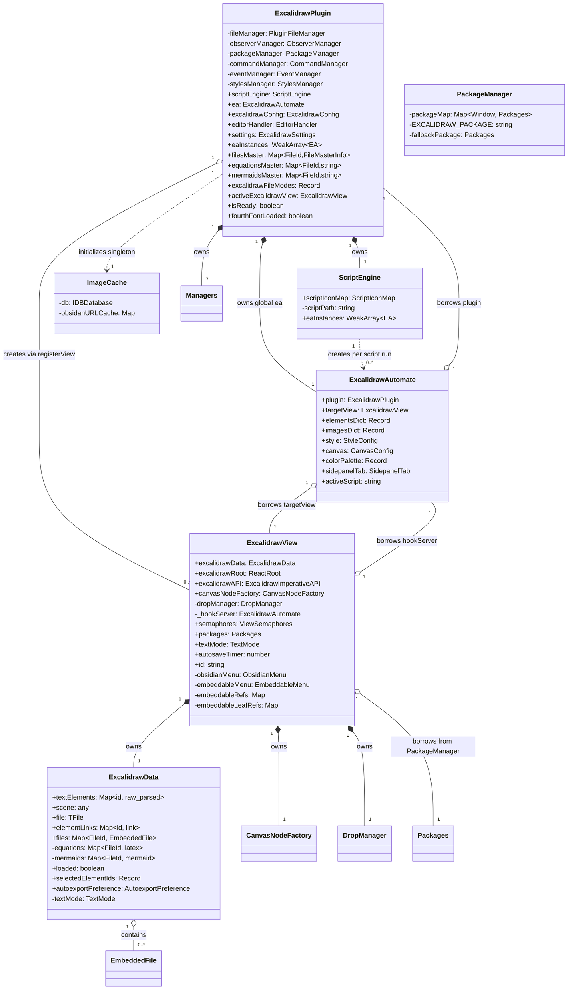
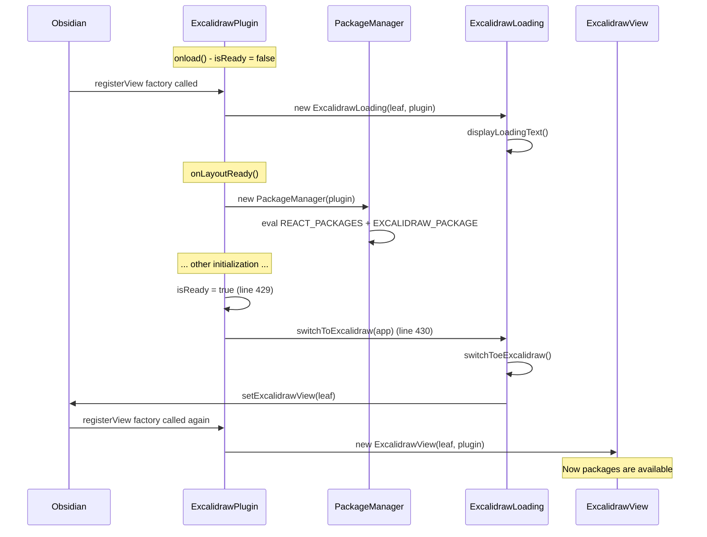
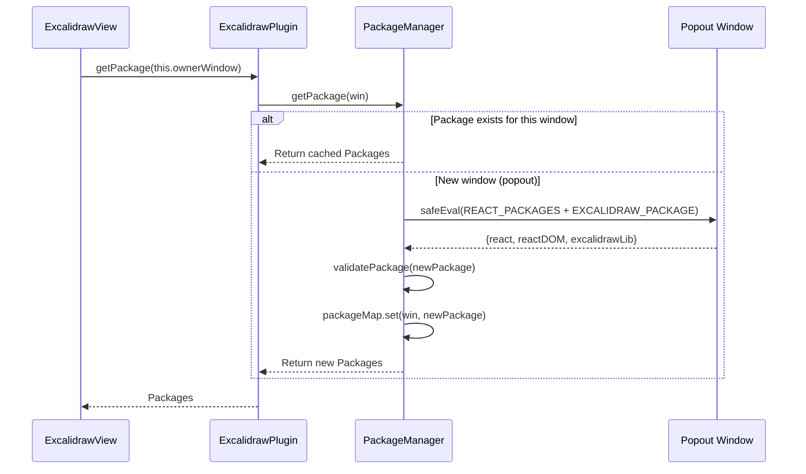
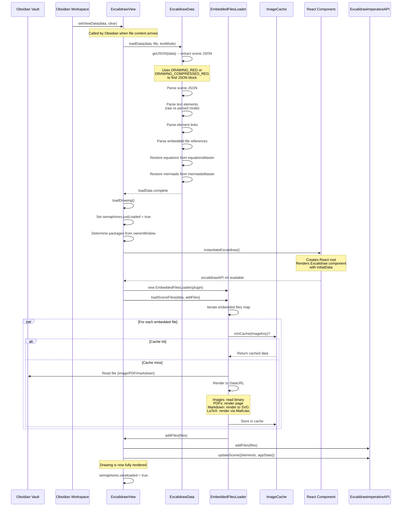
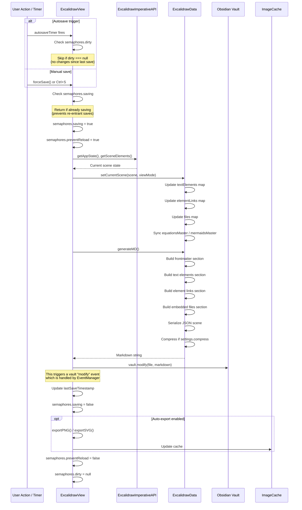
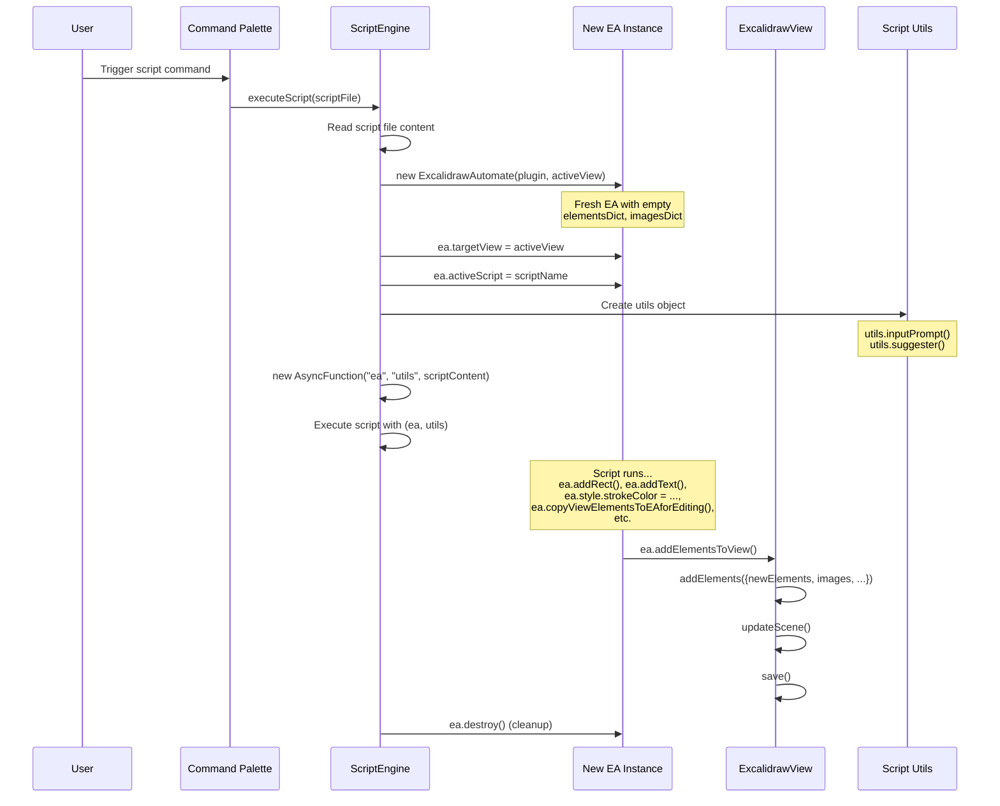
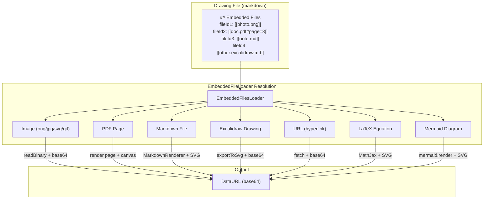
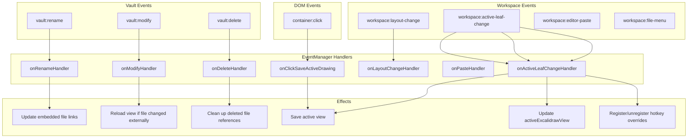

# Architecture Deep Dive -- Component Relationships

> **obsidian-excalidraw-plugin** -- Learning Material 2 of 3
> Prerequisite: [00-overview.md](./00-overview.md)

---

## Table of Contents

1. [Component Ownership Diagram](#1-component-ownership-diagram)
2. [Plugin-View Relationship](#2-plugin-view-relationship)
3. [The EA "Workbench" Model](#3-the-ea-workbench-model)
4. [Per-Window Package Isolation](#4-per-window-package-isolation)
5. [Global Singleton Pattern](#5-global-singleton-pattern)
6. [Data Flow: Load](#6-data-flow-load)
7. [Data Flow: Save](#7-data-flow-save)
8. [Data Flow: Script Execution](#8-data-flow-script-execution)
9. [Data Flow: Embedded Files](#9-data-flow-embedded-files)
10. [The Monkey Patching System](#10-the-monkey-patching-system)
11. [Event Architecture](#11-event-architecture)
12. [The hookServer Mechanism](#12-the-hookserver-mechanism)
13. [ExcalidrawData Internal Structure](#13-excalidrawdata-internal-structure)
14. [View Semaphores in Detail](#14-view-semaphores-in-detail)
15. [Multi-View Coordination](#15-multi-view-coordination)

---

## 1. Component Ownership Diagram

This diagram shows what each major class **owns** (creates and destroys) versus
what it **borrows** (references but does not own).



### Ownership Rules

| Component | Owner | Lifetime |
|---|---|---|
| All 7 managers | `ExcalidrawPlugin` | Plugin lifecycle (onload to onunload) |
| `ScriptEngine` | `ExcalidrawPlugin` | Plugin lifecycle |
| Global `ea` (`plugin.ea`) | `ExcalidrawPlugin` | Plugin lifecycle |
| `ExcalidrawView` | Obsidian workspace | Tab lifecycle (created by `registerView` factory) |
| `ExcalidrawData` | `ExcalidrawView` | View lifecycle |
| `DropManager` | `ExcalidrawView` | View lifecycle |
| `CanvasNodeFactory` | `ExcalidrawView` | View lifecycle |
| `hookServer` | Borrowed | Points to `plugin.ea` by default, can be overridden |
| Script EA instances | `ScriptEngine.eaInstances` | Script execution + cleanup |
| External EA instances | `plugin.eaInstances` (WeakArray) | Consumer-managed, GC-eligible |
| `ImageCache` | Singleton module | Plugin lifecycle (init on startup, destroy on unload) |
| `Packages` | `PackageManager.packageMap` | Per-window lifetime |

---

## 2. Plugin-View Relationship

This is one of the most important architectural concepts to understand.

### Plugin is a SINGLETON

There is exactly **one** `ExcalidrawPlugin` instance for the entire Obsidian session.
It is created when the plugin loads and destroyed when the plugin unloads.

```typescript
// src/core/main.ts:114
export default class ExcalidrawPlugin extends Plugin {
```

The plugin stores:
- All settings (`this.settings` -- line 124)
- The global EA instance (`this.ea` -- line 135)
- The currently active view reference (`this.activeExcalidrawView` -- line 125)
- Master maps shared across all views (`filesMaster`, `equationsMaster`, `mermaidsMaster` -- lines 137-140)
- File mode tracking (`excalidrawFileModes` -- line 123)

### Views are PER-LEAF

Each open Excalidraw tab creates a new `ExcalidrawView` instance. Multiple views
can be open simultaneously:
- Split panes (horizontal/vertical)
- Popout windows (Obsidian's "Pop out" feature)
- The same file can be open in multiple views

```typescript
// src/core/main.ts:281-290 -- The registerView factory
this.registerView(
  VIEW_TYPE_EXCALIDRAW,
  (leaf: WorkspaceLeaf) => {
    if(this.isReady) {
      return new ExcalidrawView(leaf, this);  // Real view after init
    } else {
      return new ExcalidrawLoading(leaf, this);  // Placeholder before init
    }
  },
);
```

### The Loading-to-View Transition

During startup, the plugin is not ready because `PackageManager` has not yet
eval'd the React/Excalidraw packages. Any Excalidraw files open at startup get
`ExcalidrawLoading` views (defined in `src/view/ExcalidrawLoading.ts`).

Once `isReady = true` at `main.ts:429`, the transition happens:



The key function is `switchToExcalidraw` at `src/view/ExcalidrawLoading.ts:7-12`:

```typescript
export async function switchToExcalidraw(app: App) {
  const leaves = app.workspace.getLeavesOfType(VIEW_TYPE_EXCALIDRAW_LOADING);
  for(const leaf of leaves) {
    await (leaf.view as ExcalidrawLoading)?.switchToeExcalidraw();
  }
}
```

### View Identification

Each view has a unique `id` derived from its workspace leaf:

```typescript
// src/view/ExcalidrawView.ts:373
id: string = (this.leaf as any).id;
```

This ID is used in `excalidrawFileModes` to track per-leaf view type preferences.

---

## 3. The EA "Workbench" Model

This is the most critical concept for anyone writing scripts or extending the plugin.

### EA is NOT the Scene

`ExcalidrawAutomate` (EA) is a **staging area**, not the actual scene. Think of it
like a Git staging area:

```
┌─────────────────────────────────────────────────────────┐
│                     ExcalidrawAutomate                   │
│                    (The "Workbench")                     │
│                                                         │
│   elementsDict: { id1: element1, id2: element2, ... }   │
│   imagesDict:   { fileId1: imageData, ... }             │
│   style:        { strokeColor, fillStyle, ... }         │
│   canvas:       { theme, viewBackgroundColor, ... }     │
│                                                         │
│   ┌─────────────┐    ┌──────────────────┐               │
│   │ Create new  │    │ Modify existing  │               │
│   │ elements    │    │ elements         │               │
│   └──────┬──────┘    └────────┬─────────┘               │
│          │                    │                          │
│          ▼                    ▼                          │
│   ┌────────────────────────────────────┐                │
│   │     addElementsToView()            │                │
│   │     (commits to scene)             │                │
│   └──────────────┬─────────────────────┘                │
│                  │                                       │
└──────────────────┼───────────────────────────────────────┘
                   │
                   ▼
┌─────────────────────────────────────────────────────────┐
│              ExcalidrawView (Scene)                      │
│         (Immutable elements in React state)              │
│                                                         │
│   Scene elements are IMMUTABLE. You should never        │
│   directly change element properties in the scene.      │
│                                                         │
└─────────────────────────────────────────────────────────┘
```

### The Three Workflows

#### Workflow 1: Creating New Elements

```typescript
// 1. Get an EA instance
const ea = window.ExcalidrawAutomate.getAPI(view);

// 2. Configure style
ea.style.strokeColor = "#ff0000";
ea.style.fillStyle = "solid";

// 3. Create elements in the workbench
const rectId = ea.addRect(0, 0, 200, 100);
const textId = ea.addText(50, 30, "Hello World");

// 4. Commit to the scene
await ea.addElementsToView(false, true);
```

The element creation methods (`addRect`, `addText`, `addEllipse`, `addLine`, etc.)
add elements to `ea.elementsDict`. They do NOT touch the scene.

#### Workflow 2: Modifying Existing Elements

```typescript
// 1. Copy elements FROM the scene INTO the workbench
const elements = ea.getViewSelectedElements();
ea.copyViewElementsToEAforEditing(elements);

// 2. Modify in the workbench
elements.forEach(el => {
  ea.elementsDict[el.id].strokeColor = "#00ff00";
});

// 3. Commit changes back to the scene
await ea.addElementsToView(false, true);
```

The `copyViewElementsToEAforEditing` method at `ExcalidrawAutomate.ts:2983` clones
elements from the scene into `elementsDict`:

```typescript
// src/shared/ExcalidrawAutomate.ts:2983-3023
copyViewElementsToEAforEditing(
  elements: ExcalidrawElement[],
  copyImages: boolean = false
): void {
  if(copyImages && elements.some(el=>el.type === "image")) {
    // ... copy image data into imagesDict too ...
    elements.forEach((el) => {
      this.elementsDict[el.id] = cloneElement(el);
      if(el.type === "image") {
        // Copy image data from scene files
        this.imagesDict[el.fileId] = { ... };
      }
    });
  } else {
    elements.forEach((el) => {
      this.elementsDict[el.id] = cloneElement(el);
    });
  }
};
```

#### Workflow 3: Deleting Elements

```typescript
// Copy to workbench, mark as deleted, commit
const elements = ea.getViewSelectedElements();
ea.copyViewElementsToEAforEditing(elements);
elements.forEach(el => {
  ea.elementsDict[el.id].isDeleted = true;
});
await ea.addElementsToView(false, true);
```

### EA Key Properties

From `src/shared/ExcalidrawAutomate.ts:532-557`:

```typescript
plugin: ExcalidrawPlugin;
elementsDict: {[key:string]:any};     // Staging area, indexed by el.id
imagesDict: {[key: FileId]: ImageInfo}; // Image files with DataURL
style: {
  strokeColor: string;       // e.g. "#000000"
  backgroundColor: string;
  angle: number;              // radians
  fillStyle: FillStyle;       // "hachure" | "cross-hatch" | "solid"
  strokeWidth: number;
  strokeStyle: StrokeStyle;   // "solid" | "dashed" | "dotted"
  roughness: number;
  opacity: number;
  roundness: null | { type: RoundnessType; value?: number };
  fontFamily: number;         // 1: Virgil, 2: Helvetica, 3: Cascadia, 4: Local Font
  fontSize: number;
  textAlign: string;          // "left" | "right" | "center"
  verticalAlign: string;      // "top" | "bottom" | "middle"
  startArrowHead: string;     // "arrow" | "bar" | "circle" | null | ...
  endArrowHead: string;
};
canvas: {
  theme: string;              // "dark" | "light"
  viewBackgroundColor: string;
  gridSize: number;
};
```

### The `setView()` Method

Before performing view-related operations, EA must target a specific view via
`setView()` at `ExcalidrawAutomate.ts:2631`:

```typescript
setView(view?: ExcalidrawView | "auto" | "first" | "active" | null,
        show: boolean = false): ExcalidrawView {
  // Selection priority:
  // 1. Explicit ExcalidrawView instance
  // 2. "auto" / null / undefined:
  //    a. Currently active ExcalidrawView
  //    b. Last active ExcalidrawView
  //    c. First ExcalidrawView in workspace
  // 3. "active": active or last active only
  // 4. "first": first in workspace
}
```

For scripts executed by the Script Engine, `targetView` is set automatically.

### The `addElementsToView()` Method

The commit operation at `ExcalidrawAutomate.ts:3165-3190`:

```typescript
async addElementsToView(
  repositionToCursor: boolean = false,  // Snap elements to cursor position
  save: boolean = true,                  // Auto-save after adding
  newElementsOnTop: boolean = false,     // Layer ordering
  shouldRestoreElements: boolean = false, // Restore legacy elements
  captureUpdate: CaptureUpdateActionType = CaptureUpdateAction.IMMEDIATELY,
): Promise<boolean> {
  const elements = this.getElements();
  const result = await this.targetView.addElements({
    newElements: elements,
    repositionToCursor,
    save,
    images: this.imagesDict,
    newElementsOnTop,
    shouldRestoreElements,
    captureUpdate,
  });
  return result;
};
```

---

## 4. Per-Window Package Isolation

This is a unique architectural requirement driven by Obsidian's popout window feature.

### The Problem

Obsidian allows users to "pop out" tabs into separate browser windows. Each window
has its own `document`, `window`, and DOM. React and ReactDOM maintain internal state
tied to a specific `window` object. If you try to render React components in a
popout window using the main window's React instance, things break silently.

### The Solution: PackageManager

`PackageManager` at `src/core/managers/PackageManager.ts:17` maintains a map of
packages per window:

```typescript
export class PackageManager {
  private packageMap: Map<Window, Packages> = new Map<Window, Packages>();
  private EXCALIDRAW_PACKAGE: string;
  private fallbackPackage: Packages | null = null;
  // ...
}
```

### How Packages Are Created



The critical code in `PackageManager.getPackage()` at line 110:

```typescript
public getPackage(win: Window): Packages {
  // Return existing package if available
  if (this.packageMap.has(win)) {
    const pkg = this.packageMap.get(win);
    if (this.validatePackage(pkg)) {
      return pkg;
    }
    this.packageMap.delete(win);
  }

  // Create new package by eval'ing in the window's context
  const evalResult = errorHandler.safeEval<...>(
    `(function() {
      ${REACT_PACKAGES + this.EXCALIDRAW_PACKAGE};
      return {react: React, reactDOM: ReactDOM, excalidrawLib: ExcalidrawLib};
    })()`,
    "PackageManager.getPackage - package evaluation",
    win  // <-- This is the key: eval in the popout window's context
  );

  const newPackage = {
    react: evalResult.react,
    reactDOM: evalResult.reactDOM,
    excalidrawLib: evalResult.excalidrawLib
  };

  this.packageMap.set(win, newPackage);
  return newPackage;
}
```

### Package Validation

Every package is validated at `PackageManager.ts:65-81`:

```typescript
private validatePackage(pkg: Packages): boolean {
  if (!pkg) return false;
  if (!pkg.react || !pkg.reactDOM || !pkg.excalidrawLib) {
    return false;
  }
  // Verify essential methods exist
  const lib = pkg.excalidrawLib;
  return (
    typeof lib === 'object' &&
    lib !== null &&
    typeof lib.restoreElements === 'function' &&
    typeof lib.exportToSvg === 'function'
  );
}
```

### Cleanup on Window Close

When a popout window closes, the package must be cleaned up to prevent memory
leaks. `deletePackage()` at `PackageManager.ts:164-203`:

```typescript
public deletePackage(win: Window) {
  const { react, reactDOM, excalidrawLib } = pkg;

  // Clean up ExcalidrawLib
  if (win.ExcalidrawLib === excalidrawLib) {
    excalidrawLib.destroyObsidianUtils();
    delete win.ExcalidrawLib;
  }

  // Clean up React
  if (win.React === react) {
    Object.keys(win.React || {}).forEach((key) => delete win.React[key]);
    delete win.React;
  }

  // Clean up ReactDOM
  if (win.ReactDOM === reactDOM) {
    Object.keys(win.ReactDOM || {}).forEach((key) => delete win.ReactDOM[key]);
    delete win.ReactDOM;
  }

  this.packageMap.delete(win);
}
```

### Fallback Mechanism

If package creation fails for a popout window, `PackageManager` falls back to the
main window's package (the `fallbackPackage` at line 21). This prevents data loss
-- the drawing can still render, just potentially with rendering quirks.

---

## 5. Global Singleton Pattern

### window.ExcalidrawAutomate

The global EA instance is set during `onload()` at `main.ts:314`:

```typescript
// src/core/main.ts:314
this.ea = initExcalidrawAutomate(this);
```

The `initExcalidrawAutomate` function (in `src/utils/excalidrawAutomateUtils.ts`)
creates an EA instance and assigns it to `window.ExcalidrawAutomate`:

```typescript
// The global EA is accessible from:
window.ExcalidrawAutomate          // Direct global access
plugin.ea                          // Plugin's own reference (same instance)
view.hookServer                    // Each view's hook reference (defaults to plugin.ea)
```

### The `getAPI()` Method

External plugins do NOT use the global EA directly. Instead, they call `getAPI()`
to get a **new EA instance** with its own workbench:

```typescript
// src/shared/ExcalidrawAutomate.ts:757-761
public getAPI(view?:ExcalidrawView):ExcalidrawAutomate {
  const ea = new ExcalidrawAutomate(this.plugin, view);
  this.plugin.eaInstances.push(ea);  // Track for cleanup
  return ea;
}
```

Each call to `getAPI()` creates a **fresh EA** with empty `elementsDict` and
`imagesDict`. The new instance is tracked in `plugin.eaInstances` (a `WeakArray`)
for lifecycle management.

### The `getEA()` Library Export

For npm consumers, `src/core/index.ts` exports a convenience function:

```typescript
// src/core/index.ts:7-14
export const getEA = (view?:any): any => {
  try {
    return window.ExcalidrawAutomate.getAPI(view);
  } catch(e) {
    console.log({message: "Excalidraw not available", fn: getEA});
    return null;
  }
}
```

### Access Patterns

| Consumer | How They Get EA | Lifetime |
|---|---|---|
| User scripts (Script Engine) | Pre-configured `ea` variable with `targetView` set | Script execution |
| External plugins (ExcaliBrain) | `window.ExcalidrawAutomate.getAPI(view)` | Plugin-managed |
| Startup script | `plugin.ea` passed directly | Plugin lifecycle |
| Internal plugin code | `plugin.ea` or `new ExcalidrawAutomate(plugin, view)` | Varies |
| npm consumers | `getEA(view)` from `obsidian-excalidraw-plugin` | Consumer-managed |
| View hookServer | `view.hookServer` (defaults to `plugin.ea`) | View lifecycle |

---

## 6. Data Flow: Load

This is the complete flow from a file on disk to a rendered drawing on screen.



### Key Functions in the Load Path

| Step | Function | File:Line | Description |
|---|---|---|---|
| 1 | `setViewData()` | `ExcalidrawView.ts` | Obsidian calls this with file content |
| 2 | `loadData()` | `ExcalidrawData.ts` | Parse the markdown structure |
| 3 | `getJSON()` | `ExcalidrawData.ts:201` | Extract JSON from `## Drawing` section |
| 4 | `getDecompressedScene()` | `ExcalidrawData.ts:163` | Decompress if `compressed-json` |
| 5 | `loadDrawing()` | `ExcalidrawView.ts` | Initialize the React scene |
| 6 | `instantiateExcalidraw()` | `ExcalidrawView.ts` | Create React root and render |
| 7 | `loadSceneFiles()` | `EmbeddedFileLoader.ts` | Resolve and load embedded files |
| 8 | `addFiles()` | `ExcalidrawView.ts:198` | Push file data to React component |

### The Drawing Section Regex

The markdown format uses regex patterns to locate the JSON scene data:

```typescript
// src/shared/ExcalidrawData.ts:151-156
const DRAWING_REG = /\n##? Drawing\n[^`]*(```json\n)([\s\S]*?)```\n/gm;
const DRAWING_REG_FALLBACK = /\n##? Drawing\n(```json\n)?(.*)(```)?(%%)?/gm;
export const DRAWING_COMPRESSED_REG =
  /(\n##? Drawing\n[^`]*(?:```compressed\-json\n))([\s\S]*?)(```\n)/gm;
const DRAWING_COMPRESSED_REG_FALLBACK =
  /(\n##? Drawing\n(?:```compressed\-json\n)?)(.*)((```)?(%%)?)/gm;
```

The `isCompressedMD()` check determines which regex to use:

```typescript
// src/shared/ExcalidrawData.ts:159-161
const isCompressedMD = (data: string): boolean => {
  return data.match(/```compressed\-json\n/gm) !== null;
};
```

---

## 7. Data Flow: Save

The save flow is triggered either by autosave or explicit user action.



### Save Semaphore Dance

The save flow involves careful semaphore management to prevent race conditions:

1. **`dirty`**: Set to a timestamp when the scene changes. `null` means no unsaved changes.
2. **`saving`**: Set to `true` while save is in progress. Prevents concurrent saves.
3. **`preventReload`**: Set to `true` during save. Prevents the vault "modify" event from triggering a reload of the just-saved file.
4. **`autosaving`**: Set to `true` during autosave specifically (vs manual save).
5. **`forceSaving`**: Set to `true` for explicit save (overrides some checks).

### The `generateMD()` Method

The markdown generation builds the file in sections:

```
1. Get the header (back-of-card notes + frontmatter)
   via getExcalidrawMarkdownHeaderSection()
2. Add "# Excalidraw Data" marker
3. Add "## Text Elements" section
   - Each text element: rawText + "\n" + "^blockRefId" + "\n\n"
4. Add "## Element Links" section
   - Each link: "elementId: linkText\n"
5. Add "## Embedded Files" section
   - Each file: "fileId: [[filepath]]\n"
6. Add "## Drawing" section
   - Either ```json or ```compressed-json fenced block
   - Contains the full scene JSON
7. Close with "%%"
```

---

## 8. Data Flow: Script Execution



### ScriptEngine Discovery

The `ScriptEngine` at `src/shared/Scripts.ts:24` discovers scripts on construction:

```typescript
constructor(plugin: ExcalidrawPlugin) {
  this.plugin = plugin;
  this.app = plugin.app;
  this.scriptIconMap = {};
  this.loadScripts();         // Discover .md files in script folder
  this.registerEventHandlers(); // Watch for file changes
}
```

Scripts are `.md` files in the configured folder. Each script can have a companion
`.svg` file with the same name for the toolbar icon. Scripts are registered as
Obsidian commands, so they appear in the command palette and can have hotkeys.

### Script Environment

When a script runs, it receives two objects:
- `ea` -- an `ExcalidrawAutomate` instance with `targetView` pre-set
- `utils` -- utility functions:
  - `utils.inputPrompt(header, placeholder, value, buttons, ...)`
  - `utils.suggester(displayItems, items, hint, instructions)`

Scripts are executed as `AsyncFunction` (allowing `await`):

```typescript
const AsyncFunction = Object.getPrototypeOf(async () => {}).constructor;
await new AsyncFunction("ea", "utils", scriptContent)(ea, utils);
```

---

## 9. Data Flow: Embedded Files

Embedded files are a core feature -- drawings can contain images, PDFs, markdown
files, and even other Excalidraw drawings.



### Recursion Protection

Circular embeds are a real problem -- File A embeds File B, which embeds File A.
The `EmbeddedFileLoader` uses a recursion watchdog:

```typescript
// src/shared/EmbeddedFileLoader.ts:51
const markdownRendererRecursionWatchdog = new Set<TFile>();
```

For Excalidraw-to-Excalidraw embeds, the loader tracks recursion depth via a
numeric counter passed through the call chain.

### Color Map System

SVG images can have their colors remapped when embedded. The `replaceSVGColors`
function at `EmbeddedFileLoader.ts:61` processes a `ColorMap`:

```typescript
type ColorMap = { [oldColor: string]: string };

// Usage: Replace all instances of "#ff0000" with "#00ff00" in the embedded SVG
const colorMap = { "#ff0000": "#00ff00" };
```

This enables features like dark-mode-aware embedding.

---

## 10. The Monkey Patching System

The plugin monkey-patches Obsidian's `WorkspaceLeaf` prototype to intercept
view state transitions. This is at `main.ts:963-1063`.

### What Is Patched

| Method | Purpose | Location |
|---|---|---|
| `WorkspaceLeaf.prototype.setViewState` | Redirect markdown view to ExcalidrawView for excalidraw files | `main.ts:1021-1060` |
| `WorkspaceLeaf.prototype.detach` | Clean up `excalidrawFileModes` when leaf closes | `main.ts:1006-1018` |
| `WorkspaceLeaf.prototype.getRoot` | Fix root resolution for popout windows (from hover-editor) | `main.ts:989-997` |
| `Workspace.prototype.getActiveViewOfType` | Templater compatibility -- return embedded markdown editor | `main.ts:967-987` |

### The setViewState Interception

This is the most important patch. It intercepts every `setViewState` call across
the entire workspace:

```typescript
// src/core/main.ts:1021-1060 (simplified)
setViewState(next) {
  return function (state: ViewState, ...rest: any[]) {
    const markdownViewLoaded =
      self._loaded &&                    // Plugin is active
      state.type === "markdown" &&        // Opening as markdown
      state.state?.file;                 // Has a file

    if (
      markdownViewLoaded &&
      self.excalidrawFileModes[this.id || state.state.file] !== "markdown"
    ) {
      const filepath = state.state.file;
      if (
        self.forceToOpenInMarkdownFilepath !== filepath &&
        fileShouldDefaultAsExcalidraw(filepath, this.app)
      ) {
        // REDIRECT: Change type from "markdown" to VIEW_TYPE_EXCALIDRAW
        const newState = {
          ...state,
          type: VIEW_TYPE_EXCALIDRAW,
        };
        self.excalidrawFileModes[filepath] = VIEW_TYPE_EXCALIDRAW;
        return next.apply(this, [newState, ...rest]);
      }
      self.forceToOpenInMarkdownFilepath = null;
    }

    // For excalidraw files opened as markdown, fold the data sections
    if (markdownViewLoaded) {
      setTimeout(async () => {
        if (self.isExcalidrawFile(leaf.view.file)) {
          foldExcalidrawSection(leaf.view);
        }
      }, 500);
    }

    return next.apply(this, [state, ...rest]);
  };
}
```

### Escape Hatch: forceToOpenInMarkdownFilepath

Sometimes a user wants to open an Excalidraw file as plain markdown (e.g., to
edit frontmatter). The `forceToOpenInMarkdownFilepath` property at `main.ts:145`
overrides the monkey patch for one file open:

```typescript
// Setting this before opening prevents the redirect
plugin.forceToOpenInMarkdownFilepath = filepath;
```

---

## 11. Event Architecture

The `EventManager` at `src/core/managers/EventManager.ts:18` handles all workspace
and vault events.

### Registered Events

From `EventManager.ts:80-99`:

```typescript
public async registerEvents() {
  await this.plugin.awaitInit();

  // Vault events
  this.registerEvent(this.app.workspace.on("editor-paste", ...));
  this.registerEvent(this.app.vault.on("rename", ...));
  this.registerEvent(this.app.vault.on("modify", ...));
  this.registerEvent(this.app.vault.on("delete", ...));

  // Workspace events
  this.registerEvent(this.app.workspace.on("active-leaf-change", ...));
  this.registerEvent(this.app.workspace.on("layout-change", ...));

  // DOM events (registered directly, tracked for cleanup)
  this.app.workspace.containerEl.addEventListener("click", ...);
  this.registerEvent(this.app.workspace.on("file-menu", ...));
}
```

### Event Flow Diagram



### The active-leaf-change Handler

This is the most complex event handler. When the user switches tabs:

1. If leaving an ExcalidrawView, save it
2. If entering an ExcalidrawView, set it as `activeExcalidrawView`
3. Register/unregister hotkey overrides (Ctrl+F, Ctrl+S, custom overrides)
4. Update the EA hook server
5. Handle mobile navbar positioning

---

## 12. The hookServer Mechanism

Each `ExcalidrawView` has a `_hookServer` property (line 304) that determines which
EA instance provides event hooks for that view.

### Default Behavior

By default, the hookServer is `plugin.ea` (the global EA instance):

```typescript
// src/view/ExcalidrawView.ts:376-383
constructor(leaf: WorkspaceLeaf, plugin: ExcalidrawPlugin) {
  super(leaf);
  this._plugin = plugin;
  this.excalidrawData = new ExcalidrawData(plugin, this);
  this.canvasNodeFactory = new CanvasNodeFactory(this);
  this.setHookServer();  // Defaults to plugin.ea
  this.dropManager = new DropManager(this);
}
```

```typescript
// src/view/ExcalidrawView.ts:405-412
setHookServer(ea?:ExcalidrawAutomate) {
  if(ea) {
    this._hookServer = ea;
  } else {
    this._hookServer = this._plugin.ea;
  }
}
```

### Available Hooks

EA instances can register callbacks that the view will invoke:

```typescript
// src/shared/ExcalidrawAutomate.ts:3223-3229+
onViewUnloadHook: (view: ExcalidrawView) => void = null;
onViewModeChangeHook: (isViewModeEnabled: boolean, view: ExcalidrawView, ea: ExcalidrawAutomate) => void = null;
onLinkHoverHook: (element, view, ea) => boolean = null;
onLinkClickHook: (element, event, linkText, view, ea) => boolean = null;
onCanvasColorChangeHook: (ea, view, oldColor, newColor) => void = null;
// ... more hooks
```

### Overriding the hookServer

External plugins or startup scripts can override the hookServer for specific views:

```typescript
// In a startup script or external plugin:
const ea = window.ExcalidrawAutomate.getAPI(view);
ea.onLinkClickHook = (element, event, linkText, view, ea) => {
  // Custom link click handling
  console.log("Link clicked:", linkText);
  return true; // Return true to prevent default handling
};
ea.registerThisAsViewEA();  // Sets this EA as the hookServer for the view
```

This is how ExcaliBrain overrides link click behavior for its specialized views.

---

## 13. ExcalidrawData Internal Structure

`ExcalidrawData` at `src/shared/ExcalidrawData.ts:472` manages the parsed
representation of the drawing file.

### Key Maps

```typescript
// src/shared/ExcalidrawData.ts:472-494
export class ExcalidrawData {
  public textElements: Map<string, {
    raw: string;          // Original markup text
    parsed: string;       // Resolved links and transclusions
    hasTextLink: boolean; // Whether text contains links
  }> = null;

  public scene: any = null;              // The parsed JSON scene object
  public deletedElements: ExcalidrawElement[] = [];  // Soft-deleted elements
  public file: TFile = null;             // The source TFile

  public elementLinks: Map<string, string> = null;  // elementId -> link target
  public files: Map<FileId, EmbeddedFile> = null;   // fileId -> EmbeddedFile
  private equations: Map<FileId, { latex: string; isLoaded: boolean }> = null;
  private mermaids: Map<FileId, { mermaid: string; isLoaded: boolean }> = null;

  public autoexportPreference: AutoexportPreference;
  private textMode: TextMode;
  public loaded: boolean = false;
}
```

### Text Mode and Link Parsing

The `textMode` determines how text elements are displayed:

```
TextMode.parsed:
  - "[[Note Title]]"  -->  "Note Title"
  - "![[embedded]]"   -->  (transclusion resolved)
  - "[alias](link)"   -->  "alias"

TextMode.raw:
  - "[[Note Title]]"  -->  "[[Note Title]]"
  - "![[embedded]]"   -->  "![[embedded]]"
  - "[alias](link)"   -->  "[alias](link)"
```

The parsing uses `REGEX_LINK` at `ExcalidrawData.ts:101-148`:

```typescript
REGEX_LINK.EXPR:
  /(!)?(\[\[([^|\]]+)\|?([^\]]+)?]]|\[([^\]]*)]\(((?:[^\(\)]|\([^\(\)]*\))*)\))(\{(\d+)\})?/g

  Captures:
  1: "!" (transclusion marker)
  2: Full link expression
  3: Wiki-link target (for [[target|alias]])
  4: Wiki-link alias
  5: Markdown link display text (for [text](url))
  6: Markdown link URL
  7: Wrap specifier (e.g., {40})
  8: Wrap length number
```

---

## 14. View Semaphores in Detail

The semaphores at `ExcalidrawView.ts:315-333` are the concurrency control
mechanism for the view. Every async operation checks and sets these flags.

```typescript
// src/view/ExcalidrawView.ts:315-333
public semaphores: ViewSemaphores | null = {
  warnAboutLinearElementLinkClick: true,  // Show warning when clicking link on arrow
  embeddableIsEditingSelf: false,          // An embedded view is being edited
  popoutUnload: false,                     // Popout window is closing
  viewloaded: false,                       // View has finished initial load
  viewunload: false,                       // View is being destroyed
  scriptsReady: false,                     // Script engine toolbar ready
  justLoaded: false,                       // Just loaded, suppress autosave
  preventAutozoom: false,                  // Don't auto-zoom to content
  autosaving: false,                       // Autosave in progress
  dirty: null,                             // Timestamp of last change, null = clean
  preventReload: false,                    // Don't reload on file modify event
  isEditingText: false,                    // Text element is being edited
  saving: false,                           // Save operation in progress
  forceSaving: false,                      // Force save (overrides checks)
  hoverSleep: false,                       // Suppress hover previews briefly
  wheelTimeout: null,                      // Scroll debounce timer
  shouldSaveImportedImage: false,          // Image was imported, save needed
};
```

### Semaphore Interaction Matrix

```
Operation         | Checks           | Sets              | Clears
------------------|------------------|-------------------|------------------
onChange()        |                  | dirty = Date.now()|
autosave()        | dirty !== null   | autosaving=true   | autosaving=false
                  | !saving          |                   |
save()            | !saving          | saving=true       | saving=false
                  |                  | preventReload=true| preventReload=false
                  |                  |                   | dirty=null
onModify (ext.)   | !preventReload   | (triggers reload) |
loadDrawing()     |                  | justLoaded=true   |
                  |                  | viewloaded=true   |
onClose()         |                  | viewunload=true   | semaphores=null
```

---

## 15. Multi-View Coordination

When the same file is open in multiple views (split panes), the plugin must
coordinate between them.

### Master Maps

The plugin-level master maps (`filesMaster`, `equationsMaster`, `mermaidsMaster`)
at `main.ts:137-140` serve as shared state:

```typescript
public filesMaster: Map<FileId, FileMasterInfo> = null;   // All known file IDs
public equationsMaster: Map<FileId, string> = null;       // All LaTeX formulas
public mermaidsMaster: Map<FileId, string> = null;         // All Mermaid texts
```

When a view saves, it updates these master maps. When another view of the same
file loads, it reads from these maps to restore equations and mermaids without
re-rendering them.

### Modify Event Synchronization

When View A saves a file, the vault "modify" event fires. View B receives this
event through the `EventManager`. View B checks:

1. Is this my file? (Compare file paths)
2. Was this save initiated by me? (Check `lastSaveTimestamp` against file mtime)
3. Is `preventReload` set? (If yes, this is my own save, ignore)

If the modify was external (from another view, sync, or manual edit), View B
reloads its data.

### Active View Tracking

Only one view can be "active" at a time:

```typescript
// main.ts:125
public activeExcalidrawView: ExcalidrawView = null;
```

The `EventManager.onActiveLeafChangeHandler` updates this when the user switches
tabs. This reference is used by:
- `CommandManager` to know which view to target for commands
- `runAction()` at `main.ts:1505-1520` for toolbar actions
- Hotkey overrides at `main.ts:1124-1162`

---

## Next Steps

Continue to **[02-plugin-lifecycle.md](./02-plugin-lifecycle.md)** for a detailed
trace of the plugin's startup sequence, view lifecycle, shutdown procedure, and
initialization dependency graph -- all with exact line numbers from `src/core/main.ts`.
