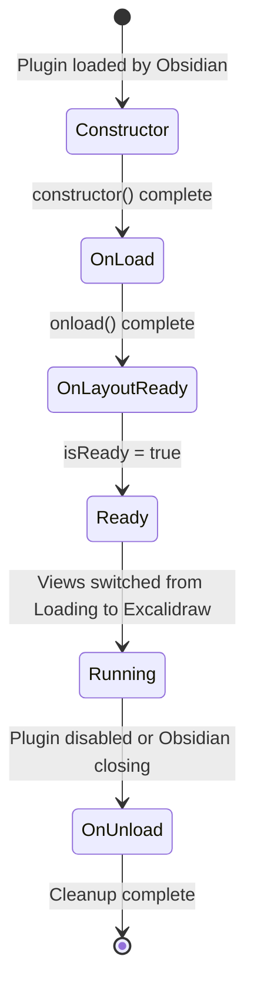
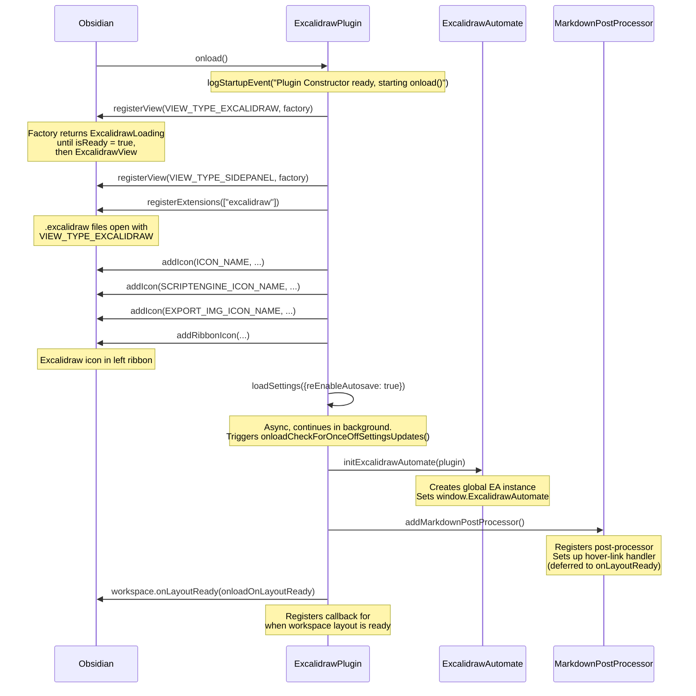
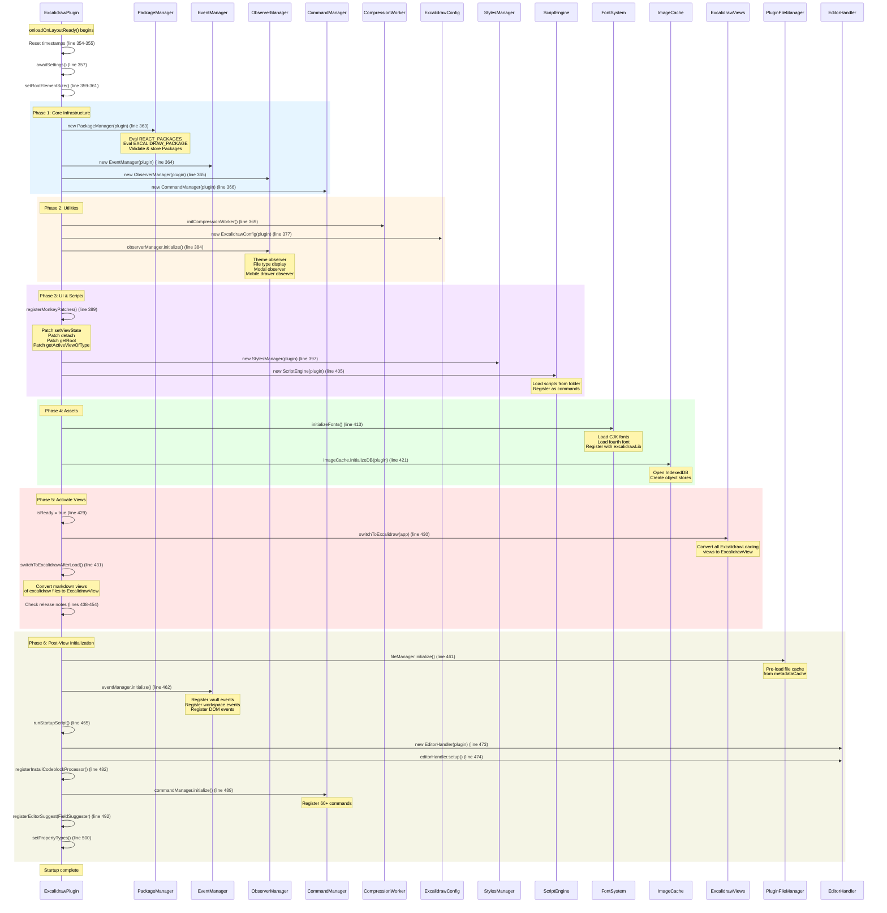
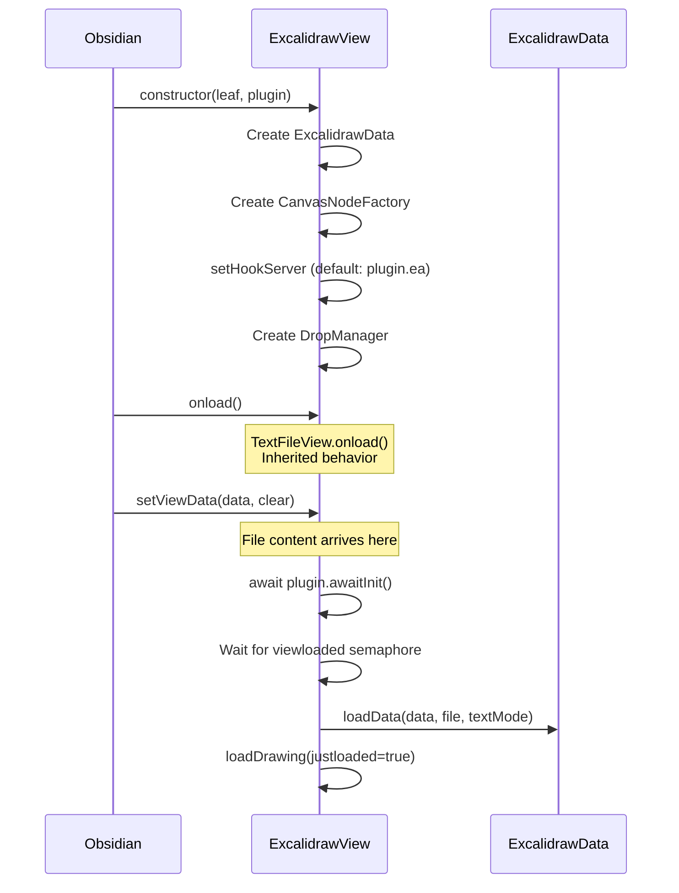
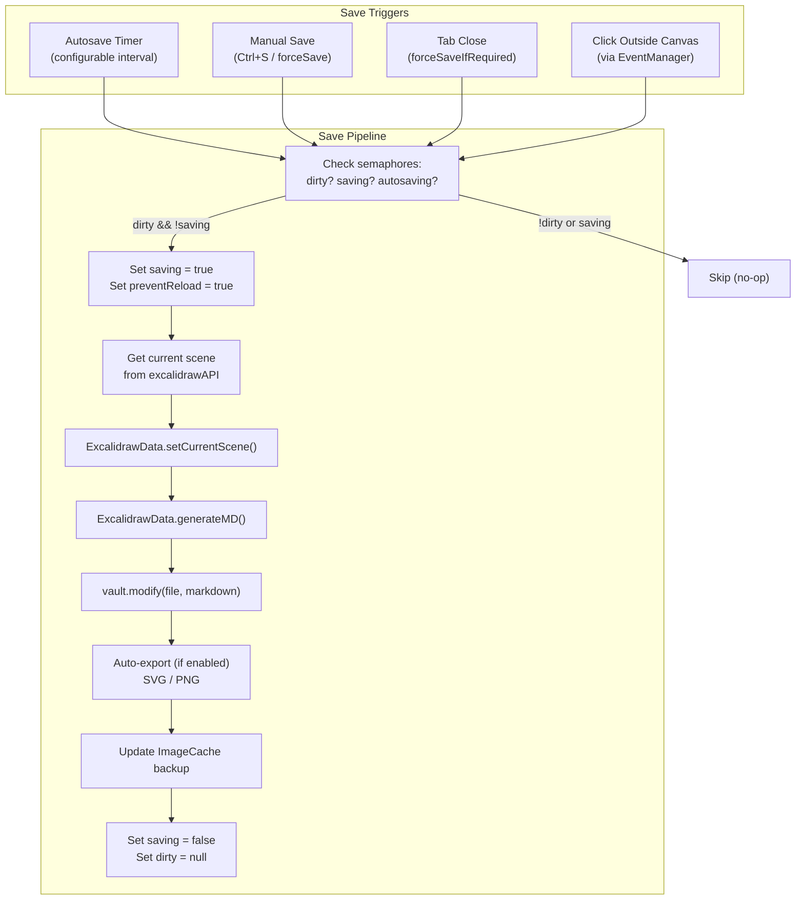
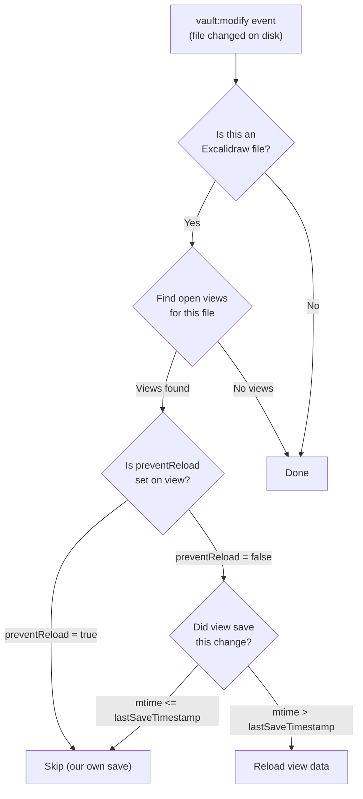
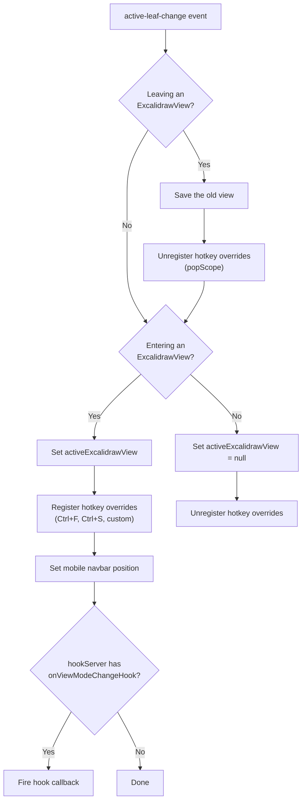
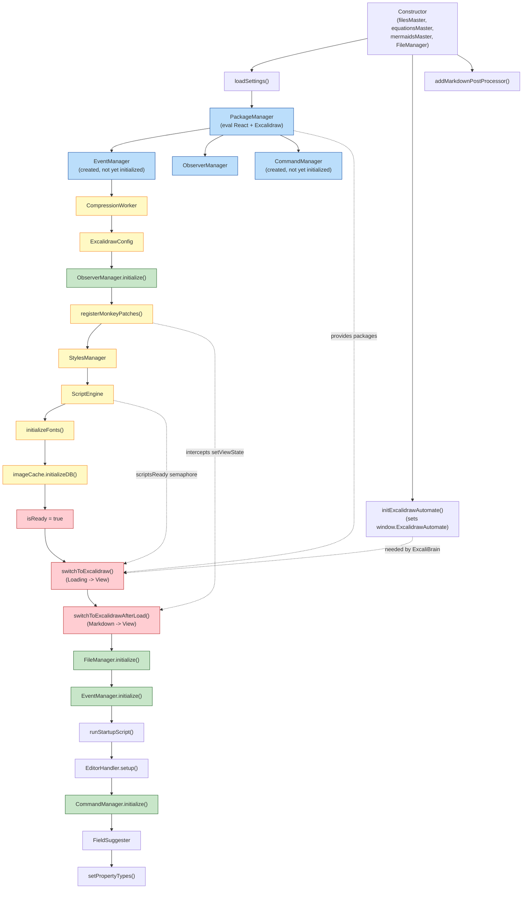

# Plugin Lifecycle -- Startup, Runtime, Shutdown

> **obsidian-excalidraw-plugin** -- Learning Material 3 of 3
> Prerequisites: [00-overview.md](./00-overview.md), [01-architecture-deep-dive.md](./01-architecture-deep-dive.md)

---

## Table of Contents

1. [Lifecycle Overview](#1-lifecycle-overview)
2. [Constructor Phase](#2-constructor-phase)
3. [onload() Phase](#3-onload-phase)
4. [onLayoutReady() -- The Heavy Lifting](#4-onlayoutready----the-heavy-lifting)
5. [View Lifecycle -- Creation](#5-view-lifecycle----creation)
6. [View Lifecycle -- setViewData and loadDrawing](#6-view-lifecycle----setviewdata-and-loadrawing)
7. [View Lifecycle -- instantiateExcalidraw](#7-view-lifecycle----instantiateexcalidraw)
8. [View Lifecycle -- onClose](#8-view-lifecycle----onclose)
9. [Runtime: Save Cycle](#9-runtime-save-cycle)
10. [Runtime: File Change Handling](#10-runtime-file-change-handling)
11. [Runtime: Active Leaf Changes](#11-runtime-active-leaf-changes)
12. [onunload() -- Teardown Sequence](#12-onunload----teardown-sequence)
13. [Initialization Dependencies Diagram](#13-initialization-dependencies-diagram)
14. [Startup Timing and Performance](#14-startup-timing-and-performance)
15. [Error Recovery Patterns](#15-error-recovery-patterns)

---

## 1. Lifecycle Overview

The plugin lifecycle has five distinct phases:



| Phase | Entry Point | Duration | What Happens |
|---|---|---|---|
| **Constructor** | `main.ts:157-175` | Synchronous, fast | Initialize maps, create FileManager, set global ref |
| **onload()** | `main.ts:279-332` | Fast, some async | Register views, icons, settings, EA, post-processor |
| **onLayoutReady()** | `main.ts:353-506` | Slow, fully async | Heavy init: packages, managers, fonts, cache, views |
| **Running** | After `isReady = true` | Indefinite | Normal operation, views open/close, scripts run |
| **onunload()** | `main.ts:1188-1261` | Synchronous teardown | Convert views back, destroy all managers, cleanup |

---

## 2. Constructor Phase

**File**: `src/core/main.ts:157-175`

The constructor is called by Obsidian when the plugin is loaded. It must be fast
and synchronous.

```typescript
// src/core/main.ts:157-175
constructor(app: App, manifest: PluginManifest) {
  super(app, manifest);

  // (1) Record build timestamp for performance tracking
  this.loadTimestamp = INITIAL_TIMESTAMP;
  this.lastLogTimestamp = this.loadTimestamp;

  // (2) Initialize the three master maps (shared across all views)
  this.filesMaster = new Map<FileId, {
    isHyperLink: boolean;
    isLocalLink: boolean;
    path: string;
    hasSVGwithBitmap: boolean;
    blockrefData: string;
    colorMapJSON?: string;
  }>();
  this.equationsMaster = new Map<FileId, string>();
  this.mermaidsMaster = new Map<FileId, string>();

  // (3) Create FileManager early -- needed by MarkdownPostProcessor before onLayoutReady
  this.fileManager = new PluginFileManager(this);

  // (4) Set global reference so other modules can access the plugin
  setExcalidrawPlugin(this);
}
```

### Why FileManager is Created in Constructor

The `PluginFileManager` is the only manager created this early. The reason is
documented in the comment at line 168:

> "isExcalidraw function is used already is already used by MarkdownPostProcessor
> in onLoad before onLayoutReady"

The `MarkdownPostProcessor` (registered during `onload()`) needs to call
`plugin.isExcalidrawFile()` to determine if an embedded file is an Excalidraw
drawing. This method delegates to `fileManager.isExcalidrawFile()`, so the
FileManager must exist before the post-processor runs.

### What `setExcalidrawPlugin(this)` Does

This function (from `src/constants/constants.ts`) stores the plugin reference in a
module-level variable that other modules import directly, avoiding circular
dependency issues that would arise from importing `main.ts` everywhere.

---

## 3. onload() Phase

**File**: `src/core/main.ts:279-332`

The `onload()` method is called by Obsidian after the constructor. It registers
the plugin's views, icons, settings, and markdown post-processor.



### Step-by-Step Walkthrough

**Step 1: Register Views (lines 281-296)**

```typescript
// src/core/main.ts:281-296
this.registerView(
  VIEW_TYPE_EXCALIDRAW,
  (leaf: WorkspaceLeaf) => {
    if(this.isReady) {
      return new ExcalidrawView(leaf, this);
    } else {
      return new ExcalidrawLoading(leaf, this);
    }
  },
);
this.registerView(
  VIEW_TYPE_SIDEPANEL,
  (leaf: WorkspaceLeaf) => new ExcalidrawSidepanelView(leaf, this),
);
this.registerExtensions(["excalidraw"], VIEW_TYPE_EXCALIDRAW);
```

The view factory checks `this.isReady` -- during startup (before `onLayoutReady`
completes), this is `false`, so any Excalidraw files open at startup get a
lightweight `ExcalidrawLoading` placeholder that simply displays "Loading
Excalidraw..." text.

**Step 2: Add Icons and Ribbon (lines 298-301)**

```typescript
// src/core/main.ts:298-301
addIcon(ICON_NAME, EXCALIDRAW_ICON);
addIcon(SCRIPTENGINE_ICON_NAME, SCRIPTENGINE_ICON);
addIcon(EXPORT_IMG_ICON_NAME, EXPORT_IMG_ICON);
this.addRibbonIcon(ICON_NAME, t("CREATE_NEW"), this.actionRibbonClick.bind(this));
```

**Step 3: Load Settings (lines 303-310)**

```typescript
// src/core/main.ts:303-310
try {
  this.loadSettings({reEnableAutosave:true})
    .then(this.onloadCheckForOnceOffSettingsUpdates.bind(this));
} catch (e) {
  new Notice("Error loading plugin settings", 6000);
  console.error("Error loading plugin settings", e);
}
```

Settings load is async. The `onloadCheckForOnceOffSettingsUpdates` at line 334
handles one-time migration flags (like resetting compress flag, updating GPT
model names). It also creates the `ExcalidrawSettingTab` at line 349.

**Step 4: Initialize ExcalidrawAutomate (lines 312-319)**

```typescript
// src/core/main.ts:312-319
try {
  // need it here for ExcaliBrain
  this.ea = initExcalidrawAutomate(this);
} catch (e) {
  new Notice("Error initializing Excalidraw Automate", 6000);
  console.error("Error initializing Excalidraw Automate", e);
}
```

The comment "need it here for ExcaliBrain" explains why EA is initialized during
`onload()` rather than `onLayoutReady()` -- external plugins like ExcaliBrain
may access `window.ExcalidrawAutomate` during their own initialization.

**Step 5: Add Markdown Post Processor (lines 321-328)**

```typescript
// src/core/main.ts:321-328
try {
  // Licat: Are you registering your post processors in onLayoutReady?
  //        You should register them in onload instead
  this.addMarkdownPostProcessor();
} catch (e) {
  new Notice("Error adding markdown post processor", 6000);
  console.error("Error adding markdown post processor", e);
}
```

The comment from "Licat" (Obsidian developer) explains why this is in `onload()`
-- post-processors must be registered during `onload`, not `onLayoutReady`.

**Step 6: Register onLayoutReady (line 330)**

```typescript
// src/core/main.ts:330
this.app.workspace.onLayoutReady(this.onloadOnLayoutReady.bind(this));
```

This schedules the heavy initialization for after Obsidian's workspace is ready.

---

## 4. onLayoutReady() -- The Heavy Lifting

**File**: `src/core/main.ts:353-506`

This is where the majority of initialization happens. It runs after Obsidian's
workspace layout is fully loaded.



### Detailed Step-by-Step

Each step includes the exact line numbers and error handling pattern.

#### Step 1: Await Settings (line 357)

```typescript
await this.awaitSettings();
```

The `awaitSettings()` method at line 508 polls `this.settingsReady` up to 150
times at 20ms intervals. This ensures settings loaded in `onload()` are available.

#### Step 2: Create Core Managers (lines 363-366)

```typescript
this.packageManager = new PackageManager(this);   // line 363
this.eventManager = new EventManager(this);        // line 364
this.observerManager = new ObserverManager(this);  // line 365
this.commandManager = new CommandManager(this);    // line 366
```

The `PackageManager` constructor is the heaviest -- it calls `unpackExcalidraw()`
to decompress and eval the Excalidraw library. This single step can take 200-500ms.

At `PackageManager.ts:23-59`:
```typescript
constructor(plugin: ExcalidrawPlugin) {
  this.plugin = plugin;

  // Decompress the Excalidraw package
  this.EXCALIDRAW_PACKAGE = unpackExcalidraw();

  // Eval the package in the current window's context
  excalidrawLib = errorHandler.safeEval(
    `(function() {${this.EXCALIDRAW_PACKAGE};return ExcalidrawLib;})()`,
    "PackageManager constructor",
    window
  );

  // Update re-exported functions from excalidrawLib
  updateExcalidrawLib();

  // Create and validate the initial package
  const initialPackage = {react, reactDOM, excalidrawLib};
  if (this.validatePackage(initialPackage)) {
    this.setPackage(window, initialPackage);
    this.fallbackPackage = initialPackage;
  }

  plugin.logStartupEvent("Excalidraw package unpacked");
}
```

#### Step 3: Compression Worker (lines 368-374)

```typescript
try {
  initCompressionWorker();
} catch (e) {
  new Notice("Error initializing compression worker", 6000);
  console.error("Error initializing compression worker", e);
}
```

The compression worker (from `src/shared/Workers/compression-worker.ts`) handles
async LZString compression in a Web Worker thread, keeping the main thread
responsive during save operations.

#### Step 4: ExcalidrawConfig (lines 376-381)

```typescript
this.excalidrawConfig = new ExcalidrawConfig(this);
```

`ExcalidrawConfig` (from `src/shared/ExcalidrawConfig.ts`) derives runtime
configuration values from the plugin settings. It provides a clean API for
accessing configuration that would otherwise require reading and interpreting
raw settings values.

#### Step 5: Observer Initialization (line 384)

```typescript
this.observerManager.initialize();
```

At `ObserverManager.ts:28-41`:
```typescript
public initialize() {
  if(this.settings.matchThemeTrigger) this.addThemeObserver();
  this.experimentalFileTypeDisplayToggle(this.settings.experimentalFileType);
  this.addModalContainerObserver();
  if (this.app.isMobile) {
    this.addWorkspaceDrawerObserver();
  }
}
```

This sets up MutationObservers for:
- **Theme changes**: Watches the `body` element for class changes (`theme-dark`/`theme-light`)
- **File type display**: Adds `.excalidraw` suffix display to file explorer items
- **Modal container**: Watches for modals opening/closing to handle focus
- **Mobile drawer**: Watches mobile sidebar drawer open/close events

#### Step 6: Monkey Patches (lines 386-394)

```typescript
this.registerMonkeyPatches();
```

This is the critical `setViewState` interception detailed in the architecture
document. See `main.ts:963-1063` for the full implementation.

Key patches:
- `WorkspaceLeaf.setViewState`: Redirect `.md` files with excalidraw frontmatter
  to use `VIEW_TYPE_EXCALIDRAW` instead of `"markdown"`
- `WorkspaceLeaf.detach`: Clean up `excalidrawFileModes` entries
- `WorkspaceLeaf.getRoot`: Fix root resolution for popout windows
- `Workspace.getActiveViewOfType`: Templater plugin compatibility

#### Step 7: StylesManager (lines 396-402)

```typescript
this.stylesManager = new StylesManager(this);
```

The `StylesManager` (at `StylesManager.ts:34`) harvests CSS variables from
Obsidian's current theme and creates light/dark theme stylesheets for embedded
views. It watches for `css-change`, `window-open`, and `window-close` events.

#### Step 8: ScriptEngine (lines 404-410)

```typescript
this.scriptEngine = new ScriptEngine(this);
```

At `Scripts.ts:32-38`:
```typescript
constructor(plugin: ExcalidrawPlugin) {
  this.plugin = plugin;
  this.app = plugin.app;
  this.scriptIconMap = {};
  this.loadScripts();         // Scan script folder
  this.registerEventHandlers(); // Watch for file changes
}
```

The `loadScripts()` method scans the configured script folder for `.md` files,
reads companion `.svg` files for icons, and registers each script as an Obsidian
command. This makes scripts appear in the command palette and assignable to hotkeys.

#### Step 9: Font Initialization (lines 412-418)

```typescript
await this.initializeFonts();
```

At `main.ts:538-593`, this method:
1. Loads CJK (Chinese/Japanese/Korean) font data URLs via `getCJKDataURLs()`
2. Creates `@font-face` declarations and injects them into all open documents
3. Loads the user's custom fourth font from the vault
4. Gets font metrics for the fourth font
5. Registers the fourth font with each window's `excalidrawLib` instance

#### Step 10: ImageCache DB (lines 420-426)

```typescript
imageCache.initializeDB(this);
```

At `ImageCache.ts:72-100`:
```typescript
public async initializeDB(plugin: ExcalidrawPlugin): Promise<void> {
  this.plugin = plugin;
  this.app = plugin.app;

  const request = indexedDB.open(this.dbName);

  request.onupgradeneeded = (event: IDBVersionChangeEvent) => {
    const db = (event.target as IDBOpenDBRequest).result;
    if (!db.objectStoreNames.contains(this.cacheStoreName)) {
      db.createObjectStore(this.cacheStoreName);  // "imageCache"
    }
    if (!db.objectStoreNames.contains(this.backupStoreName)) {
      db.createObjectStore(this.backupStoreName);  // "drawingBAK"
    }
  };

  this.db = await new Promise<IDBDatabase>((resolve, reject) => {
    request.onsuccess = (event: Event) => {
      resolve((event.target as IDBOpenDBRequest).result);
    };
    // ...
  });
}
```

The DB name is `"Excalidraw " + app.appId`, making it unique per vault.

#### Step 11: Activate Views (lines 428-436)

```typescript
this.isReady = true;                    // line 429
await switchToExcalidraw(this.app);      // line 430
this.switchToExcalidrawAfterLoad();      // line 431
```

This is the critical transition point. Once `isReady = true`:
1. `switchToExcalidraw()` finds all `ExcalidrawLoading` views and replaces them
   with real `ExcalidrawView` instances
2. `switchToExcalidrawAfterLoad()` at line 636 scans all markdown views to find
   Excalidraw files that should be showing as drawings rather than markdown

```typescript
// src/core/main.ts:636-650
private switchToExcalidrawAfterLoad() {
  let leaf: WorkspaceLeaf;
  for (leaf of this.app.workspace.getLeavesOfType("markdown")) {
    if (leaf.view instanceof MarkdownView && this.isExcalidrawFile(leaf.view.file)) {
      if (fileShouldDefaultAsExcalidraw(leaf.view.file?.path, this.app)) {
        this.excalidrawFileModes[(leaf as any).id || leaf.view.file.path] =
          VIEW_TYPE_EXCALIDRAW;
        setExcalidrawView(leaf);
      } else {
        foldExcalidrawSection(leaf.view);
      }
    }
  }
}
```

#### Step 12: Release Notes (lines 438-455)

Checks if the plugin version is newer than the stored `previousRelease` setting
and shows release notes if appropriate.

#### Step 13: Post-View Initialization (lines 457-506)

These steps happen AFTER views are ready:

```typescript
// --- Can happen after views are initialized ---

this.fileManager.initialize();           // line 461 - Pre-load file cache
this.eventManager.initialize();          // line 462 - Register event listeners

this.runStartupScript();                 // line 465 - User-configured startup script
this.editorHandler = new EditorHandler(this);  // line 473
this.editorHandler.setup();              // line 474

this.registerInstallCodeblockProcessor();  // line 482
this.commandManager.initialize();        // line 489 - Register 60+ commands

this.registerEditorSuggest(new FieldSuggester(this));  // line 492
this.setPropertyTypes();                 // line 500 - Frontmatter property types
```

The comment at lines 457-459 explicitly notes the ordering dependency:

> "initialization that can happen after Excalidraw views are initialized"

---

## 5. View Lifecycle -- Creation

When a new `ExcalidrawView` is created (either by the `registerView` factory or
via `setExcalidrawView(leaf)`), the constructor runs:

```typescript
// src/view/ExcalidrawView.ts:376-383
constructor(leaf: WorkspaceLeaf, plugin: ExcalidrawPlugin) {
  super(leaf);                                     // TextFileView constructor
  this._plugin = plugin;
  this.excalidrawData = new ExcalidrawData(plugin, this);  // Create data parser
  this.canvasNodeFactory = new CanvasNodeFactory(this);     // For embeddable nodes
  this.setHookServer();                            // Default to plugin.ea
  this.dropManager = new DropManager(this);        // Drag-and-drop handling
}
```

After construction, Obsidian calls several lifecycle methods:



### Key State After Construction

| Property | Initial Value | Set During |
|---|---|---|
| `semaphores.viewloaded` | `false` | After `onload()` completes |
| `semaphores.justLoaded` | `false` | During `loadDrawing()` |
| `excalidrawAPI` | `null` | After `instantiateExcalidraw()` |
| `excalidrawRoot` | `null` | During `instantiateExcalidraw()` |
| `packages` | `{react: null, ...}` | Set from `plugin.getPackage(ownerWindow)` |
| `textMode` | `TextMode.raw` | Set during `setViewData()` |
| `compatibilityMode` | `false` | Set during `setViewData()` if `.excalidraw` file |
| `id` | `leaf.id` | During construction |

---

## 6. View Lifecycle -- setViewData and loadDrawing

`setViewData` is the entry point for all data loading. Obsidian calls it when file
content is available.

### setViewData (line 2594)

```typescript
// src/view/ExcalidrawView.ts:2594-2693 (simplified)
async setViewData(data: string, clear: boolean = false) {
  // (1) Guard: Don't reload if same file already loaded
  await this.plugin.awaitInit();
  if(this.lastLoadedFile === this.file) return;
  this.isLoaded = false;

  // (2) Normalize line endings
  data = this.data = data.replaceAll("\r\n", "\n").replaceAll("\r", "\n");

  // (3) Wait for workspace to be ready
  this.app.workspace.onLayoutReady(async () => {
    await this.plugin.awaitInit();

    // (4) Wait for view to be ready and fonts loaded
    while ((!this.semaphores.viewloaded || !this.file ||
            !this.plugin.fourthFontLoaded) && counter++ < 50) {
      await sleep(50);
    }

    // (5) Determine compatibility mode
    this.compatibilityMode = this.file.extension === "excalidraw";

    // (6) Load data based on format
    if (this.compatibilityMode) {
      // Legacy .excalidraw JSON format
      await this.excalidrawData.loadLegacyData(data, this.file);
    } else {
      // Modern .md format
      const textMode = getTextMode(data);  // From frontmatter
      this.changeTextMode(textMode, false);
      await this.excalidrawData.loadData(data, this.file, this.textMode);
    }

    // (7) Load the drawing
    await this.loadDrawing(true);  // justloaded = true
  });
}
```

### loadDrawing (line 3029)

```typescript
// src/view/ExcalidrawView.ts:3029-3118 (simplified)
public async loadDrawing(
  justloaded: boolean,
  deletedElements?: ExcalidrawElement[],
  isReloading: boolean = false
) {
  const excalidrawData = this.excalidrawData.scene;
  this.semaphores.justLoaded = justloaded;
  this.clearDirty();

  const api = this.excalidrawAPI;
  if (api) {
    // CASE A: API already exists (reload scenario)
    // Update the existing scene with new data
    this.updateScene({
      elements: excalidrawData.elements.concat(deletedElements ?? []),
      files: excalidrawData.files,
      captureUpdate: CaptureUpdateAction.NEVER,
    }, justloaded);

    this.updateScene({
      appState: {
        ...excalidrawData.appState,
        zenModeEnabled,
        viewModeEnabled,
        linkOpacity: this.excalidrawData.getLinkOpacity(),
        penMode: penEnabled,
        // ... more app state
      },
      captureUpdate: CaptureUpdateAction.NEVER,
    });

    this.onAfterLoadScene(justloaded);
  } else {
    // CASE B: First load -- create React component
    this.instantiateExcalidraw({
      elements: excalidrawData.elements,
      appState: { ...excalidrawData.appState, ... },
      files: excalidrawData.files,
      libraryItems: await this.getLibrary(),
    });
  }
}
```

The two cases are important:
- **Case A** (API exists): This is a reload -- the file changed externally (sync,
  another view saved, user edited in markdown). The existing React component is
  updated via `updateScene()`.
- **Case B** (no API): First load. The React component must be created via
  `instantiateExcalidraw()`.

---

## 7. View Lifecycle -- instantiateExcalidraw

**File**: `src/view/ExcalidrawView.ts:6248-6268`

This is where the React rendering happens.

```typescript
// src/view/ExcalidrawView.ts:6248-6268
private async instantiateExcalidraw(initdata: {
  elements: any,
  appState: any,
  files: any,
  libraryItems: any
}) {
  // Wait for plugin and scripts to be ready
  await this.plugin.awaitInit();
  while(!this.semaphores.scriptsReady) {
    await sleep(50);
  }

  // Get per-window React and ReactDOM instances
  const React = this.packages.react;
  const ReactDOM = this.packages.reactDOM;

  this.clearDirty();

  // Create React root and render the Excalidraw component
  this.excalidrawRoot = ReactDOM.createRoot(this.contentEl);
  this.excalidrawRoot.render(
    React.createElement(this.excalidrawRootElement.bind(this, initdata))
  );
}
```

Key observations:
1. **Waits for scripts**: The `scriptsReady` semaphore ensures the script engine
   toolbar icons are available before rendering
2. **Per-window packages**: Uses `this.packages.react` / `this.packages.reactDOM`,
   not the global ones. These come from `PackageManager.getPackage(ownerWindow)`.
3. **React root**: Uses `ReactDOM.createRoot()` (React 18's concurrent mode API)
4. **Element function**: `excalidrawRootElement` is a method that creates the full
   React element tree including `ObsidianMenu`, `ToolsPanel`, `EmbeddableMenu`,
   and the Excalidraw component itself

---

## 8. View Lifecycle -- onClose

**File**: `src/view/ExcalidrawView.ts:2148-2250`

When a tab closes, `onClose()` performs thorough cleanup.

```typescript
// src/view/ExcalidrawView.ts:2148-2250 (simplified)
protected async onClose(): Promise<void> {
  // Guard against double-close
  if(!this.dropManager && !this.excalidrawRoot) return;
  if(!this.file) return;

  // (1) Exit fullscreen if active
  this.exitFullscreen();

  // (2) Force save if there are unsaved changes
  await this.forceSaveIfRequired();

  // (3) Unmount React component
  if (this.excalidrawRoot) {
    this.excalidrawRoot.unmount();
    this.excalidrawRoot = null;
  }

  // (4) Clear timers
  this.clearPreventReloadTimer();
  this.clearEmbeddableNodeIsEditingTimer();

  // (5) Terminate active loaders
  if (this.activeLoader) {
    this.activeLoader.terminate = true;
    this.activeLoader.emptyPDFDocsMap();
    this.activeLoader = null;
  }
  // ... same for nextLoader

  // (6) Clean up EA references
  this.plugin.scriptEngine?.removeViewEAs(this);
  // Remove sidepanel EA references
  if(this.plugin.ea?.targetView === this) {
    this.plugin.ea.targetView = null;
  }

  // (7) Null out API
  this.excalidrawAPI = null;

  // (8) Destroy owned objects
  this.dropManager.destroy(); this.dropManager = null;
  this.canvasNodeFactory.destroy(); this.canvasNodeFactory = null;
  this.embeddableLeafRefs.clear(); this.embeddableLeafRefs = null;
  this.embeddableRefs.clear(); this.embeddableRefs = null;

  // (9) Remove action buttons
  Object.values(this.actionButtons).forEach((el) => el.remove());
  this.actionButtons = null;

  // (10) Destroy data
  this.excalidrawData.destroy(); this.excalidrawData = null;
  this.exportDialog?.destroy(); this.exportDialog = null;

  // (11) Clear hookServer reference
  if(this._hookServer?.targetView === this) {
    this._hookServer.targetView = null;
  }
  this._hookServer = null;

  // (12) Clear packages reference
  this.packages = null;

  // (13) Check if popout window should clean up packages
  // (Counts remaining leaves in the same window)
}
```

### Cleanup Order

The cleanup order is deliberate:
1. Save first (prevent data loss)
2. Unmount React (stop rendering)
3. Stop async operations (loaders, timers)
4. Remove references (prevent memory leaks)
5. Destroy owned objects (release resources)
6. Null everything (help GC)

---

## 9. Runtime: Save Cycle

During normal operation, saves happen through three paths:



### Autosave Implementation

The autosave timer is configured in settings (`autosaveInterval`). When the
`onChange` handler detects a scene version change, it sets `dirty` to the current
timestamp. The autosave timer periodically checks this flag.

```
onChange() fired -> semaphores.dirty = Date.now()
                   |
autosaveTimer    --+-- dirty !== null && !saving --> trigger save()
(every N ms)       |
                   +-- dirty === null --> skip
```

---

## 10. Runtime: File Change Handling

When a file is modified externally (sync, another app, another view), the
`EventManager.onModifyHandler` is triggered.



The `preventReload` semaphore is the key mechanism. When a view saves, it sets
`preventReload = true` before writing to the vault, then clears it after a timeout
(typically 2000ms). This prevents the view from reloading its own save.

---

## 11. Runtime: Active Leaf Changes

When the user switches between tabs, the `EventManager.onActiveLeafChangeHandler`
runs. This is one of the most complex event handlers.



### Hotkey Override Registration

When an ExcalidrawView becomes active, the plugin registers hotkey overrides
at `main.ts:1124-1162`:

```typescript
public registerHotkeyOverrides() {
  // Unregister previous overrides
  if (this.popScope) {
    this.popScope();
    this.popScope = null;
  }

  const scope = this.app.keymap.getRootScope();

  // Register Ctrl+F override (for Excalidraw's own search)
  const handler_ctrlF = scope.register(["Mod"], "f", () => true);
  scope.keys.unshift(scope.keys.pop()); // Force to front

  // Register Ctrl+S override (for force save)
  const saveHandler = scope.register(["Ctrl"], "s",
    () => this.forceSaveActiveView(false));
  scope.keys.unshift(scope.keys.pop());

  // Register custom modifier key overrides from settings
  const overrideHandlers = this.settings.modifierKeyOverrides.map(override => {
    return scope.register(override.modifiers, override.key, () => true);
  });
  overrideHandlers.forEach(() => scope.keys.unshift(scope.keys.pop()));

  // Store cleanup function
  this.popScope = () => {
    overrideHandlers.forEach(handler => scope.unregister(handler));
    scope.unregister(handler_ctrlF);
    Boolean(saveHandler) && scope.unregister(saveHandler);
  };
}
```

---

## 12. onunload() -- Teardown Sequence

**File**: `src/core/main.ts:1188-1261`

When the plugin is disabled or Obsidian is closing, `onunload()` runs:

```typescript
// src/core/main.ts:1188-1261
onunload() {
  // (1) Close sidepanel
  ExcalidrawSidepanelView.onPluginUnload(this);

  // (2) Convert all ExcalidrawViews back to MarkdownView
  const excalidrawViews = getExcalidrawViews(this.app);
  excalidrawViews.forEach(({leaf}) => {
    this.setMarkdownView(leaf);
  });

  // (3) Clear version check timer
  if(versionUpdateCheckTimer) {
    window.clearTimeout(versionUpdateCheckTimer);
  }

  // (4) Destroy ScriptEngine
  this.scriptEngine.destroy();
  this.scriptEngine = null;

  // (5) Destroy ImageCache
  imageCache.destroy();

  // (6) Destroy StylesManager
  this.stylesManager.destroy();
  this.stylesManager = null;

  // (7) Remove custom fonts
  this.removeFonts();

  // (8) Destroy all EA instances
  this.eaInstances.forEach((ea) => ea?.destroy());
  this.eaInstances.clear();
  this.eaInstances = null;

  // (9) Destroy global EA
  this.ea.destroy();
  this.ea = null;

  // (10) Clear window.ExcalidrawAutomate
  window.ExcalidrawAutomate?.destroy();
  delete window.ExcalidrawAutomate;

  // (11) Unregister hotkey overrides
  if (this.popScope) {
    this.popScope();
    this.popScope = null;
  }

  // (12) Disconnect observers
  this.legacyExcalidrawPopoverObserver?.disconnect();
  this.observerManager.destroy();
  this.fileExplorerObserver?.disconnect();

  // (13) Clear config
  this.excalidrawConfig = null;

  // (14) Destroy EditorHandler
  this.editorHandler.destroy();
  this.editorHandler = null;

  // (15) Clear hover state
  this.hover = {linkText: null, sourcePath: null};

  // (16) Destroy FileManager and clear master maps
  this.fileManager.destroy();
  this.equationsMaster.clear();
  this.filesMaster.clear();
  this.mermaidsMaster.clear();

  // (17) Clear view references
  this.activeExcalidrawView = null;
  this.lastActiveExcalidrawFilePath = null;

  // (18) Clear settings
  this.settings = null;

  // (19) Clear MathJax
  clearMathJaxVariables();

  // (20) Clean up global PolyBool
  delete window.PolyBool;

  // (21) Destroy remaining managers
  this.packageManager.destroy();
  this.commandManager?.destroy();
  this.eventManager.destroy();

  // (22) Terminate compression worker
  terminateCompressionWorker();
}
```

### Teardown Order Rationale

The teardown order is carefully sequenced:

1. **Views first** (steps 1-2): Convert ExcalidrawViews back to MarkdownView.
   This triggers `onClose()` on each view, which saves and cleans up.
2. **Script engine** (step 4): Destroys script command registrations.
3. **Caches and singletons** (steps 5-6): ImageCache, StylesManager.
4. **EA instances** (steps 8-10): All EA instances, then the global one,
   then `window.ExcalidrawAutomate`.
5. **Observers and handlers** (steps 11-14): Hotkeys, MutationObservers, editor.
6. **Data structures** (steps 15-18): Master maps, settings.
7. **Packages** (step 21): PackageManager is destroyed last because views
   may still need packages during their teardown.
8. **Worker** (step 22): Compression worker terminated last.

---

## 13. Initialization Dependencies Diagram

This diagram shows which components must be ready before others can initialize.



### Critical Path

The longest dependency chain (critical path) for startup:

```
Constructor -> loadSettings -> PackageManager (eval packages) ->
  ... chain of manager creation ... ->
  ScriptEngine -> initializeFonts -> imageCache.initializeDB ->
  isReady = true -> switchToExcalidraw -> switchToExcalidrawAfterLoad ->
  FileManager.initialize -> EventManager.initialize -> ... ->
  CommandManager.initialize
```

The `PackageManager` construction is typically the bottleneck, as it must
decompress and eval ~2MB of JavaScript for the Excalidraw library.

---

## 14. Startup Timing and Performance

The plugin has built-in startup performance tracking via `logStartupEvent()`:

```typescript
// src/core/main.ts:177-181
public logStartupEvent(message:string) {
  const timestamp = Date.now();
  this.startupAnalytics.push(
    `${message}\nTotal: ${timestamp - this.loadTimestamp}ms ` +
    `Delta: ${timestamp - this.lastLogTimestamp}ms\n`
  );
  this.lastLogTimestamp = timestamp;
}
```

You can view the breakdown via the developer console:

```javascript
// In Obsidian's developer console:
app.plugins.plugins["obsidian-excalidraw-plugin"].printStarupBreakdown();
```

Or via EA script:

```javascript
ea.printStartupBreakdown();
```

### Typical Startup Event Sequence

| Event | Typical Delta | Cumulative |
|---|---|---|
| Plugin Constructor ready | 0ms | 0ms |
| Settings loaded | ~10ms | ~10ms |
| Excalidraw Automate initialized | ~5ms | ~15ms |
| Markdown post processor added | ~2ms | ~17ms |
| Workspace ready event handler added | ~1ms | ~18ms |
| *--- onLayoutReady starts ---* | | |
| Settings awaited | ~5ms | ~5ms* |
| Excalidraw package unpacked | ~200-500ms | ~500ms* |
| Compression worker initialized | ~5ms | ~505ms* |
| Excalidraw config initialized | ~2ms | ~507ms* |
| ObserverManager added | ~5ms | ~512ms* |
| Monkey patches registered | ~2ms | ~514ms* |
| Styles manager initialized | ~5ms | ~519ms* |
| Script engine initialized | ~10ms | ~529ms* |
| Fonts initialized | ~50-200ms | ~729ms* |
| Image cache initialized | ~10ms | ~739ms* |
| Switched to Excalidraw views | ~50-200ms | ~939ms* |
| Release notes opened | ~2ms | ~941ms* |
| Startup script run | ~5ms | ~946ms* |
| Editor handler initialized | ~5ms | ~951ms* |
| Command registration complete | ~10ms | ~961ms* |

*onLayoutReady timestamps are independent from onload timestamps

---

## 15. Error Recovery Patterns

The plugin employs several error recovery strategies throughout the lifecycle.

### Pattern 1: Try-Catch with Notice

Every initialization step in `onloadOnLayoutReady()` is wrapped:

```typescript
try {
  // ... initialization step ...
} catch (e) {
  new Notice("Error [description]", 6000);
  console.error("Error [description]", e);
}
this.logStartupEvent("[step name]");
```

This ensures that a failure in one step does not prevent subsequent steps from
running. For example, if font loading fails, the image cache can still initialize.

### Pattern 2: ImageCache Backup Recovery

If `ExcalidrawData.loadData()` fails (corrupt file, merge conflict), the plugin
attempts to recover from the ImageCache backup store:

```typescript
// In setViewData() error handler (ExcalidrawView.ts:2672-2693)
const drawingBAK = await imageCache.getBAKFromCache(file.path);
// If backup exists, offer to restore from backup
```

The backup is stored every time a drawing is saved successfully.

### Pattern 3: awaitInit Polling

```typescript
// src/core/main.ts:515-520
public async awaitInit() {
  let counter = 0;
  while(!this.isReady && counter < 150) {
    await sleep(50);
  }
}
```

This gives the plugin up to 7.5 seconds (150 * 50ms) to complete initialization
before giving up. Any code that calls `awaitInit()` will wait for the plugin to
be fully ready.

### Pattern 4: PackageManager Fallback

If package creation fails for a popout window, `PackageManager` returns the
`fallbackPackage` (the main window's packages) rather than throwing an error.
This prevents data loss at the cost of potential rendering quirks.

### Pattern 5: Double-Close Guard

Views guard against being closed twice:

```typescript
// ExcalidrawView.ts:2153
if(!this.dropManager && !this.excalidrawRoot) return; // already closed
```

This handles the case where Obsidian calls `onClose()` twice during plugin
disable (once from `unregisterView`, once from `detachLeavesOfType`).

---

## Summary

The plugin lifecycle is carefully orchestrated:

1. **Constructor** is minimal -- just maps and the FileManager
2. **onload()** registers with Obsidian quickly -- views, icons, settings, EA, post-processor
3. **onLayoutReady()** does the heavy work -- packages, managers, fonts, cache, views
4. **isReady = true** is the critical transition from "starting up" to "running"
5. **Running** state handles saves, reloads, leaf changes, scripts
6. **onunload()** reverses everything -- views first, packages last

Every step has error handling that prevents cascading failures. The startup
performance is trackable via built-in analytics. The semaphore system in
`ExcalidrawView` ensures concurrent operations (save, reload, autosave) do not
interfere with each other.

---

## Quick Reference: Key Line Numbers

| What | File | Line(s) |
|---|---|---|
| Plugin class definition | `src/core/main.ts` | 114 |
| Constructor | `src/core/main.ts` | 157-175 |
| `onload()` | `src/core/main.ts` | 279-332 |
| View factory (registerView) | `src/core/main.ts` | 281-290 |
| Settings load | `src/core/main.ts` | 303-310 |
| EA initialization | `src/core/main.ts` | 312-319 |
| Post-processor registration | `src/core/main.ts` | 321-328 |
| `onloadOnLayoutReady()` | `src/core/main.ts` | 353-506 |
| PackageManager creation | `src/core/main.ts` | 363 |
| Manager creation (EM, OM, CM) | `src/core/main.ts` | 364-366 |
| Monkey patches | `src/core/main.ts` | 386-394, 963-1063 |
| `isReady = true` | `src/core/main.ts` | 429 |
| `switchToExcalidraw()` | `src/core/main.ts` | 430 |
| FileManager.initialize | `src/core/main.ts` | 461 |
| EventManager.initialize | `src/core/main.ts` | 462 |
| Startup script | `src/core/main.ts` | 465 |
| `onunload()` | `src/core/main.ts` | 1188-1261 |
| View class definition | `src/view/ExcalidrawView.ts` | 289 |
| View constructor | `src/view/ExcalidrawView.ts` | 376-383 |
| View semaphores | `src/view/ExcalidrawView.ts` | 315-333 |
| `setViewData()` | `src/view/ExcalidrawView.ts` | 2594 |
| `loadDrawing()` | `src/view/ExcalidrawView.ts` | 3029 |
| `onClose()` | `src/view/ExcalidrawView.ts` | 2148 |
| `instantiateExcalidraw()` | `src/view/ExcalidrawView.ts` | 6248 |
| PackageManager constructor | `src/core/managers/PackageManager.ts` | 23-59 |
| PackageManager.getPackage | `src/core/managers/PackageManager.ts` | 110-162 |
| EventManager.registerEvents | `src/core/managers/EventManager.ts` | 80-99 |
| ExcalidrawLoading | `src/view/ExcalidrawLoading.ts` | 14 |
| `switchToExcalidraw()` function | `src/view/ExcalidrawLoading.ts` | 7-12 |
