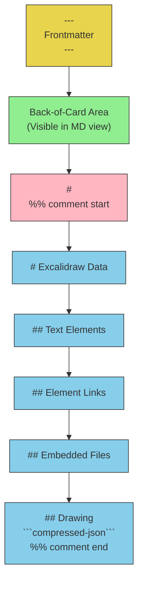
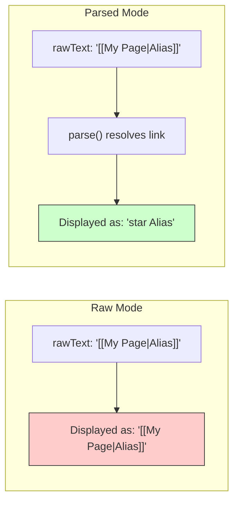
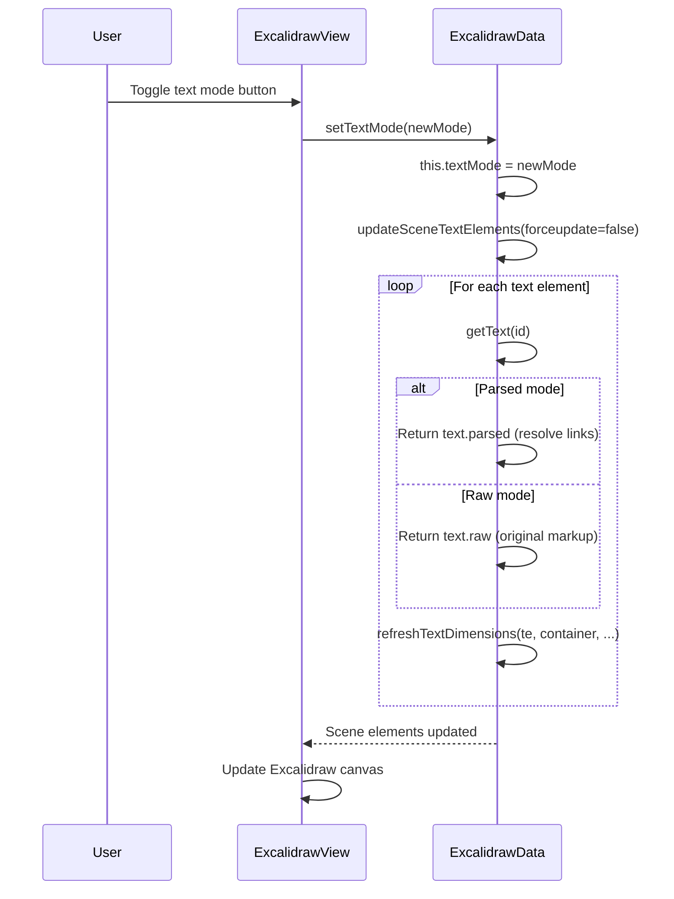
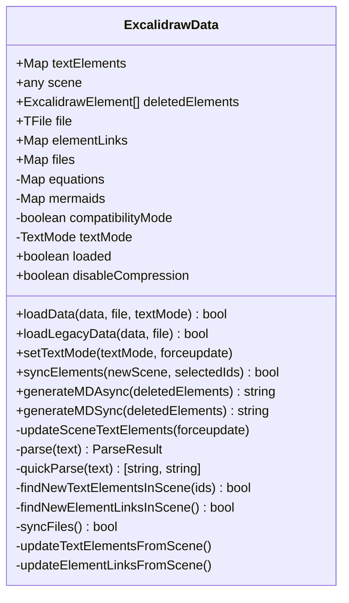
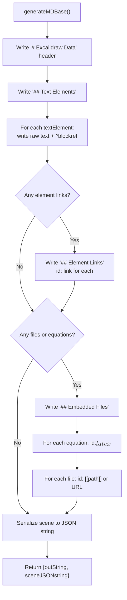
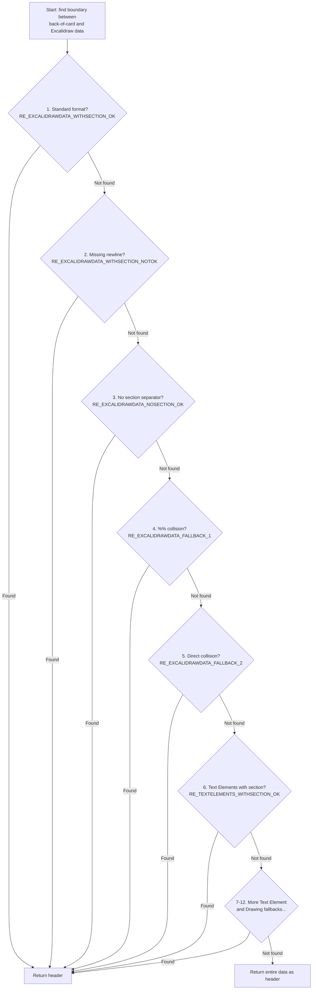

# 03 -- Markdown File Format & ExcalidrawData

This document provides a deep dive into how Obsidian-Excalidraw stores drawings as
Markdown files, the parsing and serialization pipeline implemented in `ExcalidrawData`,
the frontmatter key catalogue, text-mode switching, and the compression architecture.

---

## Table of Contents

1. [File Format Anatomy](#1-file-format-anatomy)
2. [Complete Frontmatter Keys Reference](#2-complete-frontmatter-keys-reference)
3. [TextMode: parsed vs raw](#3-textmode-parsed-vs-raw)
4. [ExcalidrawData Class Deep Dive](#4-excalidrawdata-class-deep-dive)
5. [Compression Architecture](#5-compression-architecture)
6. [Header Parsing Robustness](#6-header-parsing-robustness)
7. [Key Regex Patterns](#7-key-regex-patterns)
8. [Sync & Merge Resilience](#8-sync--merge-resilience)
9. [Cross-References](#9-cross-references)

---

## 1. File Format Anatomy

Every Excalidraw drawing in Obsidian is a `.excalidraw.md` file (or sometimes just
`.md` with special frontmatter). The file is valid Markdown that Obsidian can index,
link-resolve, and render in reading view -- but the actual drawing data lives inside
Obsidian comment blocks (`%%`).

### 1.1 Complete Annotated Example

```markdown
---
excalidraw-plugin: parsed
excalidraw-open-md: false
excalidraw-default-mode: normal
excalidraw-export-dark: false
excalidraw-export-transparent: false
excalidraw-export-padding: 10
excalidraw-export-pngscale: 1
excalidraw-export-embed-scene: false
excalidraw-autoexport: none
excalidraw-link-prefix: "\u2B50"
excalidraw-url-prefix: "\uD83C\uDF10"
excalidraw-link-brackets: true
excalidraw-css: "[[my-custom-styles]]"
excalidraw-onload-script: "[[Scripts/my-script.md]]"
tags: [excalidraw]
---
==Switch to EXCALIDRAW VIEW in the MORE OPTIONS menu of this document.==

This is the "back-of-card" area.  Anything written here is visible
when you open the file as plain Markdown, but is NOT rendered on
the Excalidraw canvas.

#
%%
# Excalidraw Data

## Text Elements
Hello World ^abc12345

This is a [[WikiLink]] with parsed display ^def67890

%%***>>>text element-link:[[SomePage]]<<<***%%Click me ^ghi11111

## Element Links
jkl22222: [[AnotherPage]]

mnopqrst: https://example.com

## Embedded Files
abcdef1234567890abcdef1234567890abcdef12: [[path/to/image.png]]

fedcba0987654321fedcba0987654321fedcba09: $$E = mc^2$$

1a2b3c4d5e6f7890a1b2c3d4e5f67890a1b2c3d4: https://example.com/photo.jpg

%%
## Drawing
```compressed-json
N4IgLgngDgpiBcIA2BTABY ... (LZString compressed JSON scene data)
```
%%
```

### 1.2 Section-by-Section Breakdown



#### Frontmatter (`---` ... `---`)

Standard YAML frontmatter that Obsidian reads. The key `excalidraw-plugin` is what
marks the file as an Excalidraw drawing. Obsidian's metadata cache indexes all
frontmatter keys, making them available to Dataview, graph view, etc.

Source: `src/constants/constants.ts:314-324` -- the `FRONTMATTER` constant that
generates the default frontmatter for new drawings:

```typescript
// src/constants/constants.ts:314-324
export const FRONTMATTER = [
  "---",
  "",
  `${FRONTMATTER_KEYS["plugin"].name}: parsed`,
  "tags: [excalidraw]",
  "",
  "---",
  "==Switch to EXCALIDRAW VIEW ...==",
  "",
  "",
].join("\n");
```

#### Back-of-Card Area

Everything between the closing `---` of frontmatter and the `%%` comment block
is the "back-of-card" area. This text:

- Is visible when the file is opened as Markdown
- Is searchable by Obsidian's search
- Does NOT appear on the Excalidraw canvas
- Can contain regular Markdown content, links, lists, etc.
- Is used by the `SelectCard` dialog (`src/shared/Dialogs/SelectCard.ts`)

The `#` character on its own line before `%%` is a section separator that the
plugin uses to reliably locate where the Excalidraw data begins. This is
important for the header parsing robustness system (see Section 6).

#### `%%` Comment Markers

Obsidian treats content inside `%%` blocks as comments -- invisible in reading
view and preview. The plugin wraps ALL Excalidraw data sections in `%%` blocks
so that the raw JSON and metadata are hidden from the user in normal Markdown
viewing mode.

Detection in `ExcalidrawData.loadData()`:
```typescript
// src/shared/ExcalidrawData.ts:887
this.textElementCommentedOut = textElementsMatch.startsWith("%%\n");
```

#### `# Excalidraw Data`

The top-level heading that marks the beginning of Excalidraw's data region.
Defined in `src/constants/constants.ts:17`:

```typescript
const MD_EXCALIDRAW = "# Excalidraw Data";
```

#### `## Text Elements`

Each text element from the Excalidraw scene is written as:

```
<text content> ^<8-char-id>
```

The 8-character ID is generated by the plugin's custom `nanoid` alphabet
(`src/constants/constants.ts:205-208`):

```typescript
export const nanoid = customAlphabet(
  "1234567890abcdefghijklmnopqrstuvwxyzABCDEFGHIJKLMNOPQRSTUVWXYZ",
  8,
);
```

Excalidraw's native IDs are much longer and may contain characters not valid in
Obsidian block references. When a new text element is first synced, its long ID
is replaced with an 8-char nanoid. See `findNewTextElementsInScene()` at
`src/shared/ExcalidrawData.ts:1166-1210`.

The `^id` suffix is an Obsidian block reference, meaning you can link to
specific text elements from other notes using `[[drawing#^abc12345]]`.

#### `## Element Links`

Non-text elements (shapes, arrows, images) that have links assigned to them are
listed here. Format:

```
<8-char-id>: <link>
```

Where `<link>` is either a `[[WikiLink]]` or a URL like `https://example.com`.
This section was introduced in version 2.0.26 as a replacement for the older
inline format. See `src/shared/ExcalidrawData.ts:893-905`.

Text elements with links are ALSO recorded here (since 2.0.26), providing a
unified location for all element-link associations.

#### `## Embedded Files`

Maps 40-character hex file IDs to their sources. Three types of entries:

| Pattern | Type | Example |
|---------|------|---------|
| `id: [[path]]` | Vault file | `abc123: [[images/photo.png]]` |
| `id: $$latex$$` | LaTeX equation | `def456: $$E = mc^2$$` |
| `id: https://...` | External URL | `ghi789: https://example.com/img.jpg` |

The file ID is a 40-character hex string generated by `fileid()` at
`src/constants/constants.ts:223`:

```typescript
export const fileid = customAlphabet("1234567890abcdef", 40);
```

Regex patterns used for parsing (from `ExcalidrawData.ts:980-993`):

```typescript
// Vault files
const REG_FILEID_FILEPATH = /([\w\d]*):\s*\!?\[\[([^\]]*)]]\s*(\{[^}]*})?\n/gm;

// External URLs
const REG_LINKID_FILEPATH = /([\w\d]*):\s*((?:https?|file|ftps?):\/\/[^\s]*)\n/gm;

// LaTeX equations
const REG_FILEID_EQUATION = /([\w\d]*):\s*\$\$([\s\S]*?)(\$\$\s*\n)/gm;
```

The optional `{...}` suffix on vault file entries stores a color map for SVG
recoloring. See `src/shared/ExcalidrawData.ts:1524`.

#### `## Drawing`

The actual Excalidraw scene data. Can be stored in two formats:

**Uncompressed** (rare, used during development or when compression is disabled):
````
## Drawing
```json
{"type":"excalidraw","version":2,"elements":[...],...}
```
````

**Compressed** (default):
````
## Drawing
```compressed-json
N4IgLgngDgpiBcIA2BTABY...
```
````

The compressed format uses LZString's `compressToBase64()` algorithm. See the
`getMarkdownDrawingSection()` function at `src/shared/ExcalidrawData.ts:245-255`:

```typescript
export function getMarkdownDrawingSection(
  jsonString: string,
  compressed: boolean,
): string {
  const result = compressed
    ? `## Drawing\n\`\`\`compressed-json\n${compress(jsonString)}\n\`\`\`\n%%`
    : `## Drawing\n\`\`\`json\n${jsonString}\n\`\`\`\n%%`;
  return result;
}
```

---

## 2. Complete Frontmatter Keys Reference

All frontmatter keys are defined in `src/constants/constants.ts:242-267` in the
`FRONTMATTER_KEYS` object:

```typescript
export const FRONTMATTER_KEYS:{[key:string]: {name: string, type: string, depricated?:boolean}} = {
  "plugin":              {name: "excalidraw-plugin",              type: "text"},
  "export-transparent":  {name: "excalidraw-export-transparent",  type: "checkbox"},
  "mask":                {name: "excalidraw-mask",                type: "checkbox"},
  "export-dark":         {name: "excalidraw-export-dark",         type: "checkbox"},
  "export-svgpadding":   {name: "excalidraw-export-svgpadding",   type: "number", depricated: true},
  "export-padding":      {name: "excalidraw-export-padding",      type: "number"},
  "export-pngscale":     {name: "excalidraw-export-pngscale",     type: "number"},
  "export-embed-scene":  {name: "excalidraw-export-embed-scene",  type: "checkbox"},
  "export-internal-links": {name: "excalidraw-export-internal-links", type: "checkbox"},
  "link-prefix":         {name: "excalidraw-link-prefix",         type: "text"},
  "url-prefix":          {name: "excalidraw-url-prefix",          type: "text"},
  "link-brackets":       {name: "excalidraw-link-brackets",       type: "checkbox"},
  "onload-script":       {name: "excalidraw-onload-script",       type: "text"},
  "linkbutton-opacity":  {name: "excalidraw-linkbutton-opacity",  type: "number"},
  "default-mode":        {name: "excalidraw-default-mode",        type: "text"},
  "font":                {name: "excalidraw-font",                type: "text"},
  "font-color":          {name: "excalidraw-font-color",          type: "text"},
  "border-color":        {name: "excalidraw-border-color",        type: "text"},
  "md-css":              {name: "excalidraw-css",                 type: "text"},
  "autoexport":          {name: "excalidraw-autoexport",          type: "text"},
  "iframe-theme":        {name: "excalidraw-iframe-theme",        type: "text", depricated: true},
  "embeddable-theme":    {name: "excalidraw-embeddable-theme",    type: "text"},
  "open-as-markdown":    {name: "excalidraw-open-md",             type: "checkbox"},
  "embed-as-markdown":   {name: "excalidraw-embed-md",            type: "checkbox"},
};
```

### Full Reference Table

| Frontmatter Key | Internal Key | Type | Description |
|---|---|---|---|
| `excalidraw-plugin` | `plugin` | text | **Required.** Marks file as Excalidraw. Values: `parsed`, `raw`, `locked`. Determines text display mode. |
| `excalidraw-export-transparent` | `export-transparent` | checkbox | Whether exported images have a transparent background. |
| `excalidraw-mask` | `mask` | checkbox | Marks file as a mask file (used for image masking/clipping). |
| `excalidraw-export-dark` | `export-dark` | checkbox | Whether to export with the dark theme. `true` = dark, `false` = light. |
| `excalidraw-export-svgpadding` | `export-svgpadding` | number | **Deprecated.** Padding for SVG export in pixels. Replaced by `export-padding`. |
| `excalidraw-export-padding` | `export-padding` | number | Padding around exported images in pixels. |
| `excalidraw-export-pngscale` | `export-pngscale` | number | Scale factor for PNG export (e.g., `2` = 2x resolution). |
| `excalidraw-export-embed-scene` | `export-embed-scene` | checkbox | Whether to embed the full scene JSON inside exported SVG files. |
| `excalidraw-export-internal-links` | `export-internal-links` | checkbox | Whether to include clickable internal links in exported SVG files. |
| `excalidraw-link-prefix` | `link-prefix` | text | Icon/prefix displayed before parsed internal links (e.g., star emoji). |
| `excalidraw-url-prefix` | `url-prefix` | text | Icon/prefix displayed before parsed external URLs (e.g., globe emoji). |
| `excalidraw-link-brackets` | `link-brackets` | checkbox | Whether to show `[[` and `]]` around parsed wiki-links on the canvas. |
| `excalidraw-onload-script` | `onload-script` | text | Path to a script file that runs automatically when the drawing opens. |
| `excalidraw-linkbutton-opacity` | `linkbutton-opacity` | number | Opacity of the link indicator icon on elements (0-1). |
| `excalidraw-default-mode` | `default-mode` | text | Default view mode when opening. Values: `normal`, `zen`, `view` (presentation). |
| `excalidraw-font` | `font` | text | Custom font specification for the drawing. |
| `excalidraw-font-color` | `font-color` | text | Default font color for text elements. |
| `excalidraw-border-color` | `border-color` | text | Default border color for shape elements. |
| `excalidraw-css` | `md-css` | text | Path to a CSS file for custom styling of markdown embeds. |
| `excalidraw-autoexport` | `autoexport` | text | Auto-export config. Values: `none`, `both`, `png`, `svg`. Overrides global setting. |
| `excalidraw-iframe-theme` | `iframe-theme` | text | **Deprecated.** Theme for embedded iframes. Replaced by `embeddable-theme`. |
| `excalidraw-embeddable-theme` | `embeddable-theme` | text | Theme for embeddable elements. Values: `light`, `dark`, `auto`, `default`. |
| `excalidraw-open-md` | `open-as-markdown` | checkbox | Whether to open the file in Markdown view instead of Excalidraw view. |
| `excalidraw-embed-md` | `embed-as-markdown` | checkbox | Whether to embed the drawing as markdown (rather than image) in reading view. |

### Valid Values for `excalidraw-plugin`

| Value | TextMode | Editable | Description |
|-------|----------|----------|-------------|
| `parsed` | `TextMode.parsed` | Yes | Links like `[[Page]]` are resolved and shown with aliases/prefixes. |
| `raw` | `TextMode.raw` | Yes | Original markup preserved as-is. Faster. |
| `locked` | `TextMode.parsed` | Read-only | Same as parsed, but the drawing opens in view-only mode. |

Detection logic in `src/shared/TextMode.ts:6-10`:

```typescript
export function getTextMode(data: string): TextMode {
  const parsed =
    data.search("excalidraw-plugin: parsed\n") > -1 ||
    data.search("excalidraw-plugin: locked\n") > -1;
  return parsed ? TextMode.parsed : TextMode.raw;
}
```

### AutoexportPreference Enum

Defined at `src/shared/ExcalidrawData.ts:72-78`:

```typescript
export enum AutoexportPreference {
  none,     // No auto-export
  both,     // Export both SVG and PNG
  png,      // Export PNG only
  svg,      // Export SVG only
  inherit   // Use global plugin setting
}
```

---

## 3. TextMode: parsed vs raw

The text mode system controls how text elements with Obsidian links and
transclusions are displayed on the Excalidraw canvas. This is one of the most
distinctive features of the plugin.

### 3.1 The Two Modes



### 3.2 TextElement Field Semantics

From the comment at `src/shared/ExcalidrawData.ts:1-7`:

```
rawText:      The text with original markdown markup, without added linebreaks for wrapping
originalText: The text without added linebreaks for wrapping (parsed or markup depending on view mode)
text:         The displayed text, with linebreaks if wrapped, and parsed or original depending on mode
```

| Field | Contains | Used For |
|-------|----------|----------|
| `rawText` | Original Markdown markup | Persisted to `## Text Elements` |
| `originalText` | Current mode's text (no wrap breaks) | Excalidraw internal |
| `text` | Current mode's text (with wrap breaks) | Rendering on canvas |

### 3.3 Mode Switching

When the user toggles between parsed and raw mode, the following chain executes:



Source: `ExcalidrawData.setTextMode()` at `src/shared/ExcalidrawData.ts:1068-1072`:

```typescript
public async setTextMode(textMode: TextMode, forceupdate: boolean = false) {
  if(!this.scene) return;
  this.textMode = textMode;
  await this.updateSceneTextElements(forceupdate);
}
```

### 3.4 The parse() Method

The `parse()` method (`src/shared/ExcalidrawData.ts:1302-1370`) is the heart
of the parsed text mode. It processes raw text through several stages:

1. **Checkbox parsing** (`parseCheckbox()`): Converts `- [ ]` and `- [x]` to
   configured TODO/DONE symbols
2. **Hyperlink detection**: If the entire text is a URL, set it as the link
3. **Link iteration**: Using `REGEX_LINK`, finds all `[[wiki]]` and
   `[md](links)` in the text
4. **Transclusion resolution**: For `![[embed]]` links, fetches the
   transcluded content via `getTransclusion()`
5. **Link display**: Replaces `[[Page|Alias]]` with just `Alias` (optionally
   with brackets)
6. **Prefix injection**: Adds link-prefix or url-prefix icons

The `quickParse()` method (`src/shared/ExcalidrawData.ts:1407-1465`) is a
synchronous fast-path that handles everything except transclusions. If the text
contains a transclusion (`![[...]]`), it returns `null` and the caller falls
back to the async `parse()`.

### 3.5 Locked Mode

When `excalidraw-plugin: locked` is set in frontmatter:

- TextMode is set to `parsed` (same link resolution)
- The drawing opens in view-only mode (`viewModeEnabled = true`)
- Users can interact with links but cannot modify the drawing

---

## 4. ExcalidrawData Class Deep Dive

`ExcalidrawData` (`src/shared/ExcalidrawData.ts:472`) is the data layer that sits
between the Markdown file on disk and the Excalidraw React component in memory.

### 4.1 Class Overview



### 4.2 Key Properties

| Property | Type | Defined At | Purpose |
|----------|------|-----------|---------|
| `textElements` | `Map<string, {raw, parsed, hasTextLink}>` | line 473-476 | Text content keyed by 8-char element ID |
| `scene` | `any` | line 477 | The full Excalidraw JSON scene object |
| `deletedElements` | `ExcalidrawElement[]` | line 478 | Elements marked as deleted (preserved for sync) |
| `file` | `TFile` | line 479 | The Obsidian file being edited |
| `elementLinks` | `Map<string, string>` | line 488 | Non-text element links (id -> link text) |
| `files` | `Map<FileId, EmbeddedFile>` | line 489 | Embedded file references (images, PDFs, etc.) |
| `equations` | `Map<FileId, {latex, isLoaded}>` | line 490 | LaTeX equation data |
| `mermaids` | `Map<FileId, {mermaid, isLoaded}>` | line 491 | Mermaid diagram data |
| `textMode` | `TextMode` | line 486 | Current display mode (parsed/raw) |
| `loaded` | `boolean` | line 487 | Whether data has been successfully loaded |
| `compatibilityMode` | `boolean` | line 492 | True for legacy `.excalidraw` files |
| `disableCompression` | `boolean` | line 1471 | Temporarily disable compression (e.g., for MD editing) |
| `selectedElementIds` | `{[key:string]:boolean}` | line 494 | Tracks selected elements across ID changes |
| `autoexportPreference` | `AutoexportPreference` | line 485 | Per-file export preference |
| `embeddableTheme` | `"light"\|"dark"\|"auto"\|"default"` | line 483 | Theme for embedded content |

### 4.3 Constructor

At `src/shared/ExcalidrawData.ts:496-503`:

```typescript
constructor(
  private plugin: ExcalidrawPlugin, private view?: ExcalidrawView,
) {
  this.app = this.plugin.app;
  this.files = new Map<FileId, EmbeddedFile>();
  this.equations = new Map<FileId, { latex: string; isLoaded: boolean }>();
  this.mermaids = new Map<FileId, { mermaid: string; isLoaded: boolean }>();
}
```

The `view` parameter is optional because `ExcalidrawData` is also used outside
the view context (e.g., by the `ExcalidrawAutomate` API for headless operations).

### 4.4 loadData() -- The Main Parsing Pipeline

`loadData()` at `src/shared/ExcalidrawData.ts:701-1031` is the most critical
method. It deserializes a Markdown string into the in-memory scene representation.

```mermaid
flowchart TD
    A["loadData(data, file, textMode)"] --> B{File exists?}
    B -->|No| B1[Return false]
    B -->|Yes| C[Reset maps: textElements, elementLinks]
    C --> D[Store display preferences:<br>linkBrackets, linkPrefix, urlPrefix]
    D --> E{syncExcalidraw enabled<br>AND .excalidraw file newer?}
    E -->|Yes| F[Load scene from .excalidraw file]
    E -->|No| G[Extract JSON via getJSON()]
    F --> G
    G --> H[JSON_parse scene data]
    H --> I[Filter deleted elements]
    I --> J[initializeNonInitializedFields<br>Backward compatibility fixes]
    J --> K[loadSceneFonts]
    K --> L[Apply theme settings]
    L --> M[Find '# Excalidraw Data' or<br>'## Text Elements' header]
    M --> N[Parse Text Elements<br>text ^blockref]
    N --> O[Parse Element Links<br>id: link]
    O --> P[Parse Embedded Files<br>id: path/equation/url]
    P --> Q[findNewTextElementsInScene<br>findNewElementLinksInScene]
    Q --> R[setTextMode]
    R --> S[loaded = true]
    S --> T[Return true]
```

#### Step 1: Scene JSON Extraction

The `getJSON()` function at `src/shared/ExcalidrawData.ts:201-231` extracts
the JSON scene data from the Markdown:

```typescript
export function getJSON(data: string): { scene: string; pos: number } {
  if (isCompressedMD(data)) {
    const [result, parts] = getDecompressedScene(data);
    // ...decompresses and returns
  }
  // Falls back to uncompressed regex matching
  res = data.matchAll(DRAWING_REG);
  // ...
}
```

It first checks if the data is compressed (`compressed-json`), and if so,
decompresses it. Otherwise it uses the `DRAWING_REG` regex to find the raw JSON.

#### Step 2: Backward Compatibility

`initializeNonInitializedFields()` at `src/shared/ExcalidrawData.ts:530-694`
handles a remarkable number of backward-compatibility issues:

- Converting `iframe` type elements to `embeddable` type (line 539-541)
- Deduplicating bound text elements (line 543-565)
- Migrating `boundElementIds` to `boundElements` array format (line 568-579)
- Adding missing `containerId` to text elements (line 582-584)
- Fixing null `x`, `y`, `fontSize` values (line 591-607)
- Adding missing `autoResize`, `lineHeight`, `roundness` fields (line 609-619)
- Fixing one-way container-text bindings (line 623-658)
- Cleaning orphaned bound element references (line 662-693)
- Legacy text wrapping for ellipse/rhombus containers (line 660-670)

#### Step 3: Text Element Parsing

Starting at line 907, the method iterates through `## Text Elements`:

```typescript
const BLOCKREF_LEN: number = 12; // " ^12345678\n\n".length;
let res = data.matchAll(/\s\^(.{8})[\n]+/g);
while (!(parts = res.next()).done) {
  let text = data.substring(position, parts.value.index);
  const id: string = parts.value[1];
  const textEl = this.scene.elements.filter((el: any) => el.id === id)[0];
  // ... process text element
}
```

For each text element found:
1. Extract the raw text and the 8-char block reference ID
2. Find the matching element in the scene JSON
3. Check for legacy text-element-link format (`%%***>>>text element-link:...<<<***%%`)
4. Check for element links in the new `## Element Links` section
5. Run `parse()` to generate the parsed representation
6. Store in `textElements` map: `{raw, parsed, hasTextLink}`
7. Optionally sync the link from parsed text to `element.link`

#### Step 4: Embedded Files Parsing

Starting at line 970, the method processes `## Embedded Files`:

```typescript
// Vault files: "id: [[path]]" or "id: ![[path]]"
const REG_FILEID_FILEPATH = /([\w\d]*):\s*\!?\[\[([^\]]*)]]\s*(\{[^}]*})?\n/gm;

// External URLs: "id: https://..."
const REG_LINKID_FILEPATH = /([\w\d]*):\s*((?:https?|file|ftps?):\/\/[^\s]*)\n/gm;

// LaTeX equations: "id: $$...$$"
const REG_FILEID_EQUATION = /([\w\d]*):\s*\$\$([\s\S]*?)(\$\$\s*\n)/gm;
```

### 4.5 generateMDAsync() / generateMDSync() -- Serialization

These methods convert the in-memory scene back to the Markdown file format.

The shared logic lives in `generateMDBase()` at `src/shared/ExcalidrawData.ts:1472-1539`:



The async variant uses worker-based compression:

```typescript
// src/shared/ExcalidrawData.ts:1542-1553
async generateMDAsync(deletedElements: ExcalidrawElement[] = []): Promise<string> {
  const { outString, sceneJSONstring } = this.generateMDBase(deletedElements);
  const result = (
    outString +
    (this.textElementCommentedOut ? "" : "%%\n") +
    (await getMarkdownDrawingSectionAsync(
      sceneJSONstring,
      this.disableCompression ? false : this.plugin.settings.compress,
    ))
  );
  return result;
}
```

### 4.6 syncElements() -- Keeping Scene and Markdown in Sync

`syncElements()` at `src/shared/ExcalidrawData.ts:1749-1766` is called during
the save cycle to reconcile changes made in the Excalidraw UI with the
internal data structures:

```typescript
public async syncElements(newScene: any, selectedElementIds?): Promise<boolean> {
  this.scene = newScene;
  let result = false;
  if (!this.compatibilityMode) {
    result = await this.syncFiles();      // Sync embedded files
    this.scene.files = {};                 // Clear dataURLs (saved to disk)
  }
  this.updateElementLinksFromScene();      // Update element links map
  result = result ||
    this.syncCroppedPDFs() ||              // Update PDF crop links
    this.setLinkPrefix() ||                // Check prefix changes
    this.setUrlPrefix() ||
    this.setShowLinkBrackets() ||
    this.findNewElementLinksInScene();      // Find new non-text links
  await this.updateTextElementsFromScene(); // Sync text content
  return result || this.findNewTextElementsInScene(selectedElementIds);
}
```

The return value indicates whether IDs were changed (requiring a scene reload).

### 4.7 syncFiles() -- File Reference Management

`syncFiles()` at `src/shared/ExcalidrawData.ts:1643-1747` handles:

1. **Cleanup**: Remove file/equation/mermaid entries for elements no longer in the scene
2. **Deduplication**: Assign new fileIds when equations or markdown embeds are duplicated
   (multiple image elements sharing the same embedded content need unique IDs)
3. **New file import**: When pasted images have dataURLs in `scene.files` that are not
   yet tracked, save them to the vault via `saveDataURLtoVault()`

---

## 5. Compression Architecture

### 5.1 Why Compression?

Excalidraw scene JSON can be very large (thousands of elements, embedded font data,
coordinate arrays). LZString compression typically achieves 60-80% size reduction,
which matters because:

- Obsidian vaults can contain hundreds of drawings
- Sync services have file size limits
- Smaller files mean faster load/save operations

### 5.2 Compression Flow

```mermaid
flowchart LR
    subgraph "Save Path"
        A["Scene JSON"] --> B["JSON.stringify()"]
        B --> C{Compression enabled?}
        C -->|Yes| D["LZString.compressToBase64()"]
        C -->|No| E["Raw JSON string"]
        D --> F["```compressed-json``` block"]
        E --> G["```json``` block"]
    end

    subgraph "Load Path"
        H["Detect format via regex"]
        H --> I{compressed-json?}
        I -->|Yes| J["LZString.decompressFromBase64()"]
        I -->|No| K["Read raw JSON"]
        J --> L["JSON_parse()"]
        K --> L
    end
```

### 5.3 Detection

At `src/shared/ExcalidrawData.ts:159-161`:

```typescript
const isCompressedMD = (data: string): boolean => {
  return data.match(/```compressed\-json\n/gm) !== null;
};
```

### 5.4 Worker-Based Async Compression

Since version 2.4.0, compression can be offloaded to a Web Worker to avoid
blocking the UI thread during saves of large drawings.

The worker is defined in `src/shared/Workers/compression-worker.ts`. It embeds
a complete copy of the LZString library inline (lines 11-47 of that file) and
handles two message types:

- `compress`: Takes a string, returns `LZString.compressToBase64(data)` with
  chunk-based newline insertion for readability
- `decompress`: Takes a compressed string, strips whitespace, returns
  `LZString.decompressFromBase64(cleanedData)`

The `IS_WORKER_SUPPORTED` flag (`src/shared/Workers/compression-worker.ts`)
determines whether the worker can be used. The view checks this flag at save
time (`src/view/ExcalidrawView.ts:1055-1061`):

```typescript
const result = IS_WORKER_SUPPORTED
  ? (header + (await this.excalidrawData.generateMDAsync(...)))
  : (header + (this.excalidrawData.generateMDSync(...)));
```

### 5.5 Compression Disable Conditions

Compression is temporarily disabled when:

1. **Markdown editing**: If the same file is open in a Markdown view, compression
   is disabled so the user can read the JSON
   (`src/view/ExcalidrawView.ts:1051-1054`)
2. **Compatibility mode**: Legacy `.excalidraw` files are never compressed
   (`src/view/ExcalidrawView.ts:2647`)
3. **Plugin setting**: `plugin.settings.compress` can be set to `false`
4. **Per-file override**: `excalidrawData.disableCompression` can be set temporarily

### 5.6 JSON_parse() Safety

The custom `JSON_parse()` function at `src/constants/constants.ts:172-174`
replaces encoded square brackets before parsing:

```typescript
export function JSON_parse(x: string): any {
  return JSON.parse(x.replaceAll("&#91;", "["));
}
```

This handles an edge case where early versions of the plugin encoded `[` to
`&#91;` to prevent Obsidian from creating phantom links in graph view.

---

## 6. Header Parsing Robustness

One of the most defensive parts of the codebase is the header extraction logic
in `getExcalidrawMarkdownHeader()` at `src/shared/ExcalidrawData.ts:309-452`.

### 6.1 Why So Many Fallbacks?

The plugin must reliably separate the "back-of-card" content from the Excalidraw
data sections. This boundary can be corrupted by:

- Sync conflicts merging files
- Users manually editing the Markdown
- Different plugin versions creating slightly different formats
- Users accidentally deleting newlines between sections
- Back-of-card notes running into section headers without whitespace

### 6.2 Fallback Chain

The function tries **12 different regex patterns** in order of decreasing
specificity:



### 6.3 Regex Patterns

Defined at `src/shared/ExcalidrawData.ts:288-307`:

```typescript
// Standard case: "# Excalidraw Data" preceded by # separator and %% comment
const RE_EXCALIDRAWDATA_WITHSECTION_OK = /^(#\n+)%%\n+# Excalidraw Data(?:\n|$)/m;

// User deleted the newline after the last back-of-card heading
const RE_EXCALIDRAWDATA_WITHSECTION_NOTOK = /#\n+%%\n+# Excalidraw Data(?:\n|$)/m;

// No section separator (older format or manual edit)
const RE_EXCALIDRAWDATA_NOSECTION_OK = /^(%%\n+)?# Excalidraw Data(?:\n|$)/m;

// Content runs directly into %% without newline
const RE_EXCALIDRAWDATA_FALLBACK_1 = /(.*)%%\n+# Excalidraw Data(?:\n|$)/m;

// Content runs directly into header without any separator
const RE_EXCALIDRAWDATA_FALLBACK_2 = /(.*)# Excalidraw Data(?:\n|$)/m;

// Same patterns but for "## Text Elements" (for files that skip the Data header)
const RE_TEXTELEMENTS_WITHSECTION_OK = /^#\n+%%\n+##? Text Elements(?:\n|$)/m;
// ... and more variants
```

### 6.4 Drawing Section Detection

The drawing section is located first (line 325-328) to trim the data before
running the expensive header regexes:

```typescript
const drawingTrimLocation = data.search(RE_DRAWING);
if(drawingTrimLocation > 0) {
  data = data.substring(0, drawingTrimLocation);
}
```

This optimization avoids running complex regex patterns against potentially
huge compressed JSON strings.

---

## 7. Key Regex Patterns

### 7.1 Link Detection

`REGEX_LINK` at `src/shared/ExcalidrawData.ts:101-148`:

```typescript
//      1   2    3           4             5         67                             8  9
EXPR: /(!)?(\[\[([^|\]]+)\|?([^\]]+)?]]|\[([^\]]*)]\(((?:[^\(\)]|\([^\(\)]*\))*)\))(\{(\d+)\})?/g
```

Capture groups:
| Group | Content | Example Match |
|-------|---------|---------------|
| 1 | `!` (transclusion marker) | `!` in `![[embed]]` |
| 2 | Full link expression | `[[Page\|Alias]]` or `[text](url)` |
| 3 | Wiki-link path | `Page` in `[[Page\|Alias]]` |
| 4 | Wiki-link alias | `Alias` in `[[Page\|Alias]]` |
| 5 | Markdown link text | `text` in `[text](url)` |
| 6 | Markdown link URL | `url` in `[text](url)` |
| 7 | Wrap specification | `{40}` |
| 8 | Wrap length number | `40` |

### 7.2 Tag Detection

`REGEX_TAGS` at `src/shared/ExcalidrawData.ts:80-99`:

```typescript
EXPR: /(#[\p{Letter}\p{Emoji_Presentation}\p{Number}\/_-]+)/gu
```

Matches Obsidian-style tags including Unicode letters, emoji, and path separators.

### 7.3 Drawing Section Patterns

At `src/shared/ExcalidrawData.ts:151-156`:

```typescript
const DRAWING_REG = /\n##? Drawing\n[^`]*(```json\n)([\s\S]*?)```\n/gm;
const DRAWING_REG_FALLBACK = /\n##? Drawing\n(```json\n)?(.*)(```)?(%%)?/gm;
const DRAWING_COMPRESSED_REG =
  /(\n##? Drawing\n[^`]*(?:```compressed\-json\n))([\s\S]*?)(```\n)/gm;
const DRAWING_COMPRESSED_REG_FALLBACK =
  /(\n##? Drawing\n(?:```compressed\-json\n)?)(.*)((```)?(%%)?)/gm;
```

Each pattern has a primary and fallback variant to handle corruption.

---

## 8. Sync & Merge Resilience

### 8.1 Compatibility with .excalidraw Files

When `plugin.settings.syncExcalidraw` is enabled, `loadData()` checks if a
companion `.excalidraw` file exists and is newer than the `.md` file
(`src/shared/ExcalidrawData.ts:739-750`). This supports users who edit the
same drawing in Logseq (which uses `.excalidraw` format).

### 8.2 Version Tracking

Each Excalidraw element has a `version` number that increments on every change.
During sync (`synchronizeWithData()` in `ExcalidrawView.ts:2900-3023`), elements
are merged by comparing version numbers -- higher version wins.

### 8.3 Deleted Elements Preservation

Deleted elements are stored separately (`this.deletedElements` at line 478) and
re-included during save (`generateMDBase` at line 1535):

```typescript
elements: this.scene.elements.concat(deletedElements),
```

This ensures that even when an element is deleted, its data persists in the
file for proper sync conflict resolution.

### 8.4 FrontmatterEditor

The `FrontmatterEditor` class (`src/shared/Frontmatter.ts:3-41`) provides
safe manipulation of YAML frontmatter without disturbing the rest of the file:

```typescript
class FrontmatterEditor {
  hasKey(key: string): boolean     // Check if frontmatter key exists
  setKey(key: string, value: string) // Set or update frontmatter key
  get data(): string               // Reconstruct full file with updated frontmatter
}
```

It handles edge cases like multi-line values (indented continuation lines) and
normalizes line endings (`\r\n` -> `\n`).

---

## 9. Cross-References

| Topic | File | Key Lines |
|-------|------|-----------|
| ExcalidrawData class | `src/shared/ExcalidrawData.ts` | 472-1767 |
| TextMode enum | `src/shared/TextMode.ts` | 1-11 |
| FrontmatterEditor | `src/shared/Frontmatter.ts` | 3-41 |
| FRONTMATTER_KEYS | `src/constants/constants.ts` | 242-267 |
| MD_EX_SECTIONS | `src/constants/constants.ts` | 17-23 |
| FRONTMATTER template | `src/constants/constants.ts` | 314-324 |
| JSON_parse | `src/constants/constants.ts` | 172-174 |
| nanoid (8-char) | `src/constants/constants.ts` | 205-208 |
| fileid (40-char hex) | `src/constants/constants.ts` | 223 |
| Compression worker | `src/shared/Workers/compression-worker.ts` | 1-47 |
| View save cycle | `src/view/ExcalidrawView.ts` | 844-1001 |
| View prepareGetViewData | `src/view/ExcalidrawView.ts` | 1012-1075 |
| getJSON | `src/shared/ExcalidrawData.ts` | 201-231 |
| getMarkdownDrawingSection | `src/shared/ExcalidrawData.ts` | 245-255 |
| REGEX_LINK | `src/shared/ExcalidrawData.ts` | 101-148 |
| EmbeddedFile class | `src/shared/EmbeddedFileLoader.ts` | -- |
| ExcalidrawAutomate.create() | `src/shared/ExcalidrawAutomate.ts` | -- |

### Related Learning Materials

- **02-architecture.md**: Overall source layout and key abstractions
- **04-view-and-react.md**: How ExcalidrawView consumes ExcalidrawData (load/save cycles)
- **05-build-system.md**: How compression is used at build time for packages
