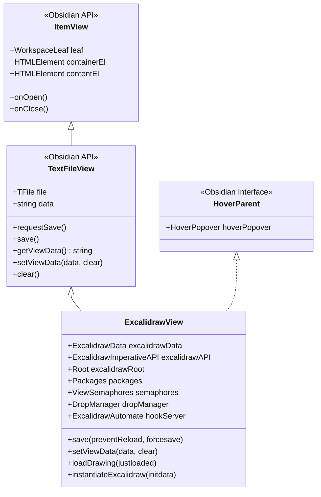
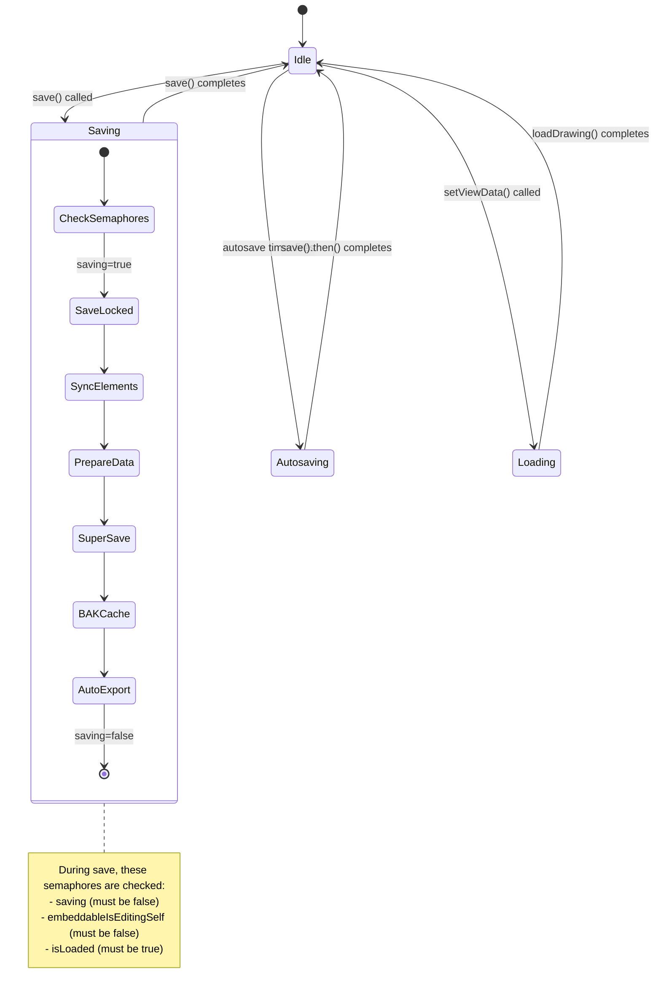
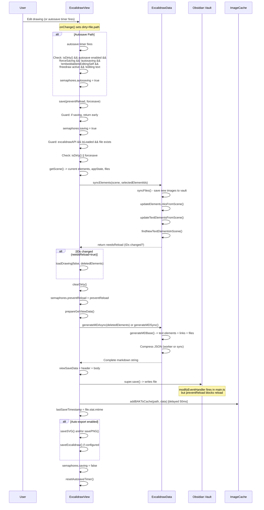
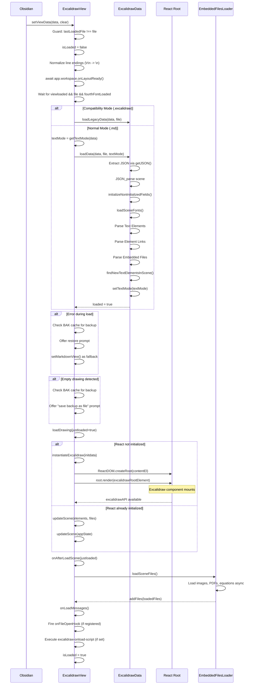
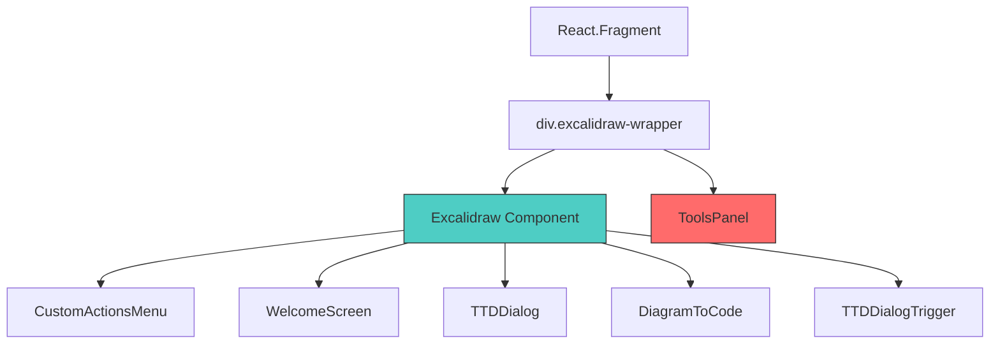
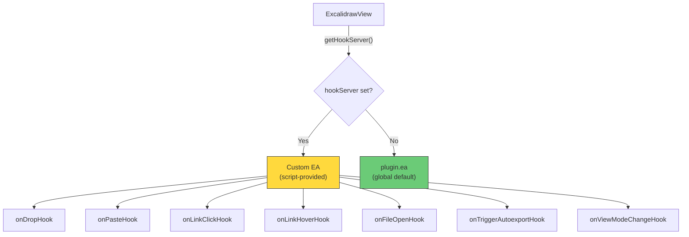
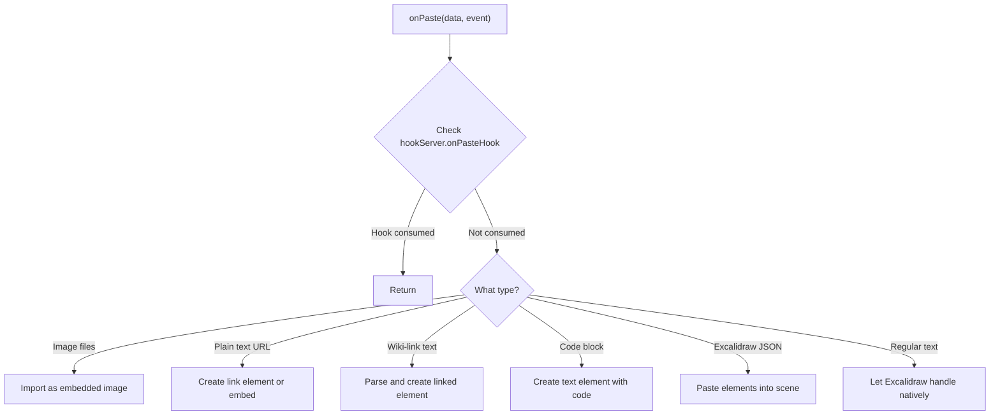
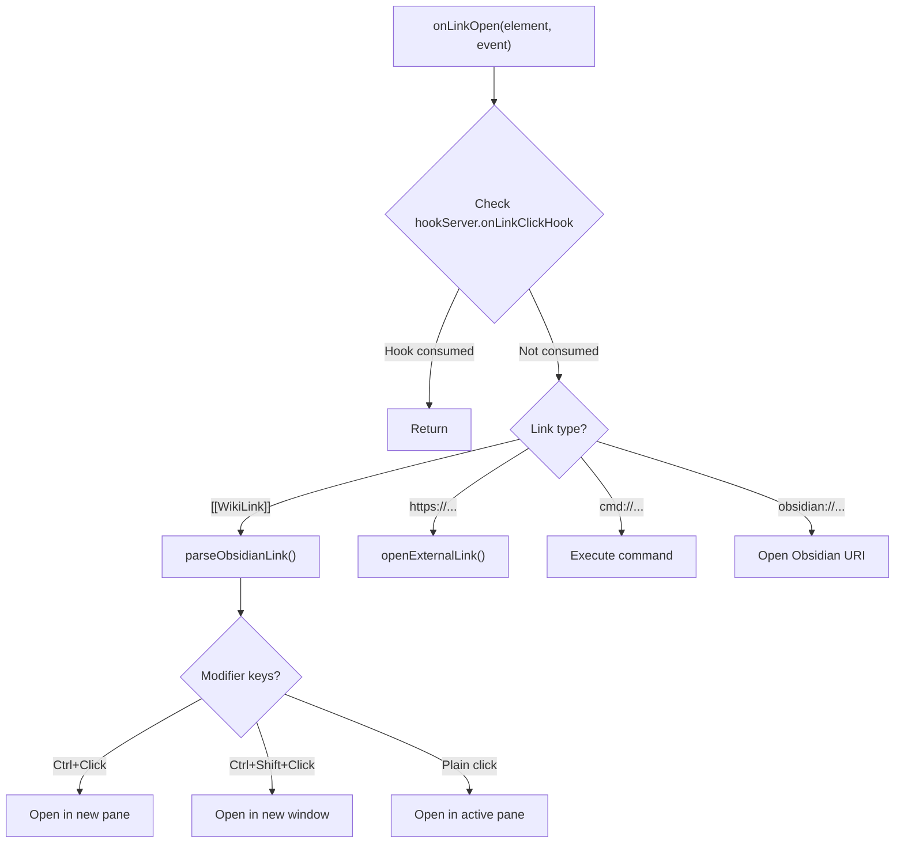
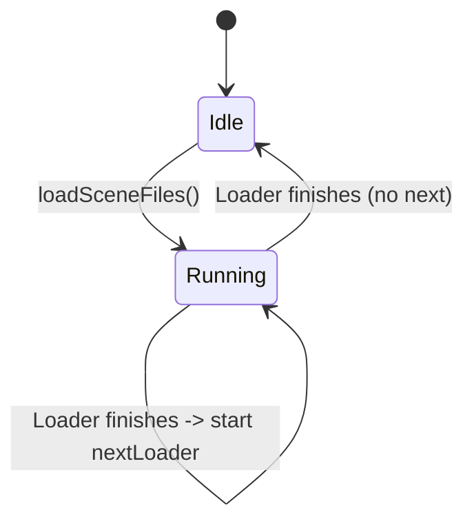
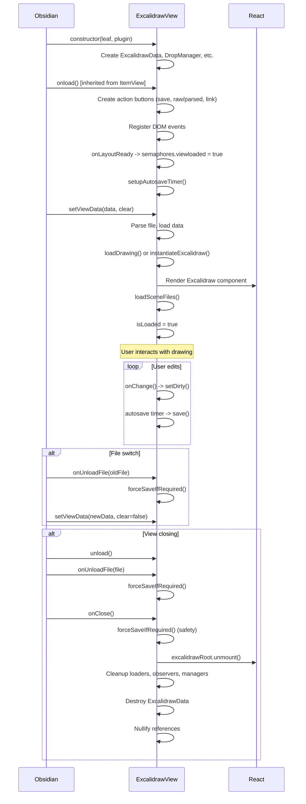

# 04 -- ExcalidrawView & React Integration

This document explores the `ExcalidrawView` class -- the ~6700-line behemoth that
bridges Obsidian's file-backed view system with the Excalidraw React component. It
covers the class hierarchy, semaphore system, save/load lifecycle, React rendering
pipeline, and event handling architecture.

---

## Table of Contents

1. [Class Hierarchy](#1-class-hierarchy)
2. [Key Properties](#2-key-properties)
3. [Semaphore System](#3-semaphore-system)
4. [Save Cycle Deep Dive](#4-save-cycle-deep-dive)
5. [Load Cycle Deep Dive](#5-load-cycle-deep-dive)
6. [React Component Rendering](#6-react-component-rendering)
7. [hookServer Pattern](#7-hookserver-pattern)
8. [Key Event Handlers](#8-key-event-handlers)
9. [File Loading Pipeline](#9-file-loading-pipeline)
10. [Autosave System](#10-autosave-system)
11. [View Lifecycle](#11-view-lifecycle)
12. [Cross-References](#12-cross-references)

---

## 1. Class Hierarchy



### What TextFileView Provides

`TextFileView` is Obsidian's base class for views that are backed by a text file.
It gives ExcalidrawView:

| Method/Property | Purpose |
|-----------------|---------|
| `this.file` | The `TFile` currently open in this view |
| `this.data` | The raw file content as a string |
| `requestSave()` | Request Obsidian to call `getViewData()` and write to disk |
| `save()` | Trigger a save (calls `getViewData()` internally) |
| `getViewData()` | **Must override.** Return the current content to save |
| `setViewData(data, clear)` | **Must override.** Called when file content changes |
| `clear()` | **Must override.** Reset the view state |

ExcalidrawView overrides `setViewData()` for loading, `getViewData()` for saving,
and adds its own `save()` method that wraps `super.save()` with extensive
semaphore-guarded logic.

### HoverParent Interface

Implementing `HoverParent` allows Obsidian to show hover previews when the user
hovers over links within the Excalidraw canvas. The `hoverPopover` property
(`src/view/ExcalidrawView.ts:291`) holds the active popover instance.

---

## 2. Key Properties

Defined at `src/view/ExcalidrawView.ts:289-374`:

### Core State

| Property | Type | Line | Purpose |
|----------|------|------|---------|
| `excalidrawData` | `ExcalidrawData` | 294 | Parsed scene data (the data layer) |
| `excalidrawAPI` | `ExcalidrawImperativeAPI` | 297 | React component's imperative API for scene manipulation |
| `excalidrawRoot` | `Root` (ReactDOM) | 296 | React 18 root for rendering |
| `packages` | `Packages` | 374 | Per-window React, ReactDOM, ExcalidrawLib references |
| `_plugin` | `ExcalidrawPlugin` | 335 | Reference to the plugin instance |
| `file` | `TFile` | (inherited) | Currently open file |
| `data` | `string` | (inherited) | Raw file content |

### View State

| Property | Type | Line | Purpose |
|----------|------|------|---------|
| `textMode` | `TextMode` | 337 | Current text display mode (parsed/raw) |
| `compatibilityMode` | `boolean` | 339 | True for legacy `.excalidraw` files |
| `semaphores` | `ViewSemaphores` | 315-333 | Concurrency control flags |
| `autosaveTimer` | `any` | 336 | Handle for the autosave timeout |
| `lastSaveTimestamp` | `number` | 305 | Timestamp of last successful save |
| `lastLoadedFile` | `TFile` | 306 | Last file that was loaded (prevents double-loads) |
| `previousSceneVersion` | `number` | 354 | Scene version at last save (dirty detection) |

### React References

| Property | Type | Line | Purpose |
|----------|------|------|---------|
| `excalidrawWrapperRef` | `React.MutableRefObject` | 298 | Ref to the wrapper div |
| `toolsPanelRef` | `React.MutableRefObject` | 299 | Ref to the ToolsPanel component |
| `embeddableMenuRef` | `React.MutableRefObject` | 300 | Ref to the embeddable actions menu |

### Interaction State

| Property | Type | Line | Purpose |
|----------|------|------|---------|
| `dropManager` | `DropManager` | 290 | Handles drag-and-drop of files, images, links |
| `_hookServer` | `ExcalidrawAutomate` | 304 | Event hook provider (scripts can intercept) |
| `currentPosition` | `Position` | 309 | Current mouse position in scene coordinates |
| `modifierKeyDown` | `ModifierKeys` | 308 | Tracked modifier key state for link clicks |
| `selectedTextElement` | `SelectedElementWithLink` | 359 | Currently selected text element with link |
| `selectedImageElement` | `SelectedImage` | 360 | Currently selected image element |
| `selectedElementWithLink` | `SelectedElementWithLink` | 361 | Any selected element with a link |

### UI State

| Property | Type | Line | Purpose |
|----------|------|------|---------|
| `obsidianMenu` | `ObsidianMenu` | 340 | Custom top-right menu integration |
| `embeddableMenu` | `EmbeddableMenu` | 341 | Menu for embeddable element actions |
| `exportDialog` | `ExportDialog` | 293 | Export settings dialog state |
| `actionButtons` | `Record<ActionButtons, HTMLElement>` | 338 | Header bar buttons (save, raw/parsed, link, script) |
| `viewModeEnabled` | `boolean` | 367 | Whether view is in read-only mode |
| `canvasNodeFactory` | `CanvasNodeFactory` | 311 | Creates Obsidian canvas nodes for embedded views |

### Embedded Content

| Property | Type | Line | Purpose |
|----------|------|------|---------|
| `activeLoader` | `EmbeddedFilesLoader` | 2812 | Currently running file loader |
| `nextLoader` | `EmbeddedFilesLoader` | 2813 | Queued loader (replaces active when done) |
| `embeddableRefs` | `Map<string, HTMLElement>` | 312 | Map of element IDs to iframe/webview elements |
| `embeddableLeafRefs` | `Map<string, any>` | 313 | Map of element IDs to Obsidian leaf references |

---

## 3. Semaphore System

The `ViewSemaphores` interface is defined in `src/types/excalidrawViewTypes.ts:32-71`.
These boolean flags coordinate the complex concurrent operations in the view.

### 3.1 Complete Semaphore Table

| Semaphore | Type | Default | Purpose |
|-----------|------|---------|---------|
| `viewloaded` | boolean | `false` | Set to `true` when `onLayoutReady` completes in `onload()`. All operations wait for this. |
| `viewunload` | boolean | `false` | Set to `true` when the view is being destroyed. Prevents operations on a dying view. |
| `scriptsReady` | boolean | `false` | Set to `true` when the Script Engine has loaded. `instantiateExcalidraw()` waits for this. |
| `justLoaded` | boolean | `false` | Set to `true` right after `loadDrawing()`. Used to suppress the first `onChange` event and trigger auto-zoom. Reset after first paint. |
| `preventAutozoom` | boolean | `false` | Prevents auto-zoom on reload (e.g., when file changes due to sync). Auto-resets after 1500ms timeout. |
| `autosaving` | boolean | `false` | Flags that an autosave is in progress. Prevents collision with force-save. |
| `forceSaving` | boolean | `false` | Flags that a force-save is in progress. Prevents collision with autosave. |
| `dirty` | string (null) | `null` | Contains the file path if there are unsaved changes, `null` otherwise. This is a string rather than boolean to prevent saving changes from one file to another during file switches. |
| `saving` | boolean | `false` | Master save lock. Only one save can run at a time. |
| `preventReload` | boolean | `false` | One-shot flag to prevent reloading the scene after a save. The `modifyEventHandler` in `main.ts` triggers reload on file change, but we don't want to reload a file we just saved. |
| `isEditingText` | boolean | `false` | True when a text element is being edited. Prevents autosave during text editing (keyboard events). |
| `hoverSleep` | boolean | `false` | Debounce flag for hover preview to prevent triggering dozens of previews. |
| `wheelTimeout` | number (null) | `null` | Timer handle to suppress hover preview while zooming. |
| `shouldSaveImportedImage` | boolean | `false` | Triggers force-save after an image import (paste or Excalidraw image tool). |
| `embeddableIsEditingSelf` | boolean | `false` | True when an embedded view is editing the back-of-card content. Prevents overwriting those changes. |
| `popoutUnload` | boolean | `false` | True when the unloaded view was the last leaf in a popout window. Special handling for Electron. |
| `warnAboutLinearElementLinkClick` | boolean | `true` | One-shot warning about clicking links on linear elements (arrows). |

### 3.2 Semaphore Interactions



### 3.3 The dirty Semaphore

The `dirty` semaphore deserves special attention. It is a **string** (the file
path) rather than a boolean. This design prevents a subtle race condition:

1. User edits drawing A (dirty = "path/to/A.md")
2. User switches to drawing B (setViewData for B begins)
3. Autosave fires for A's dirty state
4. Without path checking, it could save B's data to A's file

By storing the path, `isDirty()` validates that the dirty state matches the
current file:

```typescript
// src/view/ExcalidrawView.ts:3170-3172
public isDirty() {
  return Boolean(this.semaphores?.dirty) && (this.semaphores.dirty === this.file?.path);
}
```

---

## 4. Save Cycle Deep Dive

The save method is at `src/view/ExcalidrawView.ts:844-1001`.

### 4.1 Complete Save Sequence



### 4.2 Save Guards (lines 844-887)

The save method has multiple guard conditions that must ALL pass:

```typescript
async save(preventReload = true, forcesave = false, overrideEmbeddableDebounce = false) {
  // Guard 1: View must be loaded
  if(!this.isLoaded) return;

  // Guard 2: Not editing an embeddable (unless overridden)
  if (!overrideEmbeddableDebounce && this.semaphores.embeddableIsEditingSelf) return;

  // Guard 3: Not already saving (single-entry lock)
  if (this.semaphores.saving) return;
  this.semaphores.saving = true;

  // Guard 4: API and file must exist
  if (!this.excalidrawAPI || !this.isLoaded || !this.file ||
      !this.app.vault.getAbstractFileByPath(this.file.path)) {
    this.semaphores.saving = false;
    return;
  }

  // Guard 5: Must be dirty or force-saving
  const allowSave = this.isDirty() || forcesave;
}
```

### 4.3 prepareGetViewData() (lines 1012-1075)

This method was split from `getViewData()` because it needs to be async (for
worker-based compression), while `getViewData()` is synchronous (required by
Obsidian's API):

```typescript
async prepareGetViewData(): Promise<void> {
  const scene = this.getScene();
  if(!scene) { this.viewSaveData = this.data; return; }

  // Build frontmatter keys to update
  const keys = this.exportDialog?.dirty
    ? [ /* export settings keys */ ]
    : [ [FRONTMATTER_KEYS["plugin"].name, this.textMode] ];

  // Get header (back-of-card + frontmatter)
  const header = getExcalidrawMarkdownHeaderSection(this.data, keys);

  // Check Zotero compatibility tail
  const tail = this.plugin.settings.zoteroCompatibility ? ... : "";

  // Generate markdown body (async if worker supported)
  const result = IS_WORKER_SUPPORTED
    ? header + (await this.excalidrawData.generateMDAsync(deletedElements)) + tail
    : header + this.excalidrawData.generateMDSync(deletedElements) + tail;

  this.viewSaveData = result;
}
```

### 4.4 getViewData() (line 1076)

The synchronous method Obsidian calls during `super.save()`. It simply returns
the string prepared by `prepareGetViewData()`:

```typescript
getViewData() {
  return this.viewSaveData;
}
```

### 4.5 Popout Window Special Case (lines 914-928)

When saving from a popout window that is being closed, Electron can crash. The
code detects `viewunload` and bypasses `super.save()`, instead writing directly:

```typescript
if(this.semaphores?.viewunload) {
  await this.prepareGetViewData();
  const d = this.getViewData();
  window.setTimeout(async () => {
    await plugin.app.vault.modify(file, d);
  }, 200);
  this.semaphores.saving = false;
  return;
}
```

### 4.6 Auto-Export After Save (lines 957-987)

After a successful save (and not during autosave or unload), the view checks
auto-export preferences:

```typescript
const autoexportPreference = this.excalidrawData.autoexportPreference;
let autoexportConfig = {
  svg: (pref === inherit && settings.autoexportSVG) || pref === both || pref === svg,
  png: (pref === inherit && settings.autoexportPNG) || pref === both || pref === png,
  excalidraw: settings.autoexportExcalidraw,
  theme: settings.autoExportLightAndDark ? "both" : this.getViewExportTheme(),
};

// hookServer can modify the config
autoexportConfig = this.getHookServer().onTriggerAutoexportHook?.({...}) ?? autoexportConfig;

if (autoexportConfig.svg) this.saveSVG({autoexportConfig});
if (autoexportConfig.png) this.savePNG({autoexportConfig});
if (autoexportConfig.excalidraw) this.saveExcalidraw();
```

---

## 5. Load Cycle Deep Dive

The load cycle begins when Obsidian calls `setViewData()` at
`src/view/ExcalidrawView.ts:2594`.

### 5.1 Complete Load Sequence



### 5.2 setViewData() Guard Logic (lines 2594-2623)

```typescript
async setViewData(data: string, clear: boolean = false) {
  await this.plugin.awaitInit();

  // Prevent double-loading the same file
  if(this.lastLoadedFile === this.file) return;
  this.isLoaded = false;
  if(!this.file) return;

  // Version check
  if(this.plugin.settings.compareManifestToPluginVersion) checkVersionMismatch(this.plugin);

  // Mask file notice
  if(isMaskFile(this.plugin, this.file)) {
    new Notice(t("MASK_FILE_NOTICE"), 5000);
  }

  if (clear) this.clear();
  this.lastSaveTimestamp = this.file.stat.mtime;
  this.lastLoadedFile = this.file;

  // Normalize line endings
  data = this.data = data.replaceAll("\r\n", "\n").replaceAll("\r", "\n");
```

### 5.3 loadDrawing() (line 3029)

This method prepares the scene data and either creates or updates the React
component:

```typescript
public async loadDrawing(justloaded: boolean, deletedElements?, isReloading = false) {
  const excalidrawData = this.excalidrawData.scene;
  this.semaphores.justLoaded = justloaded;
  this.clearDirty();

  const om = this.excalidrawData.getOpenMode();
  const penEnabled = this.plugin.isPenMode();
  const api = this.excalidrawAPI;

  if (api) {
    // React component exists -> update scene in two calls:
    // 1. Elements and files (without capturing undo)
    this.updateScene({
      elements: excalidrawData.elements.concat(deletedElements ?? []),
      files: excalidrawData.files,
      captureUpdate: CaptureUpdateAction.NEVER,
    }, justloaded);

    // 2. AppState (zen mode, view mode, grid, pens, etc.)
    this.updateScene({
      appState: { ...excalidrawData.appState, ...viewSettings },
      captureUpdate: CaptureUpdateAction.NEVER,
    });

    this.onAfterLoadScene(justloaded);
  } else {
    // First load -> create React component
    this.instantiateExcalidraw({
      elements: excalidrawData.elements,
      appState: { ...excalidrawData.appState, ...viewSettings },
      files: excalidrawData.files,
      libraryItems: await this.getLibrary(),
    });
  }
}
```

### 5.4 Error Recovery (lines 2663-2718)

If `loadData()` throws, the view attempts recovery:

1. Wait for the image cache to be ready
2. Try to fetch a backup from `imageCache.getBAKFromCache(file.path)`
3. If a backup exists, prompt the user to restore it
4. Fall back to Markdown view if recovery fails

```typescript
catch (e) {
  if(e.message === ERROR_IFRAME_CONVERSION_CANCELED) {
    this.setMarkdownView();
    return;
  }
  // ... backup recovery logic
  const drawingBAK = await imageCache.getBAKFromCache(file.path);
  if (drawingBAK) {
    const prompt = new MultiOptionConfirmationPrompt(plugin, t("BACKUP_AVAILABLE"));
    prompt.waitForClose.then(async (confirmed) => {
      if (confirmed) {
        await this.app.vault.modify(file, drawingBAK);
        setExcalidrawView(leaf);
      }
    });
  }
  this.setMarkdownView();
}
```

---

## 6. React Component Rendering

### 6.1 instantiateExcalidraw() (line 6248)

This method creates the React root and renders the Excalidraw component:

```typescript
private async instantiateExcalidraw(initdata) {
  await this.plugin.awaitInit();
  while(!this.semaphores.scriptsReady) await sleep(50);

  const React = this.packages.react;
  const ReactDOM = this.packages.reactDOM;

  this.clearDirty();
  this.excalidrawRoot = ReactDOM.createRoot(this.contentEl);
  this.excalidrawRoot.render(
    React.createElement(this.excalidrawRootElement.bind(this, initdata))
  );
}
```

Key points:
- Uses per-window `packages` (React/ReactDOM may differ between main window
  and popout windows)
- Waits for `scriptsReady` to ensure the Script Engine is loaded
- Uses `React.createElement` rather than JSX (the view file is `.ts`, not `.tsx`)

### 6.2 excalidrawRootElement() -- The JSX Tree (line 6087)

This is a React functional component defined as a method on `ExcalidrawView`.
It builds the complete component tree:



#### The Wrapper Div

```typescript
// src/view/ExcalidrawView.ts:6170-6187
React.createElement(
  "div",
  {
    className: "excalidraw-wrapper",
    ref: excalidrawWrapperRef,
    tabIndex: 0,
    onKeyDown: this.excalidrawDIVonKeyDown.bind(this),
    onKeyUp: this.excalidrawDIVonKeyUp.bind(this),
    onPointerDown: this.onPointerDown.bind(this),
    onMouseMove: this.onMouseMove.bind(this),
    onMouseOver: this.onMouseOver.bind(this),
    onDragOver: this.dropManager?.onDragOver.bind(this.dropManager),
    onDragLeave: this.dropManager?.onDragLeave.bind(this.dropManager),
  },
  // ... children
)
```

#### The Excalidraw Component Props

```typescript
// src/view/ExcalidrawView.ts:6188-6242
React.createElement(
  Excalidraw,
  {
    onExcalidrawAPI: this.setExcalidrawAPI.bind(this),
    onInitialize: this.onExcalidrawInitialize.bind(this),
    width: "100%",
    height: "100%",
    UIOptions: {
      canvasActions: {
        loadScene: false,
        saveScene: false,
        saveAsScene: false,
        export: false,
        saveAsImage: false,
        saveToActiveFile: false,
      },
      desktopUIMode: calculateUIModeValue(this.plugin.settings),
    },
    initState: initdata?.appState,
    initialData: initdata,
    detectScroll: true,
    onPointerUpdate: this.onPointerUpdate.bind(this),
    libraryReturnUrl: "app://obsidian.md",
    autoFocus: true,
    langCode: obsidianToExcalidrawMap[this.plugin.locale] ?? "en-EN",
    aiEnabled: this.plugin.settings.aiEnabled ?? true,
    onChange: this.onChange.bind(this),
    onLibraryChange: this.onLibraryChange.bind(this),
    renderTopRightUI: this.renderTopRightUI.bind(this),
    renderEmbeddableMenu: this.renderEmbeddableMenu.bind(this),
    onPaste: this.onPaste.bind(this),
    onThemeChange: this.onThemeChange.bind(this),
    onDrop: this.dropManager?.onDrop.bind(this.dropManager),
    onBeforeTextEdit: this.onBeforeTextEdit.bind(this),
    onBeforeTextSubmit: this.onBeforeTextSubmit.bind(this),
    onLinkOpen: this.onLinkOpen.bind(this),
    onLinkHover: this.onLinkHover.bind(this),
    onContextMenu: this.onContextMenu.bind(this),
    onViewModeChange: this.onViewModeChange.bind(this),
    validateEmbeddable: true,
    renderWebview: DEVICE.isDesktop,
    renderEmbeddable: this.renderEmbeddable.bind(this),
    renderMermaid: shouldRenderMermaid,
    showDeprecatedFonts: true,
  },
  // children: actions menu, welcome screen, TTD dialog
)
```

### 6.3 Complete Prop Reference

| Prop | Handler Method | Purpose |
|------|---------------|---------|
| `onExcalidrawAPI` | `setExcalidrawAPI()` | Receive the imperative API ref when component mounts |
| `onInitialize` | `onExcalidrawInitialize()` | Called after Excalidraw internal init |
| `onChange` | `onChange()` | Scene changes (elements, appState) |
| `onPointerUpdate` | `onPointerUpdate()` | Mouse/pointer movement tracking |
| `onPaste` | `onPaste()` | Intercept paste events (text, images, URLs, code) |
| `onBeforeTextEdit` | `onBeforeTextEdit()` | Before a text element enters edit mode |
| `onBeforeTextSubmit` | `onBeforeTextSubmit()` | Text element submission with link parsing |
| `onLinkOpen` | `onLinkOpen()` | Link click (wiki-links, URLs) |
| `onLinkHover` | `onLinkHover()` | Link hover preview |
| `onDrop` | `dropManager.onDrop()` | File/image drop handling |
| `onThemeChange` | `onThemeChange()` | Dark/light theme toggle |
| `onContextMenu` | `onContextMenu()` | Right-click context menu |
| `onViewModeChange` | `onViewModeChange()` | Toggle between edit/view mode |
| `onLibraryChange` | `onLibraryChange()` | Excalidraw library items changed |
| `renderTopRightUI` | `renderTopRightUI()` | Custom top-right menu button |
| `renderEmbeddableMenu` | `renderEmbeddableMenu()` | Menu for embedded elements |
| `renderEmbeddable` | `renderEmbeddable()` | Custom rendering for embedded content |

### 6.4 React Component Files

Located in `src/view/components/`:

| File | Component | Purpose |
|------|-----------|---------|
| `CustomEmbeddable.tsx` | `CustomEmbeddable`, `renderWebView` | Renders Obsidian markdown/web content inside Excalidraw |
| `menu/ObsidianMenu.tsx` | `ObsidianMenu` | Top-right hamburger menu with Obsidian-specific actions |
| `menu/ToolsPanel.tsx` | `ToolsPanel` | Floating panel with script buttons and view controls |
| `menu/EmbeddableActionsMenu.tsx` | `EmbeddableMenu` | Context menu for embeddable elements |
| `menu/ActionButton.tsx` | `ActionButton` | Reusable button component for menus |

### 6.5 useEffect Hooks in excalidrawRootElement

The function component sets up several effects:

**Effect 1 -- Menu initialization** (line 6107):
```typescript
React.useEffect(() => {
  this.obsidianMenu = new ObsidianMenu(this.plugin, toolsPanelRef, this);
  this.embeddableMenu = new EmbeddableMenu(this, embeddableMenuRef);
  this.excalidrawWrapperRef = excalidrawWrapperRef;
  return () => {
    // Cleanup on unmount
    this.obsidianMenu.destroy();
    this.embeddableMenu.destroy();
  };
}, []);
```

**Effect 2 -- ResizeObserver for ToolsPanel** (line 6156):
```typescript
React.useEffect(() => {
  if (toolsPanelRef?.current) {
    observer.current.observe(toolsPanelRef.current.containerRef.current);
  }
}, [toolsPanelRef, observer]);
```

---

## 7. hookServer Pattern

The hookServer pattern allows scripts (and external plugins like ExcaliBrain)
to intercept and modify view events.

### 7.1 Architecture



### 7.2 Setting the hookServer

At `src/view/ExcalidrawView.ts:405-416`:

```typescript
setHookServer(ea?: ExcalidrawAutomate) {
  if(ea) {
    this._hookServer = ea;
  } else {
    this._hookServer = this._plugin.ea;
  }
}

public getHookServer() {
  return this.hookServer ?? this.plugin.ea;
}
```

### 7.3 Script Registration

Scripts can register themselves as the hookServer for a specific view using
`ExcalidrawAutomate` methods:

```javascript
// In an Excalidraw script:
ea.registerThisAsViewEA();  // Sets this EA as the view's hookServer
// ... do work ...
ea.deregisterThisAsViewEA(); // Restores the default hookServer
```

This allows scripts to intercept:
- **Drops**: Customize what happens when files are dropped onto the canvas
- **Pastes**: Handle clipboard content before Excalidraw processes it
- **Link clicks**: Override navigation behavior for specific link types
- **Link hovers**: Provide custom hover previews
- **Auto-export**: Modify export configuration (format, theme, etc.)

### 7.4 Usage in Event Handlers

Throughout ExcalidrawView, events check the hookServer:

```typescript
// Example: onDrop handling
if (this.getHookServer().onDropHook) {
  const result = await this.getHookServer().onDropHook({
    ea: tempEA,
    event: dropEvent,
    draggable: draggable,
    type: type,
    payload: payload,
    files: files,
    point: [x, y],
  });
  if (result === false) return; // Hook consumed the event
}
```

---

## 8. Key Event Handlers

### 8.1 onChange()

Fires whenever the Excalidraw scene changes (elements added/removed/modified,
appState changed). This is the primary dirty-detection mechanism.

Key behavior:
1. If `justLoaded` is true, skip (first onChange after load is noise)
2. Compare scene version with `previousSceneVersion`
3. If different, call `setDirty()` to mark the view as having unsaved changes
4. Handle theme changes, background color changes
5. Track `freedrawLastActiveTimestamp` for autosave suppression during drawing

### 8.2 onPaste()

Handles paste events with multiple data types:



### 8.3 onBeforeTextSubmit()

Called when the user finishes editing a text element. This is where the plugin
processes the submitted text:

1. Check if text contains a link (`REGEX_LINK`)
2. Parse the link to determine if it should set `element.link`
3. Update the `textElements` map with the new raw text
4. Generate the parsed version for display
5. Handle the case where rawText differs from displayText (text wrapping)

### 8.4 onLinkOpen()

Handles clicks on links within elements:



### 8.5 onLinkHover()

Triggers Obsidian's hover preview for links:

1. Check `hoverSleep` semaphore (debounce)
2. Parse the link to get file path
3. Call `this.app.workspace.trigger("hover-link", ...)` to show Obsidian's
   native hover preview
4. Set `hoverSleep` with timeout to prevent rapid re-triggering

### 8.6 onPointerUpdate()

Tracks mouse position in scene coordinates:

```typescript
this.currentPosition = { x: sceneX, y: sceneY };
```

Used by scripts that need to know where the cursor is (e.g., for inserting
elements at the cursor position).

---

## 9. File Loading Pipeline

### 9.1 loadSceneFiles() (line 2814)

After the scene is loaded, embedded files (images, PDFs, equations, mermaid
diagrams) need to be fetched and provided to the Excalidraw component:

```typescript
public async loadSceneFiles(isThemeChange = false, fileIDWhiteList?, callback?) {
  const loader = new EmbeddedFilesLoader(this.plugin);

  const runLoader = (l: EmbeddedFilesLoader) => {
    this.nextLoader = null;
    this.activeLoader = l;
    l.loadSceneFiles({
      excalidrawData: this.excalidrawData,
      addFiles: (files, isDark, final) => {
        if (files && files.length > 0) {
          addFiles(files, this, isDark);  // Provide to Excalidraw API
        }
        if (final) {
          this.activeLoader = null;
          if (this.nextLoader) runLoader(this.nextLoader);
        }
      },
    });
  };
}
```

### 9.2 Loader Queue Pattern

Only one `EmbeddedFilesLoader` runs at a time. If a new load is requested
while one is active, it is queued as `nextLoader`:



### 9.3 addFiles() Function (line 198)

The top-level `addFiles()` function at `src/view/ExcalidrawView.ts:198-279`
processes loaded file data:

1. Filter out files with zero dimensions (broken links)
2. Scale images to fit the scene (`scaleLoadedImage()`)
3. Update PDF crop data if scale changed
4. Update `EmbeddedFile` objects with loaded image data
5. Call `api.addFiles(files)` to provide binary data to Excalidraw

---

## 10. Autosave System

### 10.1 Timer Setup (line 2008)

```typescript
public setupAutosaveTimer() {
  const timer = async () => {
    if(!this.isLoaded) {
      // Not ready, reschedule
      this.autosaveTimer = window.setTimeout(timer, this.autosaveInterval);
      return;
    }

    const st = api.getAppState();
    const isFreedrawActive = st.activeTool?.type === "freedraw"
      && this.freedrawLastActiveTimestamp > (Date.now() - 2000);
    const isEditingText = st.editingTextElement !== null;
    const isEditingNewElement = st.newElement !== null;

    if (
      this.isDirty() &&
      this.plugin.settings.autosave &&
      !this.semaphores.forceSaving &&
      !this.semaphores.autosaving &&
      !this.semaphores.embeddableIsEditingSelf &&
      !isFreedrawActive &&
      !isEditingText &&
      !isEditingNewElement
    ) {
      this.semaphores.autosaving = true;
      this.save().then(() => this.semaphores.autosaving = false);
      this.autosaveTimer = window.setTimeout(timer, this.autosaveInterval);
    } else {
      // Retry sooner if dirty and active view
      this.autosaveTimer = window.setTimeout(timer,
        this.semaphores.dirty && this.plugin.settings.autosave
          ? 1000  // Try again in 1 second
          : this.autosaveInterval
      );
    }
  };

  this.autosaveFunction = timer;
  this.resetAutosaveTimer();
}
```

### 10.2 Autosave Conditions

All of these must be true for autosave to proceed:

| Condition | Why |
|-----------|-----|
| `isDirty()` | No point saving if nothing changed |
| `settings.autosave` | User must have autosave enabled |
| `!forceSaving` | Another save already in progress |
| `!autosaving` | Previous autosave still running |
| `!embeddableIsEditingSelf` | Would overwrite back-of-card edits |
| `!isFreedrawActive` | Drawing in progress (would interrupt) |
| `!isEditingText` | Text input in progress |
| `!isEditingNewElement` | Shape being drawn |

### 10.3 Autosave Interval

```typescript
// src/view/ExcalidrawView.ts:2004-2005
get autosaveInterval() {
  return DEVICE.isMobile
    ? this.plugin.settings.autosaveIntervalMobile
    : this.plugin.settings.autosaveIntervalDesktop;
}
```

### 10.4 Timer Reset

After every save (including force-saves), the autosave timer resets:

```typescript
// src/view/ExcalidrawView.ts:2070-2081
private resetAutosaveTimer() {
  if(!this.autosaveFunction) return;
  if (this.autosaveTimer) {
    window.clearTimeout(this.autosaveTimer);
    this.autosaveTimer = null;
  }
  this.autosaveTimer = window.setTimeout(
    this.autosaveFunction,
    this.autosaveInterval,
  );
}
```

---

## 11. View Lifecycle

### 11.1 Construction (line 376)

```typescript
constructor(leaf: WorkspaceLeaf, plugin: ExcalidrawPlugin) {
  super(leaf);
  this._plugin = plugin;
  this.excalidrawData = new ExcalidrawData(plugin, this);
  this.canvasNodeFactory = new CanvasNodeFactory(this);
  this.setHookServer();       // Default to plugin.ea
  this.dropManager = new DropManager(this);
}
```

### 11.2 Full Lifecycle Diagram



### 11.3 onClose() Cleanup (line 2148)

```typescript
protected async onClose(): Promise<void> {
  if(!this.dropManager && !this.excalidrawRoot) return; // Already closed

  this.exitFullscreen();
  await this.forceSaveIfRequired();

  if (this.excalidrawRoot) {
    this.excalidrawRoot.unmount();
    this.excalidrawRoot = null;
  }

  // Cleanup timers
  this.clearPreventReloadTimer();
  this.clearEmbeddableNodeIsEditingTimer();

  // Terminate loaders
  if (this.activeLoader) { this.activeLoader.terminate = true; ... }
  if (this.nextLoader) { this.nextLoader.terminate = true; ... }

  // Cleanup plugin references
  this.plugin.scriptEngine?.removeViewEAs(this);
  // ... sidepanel cleanup, ea cleanup

  // Nullify references
  this.excalidrawAPI = null;
  this.dropManager.destroy();
  this.dropManager = null;
  // ... destroy ExcalidrawData, managers, observers
}
```

### 11.4 forceSaveIfRequired() (line 2109)

This critical method ensures no data loss during view transitions:

```typescript
private async forceSaveIfRequired(): Promise<boolean> {
  if(!this.excalidrawAPI) return false;

  this.checkSceneVersion(this.excalidrawAPI.getSceneElements());
  if(!this.isDirty()) {
    if(!this.semaphores.saving) return false;
    // Special check for ExcaliBrain view
  }

  // Wait for any in-progress save
  while (this.semaphores.saving && watchdog++ < 200) {
    await sleep(40); // Max 8 seconds
  }

  // Re-check dirty after potential save
  if(this.excalidrawAPI) {
    this.checkSceneVersion(this.excalidrawAPI.getSceneElements());
    if(this.isDirty()) {
      await this.save(true, true, true); // Force save
    }
  }
}
```

---

## 12. Cross-References

### Source Files

| File | Purpose | Key Lines |
|------|---------|-----------|
| `src/view/ExcalidrawView.ts` | Main view class | 289 (class), 844 (save), 2594 (setViewData), 6087 (render) |
| `src/shared/ExcalidrawData.ts` | Data layer | 472 (class), 701 (loadData), 1472 (generateMD) |
| `src/types/excalidrawViewTypes.ts` | View type definitions | 32-71 (ViewSemaphores) |
| `src/view/managers/DropManager.ts` | Drag-and-drop handling | -- |
| `src/view/managers/CanvasNodeFactory.ts` | Obsidian canvas integration | -- |
| `src/shared/EmbeddedFileLoader.ts` | Async file loading | -- |
| `src/shared/ExcalidrawAutomate.ts` | Scripting API / hookServer | -- |
| `src/shared/ImageCache.ts` | BAK cache for recovery | -- |
| `src/view/components/menu/ObsidianMenu.tsx` | Custom menu component | -- |
| `src/view/components/menu/ToolsPanel.tsx` | Script buttons panel | -- |
| `src/view/components/menu/EmbeddableActionsMenu.tsx` | Embeddable context menu | -- |
| `src/view/components/CustomEmbeddable.tsx` | Custom embeddable renderer | -- |
| `src/core/managers/PackageManager.ts` | Per-window React/Excalidraw | 17 (class), 27 (unpack) |

### Related Learning Materials

- **03-data-layer.md**: ExcalidrawData parsing/serialization details
- **05-build-system.md**: How React/Excalidraw packages are compressed and loaded
- **02-architecture.md**: Overall plugin architecture and entry points
