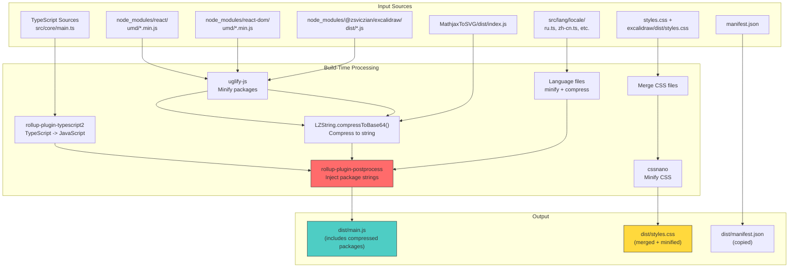
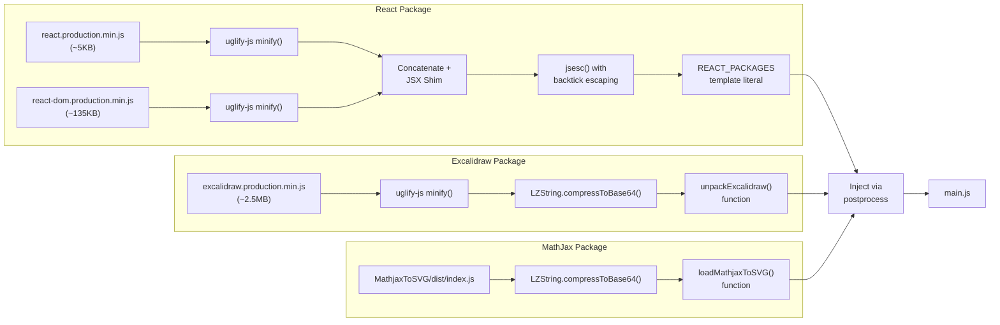
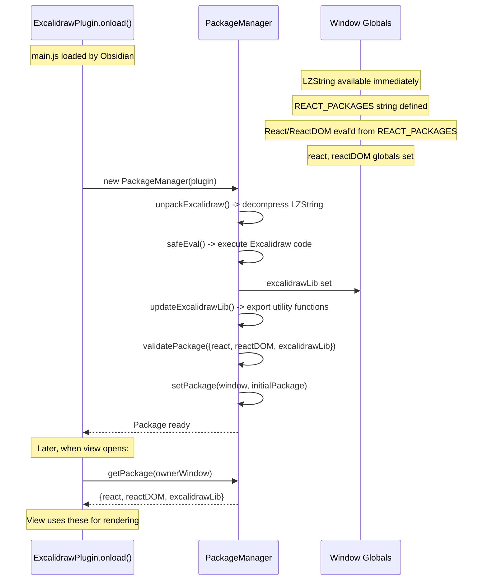
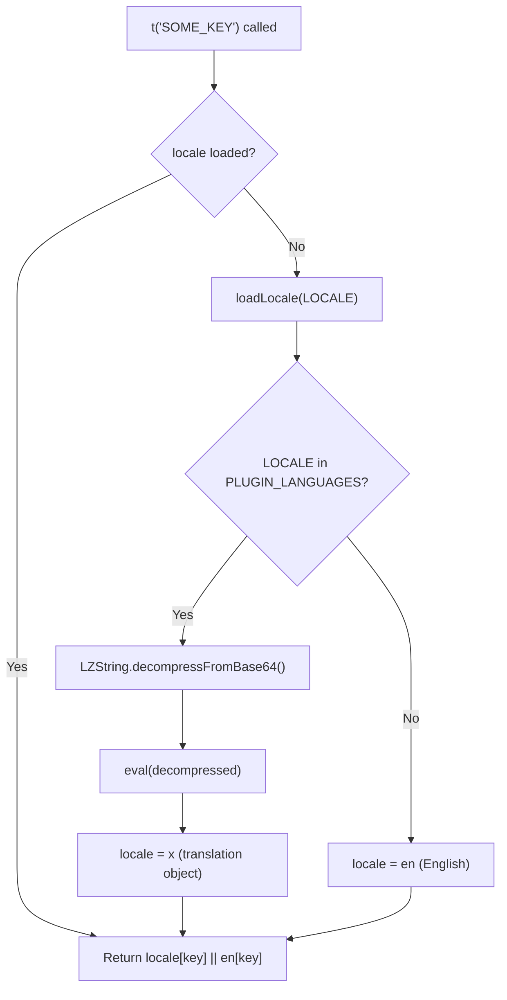

# 05 -- Build System: Rollup, Compression & Development

This document provides an exhaustive walkthrough of the build system used by
obsidian-excalidraw-plugin. The build pipeline is one of the most unusual parts
of the codebase -- React, ReactDOM, and the Excalidraw library are compressed into
strings at build time and eval'd at runtime. Understanding this system is essential
for working on the plugin.

---

## Table of Contents

1. [Build Commands Reference](#1-build-commands-reference)
2. [Rollup Pipeline Diagram](#2-rollup-pipeline-diagram)
3. [Package Inlining -- The Unusual Pattern](#3-package-inlining----the-unusual-pattern)
4. [React 19 JSX Shim](#4-react-19-jsx-shim)
5. [Language Compression System](#5-language-compression-system)
6. [Global Declarations](#6-global-declarations)
7. [MathjaxToSVG Sub-Package](#7-mathjaxtosvg-sub-package)
8. [CSS Processing](#8-css-processing)
9. [Rollup Configuration Details](#9-rollup-configuration-details)
10. [Output Structure](#10-output-structure)
11. [Library Build Mode](#11-library-build-mode)
12. [Development Tips](#12-development-tips)
13. [Cross-References](#13-cross-references)

---

## 1. Build Commands Reference

All scripts are defined in `package.json:10-22`:

| Command | Script | What It Does |
|---------|--------|-------------|
| `npm run dev` | `cross-env NODE_ENV=development rollup --config rollup.config.js` | Development build: unminified output, inline sourcemaps, development versions of React/Excalidraw |
| `npm run build` | `cross-env NODE_ENV=production rollup --config rollup.config.js` | Production build: minified with terser (2-pass), no sourcemaps, production React/Excalidraw |
| `npm run build:mathjax` | `cd MathjaxToSVG && npm run build` | Build the MathjaxToSVG sub-package (LaTeX rendering) |
| `npm run build:all` | `npm run build:mathjax && npm run build` | Full production build: MathjaxToSVG first, then main plugin |
| `npm run dev:all` | `npm run dev:mathjax && npm run dev` | Full development build: MathjaxToSVG first, then main plugin |
| `npm run dev:mathjax` | `cd MathjaxToSVG && npm run dev` | Development build of MathjaxToSVG only |
| `npm run lib` | `cross-env NODE_ENV=lib rollup --config rollup.config.js` | Build the ExcalidrawAutomate library export (for external consumers) |
| `npm run code:fix` | `eslint --max-warnings=0 --ext .ts,.tsx ./src --fix` | ESLint autofix (extends `@excalidraw/eslint-config`) |
| `npm run madge` | `madge --circular .` | Check for circular dependencies in the codebase |
| `npm run doc` | `npm run lib && node scripts/generate-script-library.js` | Build library + generate script documentation |
| `npm run mindmap` | `node scripts/deploy-mindmap-builder.js` | Deploy mindmap builder script |

### Environment Variables

The build mode is determined by `NODE_ENV`:

```typescript
// rollup.config.js:23-25
const isProd = (process.env.NODE_ENV === "production");
const isLib = (process.env.NODE_ENV === "lib");
```

| `NODE_ENV` | `isProd` | `isLib` | Behavior |
|------------|----------|---------|----------|
| `production` | true | false | Minified, compressed, production packages |
| `development` | false | false | Unminified, sourcemaps, development packages |
| `lib` | false | true | Library-only build, no package inlining |

A `.env` file can provide additional configuration (loaded via `dotenv` at
`rollup.config.js:17-18`).

---

## 2. Rollup Pipeline Diagram

### 2.1 High-Level Build Flow



### 2.2 Detailed Package Compression Flow



---

## 3. Package Inlining -- The Unusual Pattern

This is the most distinctive aspect of the build system. Understanding it is
critical for debugging and development.

### 3.1 Why This Pattern Exists

Obsidian plugins have strict constraints:
- Must be a **single `main.js` file** (no code splitting)
- React, ReactDOM, and Excalidraw are NOT available as Obsidian globals
- Normal bundling would produce an enormous file (React + Excalidraw = ~3MB+)
- LZString compression reduces the total size dramatically (~60-80% reduction)

### 3.2 Build-Time Steps

#### Step 1: Read Package Source Files

```typescript
// rollup.config.js:88-96
const excalidraw_pkg = minifyCode(isProd
  ? fs.readFileSync("./node_modules/@zsviczian/excalidraw/dist/excalidraw.production.min.js", "utf8")
  : fs.readFileSync("./node_modules/@zsviczian/excalidraw/dist/excalidraw.development.js", "utf8"));
const react_pkg = minifyCode(isProd
  ? fs.readFileSync("./node_modules/react/umd/react.production.min.js", "utf8")
  : fs.readFileSync("./node_modules/react/umd/react.development.js", "utf8"));
const reactdom_pkg = minifyCode(isProd
  ? fs.readFileSync("./node_modules/react-dom/umd/react-dom.production.min.js", "utf8")
  : fs.readFileSync("./node_modules/react-dom/umd/react-dom.development.js", "utf8"));
```

Note that both React packages (production and development) are read depending on
the build mode, giving better error messages during development.

#### Step 2: Minify with uglify-js

```typescript
// rollup.config.js:61-78
function minifyCode(code) {
  const minified = minify(code, {
    compress: {
      reduce_vars: false,  // Workaround for issue #2170
    },
    mangle: true,
    output: {
      comments: false,
      beautify: false,
    }
  });
  if (minified.error) throw new Error(minified.error);
  return minified.code;
}
```

The `reduce_vars: false` option is important -- without it, uglify-js can break
the Excalidraw library code (see GitHub issue #2170).

#### Step 3: Compress Excalidraw with LZString

The Excalidraw library is the largest dependency (~2.5MB even after minification).
It is compressed with LZString:

```typescript
// rollup.config.js:130
'const unpackExcalidraw = () => LZString.decompressFromBase64("' +
  LZString.compressToBase64(excalidraw_pkg) + '");\n'
```

#### Step 4: Build React Package String

React and ReactDOM are smaller, so they are NOT LZString-compressed. Instead,
they are concatenated with the JSX shim and escaped for embedding in a template
literal:

```typescript
// rollup.config.js:127-129
'\nlet REACT_PACKAGES = `' +
  jsesc(react_pkg + reactdom_pkg + jsxRuntimeShim, { quotes: 'backtick' }) +
  '`;\n'
```

The `jsesc` library handles proper escaping of backticks, dollar signs, and
other characters that would break a JavaScript template literal.

#### Step 5: Build the Package String

All pieces are assembled into `packageString` (`rollup.config.js:124-135`):

```typescript
const packageString =
  ';const INITIAL_TIMESTAMP=Date.now();' +
  lzstring_pkg +                           // LZString library itself
  '\nlet REACT_PACKAGES = `' + jsesc(...) + '`;\n' +  // React + ReactDOM + JSX shim
  'const unpackExcalidraw = () => LZString.decompressFromBase64("...");' +  // Compressed Excalidraw
  'let {react, reactDOM} = new Function(`${REACT_PACKAGES}; return {react: React, reactDOM: ReactDOM};`)();\n' +
  'let excalidrawLib = {};\n' +
  'const loadMathjaxToSVG = () => new Function(`${LZString.decompressFromBase64("...")}; return MathjaxToSVG;`)();\n' +
  `const PLUGIN_LANGUAGES = {${LANGUAGES.map(...)}};\n` +
  'const PLUGIN_VERSION="' + manifest.version + '";';
```

#### Step 6: Inject into main.js via postprocess

The `rollup-plugin-postprocess` plugin replaces the `require('react')` statement
in the bundled output with the package string:

```typescript
// Production (rollup.config.js:193-198)
postprocess([
  [
    /(var[^;]*?),\s*React\s*=\s*require\(["']react["']\)([^;]*;)/,
    (_, g1, g2) => `${g1}${g2}${packageString}`
  ],
]),

// Development (rollup.config.js:200)
postprocess([ [/var React = require\('react'\);/, packageString] ]),
```

This regex finds the line where rollup's CommonJS plugin would have imported
React and replaces it with the entire package string, effectively replacing
the `require()` call with the actual library code.

### 3.3 Runtime Steps

#### Step 1: LZString is Available Immediately

The LZString library code (`lzstring_pkg`) is included uncompressed and runs
immediately when `main.js` is loaded. This makes `LZString` available as a
global for decompressing everything else.

#### Step 2: React and ReactDOM are eval'd

```javascript
let {react, reactDOM} = new Function(`${REACT_PACKAGES}; return {react: React, reactDOM: ReactDOM};`)();
```

This creates a new function from the React/ReactDOM source code string, executes
it, and captures the `React` and `ReactDOM` globals. The `new Function()`
approach creates a clean scope.

#### Step 3: Excalidraw is Decompressed on Demand

```javascript
const unpackExcalidraw = () => LZString.decompressFromBase64("...");
```

Excalidraw is NOT loaded immediately -- `unpackExcalidraw()` returns the
decompressed source code string. The `PackageManager` then eval's it:

```typescript
// src/core/managers/PackageManager.ts:27-34
this.EXCALIDRAW_PACKAGE = unpackExcalidraw();
excalidrawLib = errorHandler.safeEval(
  `(function() {${this.EXCALIDRAW_PACKAGE};return ExcalidrawLib;})()`,
  "PackageManager constructor - excalidrawLib initialization",
  window
);
```

#### Step 4: PackageManager Stores Per-Window

```typescript
// src/core/managers/PackageManager.ts:44-49
const initialPackage = {react, reactDOM, excalidrawLib};
if (this.validatePackage(initialPackage)) {
  this.setPackage(window, initialPackage);
  this.fallbackPackage = initialPackage;
}
```

For popout windows, the packages may need to be re-initialized in the new
window context.

### 3.4 Complete Runtime Loading Diagram



---

## 4. React 19 JSX Shim

### 4.1 The Compatibility Problem

The Excalidraw library (`@zsviczian/excalidraw`) is built targeting React 19's
JSX transform, which expects `jsx()` and `jsxs()` runtime functions. However,
the plugin bundles React 18, which does not provide these functions. Without a
shim, any Excalidraw component that uses JSX would crash at runtime.

### 4.2 The Shim Code

Defined at `rollup.config.js:30-46`:

```javascript
const jsxRuntimeShim = `
  const jsx = (type, props, key) => {
    return React.createElement(type, props);
  };
  const jsxs = (type, props, key) => {
    return React.createElement(type, props);
  };
  const Fragment = React.Fragment;
  React.jsx = jsx;
  React.jsxs = jsxs;
  React.Fragment = Fragment;
  React.jsxRuntime = { jsx, jsxs, Fragment };
  window.__WEBPACK_EXTERNAL_MODULE_react_jsx_runtime__ = { jsx, jsxs, Fragment };
  window.__WEBPACK_EXTERNAL_MODULE_react_jsx_dev_runtime__ = { jsx, jsxs, Fragment, jsxDEV: jsx };
  window['react/jsx-runtime'] = { jsx, jsxs, Fragment };
  window['react/jsx-dev-runtime'] = { jsx, jsxs, Fragment, jsxDEV: jsx };
`;
```

### 4.3 How It Works

1. **`jsx()` and `jsxs()`** are thin wrappers around `React.createElement()`.
   In React 19, `jsx()` is for single-child elements and `jsxs()` is for
   multi-child elements, but both can fall back to `createElement()`.

2. **Multiple global locations** are patched because the Excalidraw library
   is bundled with webpack, which resolves imports to different global names
   depending on configuration:
   - `window.__WEBPACK_EXTERNAL_MODULE_react_jsx_runtime__` -- webpack's external module resolution
   - `window['react/jsx-runtime']` -- direct module path resolution
   - `React.jsxRuntime` -- property on React itself

3. **`jsxDEV`** is the development-mode variant used by React DevTools and
   development builds. It receives the same shim as `jsx`.

### 4.4 Why Not Just Upgrade to React 19?

React 19 has breaking changes that affect Obsidian's plugin ecosystem. Since the
plugin runs inside Obsidian's Electron environment alongside other plugins, upgrading
React could cause conflicts. The shim provides forward compatibility without
requiring a full React upgrade.

---

## 5. Language Compression System

### 5.1 Source Structure

The i18n system uses English as the source of truth:
- **English** (`src/lang/locale/en.ts`): Always loaded uncompressed, imported directly
- **Other locales** (`ru.ts`, `zh-cn.ts`, `zh-tw.ts`, `es.ts`): Compressed at build time

Only these 4 non-English locales are compressed. The comment at
`rollup.config.js:52` explains:

```typescript
const LANGUAGES = ['ru', 'zh-cn', 'zh-tw', 'es'];
// English is not compressed as it is always loaded by default
```

### 5.2 Build-Time Compression

The `compressLanguageFile()` function at `rollup.config.js:80-86`:

```typescript
function compressLanguageFile(lang) {
  const inputDir = "./src/lang/locale";
  const filePath = `${inputDir}/${lang}.ts`;
  let content = fs.readFileSync(filePath, "utf-8");
  content = trimLastSemicolon(content.split("export default")[1].trim());
  return LZString.compressToBase64(minifyCode(`x = ${content};`));
}
```

Step by step:
1. Read the TypeScript locale file
2. Extract the default export (the translation object)
3. Wrap it as `x = { ... };` (an assignment expression)
4. Minify with uglify-js
5. Compress with `LZString.compressToBase64()`

The compressed strings are assembled into `PLUGIN_LANGUAGES`:

```typescript
// rollup.config.js:134
`const PLUGIN_LANGUAGES = {${LANGUAGES.map(
  lang => `"${lang}": "${compressLanguageFile(lang)}"`
).join(",")}};\n`
```

### 5.3 Runtime Loading

At `src/lang/helpers.ts:11-21`:

```typescript
declare const PLUGIN_LANGUAGES: Record<string, string>;
declare var LZString: any;

function loadLocale(lang: string): Partial<typeof en> {
  if(lang === "zh") lang = "zh-cn";  // Alias handling
  if (Object.keys(PLUGIN_LANGUAGES).includes(lang)) {
    const decompressed = LZString.decompressFromBase64(PLUGIN_LANGUAGES[lang]);
    let x = {};
    eval(decompressed);  // Executes "x = { ... };"
    return x;
  } else {
    return en;  // Fallback to English
  }
}
```

The decompressed string is eval'd, which executes `x = { ... };`, populating
the local variable `x` with the translation object.

### 5.4 The t() Function

At `src/lang/helpers.ts:23-28`:

```typescript
export function t(str: keyof typeof en): string {
  if (!locale) {
    locale = loadLocale(LOCALE);
  }
  return (locale && locale[str]) || en[str];
}
```

This provides type-safe i18n with English fallback. The `LOCALE` constant
comes from `src/constants/constants.ts:29`:

```typescript
export const LOCALE = localStorage.getItem("language")?.toLowerCase() || "en";
```

### 5.5 Complete Language Loading Flow



---

## 6. Global Declarations

These variables are injected at build time by the rollup postprocess step.
They exist only at runtime and must be declared (not imported) in source:

### 6.1 Complete Reference Table

| Global | Type | Injected At | Runtime Value | Declared In |
|--------|------|-------------|---------------|-------------|
| `PLUGIN_VERSION` | `string` | rollup.config.js:135 | `"2.2.5"` (from manifest.json) | `src/view/ExcalidrawView.ts:176`, `src/constants/constants.ts:7` |
| `INITIAL_TIMESTAMP` | `number` | rollup.config.js:126 | `Date.now()` at build time | Various source files |
| `REACT_PACKAGES` | `string` | rollup.config.js:127-129 | Escaped React+ReactDOM+JSX shim source | `src/core/managers/PackageManager.ts:11` |
| `PLUGIN_LANGUAGES` | `Record<string, string>` | rollup.config.js:134 | `{"ru":"...","zh-cn":"...","zh-tw":"...","es":"..."}` | `src/lang/helpers.ts:6` |
| `unpackExcalidraw` | `() => string` | rollup.config.js:130 | Function that decompresses Excalidraw | `src/core/managers/PackageManager.ts:15` |
| `react` | `typeof React` | rollup.config.js:131 | React library object | `src/core/managers/PackageManager.ts:12` |
| `reactDOM` | `typeof ReactDOM` | rollup.config.js:131 | ReactDOM library object | `src/core/managers/PackageManager.ts:13` |
| `excalidrawLib` | `typeof ExcalidrawLib` | PackageManager.ts:30-34 | Excalidraw library (set at runtime) | `src/constants/constants.ts:27` |
| `loadMathjaxToSVG` | `() => MathjaxToSVG` | rollup.config.js:133 | Function that decompresses MathjaxToSVG | Used in LaTeX.ts |
| `LZString` | `LZString` | rollup.config.js:126 (via lzstring_pkg) | LZString compression library | `src/lang/helpers.ts:7` |
| `DEVICE` | `DeviceType` | src/constants/constants.ts:177-187 | Platform capabilities object | Various |

### 6.2 Declaration Syntax

In TypeScript source files, these globals are declared (not imported):

```typescript
// Common pattern in source files:
declare const PLUGIN_VERSION: string;
declare let REACT_PACKAGES: string;
declare let react: typeof React;
declare let reactDOM: typeof ReactDOM;
declare let excalidrawLib: typeof ExcalidrawLib;
declare const unpackExcalidraw: Function;
declare const PLUGIN_LANGUAGES: Record<string, string>;
declare var LZString: any;
```

### 6.3 excalidrawLib Utility Functions

The `excalidrawLib` global provides many utility functions that are destructured
in `src/constants/constants.ts:86-110`:

```typescript
export let {
  sceneCoordsToViewportCoords,
  viewportCoordsToSceneCoords,
  intersectElementWithLine,
  getCommonBoundingBox,
  getMaximumGroups,
  measureText,
  getLineHeight,
  wrapText,
  getFontString,
  getBoundTextMaxWidth,
  exportToSvg,
  exportToBlob,
  mutateElement,
  restoreElements,
  mermaidToExcalidraw,
  getFontFamilyString,
  getContainerElement,
  refreshTextDimensions,
  getCSSFontDefinition,
  loadSceneFonts,
  loadMermaid,
  syncInvalidIndices,
  getDefaultColorPalette,
} = excalidrawLib;
```

These are re-exported as named exports from `constants.ts`, allowing the rest
of the codebase to import them normally:

```typescript
import { measureText, getLineHeight } from "../constants/constants";
```

---

## 7. MathjaxToSVG Sub-Package

### 7.1 Purpose

The MathjaxToSVG package provides LaTeX equation rendering. It wraps the
`mathjax-full` library (which is very large) into a standalone bundle that
can be compressed and loaded on demand.

### 7.2 Directory Structure

```
MathjaxToSVG/
  index.ts           # Source: exports MathjaxToSVG class
  package.json       # Dependencies (mathjax-full)
  package-lock.json
  rollup.config.js   # Build config for this sub-package
  tsconfig.json
  dist/              # Output (generated by build)
    index.js         # Built bundle
```

### 7.3 Build Integration

The MatjaxToSVG output is read at build time:

```typescript
// rollup.config.js:50
const mathjaxtosvg_pkg = isLib ? "" : fs.readFileSync("./MathjaxToSVG/dist/index.js", "utf8");
```

It is then compressed with LZString and wrapped in a loader function:

```typescript
// rollup.config.js:133
'const loadMathjaxToSVG = () => new Function(`${
  LZString.decompressFromBase64("' +
  LZString.compressToBase64(mathjaxtosvg_pkg) +
  '")}; return MathjaxToSVG;`)();\n'
```

### 7.4 Runtime Loading

The `loadMathjaxToSVG()` function:
1. Decompresses the MathjaxToSVG source code from base64
2. Creates a new Function from the source
3. Executes it and returns the `MathjaxToSVG` object

This is loaded lazily -- only when a drawing contains LaTeX equations
(referenced in `src/shared/LaTeX.ts`).

### 7.5 When to Rebuild

You need to run `npm run build:mathjax` before the main build if:
- You changed `MathjaxToSVG/index.ts`
- You updated the `mathjax-full` dependency
- The `MathjaxToSVG/dist/` directory is missing

If MatjaxToSVG has not changed, you can skip it and just run `npm run build`
or `npm run dev`.

---

## 8. CSS Processing

### 8.1 Source Files

Two CSS files are merged:

```typescript
// rollup.config.js:100-103
const excalidraw_styles = isProd
  ? fs.readFileSync("./node_modules/@zsviczian/excalidraw/dist/styles.production.css", "utf8")
  : fs.readFileSync("./node_modules/@zsviczian/excalidraw/dist/styles.development.css", "utf8");
const plugin_styles = fs.readFileSync("./styles.css", "utf8");
const styles = excalidraw_styles + plugin_styles;
```

### 8.2 Minification

The merged CSS is processed with `cssnano`:

```typescript
// rollup.config.js:105-116
cssnano()
  .process(styles, {
    from: path.resolve("styles.css"),
    to: path.resolve(DIST_FOLDER, "styles.css"),
  })
  .then(result => {
    fs.writeFileSync(`./${DIST_FOLDER}/styles.css`, result.css);
  })
  .catch(error => {
    console.error('Error while processing CSS:', error);
  });
```

### 8.3 Important Note

The CSS processing runs **asynchronously** alongside the rollup build (it is
not a rollup plugin -- it runs as top-level async code in the config file).
This means it may finish before or after the JavaScript build.

---

## 9. Rollup Configuration Details

### 9.1 External Dependencies

These packages are NOT bundled into `main.js` -- they are expected to be
available at runtime (provided by Obsidian):

```typescript
// rollup.config.js:139-155
external: [
  '@codemirror/autocomplete',
  '@codemirror/collab',
  '@codemirror/commands',
  '@codemirror/language',
  '@codemirror/lint',
  '@codemirror/search',
  '@codemirror/state',
  '@codemirror/view',
  '@lezer/common',
  '@lezer/highlight',
  '@lezer/lr',
  'obsidian',
  '@zsviczian/excalidraw',  // Loaded via package inlining instead
  'react',                   // Loaded via package inlining instead
  'react-dom'                // Loaded via package inlining instead
],
```

Note that `react`, `react-dom`, and `@zsviczian/excalidraw` are listed as
external even though they are inlined. This tells rollup to emit `require()`
calls for them, which the `postprocess` plugin then replaces with the inlined
code.

### 9.2 Plugin Chain

```typescript
// rollup.config.js:158-167
const getRollupPlugins = (tsconfig, ...plugins) => [
  typescript2(tsconfig),           // TypeScript compilation
  json(),                          // Import JSON files
  replace({                        // Replace process.env references
    preventAssignment: true,
    "process.env.NODE_ENV": JSON.stringify(process.env.NODE_ENV),
  }),
  commonjs(),                      // CommonJS module resolution
  nodeResolve({                    // Node module resolution
    browser: true,
    preferBuiltins: false,
  }),
].concat(plugins);
```

Additional plugins for production:
- `terser()` -- JavaScript minification (2-pass, remove comments)
- `postprocess()` -- Package string injection
- `copy()` -- Copy `manifest.json` to `dist/`

### 9.3 Output Configuration

```typescript
// rollup.config.js:169-177
output: {
  dir: 'dist',                    // Output directory
  entryFileNames: 'main.js',     // Output filename
  format: 'cjs',                  // CommonJS format (required by Obsidian)
  exports: 'default',             // Default export
  inlineDynamicImports: true,     // No code splitting
},
```

The `inlineDynamicImports: true` setting is critical -- Obsidian requires a
single `main.js` file, so all dynamic imports must be inlined.

### 9.4 TypeScript Configuration

Two tsconfig files are used:

| File | Used When | Key Differences |
|------|-----------|-----------------|
| `tsconfig.json` | Production build | Strict settings, no sourcemaps |
| `tsconfig.dev.json` | Development build | Inline sourcemaps, less strict |

```typescript
// rollup.config.js:179-184
typescript2({
  tsconfig: isProd ? "tsconfig.json" : "tsconfig.dev.json",
  sourcemap: !isProd,
  clean: true,
}),
```

### 9.5 Terser Configuration (Production Only)

```typescript
// rollup.config.js:186-192
terser({
  toplevel: false,          // Don't mangle top-level names
  compress: { passes: 2 },  // Two compression passes
  format: {
    comments: false,         // Remove all comments
  },
}),
```

### 9.6 Postprocess Regex Patterns

**Production** (more complex due to terser mangling variable names):
```typescript
// rollup.config.js:193-198
postprocess([
  [
    /(var[^;]*?),\s*React\s*=\s*require\(["']react["']\)([^;]*;)/,
    (_, g1, g2) => `${g1}${g2}${packageString}`
  ],
]),
```

**Development** (simpler, unmangled):
```typescript
// rollup.config.js:200
postprocess([ [/var React = require\('react'\);/, packageString] ]),
```

---

## 10. Output Structure

```
dist/
  main.js          # The complete plugin (~4-6MB compressed packages inside)
  styles.css       # Merged Excalidraw + plugin CSS, minified
  manifest.json    # Plugin manifest (copied from root)
```

### 10.1 main.js Anatomy

```
+-------------------------------------------------------------------+
| CommonJS module wrapper                                            |
|   Obsidian require() calls (externals)                            |
|                                                                    |
|   === INJECTED PACKAGE STRING START ===                           |
|   INITIAL_TIMESTAMP = Date.now()                                  |
|   LZString library (uncompressed, ~4KB)                           |
|   REACT_PACKAGES = ` ... React + ReactDOM + JSX shim ... `       |
|   unpackExcalidraw = () => LZString.decompress("...")             |
|   {react, reactDOM} = new Function(REACT_PACKAGES + return)()    |
|   excalidrawLib = {}                                              |
|   loadMathjaxToSVG = () => new Function(decompress("..."))()     |
|   PLUGIN_LANGUAGES = { "ru": "...", "zh-cn": "...", ... }        |
|   PLUGIN_VERSION = "2.2.5"                                        |
|   === INJECTED PACKAGE STRING END ===                             |
|                                                                    |
|   Plugin source code (TypeScript compiled to JS)                  |
|     ExcalidrawPlugin class                                        |
|     ExcalidrawView class                                          |
|     ExcalidrawData class                                          |
|     ExcalidrawAutomate class                                      |
|     ... all other modules                                         |
|                                                                    |
|   module.exports = ExcalidrawPlugin (default export)              |
+-------------------------------------------------------------------+
```

---

## 11. Library Build Mode

When `NODE_ENV=lib`, a separate build produces the ExcalidrawAutomate library
for external consumers:

```typescript
// rollup.config.js:209-222
const LIB_CONFIG = {
  ...BASE_CONFIG,
  input: "src/core/index.ts",       // Different entry point
  output: {
    dir: "lib",                      // Output to lib/ instead of dist/
    sourcemap: false,
    format: "cjs",
    name: "Excalidraw (Library)",
  },
  plugins: getRollupPlugins(
    { tsconfig: "tsconfig-lib.json" },
    copy({ targets: [{ src: "src/*.d.ts", dest: "lib/typings" }] })
  ),
};
```

Key differences from the main build:
- Entry point is `src/core/index.ts` (exports `getEA()`)
- No package inlining (React/Excalidraw are not embedded)
- Output goes to `lib/` directory
- TypeScript declarations are copied to `lib/typings/`
- Published to npm as `obsidian-excalidraw-plugin` package

```
lib/
  index.js         # CJS module exporting getEA()
  typings/
    *.d.ts         # TypeScript declarations
```

---

## 12. Development Tips

### 12.1 Quick Development Workflow

```bash
# First time or after dependency changes:
npm install
npm run build:mathjax

# Regular development:
npm run dev         # Fast, unminified, with sourcemaps

# Full production build:
npm run build:all   # MathJax + main plugin, minified
```

### 12.2 Testing in Obsidian

There is **no automated test suite**. Testing is manual:

1. Build with `npm run dev`
2. Copy or symlink `dist/` to your Obsidian vault's plugin folder:
   ```
   <vault>/.obsidian/plugins/obsidian-excalidraw-plugin/
     main.js      <- from dist/
     styles.css   <- from dist/
     manifest.json <- from dist/
   ```
3. Reload Obsidian or use the "Reload app without saving" command
4. Test your changes in the Excalidraw view

### 12.3 Debug Logging

The plugin has a comprehensive debug logging system:

```typescript
// src/utils/debugHelper.ts:1-15
export let DEBUGGING = false;

export function setDebugging(value: boolean) {
  DEBUGGING = (process.env.NODE_ENV === 'development') ? value : false;
}

export const debug = (fn: Function, fnName: string, ...messages: unknown[]) => {
  console.log(fnName, ...messages);
};
```

Debug statements throughout the code use this pattern:

```typescript
(process.env.NODE_ENV === 'development') && DEBUGGING && debug(this.save, "ExcalidrawView.save", ...);
```

The `process.env.NODE_ENV === 'development'` check is compiled away in
production builds (thanks to the `replace` plugin), so debug code has zero
cost in production.

### 12.4 Circular Dependency Check

```bash
npm run madge
```

This runs `madge --circular .` to detect circular dependency chains. The plugin
actively maintains a clean dependency graph (see the recent commit
`8fb4ad1c refactor: circular dependencies`).

### 12.5 ESLint

```bash
npm run code:fix
```

Uses the Excalidraw project's ESLint config (`@excalidraw/eslint-config`) with
Prettier integration (`eslint-config-prettier` + `eslint-plugin-prettier`).

### 12.6 Common Pitfalls

| Issue | Cause | Fix |
|-------|-------|-----|
| "excalidrawLib is undefined" | Build order wrong | Run `npm run build:mathjax` first, or use `npm run build:all` |
| Blank Excalidraw canvas | React version mismatch | Check JSX shim is applied correctly |
| "Cannot find module 'react'" | External not resolved | The postprocess regex did not match -- check rollup output |
| CSS not applied | CSS build async | Rebuild; check `dist/styles.css` exists |
| Large file size | Compression disabled | Check `isProd` is `true` for production builds |
| `reduce_vars` crash | uglify-js bug | Keep `reduce_vars: false` in minifyCode() |
| "LZString is not defined" | Package string order | LZString must be first in packageString |

### 12.7 Node.js Requirements

From `package.json:95-98`:

```json
"engines": {
  "node": ">=20.0.0",
  "npm": ">=10.0.0"
}
```

### 12.8 Key Dependencies

| Package | Version | Purpose |
|---------|---------|---------|
| `@zsviczian/excalidraw` | `0.18.0-86` | Forked Excalidraw library |
| `react` | `^18.2.0` | React library (inlined) |
| `react-dom` | `^18.2.0` | ReactDOM library (inlined) |
| `mathjax-full` | `^3.2.2` | LaTeX rendering |
| `lz-string` | `^1.5.0` | Compression (build tool AND runtime) |
| `obsidian` | `1.12.3` | Obsidian API (dev only, provided at runtime) |
| `rollup` | `^2.70.1` | Build tool |
| `rollup-plugin-typescript2` | `^0.36.0` | TypeScript compilation |
| `@zsviczian/rollup-plugin-postprocess` | `^1.0.3` | String injection into output |
| `uglify-js` | `^3.19.3` | JavaScript minification (build tool) |
| `cssnano` | `^6.0.2` | CSS minification |
| `jsesc` | `^3.0.2` | Safe JavaScript string escaping |

---

## 13. Cross-References

### Source Files

| File | Purpose | Key Lines |
|------|---------|-----------|
| `rollup.config.js` | Complete build configuration | 1-231 |
| `package.json` | Scripts, dependencies, engines | 1-99 |
| `manifest.json` | Plugin metadata (version, etc.) | -- |
| `styles.css` | Plugin-specific CSS | -- |
| `src/core/managers/PackageManager.ts` | Runtime package loading | 17-100 |
| `src/lang/helpers.ts` | i18n runtime loading | 1-28 |
| `src/constants/constants.ts` | excalidrawLib destructuring | 86-167 |
| `src/shared/Workers/compression-worker.ts` | Web Worker for compression | 1-47 |
| `src/utils/debugHelper.ts` | Debug logging system | 1-50 |
| `MathjaxToSVG/index.ts` | LaTeX rendering source | -- |
| `MathjaxToSVG/rollup.config.js` | Sub-package build config | -- |
| `src/core/index.ts` | Library entry point | -- |
| `tsconfig.json` | Production TypeScript config | -- |
| `tsconfig.dev.json` | Development TypeScript config | -- |
| `tsconfig-lib.json` | Library build TypeScript config | -- |

### Related Learning Materials

- **03-data-layer.md**: How LZString compression is used for scene data at runtime
- **04-view-and-react.md**: How PackageManager provides per-window packages to views
- **02-architecture.md**: Overall plugin structure and entry points
