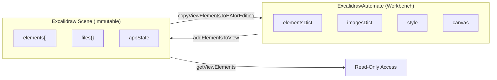
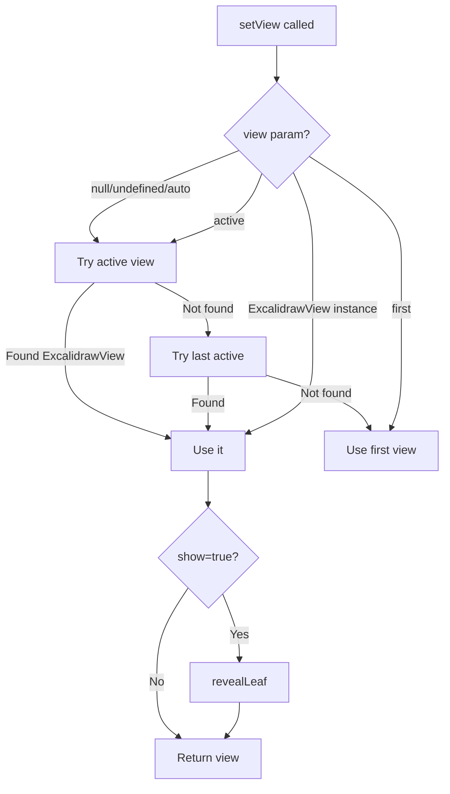
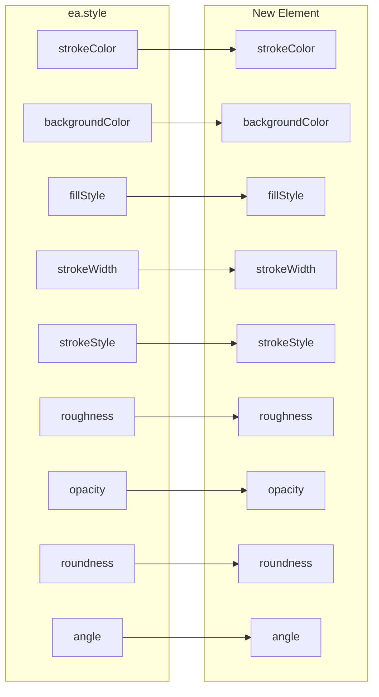
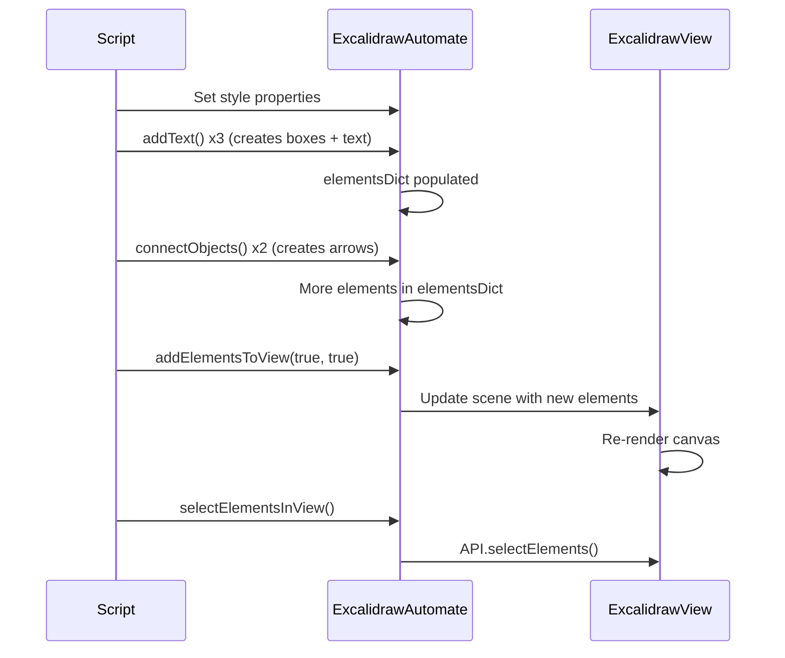

# ExcalidrawAutomate Complete Reference

This document is a deep-dive reference for the `ExcalidrawAutomate` class, the primary scripting API for the Obsidian-Excalidraw plugin. Every method signature, property type, and hook documented here is sourced directly from `src/shared/ExcalidrawAutomate.ts`.

---

## Table of Contents

1. [Conceptual Overview](#1-conceptual-overview)
2. [The EA Object Model](#2-the-ea-object-model)
3. [Element Creation Methods](#3-element-creation-methods)
4. [Element Manipulation](#4-element-manipulation)
5. [View Interaction](#5-view-interaction)
6. [File Operations](#6-file-operations)
7. [Utility Methods](#7-utility-methods)
8. [Style Configuration](#8-style-configuration)
9. [Code Example: Complete Script](#9-code-example-complete-script)
10. [Quick Reference Tables](#10-quick-reference-tables)

---

## 1. Conceptual Overview

The `ExcalidrawAutomate` class (referred to as `ea`) acts as a **workbench** between your code and the immutable Excalidraw scene. Elements in the live scene cannot be modified directly. Instead, you:

1. Create or copy elements into `ea.elementsDict` (the workbench)
2. Modify them freely
3. Commit them to the view with `addElementsToView()`



The class docstring at line 131-181 in `ExcalidrawAutomate.ts` explains this model:

> "Elements in the Excalidraw Scene are immutable. You should never directly change element properties in the scene object. ExcalidrawAutomate provides a 'workbench' where you can create, modify, and delete elements before committing them to the Excalidraw Scene using addElementsToView()."

At a high level, EA has three categories of functions:
- **Workbench functions** -- create/modify elements in `elementsDict`
- **View functions** -- access the live scene (require `targetView` to be set; methods contain "view" in their name)
- **Utility functions** -- standalone helpers (`ea.obsidian`, `ea.getCM()`, `ea.help()`, etc.)

### How EA Instances Are Created

| Method | When Used | targetView |
|--------|-----------|------------|
| `getEA(view)` from `src/core/index.ts:7` | External plugins, ScriptEngine | Optionally set |
| `new ExcalidrawAutomate(plugin, view)` at line 561 | Internal construction | Optionally set |
| `ea.getAPI(view)` at line 757 | Getting a fresh instance from an existing EA | Optionally set |
| ScriptEngine `executeScript()` at `Scripts.ts:275` | Script execution | Automatically set to active view |

---

## 2. The EA Object Model

### 2.1 `elementsDict`

**Declared at line 532:**
```typescript
elementsDict: {[key:string]:any};
```

A dictionary of Excalidraw elements currently being edited, indexed by element ID. This is the staging area -- all `addRect()`, `addText()`, etc. place elements here. Elements are committed to the view with `addElementsToView()`.

Key operations:
- `getElements()` (line 926) returns all elements as an array
- `getElement(id)` (line 940) returns a single element by ID
- `clear()` (line 2557) empties both `elementsDict` and `imagesDict`
- Direct access: `ea.elementsDict["someId"].strokeColor = "#ff0000"`

### 2.2 `imagesDict`

**Declared at line 533:**
```typescript
imagesDict: {[key: FileId]: ImageInfo};
```

Stores image file metadata indexed by `FileId`. Each entry contains:

| Property | Type | Description |
|----------|------|-------------|
| `mimeType` | `MimeType` | MIME type of the image (e.g., `"image/png"`) |
| `id` | `FileId` | Unique file identifier |
| `dataURL` | `DataURL` | Base64-encoded image data |
| `created` | `number` | Timestamp of creation |
| `file` | `TFile \| string \| null` | Vault file reference or path |
| `hasSVGwithBitmap` | `boolean` | Whether SVG contains bitmap data |
| `latex` | `string \| null` | LaTeX source if this is a LaTeX equation |
| `isHyperLink` | `boolean` | Whether the image source is a hyperlink |
| `hyperlink` | `string \| null` | External URL source |
| `colorMap` | `ColorMap` | SVG color remapping |
| `size` | `{width, height}` | Natural image dimensions |
| `shouldScale` | `boolean` | Whether to auto-scale |

Images are populated by `addImage()`, `addLaTex()`, and `addMermaid()`.

### 2.3 `style`

**Declared at lines 535-552:**
```typescript
style: {
  strokeColor: string;          // Default: "#000000"
  backgroundColor: string;      // Default: "transparent"
  angle: number;                // Default: 0 (radians)
  fillStyle: FillStyle;         // Default: "hachure"
  strokeWidth: number;          // Default: 1
  strokeStyle: StrokeStyle;     // Default: "solid"
  roughness: number;            // Default: 1
  opacity: number;              // Default: 100
  strokeSharpness?: StrokeRoundness; // Legacy, use roundness instead
  roundness: null | { type: RoundnessType; value?: number }; // Default: null (sharp)
  fontFamily: number;           // Default: 1 (Virgil)
  fontSize: number;             // Default: 20
  textAlign: string;            // Default: "left"
  verticalAlign: string;        // Default: "top"
  startArrowHead: string;       // Default: null
  endArrowHead: string;         // Default: "arrow"
};
```

Every element creation method reads from `style` to set the new element's visual properties. Change `style` before calling `addRect()`, `addText()`, etc. to control appearance.

Default values are set in the `reset()` method at lines 2565-2591.

### 2.4 `canvas`

**Declared at lines 553-557:**
```typescript
canvas: {
  theme: string;                // Default: "light"
  viewBackgroundColor: string;  // Default: "#FFFFFF"
  gridSize: number;             // Default: 0
};
```

Controls canvas-level properties used when creating new drawings via `ea.create()`.

### 2.5 Key References

| Property | Type | Line | Description |
|----------|------|------|-------------|
| `plugin` | `ExcalidrawPlugin` | 531 | Reference to the plugin instance |
| `targetView` | `ExcalidrawView` | 2602 | Currently targeted view (set via `setView()`) |
| `activeScript` | `string` | 3667 | Name of the currently executing script |
| `mostRecentMarkdownSVG` | `SVGSVGElement` | 534 | Debug: last rendered markdown SVG |
| `colorPalette` | `{}` | 558 | Custom color palette |
| `sidepanelTab` | `ExcalidrawSidepanelTab \| null` | 559 | Associated sidepanel tab |

---

## 3. Element Creation Methods

All element creation methods add the new element to `elementsDict` and return the element's `string` ID.

### 3.1 `addRect()`

**Signature (line 1777):**
```typescript
addRect(topX: number, topY: number, width: number, height: number, id?: string): string
```

Creates a rectangle element. Uses current `style` properties for stroke, fill, opacity, etc.

**Parameters:**
- `topX`, `topY` -- top-left corner coordinates
- `width`, `height` -- dimensions in pixels
- `id` -- optional custom ID (auto-generated `nanoid()` if omitted)

**Returns:** Element ID (string)

### 3.2 `addDiamond()`

**Signature (line 1799):**
```typescript
addDiamond(topX: number, topY: number, width: number, height: number, id?: string): string
```

Creates a diamond (rotated square) element. Same parameters as `addRect()`.

### 3.3 `addEllipse()`

**Signature (line 1827):**
```typescript
addEllipse(topX: number, topY: number, width: number, height: number, id?: string): string
```

Creates an ellipse element. Same parameters as `addRect()`.

### 3.4 `addText()`

**Signature (line 1940):**
```typescript
addText(
  topX: number,
  topY: number,
  text: string,
  formatting?: {
    autoResize?: boolean;
    wrapAt?: number;
    width?: number;
    height?: number;
    textAlign?: "left" | "center" | "right";
    box?: boolean | "box" | "blob" | "ellipse" | "diamond";
    boxPadding?: number;
    boxStrokeColor?: string;
    textVerticalAlign?: "top" | "middle" | "bottom";
  },
  id?: string,
): string
```

Creates a text element with optional container box. This is the most feature-rich creation method.

**Key formatting options:**

| Option | Default | Description |
|--------|---------|-------------|
| `autoResize` | `true` | Auto-resize text element to fit content |
| `wrapAt` | `undefined` | Character count to wrap text at |
| `width` | measured | Fixed width for the text element |
| `height` | measured | Fixed height for the text element |
| `textAlign` | from `style` | Horizontal text alignment |
| `box` | `false` | Wrap in container: `true`/"box" = rectangle, "ellipse", "diamond", "blob" |
| `boxPadding` | `30` | Padding between text and container |
| `boxStrokeColor` | from `style` | Stroke color of the container |
| `textVerticalAlign` | from `style` | Vertical alignment within container |

**Important behavior at lines 2013-2061:**
- When `box` is set (and not "blob"), the text element becomes **container-bound** (`containerId` is set)
- The container gets a `boundElements` entry pointing to the text element
- `addText()` returns the **container** ID (not the text element ID) when a box is used
- "blob" creates a grouped line element instead of a proper container

### 3.5 `addLine()`

**Signature (line 2069):**
```typescript
addLine(points: [[x: number, y: number]], id?: string): string
```

Creates a line element from an array of points. Points are relative to the first point.

**Example:**
```javascript
// A horizontal line 200px long
ea.addLine([[0,0], [200,0]]);

// An L-shaped line
ea.addLine([[0,0], [0,100], [100,100]]);
```

### 3.6 `addArrow()`

**Signature (line 2106):**
```typescript
addArrow(
  points: [x: number, y: number][],
  formatting?: {
    startArrowHead?: "arrow"|"bar"|"circle"|"circle_outline"|"triangle"|
                     "triangle_outline"|"diamond"|"diamond_outline"|null;
    endArrowHead?: "arrow"|"bar"|"circle"|"circle_outline"|"triangle"|
                   "triangle_outline"|"diamond"|"diamond_outline"|null;
    startObjectId?: string;
    endObjectId?: string;
    startBindMode?: "inside" | "orbit";
    endBindMode?: "inside" | "orbit";
    startFixedPoint?: [number, number];
    endFixedPoint?: [number, number];
    elbowed?: boolean;
  },
  id?: string,
): string
```

Creates an arrow element. When `startObjectId`/`endObjectId` are provided, the arrow **binds** to those elements (they must exist in `elementsDict`). The bound elements automatically get `boundElements` entries added.

**Arrow binding modes:**
- `"orbit"` -- arrow stays outside the shape boundary (default)
- `"inside"` -- arrow can go inside the shape to reach the exact fixed point

**Fixed points** are `[x, y]` ratios from 0.0 to 1.0:
- `[0.5, 0]` = top center
- `[1, 0.5]` = right center
- `[0, 0.5]` = left center
- `[0.5, 1]` = bottom center

### 3.7 `addImage()`

**Signature (line 2236):**
```typescript
async addImage(
  topXOrOpts: number | AddImageOptions,
  topY: number,
  imageFile: TFile | string,
  scale: boolean = true,
  anchor: boolean = true,
): Promise<string>
```

Adds an image from a vault file or file path. This is an **async** method.

**Parameters:**
- `imageFile` -- `TFile` object or string path (can include `#page=N` for PDFs, or `#page=N&rect=x,y,w,h` for PDF cropping)
- `scale` -- if `true`, scales image to `MAX_IMAGE_SIZE` (default: true)
- `anchor` -- if `true` (and `scale` is false), anchors image at 100% size so it won't rescale on reload

**Alternative overload** uses `AddImageOptions`:
```typescript
interface AddImageOptions {
  topX: number;
  topY: number;
  imageFile: TFile | string;
  scale?: boolean;
  anchor?: boolean;
  colorMap?: ColorMap;  // SVG color remapping
}
```

### 3.8 `addLaTex()`

**Signature (line 2348):**
```typescript
async addLaTex(
  topX: number, topY: number,
  tex: string,
  scaleX: number = 1, scaleY: number = 1
): Promise<string>
```

Renders a LaTeX equation via MathJax and adds it as an image element. The `tex` string should be raw LaTeX without `$$` delimiters.

### 3.9 `addMermaid()`

**Signature (line 2186):**
```typescript
async addMermaid(
  diagram: string,
  groupElements: boolean = true,
): Promise<string[]|string>
```

Converts a Mermaid diagram string into Excalidraw elements. Returns an array of element IDs on success, or an error string on failure. When `groupElements` is true, all created elements are grouped together.

### 3.10 `addFrame()`

**Signature (line 1754):**
```typescript
addFrame(
  topX: number, topY: number,
  width: number, height: number,
  name?: string
): string
```

Creates a frame element. Internally creates a rectangle then converts its type to "frame" with specific styling (transparent background, black stroke, no roughness).

### 3.11 `addBlob()`

**Signature (line 1855):**
```typescript
addBlob(
  topX: number, topY: number,
  width: number, height: number,
  id?: string
): string
```

Creates an organic blob shape using a procedurally generated closed line with randomized points along an elliptical path. The blob is scaled to fit within the specified bounding box.

### 3.12 `addEmbeddable()`

**Signature (line 1666):**
```typescript
addEmbeddable(
  topX: number, topY: number,
  width: number, height: number,
  url?: string, file?: TFile,
  embeddableCustomData?: EmbeddableMDCustomProps,
): string
```

Adds an embedded element (iframe-like) that can display URLs or vault files inline. If width/height is 0, the method auto-calculates dimensions based on aspect ratio.

### 3.13 `connectObjects()`

**Signature (line 2412):**
```typescript
connectObjects(
  objectA: string,
  connectionA: ConnectionPoint | null,
  objectB: string,
  connectionB: ConnectionPoint | null,
  formatting?: {
    numberOfPoints?: number;
    startArrowHead?: "arrow"|"bar"|"circle"|"circle_outline"|"triangle"|
                     "triangle_outline"|"diamond"|"diamond_outline"|null;
    endArrowHead?: "arrow"|"bar"|"circle"|"circle_outline"|"triangle"|
                   "triangle_outline"|"diamond"|"diamond_outline"|null;
    padding?: number;
  },
): string
```

Connects two elements with an arrow. Both elements must exist in `elementsDict`.

**ConnectionPoint values:** `"top" | "bottom" | "left" | "right" | null`

When `connectionA` or `connectionB` is `null`, the method auto-calculates the optimal connection point by intersecting a line between element centers with the element boundaries (line 2460-2491).

**`numberOfPoints`** controls break points in the arrow (default: 0 = straight line).

### 3.14 `addLabelToLine()`

**Signature (line 2521):**
```typescript
addLabelToLine(lineId: string, label: string): string
```

Adds a text label to a straight (2-point) line or arrow. The text is rotated to match the line's angle and positioned at the midpoint.

### 3.15 `addIFrame()`

**Signature (line 1630):**
```typescript
addIFrame(
  topX: number, topY: number,
  width: number, height: number,
  url?: string, file?: TFile, html?: string
): string
```

Legacy method retained for backward compatibility. Use `addEmbeddable()` unless you specifically need to pass raw HTML content for a custom iframe.

---

## 4. Element Manipulation

### 4.1 Getting Elements

```typescript
// From the EA workbench
getElements(): Mutable<ExcalidrawElement>[]           // line 926
getElement(id: string): Mutable<ExcalidrawElement>     // line 940

// From the live scene
getViewElements(): ExcalidrawElement[]                 // line 2687
getViewSelectedElements(includeFrameChildren?: boolean): any[]  // line 2752
getViewSelectedElement(): any                          // line 2742
```

### 4.2 Copying to Workbench

```typescript
copyViewElementsToEAforEditing(
  elements: ExcalidrawElement[],
  copyImages: boolean = false
): void    // line 2983
```

Deep-clones scene elements into `elementsDict` for editing. When `copyImages` is `true`, also copies image data into `imagesDict` (required if you need to re-add images to the scene).

The method uses `cloneElement()` internally to create independent copies:
```typescript
cloneElement(element: ExcalidrawElement): ExcalidrawElement  // line 3880
```

### 4.3 Committing to View

```typescript
async addElementsToView(
  repositionToCursor: boolean = false,
  save: boolean = true,
  newElementsOnTop: boolean = false,
  shouldRestoreElements: boolean = false,
  captureUpdate: CaptureUpdateActionType = CaptureUpdateAction.IMMEDIATELY,
): Promise<boolean>   // line 3165
```

This is the **commit** operation. All elements in `elementsDict` are added to (or replace elements in) the live scene.

**Parameters:**
- `repositionToCursor` -- if true, moves elements to the last cursor position
- `save` -- if true, triggers a file save after update
- `newElementsOnTop` -- if true, new elements are placed above existing ones in z-order
- `shouldRestoreElements` -- if true, restores legacy element format
- `captureUpdate` -- controls undo history: `IMMEDIATELY` (adds undo point), `NEVER`, or `EVENTUALLY`

### 4.4 Deleting Elements

```typescript
deleteViewElements(elToDelete: ExcalidrawElement[]): boolean  // line 2700
```

Removes elements from the scene entirely (filters them out of the elements array). Unlike setting `isDeleted = true`, this removes the element data completely.

**Alternative deletion pattern** using the workbench:
```javascript
// Copy element, mark deleted, commit back
ea.copyViewElementsToEAforEditing([element]);
ea.getElement(element.id).isDeleted = true;
await ea.addElementsToView(false, true);
```

### 4.5 Grouping

```typescript
addToGroup(objectIds: string[]): string  // line 850
```

Generates a new group ID and adds it to all specified elements' `groupIds` arrays. Returns the generated group ID.

```typescript
getMaximumGroups(elements: ExcalidrawElement[]): ExcalidrawElement[][]  // line 3537
```

Returns elements organized by their highest-level groups. Useful for finding logical groups when the user selects multiple elements.

```typescript
getLargestElement(elements: ExcalidrawElement[]): ExcalidrawElement  // line 3547
```

Returns the element with the largest area (width x height) from a group. Common pattern: when a text element is grouped with a container box, use this to find the container.

### 4.6 Frames

```typescript
addElementsToFrame(frameId: string, elementIDs: string[]): void  // line 1735
```

Sets the `frameId` property on each element, placing them inside the specified frame.

```typescript
getElementsInFrame(
  frameElement: ExcalidrawElement,
  elements: ExcalidrawElement[],
  shouldIncludeFrame: boolean = false
): ExcalidrawElement[]   // line 3654
```

Returns all elements whose `frameId` matches the given frame element.

### 4.7 Bounding Box

```typescript
getBoundingBox(elements: ExcalidrawElement[]): {
  topX: number;
  topY: number;
  width: number;
  height: number;
}   // line 3517
```

Computes the smallest rectangle enclosing all given elements.

### 4.8 Z-Index

```typescript
moveViewElementToZIndex(elementId: number, newZIndex: number): void  // line 3892
```

Moves an element to a specific position in the z-order. Uses `API.bringToFront()` if `newZIndex >= elements.length` or `API.sendToBack()` if `newZIndex < 0`.

### 4.9 Bound Text Elements

```typescript
getBoundTextElement(
  element: ExcalidrawElement | ExcalidrawElement[],
  searchInView: boolean = false
): {
  eaElement?: Mutable<ExcalidrawTextElement>;
  sceneElement?: ExcalidrawTextElement;
}   // line 970
```

Finds the text element bound to a container (or vice versa). Returns `eaElement` if found in the workbench, or `sceneElement` if found in the view (when `searchInView` is true).

**Recommended usage pattern (from docstring at line 959):**
```javascript
const boundText = ea.getBoundTextElement(container, true);
let textEl = boundText.eaElement;
if (!textEl && boundText.sceneElement) {
  ea.copyViewElementsToEAforEditing([boundText.sceneElement]);
  textEl = ea.getElement(boundText.sceneElement.id);
}
if (textEl) { /* safely modify textEl */ }
```

### 4.10 Custom Data

```typescript
addAppendUpdateCustomData(
  id: string,
  newData: Partial<Record<string, unknown>>
): Mutable<ExcalidrawElement> | undefined   // line 230
```

Adds or updates key-value pairs in an element's `customData` object. Set a value to `undefined` to delete a key.

---

## 5. View Interaction

### 5.1 Setting the Target View

```typescript
setView(
  view?: ExcalidrawView | "auto" | "first" | "active" | null,
  show: boolean = false
): ExcalidrawView   // line 2631
```

**View selection priority when `view` is `null`/`undefined`/`"auto"`:**
1. Currently active Excalidraw view
2. Last active Excalidraw view
3. First Excalidraw view in workspace

**`show`:** When true, reveals and focuses the target view.



### 5.2 Excalidraw Imperative API

```typescript
getExcalidrawAPI(): any   // line 2675
```

Returns the React imperative API for the current view. This gives access to low-level Excalidraw functions:
- `getAppState()` -- current app state (zoom, scroll, theme, colors, etc.)
- `getSceneElements()` -- all scene elements
- `selectElements(elements)` -- programmatic selection
- `bringToFront(elements)` / `sendToBack(elements)` -- z-ordering
- `updateScene(scene)` -- update scene data
- `scrollToContent()` -- scroll to fit content

### 5.3 View Scene Operations

```typescript
viewUpdateScene(scene: {
  elements?: ExcalidrawElement[];
  appState?: AppState | {};
  files?: BinaryFileData;
  commitToHistory?: boolean;   // deprecated
  storeAction?: "capture" | "none" | "update";  // deprecated
  captureUpdate?: SceneData["captureUpdate"];
}, restore: boolean = false): void   // line 3079
```

Directly updates the scene with new elements, app state, or files.

### 5.4 Selection

```typescript
selectElementsInView(elements: ExcalidrawElement[] | string[]): void  // line 3850
```

Selects elements in the view by element objects or string IDs.

### 5.5 Zoom and Navigation

```typescript
viewZoomToElements(selectElements: boolean, elements: ExcalidrawElement[]): void  // line 3146
```

Zooms the viewport to fit the specified elements.

### 5.6 Pointer Position

```typescript
getViewLastPointerPosition(): {x: number, y: number}   // line 725
getViewCenterPosition(): {x: number, y: number}         // line 737
```

`getViewLastPointerPosition()` returns the last recorded mouse/touch position in canvas coordinates.
`getViewCenterPosition()` calculates the center of the visible viewport in canvas coordinates using the formula (line 746):
```
x = -scrollX + (width / 2) / zoom
y = -scrollY + (height / 2) / zoom
```

### 5.7 Full Screen and View Mode

```typescript
viewToggleFullScreen(forceViewMode: boolean = false): void  // line 3029
setViewModeEnabled(enabled: boolean): void                   // line 3058
```

### 5.8 Register as Hook Server

```typescript
registerThisAsViewEA(): boolean    // line 3198
deregisterThisAsViewEA(): boolean  // line 3211
```

Registers this EA instance as the hook server for the target view, overriding `window.ExcalidrawAutomate` for hooks. See the hooks chapter in `08-hooks-and-integration.md`.

---

## 6. File Operations

### 6.1 Creating Drawings

```typescript
async create(params?: {
  filename?: string;
  foldername?: string;
  templatePath?: string;
  onNewPane?: boolean;
  silent?: boolean;
  frontmatterKeys?: {
    "excalidraw-plugin"?: "raw" | "parsed";
    "excalidraw-link-prefix"?: string;
    "excalidraw-link-brackets"?: boolean;
    "excalidraw-url-prefix"?: string;
    "excalidraw-export-transparent"?: boolean;
    "excalidraw-export-dark"?: boolean;
    "excalidraw-export-padding"?: number;
    "excalidraw-export-pngscale"?: number;
    "excalidraw-export-embed-scene"?: boolean;
    "excalidraw-default-mode"?: "view" | "zen";
    "excalidraw-onload-script"?: string;
    "excalidraw-linkbutton-opacity"?: number;
    "excalidraw-autoexport"?: boolean;
    "excalidraw-mask"?: boolean;
    "excalidraw-open-md"?: boolean;
    "excalidraw-export-internal-links"?: boolean;
    "cssclasses"?: string;
  };
  plaintext?: string;
}): Promise<string>   // line 1026
```

Creates a new Excalidraw drawing file and returns its path.

**Key parameters:**
- `filename` -- base filename (auto-appends `.excalidraw.md` if no `.md` extension)
- `foldername` -- target folder (defaults to plugin settings)
- `templatePath` -- vault path to a template drawing
- `silent` -- if true, creates file without opening it
- `onNewPane` -- if true, opens in a new pane instead of active pane
- `frontmatterKeys` -- set frontmatter properties
- `plaintext` -- text inserted above the `# Text Elements` section

The method builds the markdown file structure (lines 1165-1231):
```
---
excalidraw-plugin: parsed
[additional frontmatter keys]
---
[plaintext content]

# Excalidraw Data

## Text Elements
[text content] ^[elementId]

## Embedded Files
[fileId]: [[path]]

%%
# Drawing
[compressed JSON scene data]
%%
```

### 6.2 Export Functions

```typescript
// SVG from workbench elements
async createSVG(
  templatePath?: string,
  embedFont: boolean = false,
  exportSettings?: ExportSettings,
  loader?: EmbeddedFilesLoader,
  theme?: string,
  padding?: number,
  convertMarkdownLinksToObsidianURLs: boolean = false,
  includeInternalLinks: boolean = true,
): Promise<SVGSVGElement>   // line 1389

// PNG from workbench elements
async createPNG(
  templatePath?: string,
  scale: number = 1,
  exportSettings?: ExportSettings,
  loader?: EmbeddedFilesLoader,
  theme?: string,
  padding?: number,
): Promise<any>   // line 1452

// Base64 PNG for LLM workflows
async createPNGBase64(/*...same as createPNG...*/): Promise<string>  // line 1509

// SVG from current view
async createViewSVG({
  withBackground?: boolean,
  theme?: "light" | "dark",
  frameRendering?: FrameRenderingOptions,
  padding?: number,
  selectedOnly?: boolean,
  skipInliningFonts?: boolean,
  embedScene?: boolean,
  elementsOverride?: ExcalidrawElement[],
}): Promise<SVGSVGElement>   // line 1320

// PDF export
async createPDF({
  SVG: SVGSVGElement[],
  scale?: PDFExportScale,
  pageProps?: PDFPageProperties,
  filename: string,
}): Promise<void>   // line 1275
```

### 6.3 File Checks and Paths

```typescript
isExcalidrawFile(f: TFile): boolean                          // line 2598
getNewUniqueFilepath(filename: string, folderpath: string): string  // line 367
getListOfTemplateFiles(): TFile[] | null                      // line 375
getEmbeddedImagesFiletree(excalidrawFile?: TFile): TFile[]   // line 384
getAttachmentFilepath(filename: string): Promise<string>     // line 399
checkAndCreateFolder(folderpath: string): Promise<TFolder>   // line 344
```

### 6.4 Opening Files

```typescript
openFileInNewOrAdjacentLeaf(file: TFile, openState?: OpenViewState): WorkspaceLeaf  // line 3717
```

Opens a file using Excalidraw plugin settings for leaf positioning.

```typescript
getLeaf(origo: WorkspaceLeaf, targetPane?: PaneTarget): WorkspaceLeaf  // line 479
```

Generates a workspace leaf following plugin settings.

### 6.5 Scene Extraction

```typescript
async getSceneFromFile(file: TFile): Promise<{
  elements: ExcalidrawElement[];
  appState: AppState;
}>   // line 906
```

Extracts the Excalidraw scene from any Excalidraw file without opening it.

### 6.6 Clipboard

```typescript
async toClipboard(templatePath?: string): void  // line 862
```

Copies the current workbench elements to the system clipboard as Excalidraw JSON.

---

## 7. Utility Methods

### 7.1 Obsidian Module Access

```typescript
get obsidian(): typeof obsidian_module   // line 187
```

Returns the full Obsidian API module. This gives scripts access to `Notice`, `Modal`, `TFile`, `TFolder`, `MarkdownView`, `requestUrl`, and every other Obsidian API class.

```javascript
// Example: create a Notice
new ea.obsidian.Notice("Hello from script!", 4000);

// Example: get a file
const file = ea.plugin.app.vault.getAbstractFileByPath("path/to/file.md");
```

### 7.2 Color Manipulation

```typescript
getCM(color: TInput): ColorMaster   // line 3985
```

Creates a [ColorMaster](https://github.com/lbragile/ColorMaster) object for rich color manipulation:

```javascript
const cm = ea.getCM("#ff5500");
const lighter = cm.lighten(20).stringHEX();     // lighten by 20%
const complement = cm.complementary().stringHEX();
const alpha50 = cm.alphaTo(0.5).stringRGBA();
```

**Loaded plugins** (line 109-123): Harmony, Mix, Accessibility, Name, LCH, LUV, LAB, UVW, XYZ, HWB, HSV, RYB, CMYK.

**Legacy color helpers (deprecated, use getCM instead):**
```typescript
hexStringToRgb(color: string): number[]        // line 3930
rgbToHexString(color: number[]): string        // line 3941
hslToRgb(color: number[]): number[]            // line 3952
rgbToHsl(color: number[]): number[]            // line 3963
colorNameToHex(color: string): string          // line 3973
```

### 7.3 Text Measurement

```typescript
measureText(text: string): { width: number; height: number }  // line 3739
```

Measures text dimensions using the current `style.fontSize` and `style.fontFamily`.

```typescript
wrapText(text: string, lineLen: number): string  // line 1527
```

Wraps text at the specified character count.

### 7.4 Compression

```typescript
compressToBase64(str: string): string      // line 413
decompressFromBase64(data: string): string // line 422
```

LZString compression/decompression, used internally for scene data storage.

### 7.5 AI Integration

```typescript
async postOpenAI(request: AIRequest): Promise<RequestUrlResponse>  // line 297
extractCodeBlocks(markdown: string): { data: string, type: string }[]  // line 306
```

Posts requests to OpenAI-compatible APIs and extracts code blocks from markdown responses.

### 7.6 Help System

```typescript
help(target: Function | string): void  // line 246
```

Interactive help for developer console:
```javascript
ea.help(ea.addRect);           // help for a function
ea.help('elementsDict');       // help for a property
ea.help('utils.inputPrompt');  // help for a utils function
```

### 7.7 Version Check

```typescript
verifyMinimumPluginVersion(requiredVersion: string): boolean  // line 3833
```

Compares against `PLUGIN_VERSION`. Essential for script compatibility:
```javascript
if (!ea.verifyMinimumPluginVersion("2.0.0")) {
  new Notice("Please update Excalidraw plugin");
  return;
}
```

### 7.8 SVG Import

```typescript
importSVG(svgString: string): boolean  // line 4049
```

Parses an SVG string and converts it to Excalidraw elements in `elementsDict`. Returns `true` on success.

### 7.9 Data URL Conversion

```typescript
async convertStringToDataURL(data: string, type: string = "text/html"): Promise<string>  // line 316
```

Converts a string to a base64 data URL. Useful for creating embeddable content.

### 7.10 Image Utilities

```typescript
async getOriginalImageSize(
  imageElement: ExcalidrawImageElement,
  shouldWaitForImage: boolean = false
): Promise<{width: number; height: number}>   // line 3755

async resetImageAspectRatio(imgEl: ExcalidrawImageElement): Promise<boolean>  // line 3792

getViewFileForImageElement(el: ExcalidrawElement): TFile | null  // line 2765
```

### 7.11 Geometry

```typescript
intersectElementWithLine(
  element: ExcalidrawBindableElement,
  a: readonly [number, number],
  b: readonly [number, number],
  gap?: number,
): Point[]   // line 3574
```

Finds intersection points between an element boundary and a line. Returns 0 or 2 points.

```typescript
getElementsInArea(
  elements: NonDeletedExcalidrawElement[],
  element: NonDeletedExcalidrawElement,
): ExcalidrawElement[]   // line 3492
```

Returns elements that overlap with the bounding box of the specified element.

### 7.12 PolyBool

```typescript
getPolyBool(): PolyBool  // line 4038
```

Returns the [PolyBool](https://github.com/velipso/polybooljs) library for boolean operations on polygons (union, intersection, difference, XOR).

### 7.13 Floating Modal

```typescript
get FloatingModal(): typeof FloatingModal  // line 196
```

A draggable, non-dimming modal class (modified `obsidian.Modal`) for custom UI.

### 7.14 Color Picker

```typescript
async showColorPicker(
  anchorElement: HTMLElement,
  palette: "canvasBackground" | "elementBackground" | "elementStroke",
  includeSceneColors: boolean = true,
): Promise<string | null>   // line 4026
```

Opens the Excalidraw color palette as a popover anchored to an HTML element. Returns the selected color or `null` if cancelled.

### 7.15 Miscellaneous

```typescript
generateElementId(): string                                    // line 3871
splitFolderAndFilename(filepath: string): {...}                // line 352
isExcalidrawMaskFile(file?: TFile): boolean                    // line 520
isExcalidrawView(view: any): boolean                           // line 3842
getActiveEmbeddableViewOrEditor(view?: ExcalidrawView): {...}  // line 495
parseText(text: string): Promise<string | undefined>           // line 714
refreshTextElementSize(id: string): void                       // line 1907
getCommonGroupForElements(elements: ExcalidrawElement[]): string | null  // line 3593
getElementsInTheSameGroupWithElement(element, elements, includeFrameElements?): ExcalidrawElement[]  // line 3607
printStartupBreakdown(): void                                  // line 219
```

---

## 8. Style Configuration

### 8.1 Style Setter Methods

These methods provide numeric-indexed access to style enums:

#### `setFillStyle(val)` -- line 768

| Value | Fill Style |
|-------|------------|
| 0 | `"hachure"` |
| 1 | `"cross-hatch"` |
| 2 (default) | `"solid"` |

Note: The source code only maps 0, 1, and default. The `FillStyle` type also supports `"zigzag"`, `"zigzag-line"`, `"dashed"`, and `"dots"` which can be set directly: `ea.style.fillStyle = "zigzag"`.

#### `setStrokeStyle(val)` -- line 787

| Value | Stroke Style |
|-------|--------------|
| 0 | `"solid"` |
| 1 | `"dashed"` |
| 2 (default) | `"dotted"` |

#### `setStrokeSharpness(val)` -- line 806

| Value | Effect |
|-------|--------|
| 0 | Round (`roundness = {type: ROUNDNESS.LEGACY}`) |
| 1 (default) | Sharp (`roundness = null`) |

#### `setFontFamily(val)` -- line 824

| Value | Font Family |
|-------|-------------|
| 1 | Virgil (hand-drawn) |
| 2 | Helvetica (sans-serif) |
| 3 | Cascadia (monospace) |
| 4 | Local Font |

#### `setTheme(val)` -- line 834

| Value | Theme |
|-------|-------|
| 0 | `"light"` |
| 1 | `"dark"` |

### 8.2 Roundness Constants

From the docstring at lines 1531-1558:

```typescript
ROUNDNESS = {
  LEGACY: 1,            // Legacy rounding for rectangles
  PROPORTIONAL_RADIUS: 2, // For linear elements & diamonds (25% of largest side)
  ADAPTIVE_RADIUS: 3,     // Current default for rectangles (fixed 32px radius)
}
```

### 8.3 How Style Maps to Elements

When `boxedElement()` (line 1573) creates an element, it reads from `this.style`:



Text elements additionally read `fontSize`, `fontFamily`, `textAlign`, and `verticalAlign`.
Arrow elements additionally read `startArrowHead` and `endArrowHead`.

### 8.4 Default Style Values

Set in `reset()` at line 2565:

```javascript
{
  strokeColor: "#000000",
  backgroundColor: "transparent",
  angle: 0,
  fillStyle: "hachure",
  strokeWidth: 1,
  strokeStyle: "solid",
  roughness: 1,
  opacity: 100,
  roundness: null,        // sharp corners
  fontFamily: 1,          // Virgil
  fontSize: 20,
  textAlign: "left",
  verticalAlign: "top",
  startArrowHead: null,
  endArrowHead: "arrow"
}
```

---

## 9. Code Example: Complete Script

This example creates a simple flowchart with three nodes connected by arrows:

```javascript
// Verify plugin version
if (!ea.verifyMinimumPluginVersion("2.0.0")) {
  new Notice("Please update the Excalidraw Plugin.");
  return;
}

// Configure style
ea.style.strokeColor = "#1e1e1e";
ea.style.backgroundColor = "#a5d8ff";
ea.style.fillStyle = "solid";
ea.style.roughness = 0;
ea.style.roundness = { type: 3 }; // ADAPTIVE_RADIUS
ea.style.fontSize = 16;
ea.style.fontFamily = 2; // Helvetica

// Create three process boxes with text
const startId = ea.addText(0, 0, "Start Process", {
  textAlign: "center",
  textVerticalAlign: "middle",
  box: true,           // wraps in rectangle
  boxPadding: 20,
});

ea.style.backgroundColor = "#b2f2bb"; // green for middle step
const processId = ea.addText(0, 120, "Process Data", {
  textAlign: "center",
  textVerticalAlign: "middle",
  box: true,
  boxPadding: 20,
});

ea.style.backgroundColor = "#ffc9c9"; // red for end
const endId = ea.addText(0, 240, "Complete", {
  textAlign: "center",
  textVerticalAlign: "middle",
  box: true,
  boxPadding: 20,
});

// Connect them with arrows
ea.style.strokeColor = "#495057";
ea.connectObjects(startId, "bottom", processId, "top", {
  endArrowHead: "triangle",
  startArrowHead: null,
});

ea.connectObjects(processId, "bottom", endId, "top", {
  endArrowHead: "triangle",
  startArrowHead: null,
});

// Commit to view, repositioned to cursor
await ea.addElementsToView(true, true);

// Select all created elements
ea.selectElementsInView(ea.getElements());
```

**Flow of this script:**



---

## 10. Quick Reference Tables

### Element Creation Methods Summary

| Method | Type | Async | Returns | Line |
|--------|------|-------|---------|------|
| `addRect()` | rectangle | No | ID | 1777 |
| `addDiamond()` | diamond | No | ID | 1799 |
| `addEllipse()` | ellipse | No | ID | 1827 |
| `addBlob()` | line (organic) | No | ID | 1855 |
| `addText()` | text [+container] | No | container ID or text ID | 1940 |
| `addLine()` | line | No | ID | 2069 |
| `addArrow()` | arrow | No | ID | 2106 |
| `addImage()` | image | **Yes** | ID | 2236 |
| `addLaTex()` | image (equation) | **Yes** | ID | 2348 |
| `addMermaid()` | multiple | **Yes** | ID[] or error | 2186 |
| `addFrame()` | frame | No | ID | 1754 |
| `addEmbeddable()` | embeddable | No | ID | 1666 |
| `addIFrame()` | iframe/embeddable | No | ID | 1630 |
| `connectObjects()` | arrow (bound) | No | ID | 2412 |
| `addLabelToLine()` | text | No | ID | 2521 |

### View Methods Summary

| Method | Returns | Line |
|--------|---------|------|
| `setView()` | `ExcalidrawView` | 2631 |
| `getExcalidrawAPI()` | Imperative API | 2675 |
| `getViewElements()` | `ExcalidrawElement[]` | 2687 |
| `getViewSelectedElements()` | `any[]` | 2752 |
| `getViewSelectedElement()` | `any` | 2742 |
| `selectElementsInView()` | `void` | 3850 |
| `deleteViewElements()` | `boolean` | 2700 |
| `addElementsToView()` | `Promise<boolean>` | 3165 |
| `viewUpdateScene()` | `void` | 3079 |
| `viewZoomToElements()` | `void` | 3146 |
| `viewToggleFullScreen()` | `void` | 3029 |
| `setViewModeEnabled()` | `void` | 3058 |
| `getViewLastPointerPosition()` | `{x, y}` | 725 |
| `getViewCenterPosition()` | `{x, y}` | 737 |
| `copyViewElementsToEAforEditing()` | `void` | 2983 |
| `moveViewElementToZIndex()` | `void` | 3892 |
| `registerThisAsViewEA()` | `boolean` | 3198 |
| `deregisterThisAsViewEA()` | `boolean` | 3211 |

### Arrowhead Types

| Value | Shape |
|-------|-------|
| `null` | No arrowhead |
| `"arrow"` | Open arrow (V shape) |
| `"triangle"` | Filled triangle |
| `"triangle_outline"` | Outlined triangle |
| `"bar"` | Perpendicular bar |
| `"circle"` | Filled circle |
| `"circle_outline"` | Outlined circle |
| `"diamond"` | Filled diamond |
| `"diamond_outline"` | Outlined diamond |

---

## Cross-References

- Script execution model and the `utils` object: `07-script-engine-and-patterns.md`
- Hook system and event integration: `08-hooks-and-integration.md`
- Source file: `src/shared/ExcalidrawAutomate.ts` (4077 lines)
- Script engine: `src/shared/Scripts.ts`
- Entry point for external consumers: `src/core/index.ts`
