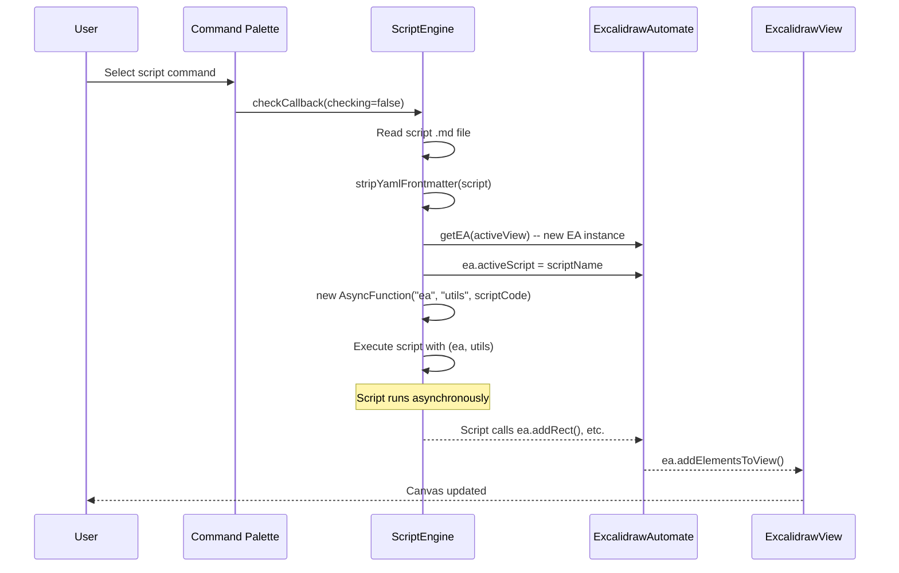
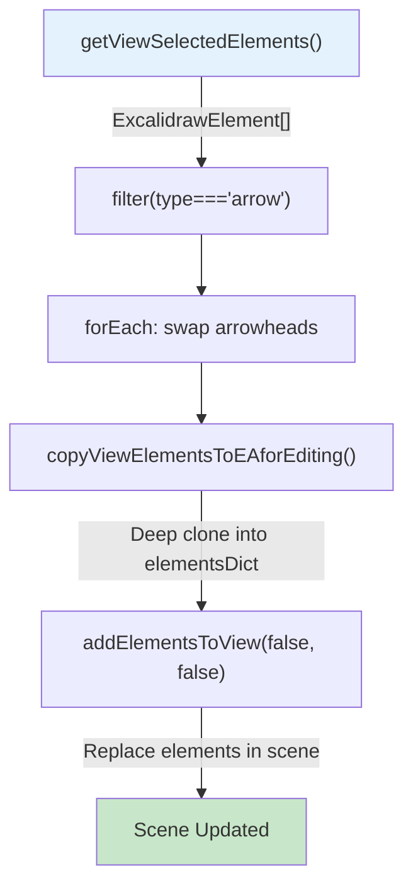
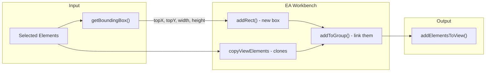
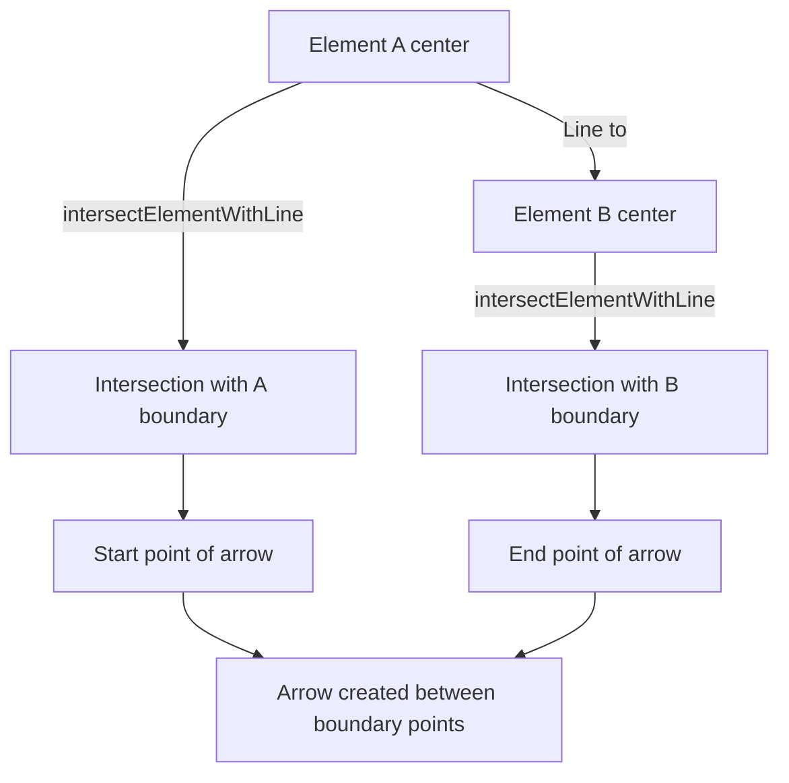
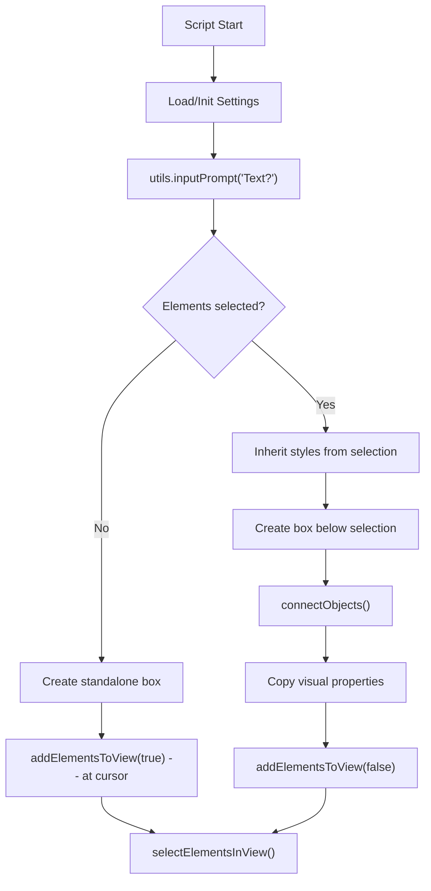
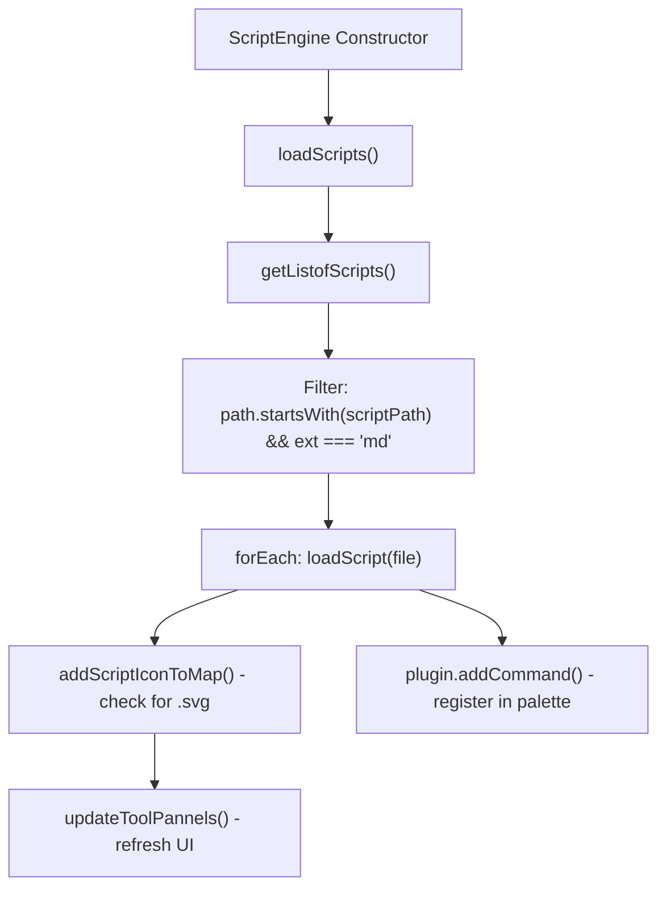

# Writing Excalidraw Scripts: Engine, Patterns, and Practices

This document covers the Excalidraw Script Engine -- how scripts are discovered, loaded, and executed -- and provides five fully annotated script patterns drawn from real community scripts in the `ea-scripts/` directory.

---

## Table of Contents

1. [Script File Format](#1-script-file-format)
2. [Execution Model](#2-execution-model)
3. [The `utils` Object](#3-the-utils-object)
4. [Script Settings Persistence](#4-script-settings-persistence)
5. [Pattern A: Simple Element Manipulation](#5-pattern-a-simple-element-manipulation)
6. [Pattern B: Create Elements with Bounding Box](#6-pattern-b-create-elements-with-bounding-box)
7. [Pattern C: Connecting Elements](#7-pattern-c-connecting-elements)
8. [Pattern D: User Input and Settings](#8-pattern-d-user-input-and-settings)
9. [Pattern E: File Operations](#9-pattern-e-file-operations)
10. [Script Registration and Toolbar](#10-script-registration-and-toolbar)
11. [Startup Scripts](#11-startup-scripts)
12. [Script Development Tips](#12-script-development-tips)

---

## 1. Script File Format

### 1.1 Where Scripts Live

Scripts are `.md` files stored in a configurable folder. The folder path is set in plugin settings as `scriptFolderPath` and accessed in `ScriptEngine` at `Scripts.ts:148`:

```typescript
public getListofScripts(): TFile[] {
    this.scriptPath = this.plugin.settings.scriptFolderPath;
    // ...
    return this.app.vault
      .getFiles()
      .filter(
        (f: TFile) =>
          f.path.startsWith(this.scriptPath+"/") && f.extension === "md",
      );
}
```

### 1.2 File Structure

A script file is a standard markdown file with a specific structure:

```markdown
/*


Description of what this script does.

```javascript
*/

// Your script code here
ea.addRect(0, 0, 200, 100);
await ea.addElementsToView(true);
```

**Key rules:**

1. **Frontmatter is stripped** before execution. The function `stripYamlFrontmatter()` from `src/utils/obsidianUtils.ts` removes YAML frontmatter blocks.

2. **Markdown code fences are stripped.** The content between ` ```javascript ` and ` ``` ` markers is used, or if no code fences exist, the raw content is used (after stripping the `/* ... */` block comment wrapper).

3. **The comment block `/* ... */`** at the top is a convention for embedding documentation and screenshots. It is valid JavaScript (a block comment) so it doesn't interfere with execution.

### 1.3 Companion SVG File

Each script can have an optional companion `.svg` file with the same base name:

```
Scripts/
  My Script.md        <-- the script
  My Script.svg       <-- toolbar icon (optional)
  subfolder/
    Another Script.md
    Another Script.svg
```

The SVG file provides a toolbar icon that appears in the Excalidraw tools panel. The SVG is loaded by `addScriptIconToMap()` at `Scripts.ts:195`:

```typescript
async addScriptIconToMap(scriptPath: string, name: string) {
    const svgFilePath = getIMGFilename(scriptPath, "svg");
    const file = this.app.vault.getAbstractFileByPath(svgFilePath);
    const svgString: string =
      file && file instanceof TFile
        ? await this.app.vault.read(file)
        : null;
    // ...
    this.scriptIconMap[scriptPath] = { name:splitname.filename, group: splitname.folderpath, svgString };
    this.updateToolPannels();
}
```

### 1.4 Subdirectory Naming

Subdirectories create hierarchical script names. A script at `Scripts/flowcharts/Add Step.md` gets the name `flowcharts/Add Step`. This name is used as:
- The Obsidian command ID (prefixed with the plugin ID)
- The display name in the command palette (prefixed with `(Script)`)
- The key for script settings persistence

The naming logic is in `getScriptName()` at `Scripts.ts:166`:

```typescript
public getScriptName(f: TFile | string): string {
    // ...
    const subpath = path.split(`${this.scriptPath}/`)[1];
    const lastSlash = subpath?.lastIndexOf("/");
    if (lastSlash > -1) {
      return subpath.substring(0, lastSlash + 1) + basename;
    }
    return basename;
}
```

---

## 2. Execution Model

### 2.1 The `executeScript()` Method

**Location:** `Scripts.ts:264`

```typescript
async executeScript(
  view: ExcalidrawView = undefined,
  script: string,
  title: string,
  file: TFile
) {
    // Strip frontmatter
    script = stripYamlFrontmatter(script);

    // Create a fresh EA instance with the view pre-set
    const ea = getEA(view);
    this.eaInstances.push(ea);
    ea.activeScript = title;

    // Create an async function from the script text
    const AsyncFunction = Object.getPrototypeOf(async () => {}).constructor;

    // Execute with ea and utils as parameters
    result = await new AsyncFunction("ea", "utils", script)(ea, {
      inputPrompt: (...) => ScriptEngine.inputPrompt(...),
      suggester: (...) => ScriptEngine.suggester(...),
      scriptFile: file
    });

    return result;
}
```

### 2.2 Execution Flow



### 2.3 Key Properties of the Execution Model

1. **Each script gets a fresh EA instance.** Created via `getEA(view)` from `src/core/index.ts:7`, which calls `window.ExcalidrawAutomate.getAPI(view)`.

2. **The EA instance is tracked.** It is pushed to `this.eaInstances` (a `WeakArray<ExcalidrawAutomate>`) for lifecycle management. When a view closes, `removeViewEAs(view)` at `Scripts.ts:40` destroys all EA instances associated with that view.

3. **Scripts run asynchronously.** The `AsyncFunction` constructor creates an async function, so scripts can use `await` freely.

4. **`ea.activeScript` is set** to the script name (e.g., `"Box Selected Elements"`) before execution. This is used by `getScriptSettings()`/`setScriptSettings()` to persist per-script settings.

5. **Error handling is currently commented out** in the source (lines 341-344). Errors propagate to the caller and are shown in the developer console.

6. **Scripts have full access** to the Obsidian API via `ea.obsidian`, to the plugin via `ea.plugin`, and to the app via `ea.plugin.app`.

### 2.4 How Scripts Are Registered as Commands

In `loadScript()` at `Scripts.ts:210`:

```typescript
loadScript(f: TFile) {
    if (f.extension !== "md") return;
    const scriptName = this.getScriptName(f);
    this.addScriptIconToMap(f.path, scriptName);

    this.plugin.addCommand({
      id: scriptName,
      name: `(Script) ${scriptName}`,
      checkCallback: (checking: boolean) => {
        if (checking) {
          // Only available when an Excalidraw view is active
          return Boolean(this.app.workspace.getActiveViewOfType(ExcalidrawView));
        }
        const view = this.app.workspace.getActiveViewOfType(ExcalidrawView);
        if (view) {
          (async()=>{
            const script = stripYamlFrontmatter(await this.app.vault.read(f));
            if(script) {
              this.executeScript(view, script, scriptName, f);
            }
          })()
          return true;
        }
        return false;
      },
    });
}
```

The `checkCallback` pattern ensures the script command only appears in the command palette when an Excalidraw view is active.

---

## 3. The `utils` Object

The `utils` object is injected into every script as the second parameter. It provides UI dialog helpers and a reference to the script file itself.

### 3.1 `utils.inputPrompt()`

**Signature (from Scripts.ts:285-310):**

```typescript
inputPrompt(
  header: string | InputPromptOptions,
  placeholder?: string,
  value?: string,
  buttons?: ButtonDefinition[],
  lines?: number,
  displayEditorButtons?: boolean,
  customComponents?: (container: HTMLElement) => void,
  blockPointerInputOutsideModal?: boolean,
  controlsOnTop?: boolean,
  draggable?: boolean,
): Promise<string>
```

Opens a modal dialog prompting the user for text input. Returns the entered string, or `undefined` if cancelled.

**Parameters:**

| Parameter | Type | Description |
|-----------|------|-------------|
| `header` | `string \| InputPromptOptions` | Dialog title. Can also be an options object containing all parameters. |
| `placeholder` | `string` | Placeholder text for the input field |
| `value` | `string` | Initial value pre-filled in the input |
| `buttons` | `ButtonDefinition[]` | Custom buttons: `[{caption: string, action: Function}]` |
| `lines` | `number` | Number of lines for multiline input (1 = single line, >1 = textarea) |
| `displayEditorButtons` | `boolean` | Show editor formatting buttons |
| `customComponents` | `(container: HTMLElement) => void` | Callback to add custom HTML components to the dialog |
| `blockPointerInputOutsideModal` | `boolean` | Prevent pointer events outside the modal |
| `controlsOnTop` | `boolean` | Place controls above the input field |
| `draggable` | `boolean` | Make the modal draggable (default: false) |

**As of newer versions**, you can pass a single `InputPromptOptions` object instead of positional arguments:

```javascript
const result = await utils.inputPrompt({
  header: "Enter name",
  placeholder: "Type here...",
  value: "default",
  lines: 3,
  draggable: true,
});
```

### 3.2 `utils.suggester()`

**Signature (from Scripts.ts:326-338):**

```typescript
suggester(
  displayItems: string[],
  items: any[],
  hint?: string,
  instructions?: Instruction[],
): Promise<any>
```

Opens a fuzzy-search selection dialog. Returns the selected item from `items`, or `null` if cancelled.

**Parameters:**

| Parameter | Type | Description |
|-----------|------|-------------|
| `displayItems` | `string[]` | Strings shown to the user in the list |
| `items` | `any[]` | Actual values returned on selection (matched by index) |
| `hint` | `string` | Hint text shown in the search field |
| `instructions` | `Instruction[]` | Obsidian instructions shown at the bottom of the modal |

**Example:**
```javascript
const shapes = ["Rectangle", "Ellipse", "Diamond"];
const values = ["rectangle", "ellipse", "diamond"];
const choice = await utils.suggester(shapes, values, "Pick a shape");
if (!choice) return; // user cancelled
ea.addRect(0, 0, 200, 100); // or whatever based on choice
```

### 3.3 `utils.scriptFile`

**Type:** `TFile`

A reference to the script's own file in the vault. Useful for:
- Reading script metadata from frontmatter
- Getting the script's folder path for relative file operations
- Storing data in the script's own frontmatter

```javascript
const scriptContent = await ea.plugin.app.vault.read(utils.scriptFile);
console.log("Script path:", utils.scriptFile.path);
```

---

## 4. Script Settings Persistence

### 4.1 How Settings Work

Script settings are stored in the plugin's settings object under the key `scriptEngineSettings[activeScript]`. This persists across Obsidian restarts.

**`getScriptSettings()`** at `ExcalidrawAutomate.ts:3674`:
```typescript
getScriptSettings(): {} {
    if (!this.activeScript) return null;
    return this.plugin.settings.scriptEngineSettings[this.activeScript] ?? {};
}
```

**`setScriptSettings(settings)`** at `ExcalidrawAutomate.ts:3686`:
```typescript
async setScriptSettings(settings: any): Promise<void> {
    if (!this.activeScript) return null;
    this.plugin.settings.scriptEngineSettings[this.activeScript] = settings;
    await this.plugin.saveSettings();
}
```

### 4.2 Settings Pattern

The standard pattern is to check for settings on first run and initialize defaults:

```javascript
// Get existing settings or empty object
let settings = ea.getScriptSettings();

// Initialize defaults if first run
if (!settings["My Setting"]) {
  settings = {
    "My Setting": {
      value: 42,
      description: "A helpful description"
    },
    "Another Setting": {
      value: "hello",
      description: "String setting"
    },
    "Boolean toggle": true,
    "Choice Setting": {
      value: "option1",
      valueset: ["option1", "option2", "option3"],
      description: "Pick one"
    }
  };
  await ea.setScriptSettings(settings);
}

// Use settings
const myValue = settings["My Setting"].value;
```

**Settings value format conventions:**
- Simple value: `settings["key"] = value`
- Described value: `settings["key"] = { value: X, description: "..." }`
- Enumerated value: `settings["key"] = { value: X, valueset: [...], description: "..." }`

### 4.3 Per-Key Settings API

For more granular access (lines 3694-3709):

```typescript
setScriptSettingValue(key: string, value: ScriptSettingValue): void
getScriptSettingValue(key: string, defaultValue: ScriptSettingValue): ScriptSettingValue
async saveScriptSettings(): Promise<void>
```

---

## 5. Pattern A: Simple Element Manipulation

### Source: `ea-scripts/Reverse arrows.md`

This pattern demonstrates the simplest script type: get selected elements, filter them, modify properties, and commit back.

```javascript
/*
Reverse the direction of arrows within the scope of selected elements.
```javascript
*/

// Step 1: Get selected arrow elements from the view
elements = ea.getViewSelectedElements().filter((el) => el.type === "arrow");

// Step 2: Guard clause -- exit if no arrows selected
if (!elements || elements.length === 0) return;

// Step 3: Swap arrowhead directions
elements.forEach((el) => {
  const start = el.startArrowhead;
  el.startArrowhead = el.endArrowhead;
  el.endArrowhead = start;
});

// Step 4: Copy modified elements to EA workbench
ea.copyViewElementsToEAforEditing(elements);

// Step 5: Commit back to view (no reposition, no save)
ea.addElementsToView(false, false);
```

### Annotated Data Flow



**Key concepts demonstrated:**
- `getViewSelectedElements()` returns live scene elements (immutable)
- Although we modify the elements before copying, `copyViewElementsToEAforEditing()` makes deep clones, preserving the modified properties
- `addElementsToView(false, false)` -- first `false` means don't reposition to cursor, second `false` means don't trigger a save (useful for performance when chaining operations)

**Note on mutability:** In this script, the elements from `getViewSelectedElements()` are modified directly before cloning. This works because the clone captures the current state. However, the **recommended** practice is to clone first, then modify:

```javascript
// Recommended approach:
const elements = ea.getViewSelectedElements().filter(el => el.type === "arrow");
ea.copyViewElementsToEAforEditing(elements);
Object.values(ea.elementsDict).forEach(el => {
  if (el.type === "arrow") {
    const start = el.startArrowhead;
    el.startArrowhead = el.endArrowhead;
    el.endArrowhead = start;
  }
});
await ea.addElementsToView(false, false);
```

---

## 6. Pattern B: Create Elements with Bounding Box

### Source: `ea-scripts/Box Selected Elements.md`

This pattern shows how to compute a bounding box around selected elements and create an enclosing shape, then group everything together.

```javascript
/*
Add an encapsulating box around the currently selected elements.
```javascript
*/

// Step 1: Version check for compatibility
if (!ea.verifyMinimumPluginVersion || !ea.verifyMinimumPluginVersion("1.5.21")) {
  new Notice("This script requires a newer version of Excalidraw.");
  return;
}

// Step 2: Load persistent settings with defaults
settings = ea.getScriptSettings();
if (!settings["Default padding"]) {
  settings = {
    "Prompt for padding?": true,
    "Default padding": {
      value: 10,
      description: "Padding between the bounding box and the box the script creates"
    }
  };
  ea.setScriptSettings(settings);
}

let padding = settings["Default padding"].value;

// Step 3: Optionally prompt user for padding value
if (settings["Prompt for padding?"]) {
  padding = parseInt(await utils.inputPrompt("padding?", "number", padding.toString()));
}

if (isNaN(padding)) {
  new Notice("The padding value provided is not a number");
  return;
}

// Step 4: Get selected elements and compute bounding box
elements = ea.getViewSelectedElements();
const box = ea.getBoundingBox(elements);

// Step 5: Match stroke color to current app state
color = ea.getExcalidrawAPI().getAppState().currentItemStrokeColor;
ea.style.strokeColor = color;

// Step 6: Create enclosing rectangle
id = ea.addRect(
  box.topX - padding,
  box.topY - padding,
  box.width + 2 * padding,
  box.height + 2 * padding
);

// Step 7: Copy view elements to EA and group with new rectangle
ea.copyViewElementsToEAforEditing(elements);
ea.addToGroup([id].concat(elements.map((el) => el.id)));

// Step 8: Commit everything
ea.addElementsToView(false, false);
```

### Annotated Architecture



**Key concepts demonstrated:**
- `getBoundingBox(elements)` returns `{topX, topY, width, height}` -- the smallest enclosing rectangle
- `getExcalidrawAPI().getAppState()` accesses the live Excalidraw app state to read the current stroke color
- `addToGroup()` creates a group ID and adds it to all elements' `groupIds`
- Both the new rectangle AND the original elements must be in `elementsDict` for grouping to work
- Settings persistence with `getScriptSettings()`/`setScriptSettings()`

---

## 7. Pattern C: Connecting Elements

### Source: `ea-scripts/Connect elements.md`

This pattern shows how to connect two selected element groups with an arrow, using group detection and the largest-element heuristic.

```javascript
/*
Connect two objects with an arrow. If either object is a group,
connect to the largest element in the group.
```javascript
*/

// Version check
if (!ea.verifyMinimumPluginVersion || !ea.verifyMinimumPluginVersion("1.5.21")) {
  new Notice("This script requires a newer version of Excalidraw.");
  return;
}

// Load settings for arrow configuration
settings = ea.getScriptSettings();
if (!settings["Starting arrowhead"]) {
  settings = {
    "Starting arrowhead": {
      value: "none",
      valueset: ["none", "arrow", "triangle", "bar", "dot"]
    },
    "Ending arrowhead": {
      value: "triangle",
      valueset: ["none", "arrow", "triangle", "bar", "dot"]
    },
    "Line points": {
      value: 1,
      description: "Number of line points between start and end"
    }
  };
  ea.setScriptSettings(settings);
}

const arrowStart = settings["Starting arrowhead"].value === "none"
  ? null : settings["Starting arrowhead"].value;
const arrowEnd = settings["Ending arrowhead"].value === "none"
  ? null : settings["Ending arrowhead"].value;
const linePoints = Math.floor(settings["Line points"].value);

// Get selected elements and copy to EA
const elements = ea.getViewSelectedElements();
ea.copyViewElementsToEAforEditing(elements);

// Detect exactly two groups
groups = ea.getMaximumGroups(elements);
if (groups.length !== 2) {
  // Handle sticky note duplication edge case
  cleanGroups = [];
  idList = [];
  for (group of groups) {
    keep = true;
    for (item of group) if (idList.contains(item.id)) keep = false;
    if (keep) {
      cleanGroups.push(group);
      idList = idList.concat(group.map(el => el.id));
    }
  }
  if (cleanGroups.length !== 2) return;
  groups = cleanGroups;
}

// Find the largest element in each group (the "shape" to connect)
els = [
  ea.getLargestElement(groups[0]),
  ea.getLargestElement(groups[1])
];

// Inherit stroke style from the first element
ea.style.strokeColor = els[0].strokeColor;
ea.style.strokeWidth = els[0].strokeWidth;
ea.style.strokeStyle = els[0].strokeStyle;
ea.style.strokeSharpness = els[0].strokeSharpness;

// Connect them
ea.connectObjects(
  els[0].id, null,   // null = auto-detect connection side
  els[1].id, null,
  {
    endArrowHead: arrowEnd,
    startArrowHead: arrowStart,
    numberOfPoints: linePoints
  }
);

// Commit (newElementsOnTop = true so arrow renders above shapes)
ea.addElementsToView(false, false, true);
```

### Connection Point Resolution

When `connectionA` or `connectionB` is `null`, `connectObjects()` uses geometry to find the optimal point:



**Key concepts demonstrated:**
- `getMaximumGroups()` organizes elements by their top-level groups
- `getLargestElement()` finds the container (not the text) in a group
- Passing `null` for connection points triggers automatic intersection calculation
- `connectObjects()` creates a bound arrow that updates when elements move
- Style inheritance from existing elements

---

## 8. Pattern D: User Input and Settings

### Source: `ea-scripts/Add Next Step in Process.md`

This is the most complex script pattern, combining user input, persistent settings, conditional element creation, and style inheritance.

```javascript
/*
Prompt for text, create a sticky note. If an element is selected,
connect the new step to it with an arrow.
```javascript
*/

// Version check
if (!ea.verifyMinimumPluginVersion || !ea.verifyMinimumPluginVersion("1.5.24")) {
  new Notice("This script requires a newer version of Excalidraw.");
  return;
}

// --- Settings Management ---
settings = ea.getScriptSettings();
if (!settings["Starting arrowhead"]) {
  settings = {
    "Starting arrowhead": {
      value: "none",
      valueset: ["none", "arrow", "triangle", "bar", "dot"]
    },
    "Ending arrowhead": {
      value: "triangle",
      valueset: ["none", "arrow", "triangle", "bar", "dot"]
    },
    "Line points": {
      value: 0,
      description: "Number of line points between start and end"
    },
    "Gap between elements": { value: 100 },
    "Wrap text at (number of characters)": { value: 25 },
    "Fix width": {
      value: true,
      description: "Should the box match wrapped text width?"
    }
  };
  ea.setScriptSettings(settings);
}

// Read settings values
const arrowStart = settings["Starting arrowhead"].value === "none"
  ? null : settings["Starting arrowhead"].value;
const arrowEnd = settings["Ending arrowhead"].value === "none"
  ? null : settings["Ending arrowhead"].value;
if (!arrowEnd) ea.style.endArrowHead = null;
if (!arrowStart) ea.style.startArrowHead = null;
const linePoints = Math.floor(settings["Line points"].value);
const gapBetweenElements = Math.floor(settings["Gap between elements"].value);
const wrapLineLen = Math.floor(settings["Wrap text at (number of characters)"].value);
const fixWidth = settings["Fix width"];

const textPadding = 10;

// --- User Input ---
const text = await utils.inputPrompt("Text?");

// --- Conditional Logic ---
const elements = ea.getViewSelectedElements();
const isFirst = (!elements || elements.length === 0);
const width = ea.measureText("w".repeat(wrapLineLen)).width;

let id = "";

if (!isFirst) {
  // --- CONNECTED STEP ---
  const fromElement = ea.getLargestElement(elements);
  ea.copyViewElementsToEAforEditing([fromElement]);

  // Inherit text style from existing text elements
  const previousTextElements = elements.filter(el => el.type === "text");
  if (previousTextElements.length > 0) {
    const el = previousTextElements[0];
    ea.style.strokeColor = el.strokeColor;
    ea.style.fontSize = el.fontSize;
    ea.style.fontFamily = el.fontFamily;
  }

  // Create text with container, positioned below the selected element
  id = ea.addText(
    fixWidth
      ? fromElement.x + fromElement.width / 2 - width / 2
      : fromElement.x + fromElement.width / 2 - ea.measureText(text).width / 2 - textPadding,
    fromElement.y + fromElement.height + gapBetweenElements,
    text,
    {
      wrapAt: wrapLineLen,
      textAlign: "center",
      textVerticalAlign: "middle",
      box: /* inherit shape type from previous step */
        elements.filter(el => ['ellipse', 'rectangle', 'diamond'].includes(el.type)).length > 0
          ? elements.filter(el => ['ellipse', 'rectangle', 'diamond'].includes(el.type))[0].type
          : false,
      ...(fixWidth ? { width: width, boxPadding: 0 } : { boxPadding: textPadding })
    }
  );

  // Connect new step to previous step
  ea.connectObjects(fromElement.id, null, id, null, {
    endArrowHead: arrowEnd,
    startArrowHead: arrowStart,
    numberOfPoints: linePoints
  });

  // Inherit visual style from the previous step's container
  const previousRectElements = elements.filter(
    el => ['ellipse', 'rectangle', 'diamond'].includes(el.type)
  );
  if (previousRectElements.length > 0) {
    const rect = ea.getElement(id);
    rect.strokeColor = fromElement.strokeColor;
    rect.strokeWidth = fromElement.strokeWidth;
    rect.strokeStyle = fromElement.strokeStyle;
    rect.roughness = fromElement.roughness;
    rect.roundness = fromElement.roundness;
    rect.backgroundColor = fromElement.backgroundColor;
    rect.fillStyle = fromElement.fillStyle;
    rect.width = fromElement.width;
    rect.height = fromElement.height;
  }

  await ea.addElementsToView(false, false);
} else {
  // --- FIRST STEP (no connection) ---
  id = ea.addText(0, 0, text, {
    wrapAt: wrapLineLen,
    textAlign: "center",
    textVerticalAlign: "middle",
    box: "rectangle",
    boxPadding: textPadding,
    ...(fixWidth ? { width: width } : null)
  });
  await ea.addElementsToView(true, false); // reposition to cursor
}

// Select the newly created element
ea.selectElementsInView([ea.getElement(id)]);
```

### Full Data Flow



**Key concepts demonstrated:**
- Complex settings with `valueset` enums
- `utils.inputPrompt()` for user text input
- `ea.measureText()` to calculate text dimensions before creating elements
- Conditional flow based on selection state
- Style inheritance: copying `strokeColor`, `fontSize`, `fontFamily`, `backgroundColor`, etc. from existing elements
- `addText()` with the `box` option to auto-create a container
- `selectElementsInView()` to highlight the result

---

## 9. Pattern E: File Operations

This pattern demonstrates creating new drawings, exporting, and linking to other files.

### Creating a New Drawing

```javascript
// Create a new drawing from elements in EA
const filepath = await ea.create({
  filename: "My Flowchart",
  foldername: "Drawings",
  templatePath: "Templates/flowchart-template.excalidraw.md",
  onNewPane: true,
  silent: false,  // opens the file after creation
  frontmatterKeys: {
    "excalidraw-plugin": "parsed",
    "excalidraw-default-mode": "view",
    "excalidraw-autoexport": true,
    "cssclasses": "excalidraw-full-width",
  },
  plaintext: "This drawing was generated by a script.\n\n",
});

new Notice(`Created: ${filepath}`);
```

### Exporting to SVG/PNG

```javascript
// Export the current view to SVG
const svg = await ea.createViewSVG({
  withBackground: true,
  theme: "light",
  selectedOnly: false,
  skipInliningFonts: false,
  embedScene: true,
});

// Save SVG to vault
const svgString = svg.outerHTML;
const file = await ea.plugin.app.vault.create(
  "exports/my-drawing.svg",
  svgString
);
new Notice(`SVG saved to ${file.path}`);
```

### Opening a Related File

```javascript
// Open a markdown file next to the drawing
const file = ea.plugin.app.vault.getAbstractFileByPath("notes/related-note.md");
if (file && file instanceof ea.obsidian.TFile) {
  ea.openFileInNewOrAdjacentLeaf(file, { active: true });
}
```

### Creating a Drawing from an Existing File

```javascript
// Read a markdown file and embed it as an image in a new drawing
const mdFile = ea.plugin.app.vault.getAbstractFileByPath("notes/summary.md");
if (mdFile) {
  await ea.addImage(0, 0, mdFile, true);
  await ea.create({
    filename: "Summary Visual",
    silent: false,
  });
}
```

### Working with Multiple Views

```javascript
// Get all open Excalidraw views
const views = ea.plugin.app.workspace.getLeavesOfType("excalidraw")
  .map(leaf => leaf.view);

// Export each view
for (const view of views) {
  ea.setView(view);
  const svg = await ea.createViewSVG({ withBackground: true });
  const filename = view.file.basename;
  // ... save each SVG
  ea.clear(); // clear workbench between operations
}
```

---

## 10. Script Registration and Toolbar

### 10.1 Script Discovery

The `ScriptEngine` constructor at `Scripts.ts:32` calls `loadScripts()`, which scans the script folder and registers each `.md` file:



### 10.2 File Watching

The `ScriptEngine` watches the script folder for real-time updates via vault events at `Scripts.ts:116-135`:

| Vault Event | Handler | Effect |
|-------------|---------|--------|
| `delete` | `deleteEventHandler` (line 78) | Unloads script and removes icon |
| `create` | `createEventHandler` (line 89) | Loads new script and registers command |
| `rename` | `renameEventHandler` (line 100) | Unloads old, loads new if still in scripts folder |

This means you can add, remove, or rename scripts while Obsidian is running and they will be immediately available (or removed) from the command palette and tools panel.

### 10.3 Toolbar Icons

Scripts with companion `.svg` files appear in the Excalidraw tools panel. The `scriptIconMap` (line 29) maps script paths to their icon data:

```typescript
export type ScriptIconMap = {
  [key: string]: { name: string; group: string; svgString: string };
};
```

- `name` -- the display name (from `splitFolderAndFilename`)
- `group` -- the folder path (used for grouping in the tools panel)
- `svgString` -- the raw SVG content (or `null` if no companion file)

When the map changes, `updateToolPannels()` (line 348) iterates all open Excalidraw views and updates their tools panel React components.

### 10.4 Command Unloading

When a script is deleted or renamed, `unloadScript()` (line 247) removes it:

```typescript
unloadScript(basename: string, path: string) {
    delete this.scriptIconMap[path];
    this.scriptIconMap = { ...this.scriptIconMap }; // trigger React re-render
    this.updateToolPannels();

    const commandId = `${PLUGIN_ID}:${basename}`;
    delete this.app.commands.commands[commandId]; // remove from Obsidian
}
```

---

## 11. Startup Scripts

### 11.1 Per-File Startup Scripts

Each Excalidraw file can specify a startup script via frontmatter:

```yaml
---
excalidraw-plugin: parsed
excalidraw-onload-script: "Scripts/my-init-script.md"
---
```

The frontmatter key is defined in `src/constants/constants.ts:255`:
```typescript
"onload-script": {name: "excalidraw-onload-script", type: "text"},
```

When a file is opened, `ExcalidrawView.setViewData()` checks for this frontmatter key (in `ExcalidrawData.ts:1920-1923`) and executes the referenced script after the view is loaded.

**Execution order:**
1. Global `onFileOpenHook` (if set on `plugin.ea`)
2. Per-file `excalidraw-onload-script` (from frontmatter)

### 11.2 Global Startup Script

The plugin has a startup script feature that runs when the plugin loads. The template is at `src/constants/assets/startupScript.md`. This script sets hooks on the global `ea` object (`window.ExcalidrawAutomate`):

```javascript
// Example startup script (global)
// This runs once when the plugin initializes

// Register a hook for all file open events
ea.onFileOpenHook = async (data) => {
  console.log(`Opened: ${data.excalidrawFile.path}`);
  // Custom initialization per file
};

// Register drop handler
ea.onDropHook = (data) => {
  if (data.type === "text" && data.payload.text.startsWith("http")) {
    // Custom URL handling
    return false; // prevent default
  }
  return true; // allow default
};
```

### 11.3 Hook Registration in Startup Scripts

Startup scripts can register hooks that persist for the plugin's lifetime. The key pattern is setting hook functions on the global `ea` instance:

```javascript
// In a startup script or per-file onload script:

// This runs for EVERY Excalidraw view
ea.onViewModeChangeHook = (isViewModeEnabled, view, ea) => {
  if (isViewModeEnabled) {
    console.log("Entered view mode");
  }
};

// For per-view hooks, use registerThisAsViewEA:
ea.onLinkClickHook = (element, linkText, event, view, hookEA) => {
  // Custom link handling for this specific view
  console.log(`Clicked: ${linkText}`);
  return true; // allow default behavior
};
ea.registerThisAsViewEA(); // Register this EA for the target view
```

See `08-hooks-and-integration.md` for the complete hook reference.

---

## 12. Script Development Tips

### 12.1 Version Compatibility

Always start scripts with a version check:
```javascript
if (!ea.verifyMinimumPluginVersion("2.0.0")) {
  new Notice("Please update the Excalidraw Plugin to the latest version.");
  return;
}
```

### 12.2 Debugging

```javascript
// Console logging (visible in Obsidian DevTools: Ctrl+Shift+I)
console.log("Elements:", ea.getViewSelectedElements());
console.log("Style:", ea.style);

// User feedback
new Notice("Script completed!", 3000); // 3 second notice

// Interactive help in console
ea.help(ea.addRect);
ea.help('elementsDict');
```

### 12.3 Error Handling

```javascript
try {
  const result = await riskyOperation();
  if (!result) {
    new Notice("Operation failed");
    return;
  }
} catch (e) {
  console.error("Script error:", e);
  new Notice(`Error: ${e.message}`);
  return;
}
```

### 12.4 Performance Tips

- Use `addElementsToView(false, false)` during intermediate operations (no reposition, no save)
- Call `save` only on the final `addElementsToView()` call: `addElementsToView(false, true)`
- Use `ea.clear()` between independent operations to free memory
- Avoid loading the same image multiple times -- cache `fileId` values

### 12.5 Testing Strategy

- **Use a dedicated test vault** to avoid damaging your main vault
- Create a test drawing with known elements for consistent testing
- Use `console.log()` liberally during development
- Check the Excalidraw developer console (Ctrl+Shift+I) for errors
- Test with various selections: no selection, single element, multiple elements, groups, frames

### 12.6 Access to Obsidian APIs

Scripts have full access to the Obsidian API through `ea.obsidian`:

```javascript
// Create a file
await ea.plugin.app.vault.create("test.md", "# Hello");

// Read a file
const content = await ea.plugin.app.vault.read(someFile);

// Get metadata
const cache = ea.plugin.app.metadataCache.getFileCache(someFile);

// Use requestUrl for HTTP requests
const response = await ea.obsidian.requestUrl("https://api.example.com/data");

// Create a modal
const modal = new ea.obsidian.Modal(ea.plugin.app);
modal.contentEl.createEl("h2", { text: "My Modal" });
modal.open();
```

### 12.7 Script Template

Here is a minimal template for new scripts:

```javascript
/*
Description of what this script does.

```javascript
*/

if (!ea.verifyMinimumPluginVersion("2.0.0")) {
  new Notice("Please update Excalidraw.");
  return;
}

// Load settings
let settings = ea.getScriptSettings();
if (!settings["initialized"]) {
  settings = {
    "initialized": true,
    // Add your settings here
  };
  await ea.setScriptSettings(settings);
}

// Get selected elements
const elements = ea.getViewSelectedElements();
if (!elements || elements.length === 0) {
  new Notice("Please select at least one element.");
  return;
}

// Your script logic here
ea.copyViewElementsToEAforEditing(elements);

// ... modify elements ...

await ea.addElementsToView(false, true);
new Notice("Done!");
```

---

## Cross-References

- Complete EA API reference: `06-scripting-api.md`
- Hooks and external plugin integration: `08-hooks-and-integration.md`
- Source files:
  - `src/shared/Scripts.ts` -- ScriptEngine class (406 lines)
  - `src/shared/ExcalidrawAutomate.ts` -- EA class (4077 lines)
  - `src/core/index.ts` -- `getEA()` entry point (14 lines)
  - `ea-scripts/` -- Community script examples
  - `src/constants/assets/startupScript.md` -- Startup script template
