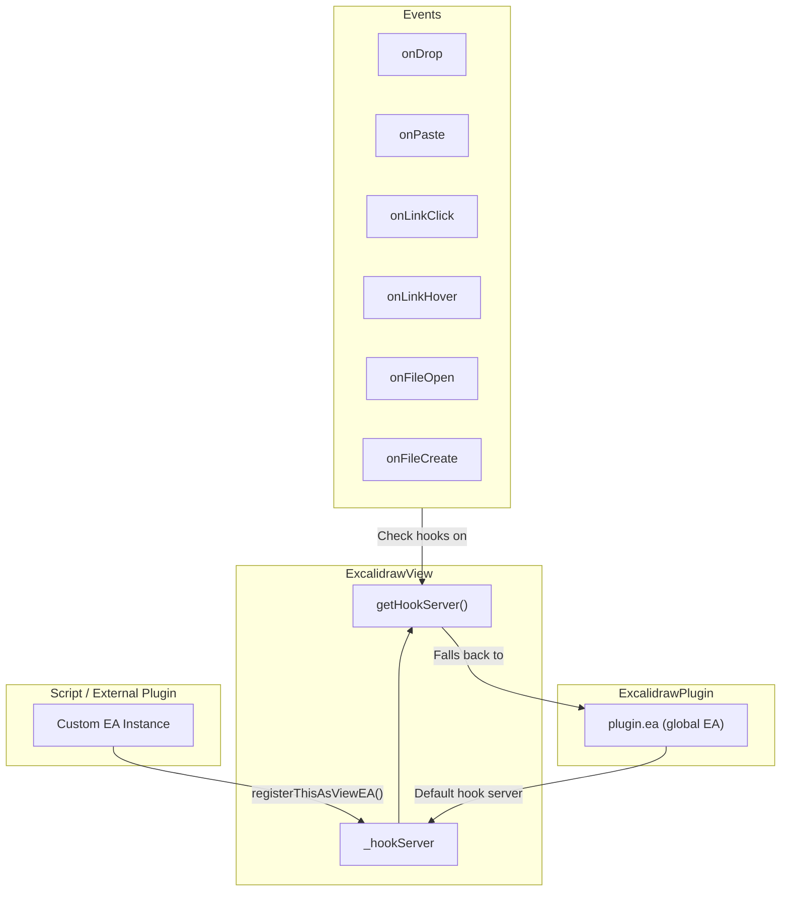
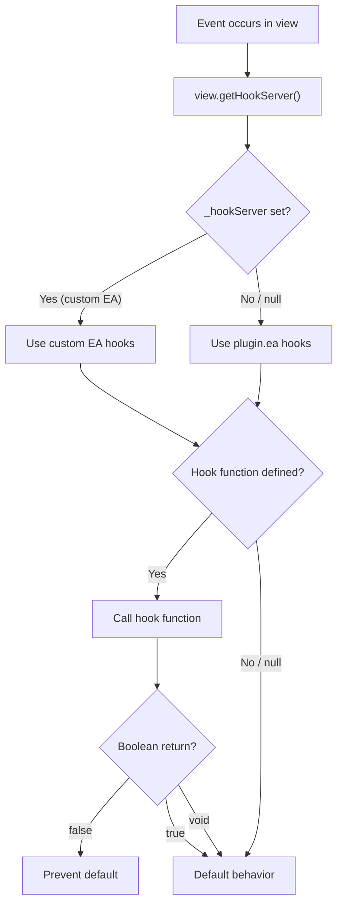
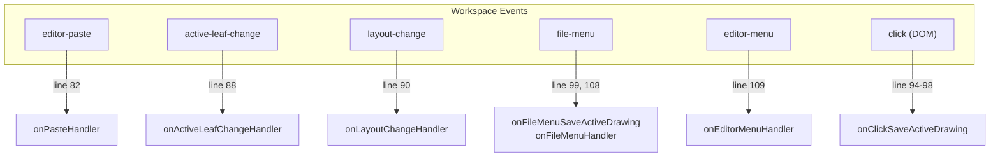
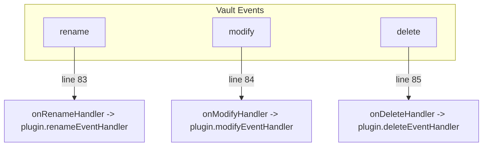
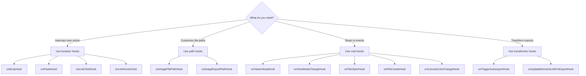

# Events, Hooks, and External Plugin Integration

This document covers the hook system in ExcalidrawAutomate, the EventManager's workspace/vault event handling, and patterns for integrating with Excalidraw from external Obsidian plugins and scripts.

---

## Table of Contents

1. [Hook System Overview](#1-hook-system-overview)
2. [Complete Hook Reference](#2-complete-hook-reference)
3. [Hook Resolution: How Views Find Their Hook Server](#3-hook-resolution-how-views-find-their-hook-server)
4. [External Plugin Integration Pattern](#4-external-plugin-integration-pattern)
5. [Sidepanel API](#5-sidepanel-api)
6. [EventManager Event Reference](#6-eventmanager-event-reference)
7. [Integration Example: Building a Plugin That Creates Drawings](#7-integration-example-building-a-plugin-that-creates-drawings)
8. [Hook Registration Patterns for Scripts](#8-hook-registration-patterns-for-scripts)
9. [Integration with Obsidian APIs](#9-integration-with-obsidian-apis)
10. [Advanced Patterns](#10-advanced-patterns)

---

## 1. Hook System Overview

### 1.1 What Are Hooks?

Hooks are **callback function properties** on `ExcalidrawAutomate` instances. When Excalidraw fires certain events (drops, pastes, link clicks, file opens, exports), it checks for a registered hook function and calls it, allowing external code to:

1. **Intercept** the event and prevent default behavior (return `false`)
2. **Augment** the event with additional actions (return `true` to allow default)
3. **React** to the event without modifying behavior (`void` hooks)

All hooks are defined in `src/shared/ExcalidrawAutomate.ts` at lines 3220-3459.

### 1.2 Architecture



### 1.3 Two-Tier Hook System

Hooks operate at two levels:

1. **Global hooks** -- set on `plugin.ea` (the global `window.ExcalidrawAutomate` instance). These apply to all Excalidraw views by default.

2. **Per-view hooks** -- set on a custom EA instance registered via `registerThisAsViewEA()`. These override global hooks for a specific view.

The resolution logic in `ExcalidrawView.ts:414`:
```typescript
public getHookServer() {
    return this.hookServer ?? this.plugin.ea;
}
```

If a custom hook server is registered for a view, it takes priority. Otherwise, the global `plugin.ea` is used.

### 1.4 Hook Categories

| Category | Hooks | Return Semantics |
|----------|-------|------------------|
| **Interceptors** (return boolean) | `onDropHook`, `onPasteHook`, `onLinkClickHook`, `onLinkHoverHook` | `false` = prevent default, `true` = allow |
| **Transformers** (return value) | `onImageFilePathHook`, `onImageExportPathHook`, `onTriggerAutoexportHook`, `onUpdateElementLinkForExportHook` | Return modified value or `null` for default |
| **Observers** (void) | `onViewUnloadHook`, `onViewModeChangeHook`, `onFileOpenHook`, `onFileCreateHook`, `onCanvasColorChangeHook` | No return value; observation only |

---

## 2. Complete Hook Reference

### 2.1 `onViewUnloadHook`

**Line 3223:**
```typescript
onViewUnloadHook: (view: ExcalidrawView) => void = null;
```

| Aspect | Detail |
|--------|--------|
| **When fired** | User closes an Excalidraw view |
| **Parameters** | `view` -- the ExcalidrawView being closed |
| **Return** | `void` |
| **Use case** | Cleanup: remove event listeners, save state, destroy custom EA instances |

**Called at** `ExcalidrawView.ts:2280`:
```typescript
if(this.getHookServer().onViewUnloadHook) {
    // ... call the hook
}
```

### 2.2 `onViewModeChangeHook`

**Line 3229:**
```typescript
onViewModeChangeHook: (
    isViewModeEnabled: boolean,
    view: ExcalidrawView,
    ea: ExcalidrawAutomate
) => void = null;
```

| Aspect | Detail |
|--------|--------|
| **When fired** | User toggles view mode (edit <-> view/zen mode) |
| **Parameters** | `isViewModeEnabled` -- `true` if entering view mode; `view` -- the affected view; `ea` -- the hook EA |
| **Return** | `void` |
| **Use case** | Change UI behavior based on mode, show/hide custom controls, lock elements |

### 2.3 `onLinkHoverHook`

**Line 3237:**
```typescript
onLinkHoverHook: (
    element: NonDeletedExcalidrawElement,
    linkText: string,
    view: ExcalidrawView,
    ea: ExcalidrawAutomate
) => boolean = null;
```

| Aspect | Detail |
|--------|--------|
| **When fired** | User hovers over an element with a link |
| **Parameters** | `element` -- the hovered element; `linkText` -- the link URL/path; `view` -- current view; `ea` -- hook EA |
| **Return** | `boolean` -- `false` to prevent the default hover preview, `true` to allow |
| **Use case** | Custom hover previews, conditional preview suppression, link validation |

### 2.4 `onLinkClickHook`

**Line 3250:**
```typescript
onLinkClickHook: (
    element: ExcalidrawElement,
    linkText: string,
    event: MouseEvent,
    view: ExcalidrawView,
    ea: ExcalidrawAutomate
) => boolean = null;
```

| Aspect | Detail |
|--------|--------|
| **When fired** | User clicks a link on an element |
| **Parameters** | `element` -- clicked element; `linkText` -- the link; `event` -- mouse event (for modifier keys); `view` -- current view; `ea` -- hook EA |
| **Return** | `boolean` -- `false` to prevent default navigation, `true` to allow |
| **Use case** | Custom navigation, link interception, analytics, conditional opening |

**Called at** `ExcalidrawView.ts:1308-1320`:
```typescript
if(this.getHookServer().onLinkClickHook) {
    try {
        if(!this.getHookServer().onLinkClickHook(
            element, linkText, event, this,
            this.getHookServer()
        )) return; // prevented
    } catch(e) {
        errorlog({where: "ExcalidrawView.onLinkOpen", ...});
    }
}
```

### 2.5 `onDropHook`

**Line 3264:**
```typescript
onDropHook: (data: {
    ea: ExcalidrawAutomate;
    event: React.DragEvent<HTMLDivElement>;
    draggable: any;
    type: "file" | "text" | "unknown";
    payload: {
        files: TFile[];
        text: string;
    };
    excalidrawFile: TFile;
    view: ExcalidrawView;
    pointerPosition: { x: number; y: number };
}) => boolean = null;
```

| Aspect | Detail |
|--------|--------|
| **When fired** | User drops a file, text, or other content onto the Excalidraw canvas |
| **Parameters** | Object with `ea`, raw `event`, Obsidian `draggable`, drop `type`, `payload` (files or text), `excalidrawFile` receiving the drop, `view`, and canvas `pointerPosition` |
| **Return** | `boolean` -- `false` to prevent default drop handling, `true` to allow |
| **Use case** | Custom file handling (e.g., process CSV drops, special image processing), text transformation on drop |

**Drop type detection:**
- `"file"` -- one or more vault files were dropped
- `"text"` -- text/URL was dropped
- `"unknown"` -- unrecognized drop content

### 2.6 `onPasteHook`

**Line 3286:**
```typescript
onPasteHook: (data: {
    ea: ExcalidrawAutomate;
    payload: ClipboardData;
    event: ClipboardEvent;
    excalidrawFile: TFile;
    view: ExcalidrawView;
    pointerPosition: { x: number; y: number };
}) => boolean = null;
```

| Aspect | Detail |
|--------|--------|
| **When fired** | User pastes content into the Excalidraw canvas |
| **Parameters** | Object with `ea`, Excalidraw `ClipboardData` payload, raw `event`, `excalidrawFile`, `view`, canvas `pointerPosition` |
| **Return** | `boolean` -- `false` to prevent default paste, `true` to allow |
| **Use case** | Custom paste processing, URL-to-embed conversion, clipboard format detection |

### 2.7 `onImageFilePathHook`

**Line 3324:**
```typescript
onImageFilePathHook: (data: {
    currentImageName: string;
    drawingFilePath: string;
}) => string | null = null;
```

| Aspect | Detail |
|--------|--------|
| **When fired** | An image is being saved to the vault (e.g., after paste) |
| **Parameters** | `currentImageName` -- the default filename Excalidraw would use; `drawingFilePath` -- the drawing's vault path |
| **Return** | `string` (custom file path with extension) or `null`/`undefined` (use default) |
| **Use case** | Custom image naming (avoid "Pasted image 123456.png"), organizing images into specific folders |

**Example (from docstring at line 3314-3322):**
```javascript
ea.onImageFilePathHook = (data) => {
    const { currentImageName, drawingFilePath } = data;
    const ext = currentImageName.split('.').pop();
    const drawingName = drawingFilePath.split('/').pop().replace('.excalidraw.md', '');
    return `attachments/${drawingName}-${Date.now()}.${ext}`;
};
```

### 2.8 `onImageExportPathHook`

**Line 3372:**
```typescript
onImageExportPathHook: (data: {
    exportFilepath: string;
    exportExtension: string;
    excalidrawFile: TFile;
    oldExcalidrawPath?: string;
    action: "export" | "move" | "delete";
}) => string | null = null;
```

| Aspect | Detail |
|--------|--------|
| **When fired** | Excalidraw image is exported to .svg, .png, or .excalidraw |
| **Parameters** | `exportFilepath` -- default export path; `exportExtension` -- e.g., ".dark.svg"; `excalidrawFile` -- source file; `oldExcalidrawPath` -- previous path if moved; `action` -- what triggered the export |
| **Return** | `string` (custom export path) or `null` (use default) |
| **Use case** | Place exports in an `assets/` folder, custom naming conventions |

**Warning from docstring (line 3340-3341):**
> If an image already exists on the path, that will be overwritten. When returning your own image path, you must take care of unique filenames.

**Export extensions that might be passed:**
- `.png`, `.svg`, `.excalidraw`
- `.dark.svg`, `.light.svg`, `.dark.png`, `.light.png` (theme-specific exports)

### 2.9 `onTriggerAutoexportHook`

**Line 3403:**
```typescript
onTriggerAutoexportHook: (data: {
    autoexportConfig: AutoexportConfig;
    excalidrawFile: TFile;
}) => AutoexportConfig | null = null;
```

Where `AutoexportConfig` is:
```typescript
interface AutoexportConfig {
    png: boolean;
    svg: boolean;
    excalidraw: boolean;
    theme: "light" | "dark" | "both";
}
```

| Aspect | Detail |
|--------|--------|
| **When fired** | When an Excalidraw file is being saved and auto-export is triggered |
| **Parameters** | `autoexportConfig` -- the current config (from settings + frontmatter); `excalidrawFile` -- the file being saved |
| **Return** | Modified `AutoexportConfig` to override, or `null` to use default |
| **Use case** | Conditional export (e.g., only export certain files, change theme per-file) |

**Called at** `ExcalidrawView.ts:969-974`:
```typescript
if (this.getHookServer().onTriggerAutoexportHook) {
    autoexportConfig = this.getHookServer().onTriggerAutoexportHook({
        autoexportConfig,
        excalidrawFile: this.file,
    });
}
```

**Auto-export control hierarchy:**
1. Plugin settings (global defaults)
2. `excalidraw-autoexport` frontmatter key (per-file override)
3. `onTriggerAutoexportHook` (programmatic override -- highest priority)

### 2.10 `onFileOpenHook`

**Line 3413:**
```typescript
onFileOpenHook: (data: {
    ea: ExcalidrawAutomate;
    excalidrawFile: TFile;
    view: ExcalidrawView;
}) => Promise<void>;
```

| Aspect | Detail |
|--------|--------|
| **When fired** | An Excalidraw file is opened in a view |
| **Parameters** | `ea` -- a temporary EA instance (created via `getEA(this)` and destroyed after); `excalidrawFile` -- the opened file; `view` -- the view |
| **Return** | `Promise<void>` (async allowed) |
| **Use case** | Per-file initialization, load custom data, set up per-file hooks |

**Called at** `ExcalidrawView.ts:2751-2762`:
```typescript
if(this.plugin.ea.onFileOpenHook) {
    const tempEA = getEA(this);
    try {
        await this.plugin.ea.onFileOpenHook({
            ea: tempEA,
            excalidrawFile: this.file,
            view: this,
        });
    } catch(e) {
        errorlog({where: "ExcalidrawView.setViewData.onFileOpenHook", error: e});
    } finally {
        tempEA.destroy();
    }
}
```

**Important:** The `ea` parameter is a **temporary** instance that is destroyed after the hook completes. If you need a persistent EA, create your own with `ea.getAPI(data.view)`.

**Execution order:** This hook runs **before** the per-file `excalidraw-onload-script` frontmatter script.

### 2.11 `onFileCreateHook`

**Line 3424:**
```typescript
onFileCreateHook: (data: {
    ea: ExcalidrawAutomate;
    excalidrawFile: TFile;
    view: ExcalidrawView;
}) => Promise<void>;
```

| Aspect | Detail |
|--------|--------|
| **When fired** | A new Excalidraw file is created |
| **Parameters** | Same as `onFileOpenHook` |
| **Return** | `Promise<void>` |
| **Use case** | Post-creation setup, add default elements, apply templates |

### 2.12 `onCanvasColorChangeHook`

**Line 3437:**
```typescript
onCanvasColorChangeHook: (
    ea: ExcalidrawAutomate,
    view: ExcalidrawView,
    color: string,
) => void = null;
```

| Aspect | Detail |
|--------|--------|
| **When fired** | Canvas background color changes, or when switching to an Excalidraw view |
| **Parameters** | `ea` -- global EA; `view` -- the view; `color` -- new background color string |
| **Return** | `void` |
| **Use case** | React to theme changes, synchronize UI elements with canvas color |

**Called at** `EventManager.ts:284-291` during active leaf change:
```typescript
if (newActiveviewEV && newActiveviewEV._loaded &&
    newActiveviewEV.isLoaded && newActiveviewEV.excalidrawAPI &&
    this.ea.onCanvasColorChangeHook) {
    this.ea.onCanvasColorChangeHook(
        this.ea,
        newActiveviewEV,
        newActiveviewEV.excalidrawAPI.getAppState().viewBackgroundColor
    );
}
```

### 2.13 `onUpdateElementLinkForExportHook`

**Line 3454:**
```typescript
onUpdateElementLinkForExportHook: (data: {
    originalLink: string;
    obsidianLink: string;
    linkedFile: TFile | null;
    hostFile: TFile;
}) => string = null;
```

| Aspect | Detail |
|--------|--------|
| **When fired** | During SVG export, for each internal link in the drawing |
| **Parameters** | `originalLink` -- the raw link; `obsidianLink` -- the Obsidian-format link; `linkedFile` -- resolved vault file (or null); `hostFile` -- the Excalidraw file being exported |
| **Return** | `string` -- the transformed link to use in the export |
| **Use case** | Transform links for external publishing (e.g., convert to web URLs) |

---

## 3. Hook Resolution: How Views Find Their Hook Server

### 3.1 The Hook Server Chain

Each `ExcalidrawView` maintains a `_hookServer` reference (line 304 of ExcalidrawView.ts):

```typescript
private _hookServer: ExcalidrawAutomate;
```

The `setHookServer()` method at `ExcalidrawView.ts:405`:
```typescript
setHookServer(ea?: ExcalidrawAutomate) {
    if(ea) {
        this._hookServer = ea;  // Custom EA for this view
    } else {
        this._hookServer = this._plugin.ea;  // Reset to global
    }
}
```

The `getHookServer()` method at `ExcalidrawView.ts:414`:
```typescript
public getHookServer() {
    return this.hookServer ?? this.plugin.ea;
}
```

### 3.2 Resolution Flow



### 3.3 Registering a Custom Hook Server

From `ExcalidrawAutomate.ts:3198`:
```typescript
registerThisAsViewEA(): boolean {
    if (!this.targetView || !this.targetView?._loaded) {
        errorMessage("targetView not set", "addElementsToView()");
        return false;
    }
    this.targetView.setHookServer(this);
    return true;
}
```

This is critical for per-view hook customization. Without calling `registerThisAsViewEA()`, hooks set on a custom EA instance will not be used by the view.

### 3.4 Lifecycle and Cleanup

When a view is unloaded (`ExcalidrawView.ts:2231-2234`):
```typescript
if(this._hookServer?.targetView === this) {
    this._hookServer.targetView = null;
}
this._hookServer = null;
```

The hook server reference is cleared, and if the hook server's `targetView` pointed to this view, it is set to `null`.

Additionally, the `ScriptEngine.removeViewEAs()` method at `Scripts.ts:40` destroys all EA instances associated with a closing view:
```typescript
public removeViewEAs(view: ExcalidrawView) {
    const eas = new Set<ExcalidrawAutomate>();
    this.eaInstances.forEach((ea) => {
        if (ea.targetView === view) {
            eas.add(ea);
            if(ea.sidepanelTab) {
                ea.targetView = null;
                ea.sidepanelTab.onExcalidrawViewClosed();
            } else {
                ea.destroy();
            }
        }
    });
    this.eaInstances.removeObjects(eas);
}
```

---

## 4. External Plugin Integration Pattern

### 4.1 Step-by-Step Guide

#### Step 1: Check if Excalidraw is Available

```typescript
// In your plugin's onload() or when needed
const excalidrawPlugin = (this.app as any).plugins.plugins["obsidian-excalidraw-plugin"];
if (!excalidrawPlugin) {
    console.log("Excalidraw plugin not found");
    return;
}
```

#### Step 2: Get the EA API

There are three ways to get an EA instance:

```typescript
// Method A: From the global window object
const ea = window.ExcalidrawAutomate;

// Method B: From the plugin instance
const ea = excalidrawPlugin.ea;

// Method C: Import the getEA function (for npm package consumers)
import { getEA } from "obsidian-excalidraw-plugin";
const ea = getEA(view); // pass a view, or undefined for a new EA
```

**`getEA()` source** at `src/core/index.ts:7`:
```typescript
export const getEA = (view?: any): any => {
    try {
        return window.ExcalidrawAutomate.getAPI(view);
    } catch(e) {
        console.log({message: "Excalidraw not available", fn: getEA});
        return null;
    }
}
```

#### Step 3: Target a View

```typescript
// Auto-detect the current Excalidraw view
ea.setView();

// Or target a specific view
const views = this.app.workspace.getLeavesOfType("excalidraw");
if (views.length > 0) {
    ea.setView(views[0].view);
}
```

#### Step 4: Use the API

```typescript
// Create elements
ea.style.strokeColor = "#1e1e1e";
ea.style.backgroundColor = "#e3fafc";
ea.style.fillStyle = "solid";

const boxId = ea.addRect(0, 0, 200, 100);
ea.addText(10, 10, "Hello from my plugin!", {
    textAlign: "center",
    box: false,
});

// Commit to view
await ea.addElementsToView(true); // reposition to cursor
```

#### Step 5: Clean Up

```typescript
// When done, destroy the EA instance to free resources
ea.destroy();
```

### 4.2 Complete Integration Example

```typescript
import { Plugin, TFile, Notice } from "obsidian";

export default class MyPlugin extends Plugin {
    private excalidrawAPI: any = null;

    async onload() {
        // Wait for Excalidraw to be ready
        this.app.workspace.onLayoutReady(() => {
            this.initExcalidrawIntegration();
        });

        this.addCommand({
            id: "create-diagram",
            name: "Create diagram in Excalidraw",
            callback: () => this.createDiagram(),
        });
    }

    private initExcalidrawIntegration() {
        const excalidrawPlugin = (this.app as any).plugins.plugins[
            "obsidian-excalidraw-plugin"
        ];
        if (excalidrawPlugin) {
            this.excalidrawAPI = excalidrawPlugin.ea;
            console.log("Excalidraw integration ready");
        }
    }

    private async createDiagram() {
        if (!this.excalidrawAPI) {
            new Notice("Excalidraw plugin not found");
            return;
        }

        // Get a fresh EA instance
        const ea = this.excalidrawAPI.getAPI();

        // Create elements
        ea.style.strokeColor = "#000000";
        ea.style.backgroundColor = "#d0ebff";
        ea.style.fillStyle = "solid";
        ea.style.roundness = { type: 3 };

        const id1 = ea.addText(0, 0, "Step 1", {
            box: true, boxPadding: 20,
            textAlign: "center",
        });

        const id2 = ea.addText(0, 150, "Step 2", {
            box: true, boxPadding: 20,
            textAlign: "center",
        });

        ea.connectObjects(id1, "bottom", id2, "top", {
            endArrowHead: "triangle",
        });

        // Create a new drawing with these elements
        const path = await ea.create({
            filename: "Generated Diagram",
            onNewPane: true,
            silent: false,
        });

        ea.destroy();
        new Notice(`Created: ${path}`);
    }
}
```

### 4.3 Checking API Availability Safely

```typescript
function getExcalidrawEA(app: App): any | null {
    try {
        const plugin = (app as any).plugins.plugins["obsidian-excalidraw-plugin"];
        if (!plugin || !plugin.ea) return null;

        // Verify the API is functional
        if (typeof plugin.ea.addRect !== "function") return null;

        return plugin.ea;
    } catch {
        return null;
    }
}
```

---

## 5. Sidepanel API

### 5.1 Overview

The Sidepanel API allows scripts and external plugins to create custom tabbed panels alongside the Excalidraw canvas. Each tab is hosted by an `ExcalidrawSidepanelTab` instance associated with an EA object.

### 5.2 Creating a Sidepanel Tab

**`createSidepanelTab()`** at `ExcalidrawAutomate.ts:600`:
```typescript
async createSidepanelTab(
    title: string,
    persist: boolean = false,
    reveal: boolean = true,
): Promise<ExcalidrawSidepanelTab | null>
```

**Parameters:**
- `title` -- display title for the tab
- `persist` -- if `true`, the tab persists across Obsidian restarts (stored in workspace data)
- `reveal` -- if `true`, the sidepanel is opened and the tab is selected

**Returns:** The `ExcalidrawSidepanelTab` instance, or `null` on error.

**Example:**
```javascript
const tab = await ea.createSidepanelTab("My Panel", true, true);
if (tab) {
    const container = tab.contentEl;
    container.createEl("h3", { text: "Custom Panel" });
    container.createEl("p", { text: "This is my custom content" });

    // Add interactive elements
    const button = container.createEl("button", { text: "Do Something" });
    button.addEventListener("click", () => {
        ea.addRect(0, 0, 100, 100);
        ea.addElementsToView(true);
    });
}
```

### 5.3 Checking for Existing Tabs

```typescript
checkForActiveSidepanelTabForScript(scriptName?: string): ExcalidrawSidepanelTab | null
// Line 580
```

Checks if a sidepanel tab already exists for the given script. Defaults to `ea.activeScript`.

**Pattern for reusing existing tabs:**
```javascript
let tab = ea.checkForActiveSidepanelTabForScript();
if (tab) {
    // Tab already exists; the user might be re-running the script
    // Check if this EA owns the tab
    if (tab.getHostEA() === ea) {
        // Reuse it
        tab.reveal();
    } else {
        // Another EA instance owns it; close and recreate
        tab = await ea.createSidepanelTab("My Panel", true);
    }
} else {
    tab = await ea.createSidepanelTab("My Panel", true);
}
```

### 5.4 Persisting Tabs

```typescript
persistSidepanelTab(): ExcalidrawSidepanelTab | null  // line 678
```

Marks the current tab as persistent so it survives Obsidian restarts. The script will be re-executed on startup to recreate the tab content.

### 5.5 Toggling Visibility

```typescript
toggleSidepanelView(): void  // line 658
```

Toggles the sidepanel visibility (works only if the sidepanel is in a left or right split).

### 5.6 Skip Restoration

```typescript
skipSidepanelScriptRestore(scriptName?: string): boolean  // line 642
```

Prevents a persistent tab from being auto-restored on startup. Useful when a script is launched manually and you don't want the sidepanel restoration to also run it.

### 5.7 Getting the Sidepanel Leaf

```typescript
getSidepanelLeaf(): WorkspaceLeaf | null  // line 629
```

Returns the workspace leaf hosting the sidepanel view.

---

## 6. EventManager Event Reference

The `EventManager` class at `src/core/managers/EventManager.ts` registers all workspace and vault events for the plugin. It is constructed and initialized in `onLayoutReady` (line 67-74).

### 6.1 Workspace Events



#### `editor-paste` (line 82)

**Handler:** `onPasteHandler` (line 127)

Intercepts paste events in markdown editors. When the clipboard contains Excalidraw JSON (`{"type":"excalidraw/clipboard"...}`), the handler:

1. Checks if the pasted data contains a single text element -- inserts the raw text
2. Checks for a single image element -- inserts an Obsidian link to the image file
3. Checks for an element with a link -- inserts the link text

This enables copy-paste from Excalidraw into markdown editors.

#### `active-leaf-change` (line 88)

**Handler:** `onActiveLeafChangeHandler` (line 180)

The most complex event handler. When the user switches between workspace leaves:

1. **PDF tracking:** Records the last active PDF leaf ID (line 196)
2. **Excalidraw tracking:** Records the last active Excalidraw leaf ID (line 200)
3. **Font size override:** Resets font size when entering an Excalidraw view (line 213-217)
4. **Save previous view:** If the previous active view was Excalidraw and dirty, saves it (line 244-255)
5. **Refresh embeds:** Triggers embed updates for the previous view's file (line 253)
6. **Load scene files:** Refreshes embedded files in the newly active Excalidraw view after a 2-second delay (line 263-277)
7. **Canvas color hook:** Fires `onCanvasColorChangeHook` if set (line 282-291)
8. **Hotkey management:** Registers/unregisters hotkey overrides (line 294-299)
9. **Split view detection:** Detects when switching between a markdown and Excalidraw view of the same file (line 226-229)

#### `layout-change` (line 90)

**Handler:** `onLayoutChangeHandler` (line 121)

Refreshes all Excalidraw views when the workspace layout changes (e.g., pane resize, tab rearrangement). Only runs when `workspace.layoutReady` is true.

```typescript
private onLayoutChangeHandler() {
    if (this.app.workspace.layoutReady) {
        getExcalidrawViews(this.app).forEach(
            excalidrawView => !!excalidrawView?.refresh && excalidrawView.refresh()
        );
    }
}
```

#### `file-menu` (lines 99 and 108)

**Two handlers:**
1. `onFileMenuSaveActiveDrawing` (line 316) -- saves the active Excalidraw drawing when a file menu opens
2. `onFileMenuHandler` (line 327) -- adds an "Open as Excalidraw" menu item for Excalidraw files opened as markdown

#### `editor-menu` (line 109)

**Handler:** `onEditorMenuHandler` (line 349)

Adds an "Open as Excalidraw" context menu item in the markdown editor for files with the `excalidraw-plugin` frontmatter key.

#### `click` (DOM event, line 94-98)

**Handler:** `onClickSaveActiveDrawing` (line 304)

Saves the active Excalidraw drawing when the user clicks outside the Excalidraw canvas. This is a DOM event listener on the workspace container element, not an Obsidian event.

### 6.2 Vault Events



#### `rename` (line 83)

Delegates to `plugin.renameEventHandler()`. Updates internal references when files are renamed (e.g., embedded file paths, link references, auto-export paths).

#### `modify` (line 84)

Delegates to `plugin.modifyEventHandler()`. Handles external modifications to Excalidraw files (e.g., from another app, sync, or git). May trigger a view reload.

#### `delete` (line 85)

Delegates to `plugin.deleteEventHandler()`. Cleans up caches and references when files are deleted.

### 6.3 MetadataCache Events

#### `changed` (line 102-106)

```typescript
metaCache.on("changed", (file, _, cache) =>
    this.plugin.updateFileCache(file, cache?.frontmatter),
)
```

When frontmatter changes on a file, the plugin updates its internal file cache. This is how the plugin detects when a file becomes or stops being an Excalidraw file.

### 6.4 Script Engine Events

The `ScriptEngine` in `Scripts.ts:116-135` registers its own vault events:

| Event | Handler | Effect |
|-------|---------|--------|
| `delete` | `deleteEventHandler` (line 78) | Unloads deleted scripts |
| `create` | `createEventHandler` (line 89) | Loads newly created scripts |
| `rename` | `renameEventHandler` (line 100) | Unloads old name, loads new name |

These are **separate** from the EventManager events and specifically handle changes to files in the scripts folder.

---

## 7. Integration Example: Building a Plugin That Creates Drawings

This comprehensive example shows how to build an Obsidian plugin that integrates with Excalidraw, including hook registration.

```typescript
import { Plugin, TFile, Notice, WorkspaceLeaf } from "obsidian";

interface ExcalidrawEA {
    setView(view?: any): any;
    getAPI(view?: any): ExcalidrawEA;
    addRect(x: number, y: number, w: number, h: number): string;
    addText(x: number, y: number, text: string, formatting?: any): string;
    addArrow(points: number[][], formatting?: any): string;
    connectObjects(a: string, ca: any, b: string, cb: any, f?: any): string;
    addElementsToView(reposition?: boolean, save?: boolean): Promise<boolean>;
    create(params?: any): Promise<string>;
    getViewSelectedElements(): any[];
    copyViewElementsToEAforEditing(elements: any[]): void;
    getBoundingBox(elements: any[]): any;
    addToGroup(ids: string[]): string;
    destroy(): void;
    style: any;
    canvas: any;
    plugin: any;
    targetView: any;

    // Hooks
    onFileOpenHook: ((data: any) => Promise<void>) | null;
    onDropHook: ((data: any) => boolean) | null;
    onLinkClickHook: ((data: any) => boolean) | null;
    registerThisAsViewEA(): boolean;
}

export default class MyExcalidrawIntegration extends Plugin {
    private excalidrawAvailable = false;

    async onload() {
        this.app.workspace.onLayoutReady(() => {
            this.checkExcalidraw();
            this.registerHooks();
        });

        // Command: Create a mind map in Excalidraw
        this.addCommand({
            id: "create-mind-map",
            name: "Create mind map in Excalidraw",
            callback: () => this.createMindMap(),
        });

        // Command: Export selection info
        this.addCommand({
            id: "export-selection",
            name: "Get Excalidraw selection info",
            callback: () => this.getSelectionInfo(),
        });
    }

    private checkExcalidraw(): boolean {
        const plugin = (this.app as any).plugins?.plugins?.[
            "obsidian-excalidraw-plugin"
        ];
        this.excalidrawAvailable = !!plugin?.ea;
        return this.excalidrawAvailable;
    }

    private getEA(): ExcalidrawEA | null {
        if (!this.checkExcalidraw()) return null;
        const plugin = (this.app as any).plugins.plugins[
            "obsidian-excalidraw-plugin"
        ];
        return plugin.ea.getAPI() as ExcalidrawEA;
    }

    private registerHooks() {
        if (!this.checkExcalidraw()) return;

        const globalEA = (this.app as any).plugins.plugins[
            "obsidian-excalidraw-plugin"
        ].ea;

        // Register a global file open hook
        globalEA.onFileOpenHook = async (data: any) => {
            console.log(`[MyPlugin] File opened: ${data.excalidrawFile.path}`);
            // Could load metadata, check tags, initialize state, etc.
        };

        // Register a global link click hook
        globalEA.onLinkClickHook = (
            element: any,
            linkText: string,
            event: MouseEvent,
            view: any,
            ea: any
        ) => {
            // Log all link clicks for analytics
            console.log(`[MyPlugin] Link clicked: ${linkText}`);
            // Return true to allow default navigation
            return true;
        };
    }

    private async createMindMap() {
        const ea = this.getEA();
        if (!ea) {
            new Notice("Excalidraw is not available");
            return;
        }

        try {
            // Configure style
            ea.style.strokeColor = "#1e1e1e";
            ea.style.fillStyle = "solid";
            ea.style.roughness = 0;
            ea.style.roundness = { type: 3 };
            ea.style.fontSize = 18;
            ea.style.fontFamily = 2;

            // Central node
            ea.style.backgroundColor = "#ffd43b";
            const center = ea.addText(0, 0, "Central Idea", {
                box: true,
                boxPadding: 25,
                textAlign: "center",
            });

            // Branch nodes
            const topics = [
                { text: "Topic A", x: -300, y: -150, color: "#a5d8ff" },
                { text: "Topic B", x: 300, y: -150, color: "#b2f2bb" },
                { text: "Topic C", x: -300, y: 150, color: "#ffc9c9" },
                { text: "Topic D", x: 300, y: 150, color: "#d0bfff" },
            ];

            const branchIds: string[] = [];
            for (const topic of topics) {
                ea.style.backgroundColor = topic.color;
                const id = ea.addText(topic.x, topic.y, topic.text, {
                    box: true,
                    boxPadding: 15,
                    textAlign: "center",
                });
                branchIds.push(id);
            }

            // Connect branches to center
            ea.style.strokeColor = "#868e96";
            for (const branchId of branchIds) {
                ea.connectObjects(center, null, branchId, null, {
                    endArrowHead: null,
                    startArrowHead: null,
                });
            }

            // Create the drawing
            const path = await ea.create({
                filename: "Mind Map",
                onNewPane: true,
                silent: false,
            });

            new Notice(`Mind map created: ${path}`);
        } finally {
            ea.destroy();
        }
    }

    private async getSelectionInfo() {
        const ea = this.getEA();
        if (!ea) {
            new Notice("Excalidraw is not available");
            return;
        }

        try {
            const view = ea.setView();
            if (!view) {
                new Notice("No active Excalidraw view");
                return;
            }

            const selected = ea.getViewSelectedElements();
            if (!selected || selected.length === 0) {
                new Notice("No elements selected");
                return;
            }

            const box = ea.getBoundingBox(selected);
            const info = [
                `Selected: ${selected.length} element(s)`,
                `Types: ${[...new Set(selected.map((e: any) => e.type))].join(", ")}`,
                `Bounding box: ${Math.round(box.width)}x${Math.round(box.height)}`,
                `Position: (${Math.round(box.topX)}, ${Math.round(box.topY)})`,
            ].join("\n");

            new Notice(info, 5000);
        } finally {
            ea.destroy();
        }
    }
}
```

---

## 8. Hook Registration Patterns for Scripts

### 8.1 Global Hook Registration (Startup Script)

A startup script can set hooks on the global `ea` that persist for the plugin's lifetime:

```javascript
// Global startup script
// Set on plugin.ea, affects all views

ea.onDropHook = (data) => {
    const { type, payload, view, pointerPosition } = data;

    // Custom handling for CSV files
    if (type === "file" && payload.files.some(f => f.extension === "csv")) {
        // Parse CSV and create a table visualization
        console.log("CSV dropped -- custom handling");
        return false; // prevent default
    }

    return true; // allow default for everything else
};

ea.onPasteHook = (data) => {
    const { payload, view, pointerPosition } = data;

    // Intercept URL pastes and create embeddables
    if (payload.text && payload.text.startsWith("https://")) {
        console.log("URL pasted:", payload.text);
        // Could create an embeddable here
    }

    return true; // allow default
};

ea.onCanvasColorChangeHook = (ea, view, color) => {
    // Synchronize a custom UI element with canvas color
    console.log(`Canvas color changed to: ${color}`);
};
```

### 8.2 Per-View Hook Registration (File-Level Script)

In a per-file `excalidraw-onload-script`:

```javascript
// Per-file onload script
// Create a dedicated EA instance for this view

const myEA = ea.getAPI(ea.targetView);

// Set hooks on the custom EA
myEA.onLinkClickHook = (element, linkText, event, view, hookEA) => {
    // Custom link handling for this specific drawing
    if (linkText.startsWith("action:")) {
        const action = linkText.replace("action:", "");
        console.log(`Action triggered: ${action}`);
        return false; // prevent navigation
    }
    return true;
};

myEA.onViewUnloadHook = (view) => {
    console.log("View closing, cleaning up...");
    myEA.destroy();
};

// CRITICAL: Register this EA as the hook server for the view
myEA.registerThisAsViewEA();
```

### 8.3 Hook with Sidepanel Integration

```javascript
// Script that creates a persistent sidepanel with hooks

// Check for existing tab
let tab = ea.checkForActiveSidepanelTabForScript();
if (!tab) {
    tab = await ea.createSidepanelTab("Element Inspector", true, true);
}

if (!tab) return;

const container = tab.contentEl;
container.empty();
container.createEl("h3", { text: "Element Inspector" });
const infoEl = container.createEl("div");

// Register view mode change hook to update the panel
ea.onViewModeChangeHook = (isViewMode, view, hookEA) => {
    infoEl.innerHTML = isViewMode
        ? "<p>View mode active</p>"
        : "<p>Edit mode active</p>";
};

// Register canvas color hook
ea.onCanvasColorChangeHook = (hookEA, view, color) => {
    infoEl.innerHTML += `<p>Canvas: ${color}</p>`;
};

ea.registerThisAsViewEA();
```

### 8.4 Conditional Hook Based on File Properties

```javascript
// Startup script that applies hooks only to certain files

ea.onFileOpenHook = async (data) => {
    const { excalidrawFile, view } = data;

    // Only apply custom hooks to files in a specific folder
    if (!excalidrawFile.path.startsWith("Projects/")) return;

    // Create a per-view EA with custom hooks
    const viewEA = data.ea.getAPI(view);

    viewEA.onDropHook = (dropData) => {
        // Custom drop handling for project drawings
        console.log(`Drop in project drawing: ${excalidrawFile.basename}`);
        return true;
    };

    viewEA.onViewUnloadHook = () => {
        viewEA.destroy();
    };

    viewEA.registerThisAsViewEA();
};
```

---

## 9. Integration with Obsidian APIs

### 9.1 The `ea.obsidian` Module

The `obsidian` getter at `ExcalidrawAutomate.ts:187` returns the full Obsidian module:

```javascript
// Access any Obsidian API class
const { Notice, Modal, TFile, TFolder, MarkdownView, requestUrl } = ea.obsidian;
```

### 9.2 The App Instance

```javascript
const app = ea.plugin.app;
```

Through `app` you can access:

| Property | Type | Description |
|----------|------|-------------|
| `app.vault` | `Vault` | File system operations |
| `app.workspace` | `Workspace` | Workspace and leaf management |
| `app.metadataCache` | `MetadataCache` | File metadata and frontmatter |
| `app.fileManager` | `FileManager` | File operations (rename, move) |

### 9.3 Common Obsidian API Patterns

#### Reading Vault Files

```javascript
// Read a markdown file
const file = app.vault.getAbstractFileByPath("notes/my-note.md");
if (file instanceof ea.obsidian.TFile) {
    const content = await app.vault.read(file);
    console.log(content);
}

// List files in a folder
const folder = app.vault.getAbstractFileByPath("drawings");
if (folder instanceof ea.obsidian.TFolder) {
    folder.children.forEach(child => {
        console.log(child.path);
    });
}
```

#### Creating and Modifying Files

```javascript
// Create a new file
const newFile = await app.vault.create(
    "output/generated.md",
    "# Generated Content\n\nCreated by script."
);

// Modify an existing file
const existingFile = app.vault.getAbstractFileByPath("notes/existing.md");
if (existingFile instanceof ea.obsidian.TFile) {
    await app.vault.modify(existingFile, "New content");
}

// Append to a file
await app.vault.append(existingFile, "\n\n## Appended Section");
```

#### Working with Metadata

```javascript
// Get frontmatter for a file
const file = app.vault.getAbstractFileByPath("drawings/my-drawing.excalidraw.md");
if (file instanceof ea.obsidian.TFile) {
    const cache = app.metadataCache.getFileCache(file);
    if (cache?.frontmatter) {
        console.log("Tags:", cache.frontmatter.tags);
        console.log("Plugin mode:", cache.frontmatter["excalidraw-plugin"]);
    }
}
```

#### Managing Workspace Leaves

```javascript
// Open a file in a new tab
const file = app.vault.getAbstractFileByPath("notes/reference.md");
if (file) {
    const leaf = app.workspace.getLeaf("tab");
    await leaf.openFile(file);
}

// Get all open Excalidraw views
const excalidrawLeaves = app.workspace.getLeavesOfType("excalidraw");
excalidrawLeaves.forEach(leaf => {
    const view = leaf.view;
    console.log(`Open drawing: ${view.file?.path}`);
});
```

#### Using requestUrl for HTTP Requests

```javascript
const response = await ea.obsidian.requestUrl({
    url: "https://api.example.com/data",
    method: "GET",
    headers: { "Content-Type": "application/json" },
});
console.log(response.json);
```

#### Creating Custom Modals

```javascript
// Simple input modal using FloatingModal (draggable, non-dimming)
const FloatingModal = ea.FloatingModal;
const modal = new FloatingModal(ea.plugin.app);
modal.titleEl.setText("Custom Dialog");
modal.contentEl.createEl("p", { text: "This is a custom floating modal." });

const inputEl = modal.contentEl.createEl("input", {
    type: "text",
    placeholder: "Enter something...",
});

const buttonEl = modal.contentEl.createEl("button", { text: "OK" });
buttonEl.addEventListener("click", () => {
    console.log("Input:", inputEl.value);
    modal.close();
});

modal.open();
```

### 9.4 Using Obsidian's FileManager

```javascript
// Rename a file
const file = app.vault.getAbstractFileByPath("old-name.md");
if (file) {
    await app.fileManager.renameFile(file, "new-name.md");
}

// Get the attachment folder for a file
const sourceFile = app.vault.getAbstractFileByPath("notes/my-note.md");
const attachmentFolder = app.vault.getConfig("attachmentFolderPath");
```

---

## 10. Advanced Patterns

### 10.1 Bi-Directional Communication Between Plugin and Excalidraw

```typescript
// In your plugin: set up a message channel using customData

class MyPlugin extends Plugin {
    async sendToExcalidraw(drawingPath: string, data: any) {
        const ea = this.getEA(); // helper from earlier
        if (!ea) return;

        const file = this.app.vault.getAbstractFileByPath(drawingPath);
        if (!file) return;

        // Open the view if needed
        ea.setView();
        if (!ea.targetView) return;

        // Get all elements and find one with matching customData
        const elements = ea.getViewSelectedElements();
        const target = elements.find(
            (el: any) => el.customData?.channel === "my-plugin"
        );

        if (target) {
            ea.copyViewElementsToEAforEditing([target]);
            ea.addAppendUpdateCustomData(target.id, {
                lastUpdate: Date.now(),
                payload: data,
            });
            await ea.addElementsToView(false, true);
        }

        ea.destroy();
    }
}
```

### 10.2 Watching for Element Changes

```javascript
// In a startup script: poll for changes (lightweight)

let lastElementCount = 0;

ea.onCanvasColorChangeHook = (hookEA, view, color) => {
    // This fires on leaf change -- use it as a trigger to check elements
    const tempEA = hookEA.getAPI(view);
    const elements = tempEA.getViewElements();
    if (elements.length !== lastElementCount) {
        console.log(`Element count changed: ${lastElementCount} -> ${elements.length}`);
        lastElementCount = elements.length;
    }
    tempEA.destroy();
};
```

### 10.3 Cross-Drawing Element Transfer

```javascript
// Copy selected elements from one drawing to another

async function transferElements(sourceView, targetPath) {
    const sourceEA = ea.getAPI(sourceView);
    const elements = sourceEA.getViewSelectedElements();

    if (!elements || elements.length === 0) {
        new Notice("No elements selected");
        sourceEA.destroy();
        return;
    }

    // Copy elements with images
    sourceEA.copyViewElementsToEAforEditing(elements, true);

    // Create a new EA for the target
    const targetEA = ea.getAPI();

    // Transfer elements and images
    Object.assign(targetEA.elementsDict, sourceEA.elementsDict);
    Object.assign(targetEA.imagesDict, sourceEA.imagesDict);

    // Open target file and add elements
    const targetFile = ea.plugin.app.vault.getAbstractFileByPath(targetPath);
    if (targetFile) {
        // Open the target drawing
        const leaf = ea.plugin.app.workspace.getLeaf("tab");
        await leaf.openFile(targetFile);

        // Wait for view to load
        await new Promise(resolve => setTimeout(resolve, 1000));

        targetEA.setView();
        if (targetEA.targetView) {
            await targetEA.addElementsToView(true, true);
            new Notice(`Transferred ${elements.length} elements`);
        }
    }

    sourceEA.destroy();
    targetEA.destroy();
}
```

### 10.4 Conditional Auto-Export with Hook

```javascript
// Startup script: only auto-export drawings with a specific tag

ea.onTriggerAutoexportHook = (data) => {
    const { autoexportConfig, excalidrawFile } = data;

    // Check frontmatter for a custom tag
    const cache = ea.plugin.app.metadataCache.getFileCache(excalidrawFile);
    const tags = cache?.frontmatter?.tags || [];

    if (tags.includes("publish")) {
        // Force SVG export for published drawings
        return {
            png: false,
            svg: true,
            excalidraw: false,
            theme: "light",
        };
    }

    if (tags.includes("draft")) {
        // Disable auto-export for drafts
        return {
            png: false,
            svg: false,
            excalidraw: false,
            theme: "light",
        };
    }

    // Use default config for everything else
    return null;
};
```

### 10.5 Link Transformation for Publishing

```javascript
// Startup script: transform Obsidian links to web URLs during SVG export

ea.onUpdateElementLinkForExportHook = (data) => {
    const { originalLink, obsidianLink, linkedFile, hostFile } = data;

    if (!linkedFile) return originalLink; // external link, keep as-is

    // Transform vault links to web URLs
    const basePath = "https://my-website.com/notes/";
    const webPath = linkedFile.path
        .replace(/\.md$/, "")
        .replace(/\.excalidraw\.md$/, "")
        .replace(/ /g, "-")
        .toLowerCase();

    return basePath + webPath;
};
```

### 10.6 Custom Drop Handler for Special File Types

```javascript
// Handle JSONL data files dropped onto canvas

ea.onDropHook = (data) => {
    const { type, payload, view, pointerPosition, ea: hookEA } = data;

    if (type !== "file") return true;

    const jsonlFiles = payload.files.filter(f => f.extension === "jsonl");
    if (jsonlFiles.length === 0) return true;

    // Process JSONL files asynchronously
    (async () => {
        for (const file of jsonlFiles) {
            const content = await ea.plugin.app.vault.read(file);
            const lines = content.trim().split("\n");
            const records = lines.map(l => JSON.parse(l));

            // Create a visual representation
            const tempEA = hookEA.getAPI(view);
            tempEA.style.fontSize = 14;
            tempEA.style.fontFamily = 3; // Cascadia (monospace)

            let y = pointerPosition.y;
            for (const record of records.slice(0, 10)) {
                const text = JSON.stringify(record, null, 2);
                tempEA.addText(pointerPosition.x, y, text, {
                    box: true,
                    boxPadding: 10,
                });
                y += 100;
            }

            await tempEA.addElementsToView(false, true);
            tempEA.destroy();
        }
    })();

    return false; // prevent default drop handling
};
```

---

## Summary: Hook Decision Matrix



---

---

## 11. Command Palette Actions for Script Automation

The Excalidraw Wiki's Command Palette Actions page documents that the plugin
registers 86+ commands in Obsidian's command palette. These commands can be
invoked programmatically from scripts and hooks, enabling powerful automation
chains.

### Executing Commands from Scripts

Any Obsidian command can be executed by its ID:

```javascript
app.commands.executeCommandById("command-id");
```

### Key Excalidraw Command IDs

| Command ID | Description |
|------------|-------------|
| `obsidian-excalidraw-plugin:scriptengine-store` | Opens the Script Engine Store to install or update community scripts |
| `obsidian-excalidraw-plugin:insert-image` | Opens the insert image dialog for the active drawing |
| `obsidian-excalidraw-plugin:insert-md` | Opens the insert markdown file dialog |
| `obsidian-excalidraw-plugin:save` | Saves the active drawing (also triggers transclusion updates and auto-export) |
| `obsidian-excalidraw-plugin:toggle-excalidraw-view` | Toggles the active file between Excalidraw view and Markdown view |
| `obsidian-excalidraw-plugin:convert-text2MD` | Converts selected text elements to embedded markdown files |
| `obsidian-excalidraw-plugin:export-image` | Opens the export dialog for the active drawing |
| `obsidian-excalidraw-plugin:insert-link` | Opens the insert link dialog |
| `obsidian-excalidraw-plugin:insert-LaTeX` | Opens the LaTeX equation editor |
| `obsidian-excalidraw-plugin:tray-mode` | Toggles tray mode (minimal toolbar) |
| `obsidian-excalidraw-plugin:fullscreen` | Toggles fullscreen mode |
| `obsidian-excalidraw-plugin:disable-binding` | Toggles element binding (arrows snap to shapes) |
| `obsidian-excalidraw-plugin:frame-settings` | Opens frame settings for the selected frame |
| `obsidian-excalidraw-plugin:reset-image-ar` | Resets the aspect ratio of selected image elements |

### Usage in Scripts

Commands are useful when you want to trigger built-in plugin behavior from a
script without reimplementing it:

```javascript
// Save the current drawing, which triggers auto-export and transclusion refresh
app.commands.executeCommandById("obsidian-excalidraw-plugin:save");

// Open the script store to install community scripts
app.commands.executeCommandById("obsidian-excalidraw-plugin:scriptengine-store");
```

Commands can also be chained with delays for complex automation sequences:

```javascript
// Insert an image, wait for the dialog, then save
app.commands.executeCommandById("obsidian-excalidraw-plugin:insert-image");
// The dialog is modal; after user completes it, save:
setTimeout(() => {
  app.commands.executeCommandById("obsidian-excalidraw-plugin:save");
}, 500);
```

---

## 12. Templater Automation Pattern

The Excalidraw Wiki's Developer Docs describe a specific pattern for
creating Excalidraw drawings from Templater templates and immediately
opening them in Excalidraw view.

### The Problem

When Templater creates a new file from a template that contains
`excalidraw-plugin: parsed` in the frontmatter, there is a race condition:
the metadata cache may not have indexed the new file's frontmatter by the
time you try to toggle to Excalidraw view. The toggle command checks the
metadata cache to determine if a file is an Excalidraw drawing, so it fails
silently if the cache is stale.

### The Solution

Use the metadata cache's `changed` event to detect when the file has been
indexed, then execute the toggle command:

```javascript
// In a Templater template -- open Excalidraw drawing after creation
const path = tp.file.path(true);

const handler = (file) => {
  if (file.path === path) {
    // File has been indexed by the metadata cache
    app.metadataCache.off("changed", handler);
    app.commands.executeCommandById(
      "obsidian-excalidraw-plugin:toggle-excalidraw-view"
    );
  }
};

// Start listening before the file is fully created
app.metadataCache.on("changed", handler);
```

### How It Works

1. `tp.file.path(true)` gets the path of the file being created by
   Templater.
2. A listener is registered on `app.metadataCache` for the `"changed"`
   event, which fires whenever Obsidian re-indexes a file's metadata.
3. When the event fires for the target file, the listener removes itself
   and executes the Excalidraw toggle command.
4. The toggle command sees the `excalidraw-plugin` key in the now-indexed
   frontmatter and switches the view from Markdown to Excalidraw.

This pattern is safe because:
- If the metadata is already cached (unlikely for a brand-new file), the
  event fires immediately.
- If the file creation is delayed, the listener waits patiently.
- The listener self-removes after firing, preventing duplicate toggles.

---

## Cross-References

- Complete EA API reference: `06-scripting-api.md`
- Script Engine and patterns: `07-script-engine-and-patterns.md`
- Source files:
  - `src/shared/ExcalidrawAutomate.ts` -- Hook definitions (lines 3220-3459)
  - `src/core/managers/EventManager.ts` -- Workspace/vault events (369 lines)
  - `src/view/ExcalidrawView.ts` -- Hook server resolution (lines 304, 385-416)
  - `src/shared/Scripts.ts` -- Script engine lifecycle (406 lines)
  - `src/core/index.ts` -- `getEA()` entry point
  - `src/constants/assets/startupScript.md` -- Startup script template with all hook signatures
- Official Wiki resources:
  - Command Palette Actions page -- full list of 86+ command IDs
  - Developer Docs -- Templater integration patterns
