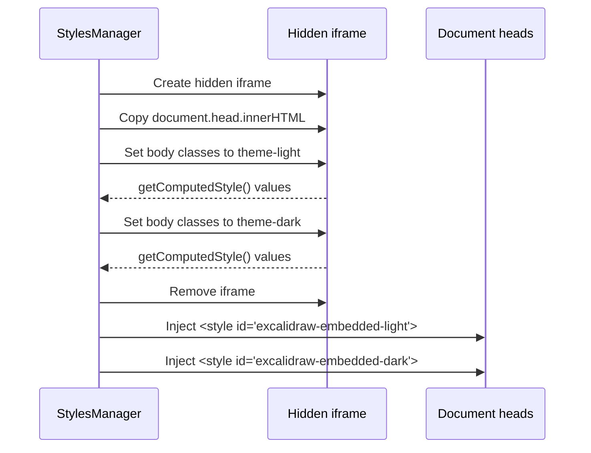
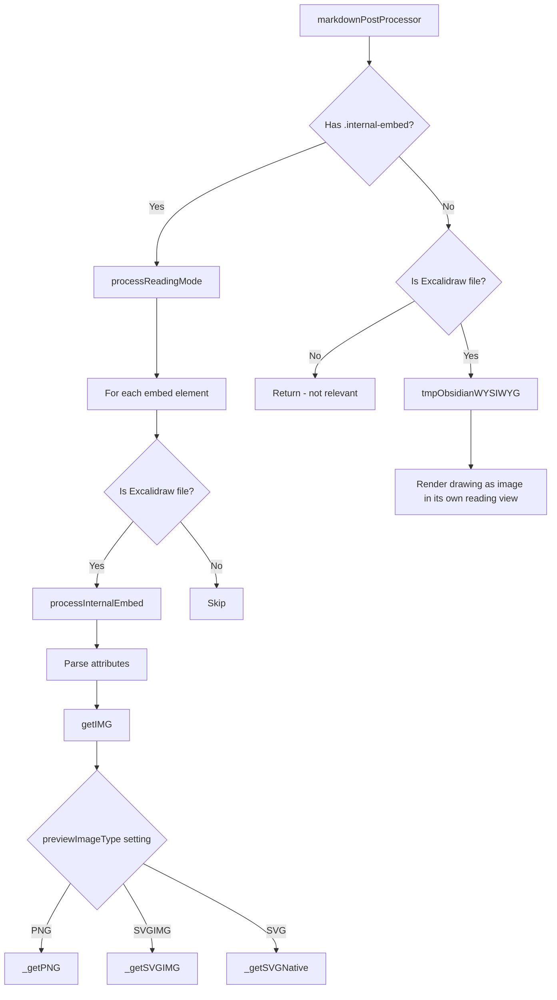
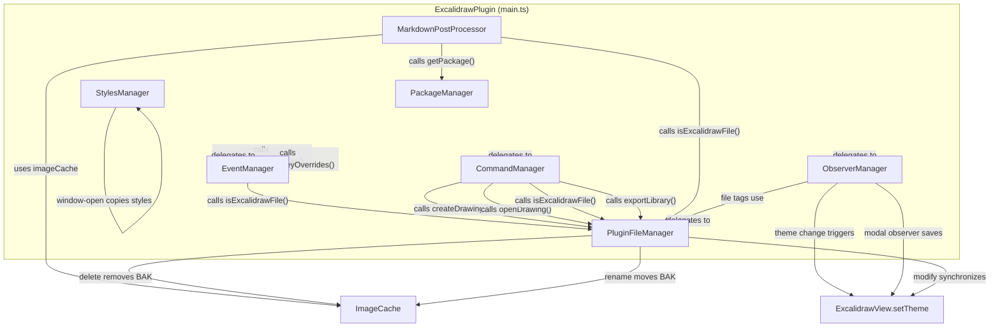

# Manager Pattern Deep Dive

This document provides an exhaustive reference for the seven manager classes that decompose the
responsibilities of `ExcalidrawPlugin`. Understanding these managers is essential to navigating the
plugin's architecture -- they are the backbone of everything from file detection to theme styling
to React package lifecycle.

---

## Table of Contents

1. [Manager Architecture Pattern](#1-manager-architecture-pattern)
2. [PackageManager](#2-packagemanager)
3. [EventManager](#3-eventmanager)
4. [FileManager (PluginFileManager)](#4-filemanager-pluginfilemanager)
5. [CommandManager](#5-commandmanager)
6. [ObserverManager](#6-observermanager)
7. [StylesManager](#7-stylesmanager)
8. [MarkdownPostProcessor](#8-markdownpostprocessor)
9. [Manager Interaction Diagram](#9-manager-interaction-diagram)
10. [Manager Lifecycle Timeline](#10-manager-lifecycle-timeline)
11. [Cross-Reference Table](#11-cross-reference-table)

---

## 1. Manager Architecture Pattern

### The Pattern

All managers in this codebase follow a consistent structural pattern designed for the Obsidian
plugin lifecycle:

```
Constructor(plugin) --> initialize() --> [runtime operations] --> destroy()
```

| Aspect | Detail |
|---|---|
| **Constructor** | Receives the `ExcalidrawPlugin` instance, stores references to `plugin` and `plugin.app` |
| **`initialize()`** | Deferred initialization that runs after the workspace is ready. Some managers call `awaitInit()` internally |
| **`destroy()`** | Cleanup: disconnects observers, clears maps, nullifies references to prevent memory leaks |
| **Settings access** | Via a getter: `get settings() { return this.plugin.settings; }` |
| **Event registration** | Via `private registerEvent(event: EventRef)` which delegates to `this.plugin.registerEvent()` |

### Where Managers Are Created

Managers are created in `onloadOnLayoutReady()` in `src/core/main.ts`. This method runs when
Obsidian fires the `onLayoutReady` event, guaranteeing the workspace DOM exists.

**File:** `src/core/main.ts:353-506`

```typescript
// src/core/main.ts:363-366 -- Manager construction
this.packageManager = new PackageManager(this);    // line 363
this.eventManager = new EventManager(this);        // line 364
this.observerManager = new ObserverManager(this);  // line 365
this.commandManager = new CommandManager(this);    // line 366
```

Two managers are constructed earlier or later:

| Manager | Construction Point | Reason |
|---|---|---|
| `PluginFileManager` | Constructor (`main.ts:169`) | Needed by `MarkdownPostProcessor` during `onLoad()` before workspace ready |
| `StylesManager` | `onloadOnLayoutReady()` (`main.ts:397`) | After monkey patches are registered |

### Initialization Order

The initialization order is critical because some managers depend on others:

```
1. fileManager        (constructed in plugin constructor, line 169)
2. packageManager     (constructed in onLayoutReady, line 363)
3. eventManager       (constructed in onLayoutReady, line 364)
4. observerManager    (constructed in onLayoutReady, line 365)
5. commandManager     (constructed in onLayoutReady, line 366)
6. observerManager.initialize()  (line 384)
7. stylesManager      (constructed in onLayoutReady, line 397)
8. [... fonts, imageCache, views initialized ...]
9. fileManager.initialize()      (line 461)
10. eventManager.initialize()    (line 462)
11. commandManager.initialize()  (line 489)
```

Notice that `fileManager.initialize()` and `eventManager.initialize()` are called **after**
Excalidraw views are switched from loading placeholders to actual views (line 429-431). This is
intentional: the file cache pre-load and event listeners run after views are alive.

### Destruction Order

In `onunload()` (`main.ts:1188-1261`), managers are destroyed:

```typescript
this.stylesManager.destroy();      // line 1208
this.observerManager.destroy();    // line 1230
this.fileManager.destroy();        // line 1243
this.packageManager.destroy();     // line 1257
this.commandManager?.destroy();    // line 1258
this.eventManager.destroy();       // line 1259
```

### Exception vs. Constructor Pattern

A notable exception: `PluginFileManager` is the only manager constructed in the plugin constructor
rather than in `onLayoutReady()`. This is because `isExcalidrawFile()` is needed by the
`MarkdownPostProcessor` which is registered in `onLoad()` (before workspace ready):

```typescript
// src/core/main.ts:168-169
// isExcalidraw function is used already by MarkdownPostProcessor
// in onLoad before onLayoutReady
this.fileManager = new PluginFileManager(this);
```

---

## 2. PackageManager

**File:** `src/core/managers/PackageManager.ts` (228 lines)

### Purpose

Manages per-window instances of React, ReactDOM, and the Excalidraw library. The Excalidraw
package is not bundled normally -- it is compressed, stored as a string literal at build time,
decompressed at runtime, and eval'd into each window context.

### Why Per-Window Packages?

Obsidian supports popout windows. Each popout has its own `Window` and `Document` object. React
manages its own internal state tied to the DOM of a specific window. If you use a React instance
from `window A` to render in `window B`, React's reconciler breaks. Therefore, each window needs
its own React + ReactDOM + ExcalidrawLib instances.

### Key Properties

```typescript
// src/core/managers/PackageManager.ts:18-21
private packageMap: Map<Window, Packages> = new Map<Window, Packages>();
private EXCALIDRAW_PACKAGE: string;
private plugin: ExcalidrawPlugin;
private fallbackPackage: Packages | null = null;
```

| Property | Type | Purpose |
|---|---|---|
| `packageMap` | `Map<Window, Packages>` | Cache of per-window package instances |
| `EXCALIDRAW_PACKAGE` | `string` | The uncompressed Excalidraw library source code (JavaScript string) |
| `fallbackPackage` | `Packages \| null` | Emergency fallback if a new window's package creation fails |

The `Packages` type (defined in `src/types/types.ts`) is:

```typescript
type Packages = {
  react: typeof React;
  reactDOM: typeof ReactDOM;
  excalidrawLib: typeof ExcalidrawLib;
}
```

### Constructor Flow

```
PackageManager(plugin)
  |
  +--> unpackExcalidraw()           // Decompress LZString-compressed package
  |    (global function injected by rollup)
  |
  +--> errorHandler.safeEval(...)   // Eval the package in the main window
  |    Creates: excalidrawLib global
  |
  +--> updateExcalidrawLib()        // Export functions from the lib
  |
  +--> validatePackage(initial)     // Verify restoreElements + exportToSvg exist
  |
  +--> setPackage(window, initial)  // Cache for main window
  +--> fallbackPackage = initial    // Store as emergency fallback
```

**File:** `src/core/managers/PackageManager.ts:23-60`

### getPackage(win: Window): Packages

The core method. Called every time a view needs access to React or Excalidraw.

```
getPackage(win)
  |
  +--> packageMap.has(win)?
  |    YES --> validatePackage() --> return cached package
  |    NO  --> eval REACT_PACKAGES + EXCALIDRAW_PACKAGE in win context
  |            |
  |            +--> safeEval(`(function() {
  |            |      ${REACT_PACKAGES + this.EXCALIDRAW_PACKAGE};
  |            |      return {react: React, reactDOM: ReactDOM,
  |            |              excalidrawLib: ExcalidrawLib};
  |            |    })()`, ..., win)
  |            |
  |            +--> validatePackage(result)
  |            +--> packageMap.set(win, result)
  |            +--> return result
  |
  +--> On error: return fallbackPackage (prevents crash)
```

**File:** `src/core/managers/PackageManager.ts:110-162`

### validatePackage(pkg: Packages): boolean

Checks that a package has all three components and that `excalidrawLib` has the two essential
methods:

```typescript
// src/core/managers/PackageManager.ts:65-81
private validatePackage(pkg: Packages): boolean {
  if (!pkg) return false;
  if (!pkg.react || !pkg.reactDOM || !pkg.excalidrawLib) return false;
  const lib = pkg.excalidrawLib;
  return (
    typeof lib === 'object' && lib !== null &&
    typeof lib.restoreElements === 'function' &&
    typeof lib.exportToSvg === 'function'
  );
}
```

### deletePackage(win: Window)

Cleans up when a popout window closes. Removes globals from the window object and clears the
React/ReactDOM key-by-key to help garbage collection:

```typescript
// src/core/managers/PackageManager.ts:164-203
// Cleans up: win.ExcalidrawLib, win.React, win.ReactDOM
// Calls excalidrawLib.destroyObsidianUtils() if available
// Deletes from packageMap
```

### destroy()

Called on plugin unload. Clears all packages, nullifies globals:

```typescript
// src/core/managers/PackageManager.ts:209-227
REACT_PACKAGES = "";
// Iterates all windows, calls deletePackage on each
this.packageMap.clear();
this.EXCALIDRAW_PACKAGE = "";
this.fallbackPackage = null;
react = null; reactDOM = null; excalidrawLib = null;
```

### Runtime Globals

These `declare` statements at the top show the build-injected globals:

```typescript
// src/core/managers/PackageManager.ts:11-15
declare let REACT_PACKAGES: string;
declare let react: typeof React;
declare let reactDOM: typeof ReactDOM;
declare let excalidrawLib: typeof ExcalidrawLib;
declare const unpackExcalidraw: Function;
```

These are NOT imported. They are created by the rollup build process which reads the node_modules
packages, compresses them with LZString, and injects them as string constants.

---

## 3. EventManager

**File:** `src/core/managers/EventManager.ts` (368 lines)

### Purpose

Centralizes all workspace and vault event handlers. This is the "nervous system" of the plugin --
it reacts to file changes, leaf switches, clipboard operations, and user interactions.

### Key Properties

```typescript
// src/core/managers/EventManager.ts:19-25
private plugin: ExcalidrawPlugin;
private app: App;
public leafChangeTimeout: number|null = null;
private removeEventListeners: (()=>void)[] = [];
private previouslyActiveLeaf: WorkspaceLeaf;
private splitViewLeafSwitchTimestamp: number = 0;
private debounceActiveLeafChangeHandlerTimer: number|null = null;
```

### registerEvents() -- All Event Registrations

Called from `initialize()` at `EventManager.ts:80-110`:

| Event | Handler | Line | Purpose |
|---|---|---|---|
| `editor-paste` | `onPasteHandler()` | 82 | Intercepts Excalidraw clipboard JSON in markdown editors |
| `vault:rename` | `onRenameHandler()` | 83 | Updates image file references when an Excalidraw file is renamed |
| `vault:modify` | `onModifyHandler()` | 84 | Reloads/synchronizes views when files change externally |
| `vault:delete` | `onDeleteHandler()` | 85 | Cleans up caches and closes views of deleted files |
| `active-leaf-change` | `onActiveLeafChangeHandler()` | 88 | Saves previous view, loads new, manages hotkey scopes |
| `layout-change` | `onLayoutChangeHandler()` | 90 | Refreshes all Excalidraw views when layout changes |
| Container `click` | `onClickSaveActiveDrawing()` | 94-98 | Saves when user clicks outside the canvas |
| `file-menu` | `onFileMenuSaveActiveDrawing()` | 99 | Saves when file menu opens |
| `metadataCache:changed` | lambda | 102-106 | Updates `fileManager.updateFileCache()` |
| `file-menu` | `onFileMenuHandler()` | 108 | Adds "Open as Excalidraw" menu item |
| `editor-menu` | `onEditorMenuHandler()` | 109 | Adds "Open as Excalidraw" to editor context menu |

### onPasteHandler (line 127-166)

When the user pastes in a markdown editor, this handler checks if the clipboard data starts with
`{"type":"excalidraw/clipboard"`. If so:

1. Parses the JSON
2. If it contains a single text element: pastes the raw text
3. If it contains a single image element: pastes a link to the image file
4. If it contains a single element with a link: pastes the link

This enables seamless copy-paste from Excalidraw to markdown.

### onActiveLeafChangeHandler (line 180-301) -- The Complex One

This is the most intricate handler in the plugin. It runs every time the user switches between
tabs/panes. Here is the annotated flow:

```
onActiveLeafChangeHandler(leaf)
  |
  +--> Debounce check (line 184-186)
  |    If debounce timer active, return immediately
  |
  +--> Unwanted leaf detection (line 190-193)
  |    Obsidian 1.8.x bug: empty leaf without parent obscures active view
  |    Fix: detach the unwanted leaf
  |
  +--> PDF leaf tracking (line 195-197)
  |    If the new leaf is a PDF view, store its ID for later
  |    (used by "Insert last active PDF page" command)
  |
  +--> Excalidraw leaf tracking (line 199-206)
  |    Track lastActiveExcalidrawLeafID
  |
  +--> leafChangeTimeout (line 208-211)
  |    Set a 1-second timeout flag used by other parts of the plugin
  |
  +--> Font size override (line 213-217)
  |    Reset document font size when entering Excalidraw view
  |
  +--> Previous view save (line 219-255)
  |    If previously active Excalidraw view is dirty:
  |      Save it (with transclusion updates)
  |    Trigger embed updates for previous view's file
  |
  +--> Split view detection (line 226-230)
  |    Detect when user switches between markdown and Excalidraw
  |    views of the same file (split view editing)
  |
  +--> New view file refresh (line 257-278)
  |    After 2s timeout, reload embedded files in new Excalidraw view
  |
  +--> Canvas color hook (line 281-291)
  |    If ea.onCanvasColorChangeHook is set, fire it
  |
  +--> Hotkey scope management (line 293-300)
  |    Pop previous scope, register new hotkey overrides
  |    for the active Excalidraw view
```

### onClickSaveActiveDrawing (line 304-314)

Saves the active drawing when the user clicks **outside** the Excalidraw canvas. It checks:
- Is there an active Excalidraw view?
- Is it dirty (unsaved changes)?
- Is the click target NOT the canvas or its wrapper?

If all conditions met, saves the view.

### onLayoutChangeHandler (line 121-125)

Simple but important: when Obsidian's layout changes, refresh all Excalidraw views. This handles
scenarios like pane resizing, tab reordering, and sidebar toggling.

```typescript
// src/core/managers/EventManager.ts:121-125
private onLayoutChangeHandler() {
  if (this.app.workspace.layoutReady) {
    getExcalidrawViews(this.app).forEach(
      excalidrawView => !!excalidrawView?.refresh && excalidrawView.refresh()
    );
  }
}
```

### onFileMenuHandler (line 327-347)

Adds "Open as Excalidraw" to the file menu when viewing an Excalidraw file as markdown:

```typescript
// Only shown when:
// 1. The leaf has a MarkdownView
// 2. The file has excalidraw-plugin frontmatter
menu.addItem(item => {
  item.setTitle(t("OPEN_AS_EXCALIDRAW"))
      .setIcon(ICON_NAME)
      .setSection("pane")
      .onClick(async () => {
        await view.save();
        this.plugin.excalidrawFileModes[leaf.id || file.path] = VIEW_TYPE_EXCALIDRAW;
        setExcalidrawView(leaf);
      })
});
```

### Debouncing

The `setDebounceActiveLeafChangeHandler()` method (line 112-119) sets a 50ms debounce timer.
During this window, `onActiveLeafChangeHandler` returns immediately. This prevents rapid
consecutive leaf changes from causing multiple saves/reloads.

---

## 4. FileManager (PluginFileManager)

**File:** `src/core/managers/FileManager.ts` (618 lines)

### Purpose

Handles all file-related operations: detecting Excalidraw files, creating drawings, managing the
file cache, and responding to file system events (rename, modify, delete).

### Key Property: excalidrawFiles

```typescript
// src/core/managers/FileManager.ts:19
private excalidrawFiles: Set<TFile> = new Set<TFile>();
```

**Why maintain an independent set?** When Obsidian deletes a file, its metadata cache entry is
removed immediately. The `onDelete` handler cannot check frontmatter to determine if the deleted
file was an Excalidraw file. By maintaining its own set, the plugin can reliably identify deleted
Excalidraw files.

### isExcalidrawFile(f: TFile): boolean

The central file-type detection method, used throughout the entire plugin:

```typescript
// src/core/managers/FileManager.ts:47-54
public isExcalidrawFile(f: TFile): boolean {
  if (!f) return false;
  if (f.extension === "excalidraw") return true;       // Legacy extension
  const fileCache = f ? this.plugin.app.metadataCache.getFileCache(f) : null;
  return !!fileCache?.frontmatter &&
    !!fileCache.frontmatter[FRONTMATTER_KEYS["plugin"].name]; // "excalidraw-plugin"
}
```

A file is Excalidraw if:
1. Its extension is `.excalidraw` (legacy format), OR
2. It has `excalidraw-plugin` in its frontmatter (modern `.md` format)

### initialize() -- Building the File Cache

```typescript
// src/core/managers/FileManager.ts:30-45
public async initialize() {
  await this.plugin.awaitInit();
  const metaCache = this.app.metadataCache;
  metaCache.getCachedFiles().forEach((filename: string) => {
    const fm = metaCache.getCache(filename)?.frontmatter;
    if (
      (fm && typeof fm[FRONTMATTER_KEYS["plugin"].name] !== "undefined") ||
      filename.match(/\.excalidraw$/)
    ) {
      this.updateFileCache(
        this.app.vault.getAbstractFileByPath(filename) as TFile, fm
      );
    }
  });
}
```

This scans every cached file in the vault and adds Excalidraw files to the set. It runs after
views are initialized (line 461 in main.ts).

### updateFileCache (line 58-72)

Maintains the `excalidrawFiles` set:

```typescript
public updateFileCache(file: TFile, frontmatter?: FrontMatterCache, deleted: boolean = false) {
  if (frontmatter && typeof frontmatter[FRONTMATTER_KEYS["plugin"].name] !== "undefined") {
    this.excalidrawFiles.add(file);
    return;
  }
  if (!deleted && file.extension === "excalidraw") {
    this.excalidrawFiles.add(file);
    return;
  }
  this.excalidrawFiles.delete(file);
}
```

### createDrawing (line 82-108)

Creates a new Excalidraw drawing file:

1. Normalizes the folder path
2. Creates the folder if needed
3. Generates a unique filename
4. Creates the file with blank drawing or template content
5. **Waits for metadata cache** -- polls up to 10 times (50ms each) until Obsidian indexes the
   frontmatter and the file is recognized as Excalidraw

```typescript
// src/core/managers/FileManager.ts:98-101
let counter = 0;
while (file instanceof TFile && !this.isExcalidrawFile(file) && counter++ < 10) {
  await sleep(50);
}
```

### getBlankDrawing (line 110-141)

Returns a blank drawing, optionally from a template:

1. Checks if templates are configured
2. If templates exist, prompts the user to select one
3. If theme matching is enabled, adjusts the drawing theme
4. For `.md` mode: wraps drawing in frontmatter + markdown drawing section

### Event Handlers

#### renameEventHandler (line 407-454)

When an Excalidraw file is renamed:
1. Moves the BAK (backup) entry in ImageCache
2. If `keepInSync` is enabled: renames corresponding `.svg`, `.png`, `.excalidraw` export files
3. Respects `onImageExportPathHook` for custom export paths

#### modifyEventHandler (line 456-525)

When an Excalidraw file is modified externally:
1. Finds all open ExcalidrawView instances for this file
2. **Staleness check**: If user has not interacted for 5+ minutes, does a full reload
3. **Split view detection**: Avoids unwanted reloads when user is editing the markdown side
4. For `.md` files: creates a temporary `ExcalidrawData`, loads and synchronizes
5. For `.excalidraw` files: does a full reload

#### deleteEventHandler (line 560-616)

When an Excalidraw file is deleted:
1. Removes from `excalidrawFiles` set
2. Closes any open ExcalidrawView for this file
3. Removes BAK from ImageCache
4. If `keepInSync`: deletes corresponding export files (after 500ms delay)

### openDrawing (line 305-357)

Opens a drawing file in the appropriate pane:
- Handles all `PaneTarget` types: `active-pane`, `new-pane`, `new-tab`, `popout-window`, `md-properties`
- Fires `ea.onFileCreateHook` if the file was just created

---

## 5. CommandManager

**File:** `src/core/managers/CommandManager.ts` (1885 lines)

### Purpose

Registers all command palette commands, dialog instances, and file menu handlers. This is the
largest manager by line count.

### Key Properties

```typescript
// src/core/managers/CommandManager.ts:82-89
private openDialog: OpenFileDialog;
public insertLinkDialog: InsertLinkDialog;
public insertCommandDialog: InsertCommandDialog;
public insertImageDialog: InsertImageDialog;
public importSVGDialog: ImportSVGDialog;
public insertMDDialog: InsertMDDialog;
public taskbone: Taskbone;
public forceSaveCommand: Command;
```

All dialog instances are created once and reused. This avoids the overhead of constructing dialog
objects every time a command is invoked.

### initialize() (line 108-117)

```typescript
public initialize() {
  try {
    this.taskbone = new Taskbone(this.plugin);
    this.registerCommands();
  } catch (e) {
    new Notice("Error registering commands", 6000);
  }
  this.plugin.logStartupEvent("Commands registered");
}
```

### registerCommands() -- Command Catalog

The `registerCommands()` method (line 147-1884) registers approximately 40+ commands. Here is a
categorized summary:

#### Drawing Creation Commands

| Command ID | Name Key | Target |
|---|---|---|
| `excalidraw-autocreate` | `NEW_IN_NEW_PANE` | New pane |
| `excalidraw-autocreate-newtab` | `NEW_IN_NEW_TAB` | New tab |
| `excalidraw-autocreate-on-current` | `NEW_IN_ACTIVE_PANE` | Active pane |
| `excalidraw-autocreate-popout` | `NEW_IN_POPOUT_WINDOW` | Popout (desktop only) |
| `excalidraw-autocreate-and-embed` | `NEW_IN_NEW_PANE_EMBED` | Create + embed in markdown |
| `excalidraw-autocreate-and-embed-new-tab` | `NEW_IN_NEW_TAB_EMBED` | Create + embed |
| `excalidraw-autocreate-and-embed-on-current` | `NEW_IN_ACTIVE_PANE_EMBED` | Create + embed |
| `excalidraw-autocreate-and-embed-popout` | `NEW_IN_POPOUT_WINDOW_EMBED` | Create + embed |

#### View Mode Commands

| Command ID | Name Key | Purpose |
|---|---|---|
| `toggle-excalidraw-view` | `TOGGLE_MODE` | Switch between Excalidraw and Markdown view |
| `toggle-lock` | `TOGGLE_LOCK` | Toggle parsed/raw text mode |
| `convert-to-excalidraw` | `CONVERT_NOTE_TO_EXCALIDRAW` | Convert plain MD to Excalidraw |
| `convert-excalidraw` | `CONVERT_EXCALIDRAW` | Batch convert `.excalidraw` to `.md` |

#### Element Manipulation Commands

| Command ID | Purpose |
|---|---|
| `insert-link` | Insert an internal link (Mod+Shift+K) |
| `insert-command` | Insert an Obsidian command reference |
| `insert-image` | Insert an image file |
| `insert-md` | Insert a markdown file as embedded |
| `insert-pdf` | Insert a PDF file |
| `insert-LaTeX-symbol` | Insert a LaTeX equation |
| `import-svg` | Import SVG as native elements |
| `universal-add-file` | Universal file inserter |
| `universal-card` | Insert back-of-the-note card |

#### Image Operations

| Command ID | Purpose |
|---|---|
| `crop-image` | Crop an image or PDF page |
| `annotate-image` | Annotate an image (creates new drawing with image as background) |
| `flip-image` | Open embedded Excalidraw drawing for editing |
| `duplicate-image` | Duplicate an image element |
| `reset-image-to-100` | Reset image to original size |
| `reset-image-ar` | Reset image aspect ratio |
| `delete-file` | Delete the file behind a selected image element |
| `convert-text2MD` | Convert text element to embedded markdown |

#### Export and Utility Commands

| Command ID | Purpose |
|---|---|
| `export-image` | Open the export dialog |
| `save` | Force save (Ctrl+S) |
| `fullscreen` | Toggle fullscreen |
| `search-text` | Search text in drawing |
| `run-ocr` / `rerun-ocr` | OCR via Taskbone |
| `excalidraw-unzip-file` | Decompress a compressed Excalidraw file |

### File Menu Handlers

The CommandManager registers two file menu handlers:

1. **"Create new drawing"** (line 169-181): Added to folder context menus
2. **"Convert .excalidraw"** (line 183-215): Added to `.excalidraw` file context menus

### Taskbone Integration

`Taskbone` (line 88, 110) is an OCR service integration. It is initialized during
`CommandManager.initialize()` and provides text recognition for drawings.

### Force Save Command

The force save command (line 788-793) has a special hotkey `Ctrl+S` and is checked in
`registerHotkeyOverrides()` to ensure it works even when Excalidraw has focus:

```typescript
this.forceSaveCommand = this.addCommand({
  id: "save",
  hotkeys: [{modifiers: ["Ctrl"], key: "s"}],
  name: t("FORCE_SAVE"),
  checkCallback: (checking) => this.plugin.forceSaveActiveView(checking),
});
```

---

## 6. ObserverManager

**File:** `src/core/managers/ObserverManager.ts` (329 lines)

### Purpose

Manages all `MutationObserver` instances that watch the DOM for changes relevant to the plugin.

### Observer Inventory

| Observer | Target | What It Watches | When Active |
|---|---|---|---|
| `themeObserver` | `document.body` | Class attribute changes (`theme-dark`/`theme-light`) | When `matchThemeTrigger` setting is on |
| `fileExplorerObserver` | `.nav-files-container` | Child node additions in file explorer | When `experimentalFileType` setting is on |
| `modalContainerObserver` | `document.body` (or popout doc) | Child additions (modals opening) | When an Excalidraw view is active |
| `workspaceDrawerLeftObserver` | `.workspace-drawer.mod-left` | Style attribute changes | Mobile only |
| `workspaceDrawerRightObserver` | `.workspace-drawer.mod-right` | Style attribute changes | Mobile only |

### themeObserver (line 64-100)

Watches `document.body` for class changes. When the theme toggles between `theme-dark` and
`theme-light`:

```typescript
// src/core/managers/ObserverManager.ts:69-90
const themeObserverFn: MutationCallback = async (mutations) => {
  const bodyClassList = document.body.classList;
  const mutation = mutations[0];
  if (mutation?.oldValue === bodyClassList.value) return;

  const darkClass = bodyClassList.contains('theme-dark');
  if (mutation?.oldValue?.includes('theme-dark') === darkClass) return;

  setTimeout(() => {
    const theme = isObsidianThemeDark() ? "dark" : "light";
    const excalidrawViews = getExcalidrawViews(this.app);
    excalidrawViews.forEach(excalidrawView => {
      if (excalidrawView.file && excalidrawView.excalidrawAPI) {
        excalidrawView.setTheme(theme);
      }
    });
  });
};
```

The observer uses `attributeOldValue: true` and `attributeFilter: ["class"]` to efficiently
detect only class changes on the body element.

### fileExplorerObserver -- experimentalFileTypeDisplay (line 108-222)

Shows a configurable tag (e.g., ".excalidraw") next to Excalidraw files in the file explorer.

**How it works:**

1. Queries all `.nav-file-title` elements in `.nav-files-container`
2. For each, checks if the `data-path` attribute points to an Excalidraw file
3. If yes, inserts a `<div class="nav-file-tag excalidraw-filetype-tag">` after the first child

```typescript
// src/core/managers/ObserverManager.ts:127-148
const insertFiletype = (el: HTMLElement) => {
  if (!el || el.querySelector(`.${tagClassName}`)) return;
  const filename = el.getAttribute("data-path");
  const f = this.app.vault.getAbstractFileByPath(filename);
  if (f instanceof TFile && this.plugin.isExcalidrawFile(f)) {
    el.insertAfter(
      createDiv({
        cls: ["nav-file-tag", tagClassName],
        text: this.settings.experimentalFileTag,
      }),
      el.firstChild,
    );
  }
};
```

The observer watches for both `childList` (new files appearing) and `attributes` (folder
expand/collapse) mutations.

**Mobile handling** (line 199-221): On mobile, the file explorer may not exist in the DOM yet.
A temporary `MutationObserver` waits for `.nav-files-container` to appear, then attaches the
real observer.

### modalContainerObserver (line 228-269)

Saves the active Excalidraw view when a modal (settings, command palette, etc.) opens:

```typescript
// src/core/managers/ObserverManager.ts:237-253
const modalContainerObserverFn: MutationCallback = async (m) => {
  const view = this.plugin.activeExcalidrawView;
  if (
    (m.length !== 1) || (m[0].type !== "childList") ||
    (m[0].addedNodes.length !== 1) || (!view) ||
    view.semaphores?.viewunload || (!view.isDirty())
  ) return;

  const { errorMessage } = view.excalidrawAPI.getAppState();
  if (!errorMessage) this.plugin.activeExcalidrawView.save();
};
```

The observer is document-specific -- it tracks `activeViewDoc` and re-attaches when the active
view moves to a different document (popout window).

### workspaceDrawerObserver (line 271-328)

Mobile-only. Watches the sidebar drawers for open/close transitions:

- **Drawer closing** (`display: none`): Refreshes the active Excalidraw view (fixes pointer
  offset after CSS transitions)
- **Drawer opening** (from `display: none`): Saves the active view if dirty

### Debug Mode

All observers check the `DEBUGGING` flag and use `CustomMutationObserver` when debugging is
enabled. `CustomMutationObserver` (from `src/utils/debugHelper.ts`) wraps the standard
`MutationObserver` and logs execution time for each callback.

---

## 7. StylesManager

**File:** `src/core/managers/StylesManager.ts` (166 lines)

### Purpose

Ensures that embeddable content inside Excalidraw (markdown embeds, PDFs, etc.) correctly inherits
Obsidian's theme colors. Without this, embedded content would not match the user's chosen theme.

### CSS Variables Harvested

The manager extracts these CSS custom properties from Obsidian's computed styles:

```typescript
// src/core/managers/StylesManager.ts:8-31
const STYLE_VARIABLES = [
  "--background-modifier-cover",
  "--background-primary-alt",
  "--background-secondary",
  "--background-secondary-alt",
  "--background-modifier-border",
  "--text-normal",
  "--text-muted",
  "--text-accent",
  "--text-accent-hover",
  "--text-faint",
  "--text-highlight-bg",
  "--text-highlight-bg-active",
  "--text-selection",
  "--interactive-normal",
  "--interactive-hover",
  "--interactive-accent",
  "--interactive-accent-hover",
  "--scrollbar-bg",
  "--scrollbar-thumb-bg",
  "--scrollbar-active-thumb-bg",
  "--tab-container-background",
  "--titlebar-background-focused",
];
```

### How It Works



### harvestStyles() (line 82-134)

The core method:

1. Creates a hidden `<iframe>` (line 89-91)
2. Copies `document.head.innerHTML` into the iframe's `<head>` (line 100)
3. Copies body `style` and `class` attributes
4. Switches the iframe body to `theme-light`, reads all CSS variables
5. Switches to `theme-dark`, reads again
6. **Special handling for `--background-primary`**: Sets alpha to 0.9 for slight transparency
7. Removes the iframe
8. Stores results in `styleLight` and `styleDark` strings

```typescript
// src/core/managers/StylesManager.ts:115-127
const getCSSVariables = (): string => {
  const computedStyles = iframeWin.getComputedStyle(iframeBody);
  const allVariables: {[key:string]:string} = {};
  for (const variable of STYLE_VARIABLES) {
    allVariables[variable] = computedStyles.getPropertyValue(variable);
  }
  const cm = this.plugin.ea.getCM(
    computedStyles.getPropertyValue("--background-primary")
  );
  cm.alphaTo(0.9);
  allVariables["--background-primary"] = cm.stringHEX();
  return Object.entries(allVariables)
    .map(([key, value]) => `${key}: ${value} !important;`)
    .join(" ");
};
```

### copyPropertiesToTheme(doc: Document) (line 136-156)

Injects (or updates) two `<style>` elements into each document head:

```html
<style id="excalidraw-embedded-light">
  .excalidraw__embeddable__outer .theme-light {
    --background-primary: #ffffff !important;
    --text-normal: #2e3338 !important;
    /* ... all variables ... */
  }
</style>
<style id="excalidraw-embedded-dark">
  .excalidraw__embeddable__outer .theme-dark {
    --background-primary: #1e1e1eE6 !important;
    --text-normal: #dcddde !important;
    /* ... all variables ... */
  }
</style>
```

### Event Listeners

The constructor registers three workspace events:

| Event | Action |
|---|---|
| `css-change` | Re-harvest styles, update all document heads |
| `window-open` | Track the new window's document, copy styles |
| `window-close` | Remove the window's document from the styles map |

### REM_VALUE

An exported variable updated during `harvestStyles()`:

```typescript
// src/core/managers/StylesManager.ts:6,83-86
export let REM_VALUE = 16;
// In harvestStyles():
REM_VALUE = parseInt(
  window.getComputedStyle(document.body).getPropertyValue('--font-text-size').trim()
);
```

This is used elsewhere in the plugin for size calculations.

---

## 8. MarkdownPostProcessor

**File:** `src/core/managers/MarkdownPostProcessor.ts` (1099 lines)

### Purpose

Renders Excalidraw file embeds as images when viewing markdown in reading mode. When Obsidian
encounters `![[drawing.excalidraw]]` in a markdown file, the post-processor replaces the raw
embed with a generated SVG or PNG preview.

### Initialization

```typescript
// src/core/managers/MarkdownPostProcessor.ts:66-71
export const initializeMarkdownPostProcessor = (p: ExcalidrawPlugin) => {
  plugin = p;
  app = plugin.app;
  vault = app.vault;
  metadataCache = app.metadataCache;
};
```

Called from `addMarkdownPostProcessor()` in `main.ts:879`. Note the module-level variables --
this is not a class but a set of exported functions with module-scoped state.

### markdownPostProcessor (the entry point, line 936-999)

The registered post-processor function. It determines what type of content is being processed:

```
markdownPostProcessor(el, ctx)
  |
  +--> Is printing? (line 941)
  +--> Is frontmatter div? (line 943-945)
  +--> Is reading mode? Is hover popover? (line 962-964)
  |
  +--> Has .internal-embed children?
  |    YES --> processReadingMode(embeddedItems, ctx)
  |    NO  --> tmpObsidianWYSIWYG(el, ctx, ...)
  |
  +--> Is the file itself an Excalidraw file in reading mode?
       YES --> Hide raw content, show rendered image
```

### Processing Flow



### Image Generation: Three Modes

The plugin supports three preview image types, configured in settings:

| Mode | Function | Output | Performance |
|---|---|---|---|
| `PNG` | `_getPNG()` line 73-151 | `` from PNG blob | Slower, scales based on width |
| `SVGIMG` | `_getSVGIMG()` line 183-249 | `` from SVG blob | Good balance |
| `SVG` (native) | `_getSVGNative()` line 251-315 | `<div>` containing `<svg>` element | Best quality, largest DOM |

### Cache Integration

All three rendering functions check the image cache before rendering:

```typescript
// Example from _getSVGIMG, line 203-209
if (cacheReady) {
  const src = await imageCache.getImageFromCache(cacheKey);
  if (src && typeof src === "string") {
    img.setAttribute("src", src);
    return img;
  }
}
```

Cache keys include: `filepath`, `blockref`, `sectionref`, `isDark`, `previewImageType`, `scale`,
`isTransparent`, `inlineFonts`.

### Quick Image Preview

Before doing a full render, the functions check for a "quick preview" -- a pre-exported SVG or
PNG file that exists alongside the Excalidraw file:

```typescript
// line 114-116
const quickPNG = !(filenameParts.hasGroupref || filenameParts.hasFrameref)
  ? await getQuickImagePreview(plugin, file.path, "png")
  : undefined;
```

### Embed Attributes

When processing `![[drawing|alias]]`, the post-processor parses the alias for:

| Syntax | Meaning |
|---|---|
| `![[drawing\|400]]` | Width = 400px |
| `![[drawing\|400x300]]` | Width = 400px, Height = 300px |
| `![[drawing\|x300]]` | Height only = 300px |
| `![[drawing\|mycss]]` | Apply CSS class `excalidraw-svg-mycss` |
| `![[drawing\|name\|400\|mycss]]` | Alias, width, and style |

### Event Handling on Generated Images

Each generated image element has event listeners for:
- **`pointerdown` + timeout**: Long-press to open (configurable desktop/mobile timeout)
- **`dblclick`**: Double-click to open
- **`RERENDER_EVENT`**: Re-renders the image when the source file changes

### legacyExcalidrawPopoverObserver (line 1016-1097)

Handles hover previews for legacy `.excalidraw` files. It watches `document.body` for new
popover elements and replaces their content with a rendered preview.

### Theme Awareness

Previews can be theme-aware:
- If `previewMatchObsidianTheme` is true: renders dark preview in dark mode, light in light
- If `exportWithTheme` is true: uses the theme stored in the drawing
- Per-file override via `excalidraw-export-dark` frontmatter

---

## 9. Manager Interaction Diagram



### Key Interaction Patterns

1. **EventManager -> FileManager**: `onRenameHandler`, `onModifyHandler`, `onDeleteHandler` all
   delegate to `PluginFileManager` via the plugin instance

2. **CommandManager -> FileManager**: All drawing creation commands flow through
   `plugin.createDrawing()` which calls `fileManager.createDrawing()`

3. **MarkdownPostProcessor -> PackageManager**: SVG/PNG rendering requires the Excalidraw
   library (via `createSVG()`/`createPNG()`) which internally uses packages

4. **ObserverManager -> StylesManager**: Theme changes detected by `themeObserver` cause view
   theme updates; `StylesManager` listens to `css-change` independently

5. **FileManager -> ImageCache**: Delete and rename events update the BAK (backup) cache entries

---

## 10. Manager Lifecycle Timeline

```mermaid
gantt
    title Plugin Startup Timeline
    dateFormat X
    axisFormat %s

    section Construction
    Plugin constructor          :a1, 0, 1
    FileManager constructor     :a2, 0, 1

    section onLoad
    Register views              :b1, 1, 2
    Load settings               :b2, 2, 3
    Init EA                     :b3, 3, 4
    Add PostProcessor           :b4, 4, 5

    section onLayoutReady
    PackageManager constructor  :c1, 6, 7
    EventManager constructor    :c2, 7, 8
    ObserverManager constructor :c3, 8, 9
    CommandManager constructor  :c4, 9, 10
    ObserverManager.initialize  :c5, 10, 11
    Monkey patches              :c6, 11, 12
    StylesManager constructor   :c7, 12, 13
    Font initialization         :c8, 13, 14
    ImageCache init             :c9, 14, 15
    Switch views to Excalidraw  :c10, 15, 16
    FileManager.initialize      :c11, 16, 17
    EventManager.initialize     :c12, 17, 18
    CommandManager.initialize   :c13, 18, 19
    EditorHandler setup         :c14, 19, 20
```



---

## 11. Cross-Reference Table

| Manager | Source File | Lines | Key Methods | Dependencies |
|---|---|---|---|---|
| PackageManager | `src/core/managers/PackageManager.ts` | 228 | `getPackage()`, `deletePackage()`, `validatePackage()` | Build-time globals |
| EventManager | `src/core/managers/EventManager.ts` | 368 | `registerEvents()`, `onActiveLeafChangeHandler()` | FileManager (via plugin), ExcalidrawView |
| PluginFileManager | `src/core/managers/FileManager.ts` | 618 | `isExcalidrawFile()`, `createDrawing()`, `updateFileCache()` | ImageCache, ExcalidrawData |
| CommandManager | `src/core/managers/CommandManager.ts` | 1885 | `registerCommands()`, `initialize()` | FileManager, ExcalidrawAutomate, many Dialogs |
| ObserverManager | `src/core/managers/ObserverManager.ts` | 329 | `addThemeObserver()`, `experimentalFileTypeDisplayToggle()` | ExcalidrawView, FileManager |
| StylesManager | `src/core/managers/StylesManager.ts` | 166 | `harvestStyles()`, `copyPropertiesToTheme()` | ExcalidrawAutomate (for color math) |
| MarkdownPostProcessor | `src/core/managers/MarkdownPostProcessor.ts` | 1099 | `markdownPostProcessor()`, `getIMG()` | EmbeddedFilesLoader, ImageCache, PackageManager |
