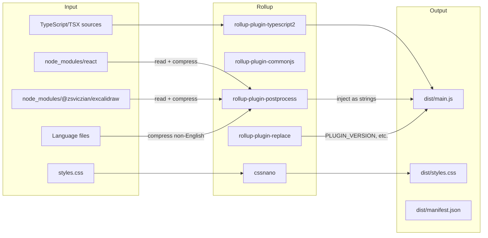

# Conventions & Workflow -- Contributing Guide

This document covers everything you need to know to set up a development environment, understand
the code conventions, avoid common pitfalls, and submit clean contributions to the
obsidian-excalidraw-plugin codebase.

---

## Table of Contents

1. [Development Setup](#1-development-setup)
2. [Code Conventions](#2-code-conventions)
3. [ESLint and Prettier](#3-eslint-and-prettier)
4. [Circular Dependency Prevention](#4-circular-dependency-prevention)
5. [File Organization Rules](#5-file-organization-rules)
6. [Testing Approach](#6-testing-approach)
7. [Common Gotchas](#7-common-gotchas)
8. [PR Guidelines](#8-pr-guidelines)
9. [Build System Deep Dive](#9-build-system-deep-dive)
10. [Debugging Techniques](#10-debugging-techniques)
11. [Quick Reference Card](#11-quick-reference-card)

---

## 1. Development Setup

### Prerequisites

- **Node.js** 18+ (the project uses ES2022 features)
- **npm** (ships with Node.js)
- An Obsidian vault for testing
- Git

### Step-by-Step Setup

```bash
# 1. Clone the repository
git clone https://github.com/zsviczian/obsidian-excalidraw-plugin.git
cd obsidian-excalidraw-plugin

# 2. Install dependencies
npm install

# 3. Build MathjaxToSVG (required before first build)
npm run build:mathjax

# 4. Development build (with inline sourcemaps, unminified)
npm run dev

# 5. OR full development build (MathjaxToSVG + main)
npm run dev:all
```

### Installing in Your Vault

After `npm run dev`, the output is in `dist/`:

```
dist/
  main.js       # The plugin bundle
  styles.css    # Merged CSS
  manifest.json # Plugin manifest
```

Copy these three files to:

```
<your-vault>/.obsidian/plugins/obsidian-excalidraw-plugin/
```

Or create a symbolic link for faster iteration:

```bash
# On Windows (PowerShell, run as admin):
New-Item -ItemType SymbolicLink `
  -Path "C:\path\to\vault\.obsidian\plugins\obsidian-excalidraw-plugin" `
  -Target "C:\path\to\obsidian-excalidraw-plugin\dist"

# On macOS/Linux:
ln -s /path/to/obsidian-excalidraw-plugin/dist \
  /path/to/vault/.obsidian/plugins/obsidian-excalidraw-plugin
```

### Available NPM Scripts

From `package.json:10-21`:

| Script | Command | Purpose |
|---|---|---|
| `npm run dev` | `cross-env NODE_ENV=development rollup --config` | Dev build (unminified, inline sourcemaps) |
| `npm run build` | `cross-env NODE_ENV=production rollup --config` | Production build (minified, no sourcemaps) |
| `npm run build:mathjax` | `cd MathjaxToSVG && npm run build` | Build the LaTeX sub-package |
| `npm run build:all` | `build:mathjax && build` | Full production build |
| `npm run dev:all` | `dev:mathjax && dev` | Full dev build |
| `npm run lib` | `cross-env NODE_ENV=lib rollup --config` | Build ExcalidrawAutomate library export |
| `npm run code:fix` | `eslint --max-warnings=0 --ext .ts,.tsx ./src --fix` | ESLint auto-fix |
| `npm run madge` | `madge --circular .` | Check for circular dependencies |

### Rebuilding After Changes

- **Changed TypeScript/TSX in `src/`**: Run `npm run dev` again
- **Changed LaTeX code in `MathjaxToSVG/`**: Run `npm run dev:all`
- **Changed only CSS**: Still need `npm run dev` (CSS is processed by rollup)

### Hot Reload

The project does not have a watch mode built in. You can use a file watcher:

```bash
# Using nodemon (install globally: npm i -g nodemon)
nodemon --watch src --ext ts,tsx,css --exec "npm run dev"
```

After rebuilding, reload the plugin in Obsidian:
- Open Command Palette > "Reload app without saving" (Ctrl+R / Cmd+R)
- Or: Settings > Community Plugins > Disable then re-enable Excalidraw

---

## 2. Code Conventions

### Import Paths

The project uses `baseUrl: "."` in `tsconfig.json:4`, which allows imports starting with `src/`:

```typescript
// CORRECT: Use src/ prefix for cross-module imports
import { ExcalidrawAutomate } from "src/shared/ExcalidrawAutomate";
import { DEVICE } from "src/constants/constants";
import { debug } from "src/utils/debugHelper";

// ALSO CORRECT: Relative imports within the same directory tree
import { ExcalidrawData } from "../../shared/ExcalidrawData";
```

**File:** `tsconfig.json:4`
```json
{
  "compilerOptions": {
    "baseUrl": ".",
    ...
  }
}
```

Both `src/` prefix and relative imports are used in the codebase. Within manager files, you will
see both patterns. There is no strict rule, but `src/` prefix is more common for cross-directory
imports.

### Internationalization (i18n)

All user-facing strings must use the `t()` function:

```typescript
import { t } from "../lang/helpers";

// Usage:
new Notice(t("FONTS_LOAD_ERROR") + path, 6000);
this.addCommand({
  id: "excalidraw-open",
  name: t("OPEN_EXISTING_NEW_PANE"),
  ...
});
```

**Source of truth:** `src/lang/locale/en.ts`

To add a new string:
1. Add the key to `src/lang/locale/en.ts`
2. Add translations to other locales: `ru.ts`, `zh-cn.ts`, `zh-tw.ts`, `es.ts`
3. Non-English locales are compressed with LZString at build time

The key naming convention uses SCREAMING_SNAKE_CASE:
```typescript
// src/lang/locale/en.ts (example entries)
"CREATE_NEW": "Create a new drawing",
"OPEN_EXISTING_NEW_PANE": "Open an existing drawing - IN A NEW PANE",
"TOGGLE_MODE": "Toggle between Excalidraw and Markdown mode",
```

### TSX Usage

TSX (React components) is ONLY used in two locations:
- `src/view/components/` -- React components rendered inside the Excalidraw canvas
- `src/constants/actionIcons.tsx` -- SVG icon definitions as React elements

Do not create TSX files elsewhere. The rest of the codebase is pure TypeScript.

### Platform Detection

Use the `DEVICE` global for platform-specific logic:

```typescript
import { DEVICE } from "src/constants/constants";

// DEVICE is of type DeviceType:
interface DeviceType {
  isMobile: boolean;
  isDesktop: boolean;
  isIOS: boolean;
  isAndroid: boolean;
  isTablet: boolean;
  // ... more properties
}

// Usage:
if (DEVICE.isMobile) {
  // Mobile-specific behavior
}
if (!DEVICE.isDesktop) {
  return false; // Desktop-only command
}
```

### Debug Logging

```typescript
import { debug, DEBUGGING } from "src/utils/debugHelper";

// Pattern used throughout the codebase:
(process.env.NODE_ENV === 'development') && DEBUGGING && debug(
  this.someMethod,
  `ClassName.someMethod`,
  arg1, arg2
);
```

The `process.env.NODE_ENV === 'development'` check is stripped in production builds by rollup's
replace plugin. The `DEBUGGING` flag is a runtime toggle controlled by `settings.isDebugMode`.

**File:** `src/utils/debugHelper.ts:3-7`
```typescript
export function setDebugging(value: boolean) {
  DEBUGGING = (process.env.NODE_ENV === 'development') ? value : false;
}
export let DEBUGGING = false;
```

### Runtime Globals -- CRITICAL

The following variables exist at runtime but are NOT importable:

```typescript
// These are injected by the rollup build process
declare const PLUGIN_VERSION: string;        // Plugin version from manifest.json
declare const INITIAL_TIMESTAMP: number;     // Build timestamp
declare let REACT_PACKAGES: string;          // Compressed React + ReactDOM source
declare let react: typeof React;             // React instance (eval'd from REACT_PACKAGES)
declare let reactDOM: typeof ReactDOM;       // ReactDOM instance
declare let excalidrawLib: typeof ExcalidrawLib; // Excalidraw library
declare const unpackExcalidraw: Function;    // Decompresses the Excalidraw package
declare const loadMathjaxToSVG: Function;    // Loads the MathJax sub-package
```

**File:** `src/core/main.ts:102-103` and `src/core/managers/PackageManager.ts:11-15`

### Settings Access Pattern

Managers access settings through a getter, not direct reference:

```typescript
// In a manager class:
get settings() {
  return this.plugin.settings;
}

// Usage:
if (this.settings.keepInSync) { ... }
```

This ensures settings are always current (they can be reloaded at runtime).

### Type Declarations

Type definitions are in `src/types/`:

| File | Content |
|---|---|
| `types.ts` | Core types: `Packages`, `DeviceType`, etc. |
| `types.d.ts` | Ambient declarations for global objects |
| `utilTypes.ts` | `PreviewImageType`, `FILENAMEPARTS`, etc. |
| `excalidrawLib.ts` | Type definitions for the Excalidraw library |
| `exportUtilTypes.ts` | `ExportSettings` type |
| `embeddedFileLoaderTypes.ts` | `ColorMap`, `ImgData`, `PDFPageViewProps`, etc. |
| `excalidrawAutomateTypes.ts` | Types for the scripting API |

---

## 3. ESLint and Prettier

### Configuration

**File:** `.eslintrc.json`
```json
{
  "extends": ["@excalidraw/eslint-config"],
  "rules": {
    "import/no-anonymous-default-export": "off",
    "no-restricted-globals": "off"
  }
}
```

The project extends `@excalidraw/eslint-config` which is a shared configuration from the
Excalidraw project. It includes Prettier integration.

### Running the Linter

```bash
# Auto-fix all issues
npm run code:fix

# This runs:
# eslint --max-warnings=0 --ext .ts,.tsx ./src --fix
```

The `--max-warnings=0` flag means any warning is treated as a failure. Fix all warnings before
submitting a PR.

### Key Rules to Know

From `@excalidraw/eslint-config`:
- **Prettier** formatting is enforced (semicolons, trailing commas, quotes, etc.)
- **No unused variables** (but prefixed with `_` are allowed)
- **No `any`**: Use proper types where possible (though the codebase has some legacy `any` usage)
- **Import order**: Not strictly enforced, but keep it consistent

### Prettier Configuration

The Prettier config comes from `@excalidraw/prettier-config` (referenced in package.json
devDependencies at line 75). It uses:
- Trailing commas
- Double quotes (but the codebase has mixed usage -- follow the file you are editing)
- Semicolons

---

## 4. Circular Dependency Prevention

### The Tool

```bash
npm run madge
# Equivalent to: madge --circular .
```

`madge` is a dependency analysis tool. When run, it scans all imports and reports any circular
dependency chains.

### Why It Matters

The project underwent a major refactoring to break circular dependencies (the manager decomposition
from `main.ts` into `src/core/managers/`). The recent commit `8fb4ad1c` is titled
"refactor: circular dependencies" -- this is an ongoing concern.

### What Causes Circular Dependencies

Common patterns that create circles:

```
// File A imports from File B
import { something } from "./B";

// File B imports from File A
import { somethingElse } from "./A";  // CIRCULAR!
```

In this codebase, this often happens when:
1. A utility function needs access to the plugin instance
2. The plugin imports the utility
3. The utility imports a type that imports the plugin

### Prevention Strategies Used

1. **Type-only imports**: Use `import type { ... }` when you only need the type at compile time
2. **Parameter injection**: Pass the plugin instance as a function parameter instead of importing
3. **Module-level variables**: The MarkdownPostProcessor uses `let plugin: ExcalidrawPlugin` set
   by `initializeMarkdownPostProcessor()` instead of importing
4. **Manager decomposition**: Moving code from `main.ts` into separate manager files breaks
   dependency chains

### Before Submitting

Always run `npm run madge` before submitting a PR. If it reports circular dependencies, you must
resolve them.

---

## 5. File Organization Rules

### Directory Purpose Map

```
src/
  core/              Plugin lifecycle and Obsidian-facing code
    main.ts          ExcalidrawPlugin class
    settings.ts      Settings interface and settings tab
    editor/          CodeMirror 6 extensions
    managers/        Decomposed plugin responsibilities

  view/              UI layer -- ExcalidrawView and React components
    ExcalidrawView.ts    Main view (~6700 lines)
    ExcalidrawLoading.ts Loading placeholder
    components/          React TSX components
    managers/            View-specific managers (DropManager, CanvasNodeFactory)
    sidepanel/           Sidepanel view

  shared/            Core domain logic shared across view and plugin
    ExcalidrawAutomate.ts  Public scripting API (~4000 lines)
    ExcalidrawData.ts      File format parser/serializer
    EmbeddedFileLoader.ts  Image/PDF/markdown loading
    ImageCache.ts          IndexedDB image cache
    LaTeX.ts               MathJax integration
    Scripts.ts             Script engine
    Dialogs/               Modal dialogs
    Suggesters/            Autocomplete suggesters
    Workers/               Web workers
    svgToExcalidraw/       SVG import

  utils/             Pure-ish utility functions
    utils.ts               General utilities
    fileUtils.ts           File I/O helpers
    obsidianUtils.ts       Obsidian API wrappers
    debugHelper.ts         Debug logging
    ...                    Many specialized util files

  constants/         Constants, icons, configuration values
    constants.ts           All constants and config values
    actionIcons.tsx        SVG icons as React elements

  lang/              Internationalization
    helpers.ts             t() function
    locale/                Translation files (en.ts, ru.ts, etc.)

  types/             TypeScript type definitions
```

### When to Put Code Where

| You are writing... | Put it in... | Why |
|---|---|---|
| New Obsidian API interaction | `src/core/` | Obsidian lifecycle code |
| New React component | `src/view/components/` | UI layer |
| New dialog/modal | `src/shared/Dialogs/` | Shared between view and plugin |
| New utility function | `src/utils/` | Pure functions, no state |
| New constant | `src/constants/constants.ts` | Centralized constants |
| New user-facing string | `src/lang/locale/en.ts` | i18n source of truth |
| New type definition | `src/types/` | Centralized types |
| New Excalidraw API method | `src/shared/ExcalidrawAutomate.ts` | Public API |

### Avoiding the "Big File" Problem

`ExcalidrawView.ts` is ~6700 lines and `ExcalidrawAutomate.ts` is ~4000 lines. When adding new
functionality, consider:

1. Can this be a utility function in `src/utils/`?
2. Can this be a separate module in `src/shared/`?
3. Can this be a new manager in `src/view/managers/`?

Do not add more code to already-large files if it can be reasonably extracted.

---

## 6. Testing Approach

### No Automated Tests

The project has **no automated test suite** (`package.json` has no `test` script). All testing is
manual in Obsidian.

### Setting Up a Test Vault

Create a dedicated Obsidian vault for testing with:

1. Several Excalidraw drawings of varying complexity
2. Drawings that embed images, PDFs, and markdown files
3. Drawings with LaTeX equations
4. Drawings with links and transclusions
5. Template files configured in settings
6. User scripts in the script folder

### Key Test Scenarios

#### Basic Operations
- [ ] Create a new drawing
- [ ] Draw elements (shapes, text, arrows, images)
- [ ] Save and reload (close/reopen)
- [ ] Undo/redo

#### File Operations
- [ ] Rename an Excalidraw file (check exported SVG/PNG are renamed too)
- [ ] Delete an Excalidraw file (check exports are deleted if keepInSync)
- [ ] Move an Excalidraw file to another folder

#### Embedding
- [ ] Embed an image (PNG, JPEG, SVG, GIF)
- [ ] Embed a PDF page (`[[file.pdf#page=3]]`)
- [ ] Embed another Excalidraw drawing
- [ ] Embed a markdown file
- [ ] Embed an equation (LaTeX)

#### View Modes
- [ ] Reading mode: `![[drawing]]` renders as image
- [ ] Reading mode with size: `![[drawing|400]]`
- [ ] Reading mode with style: `![[drawing|400|mycss]]`
- [ ] Block reference: `![[drawing#^blockid]]`
- [ ] Frame reference: `![[drawing#^frame=frameName]]`
- [ ] Group reference: `![[drawing#^group=groupId]]`

#### Multi-Window
- [ ] Open a drawing in a popout window
- [ ] Draw in the popout window, save, verify main window updates
- [ ] Close the popout window (no crashes)

#### Theme
- [ ] Switch between light and dark mode (drawings should update)
- [ ] Export with theme matching
- [ ] Embedded content inherits theme colors

#### Mobile
- [ ] Create and edit drawings on mobile
- [ ] Sidebar drawers do not break the view
- [ ] Touch/pen input works correctly

#### Export
- [ ] Export as SVG
- [ ] Export as PNG
- [ ] Auto-export settings (keepInSync)
- [ ] Print/PDF export

---

## 7. Common Gotchas

### Gotcha #1: Never Import React Directly

```typescript
// WRONG -- This will fail at runtime!
import React from 'react';
import ReactDOM from 'react-dom';

// RIGHT -- Get React from PackageManager
const pkg = plugin.getPackage(window);
const { react: React, reactDOM: ReactDOM, excalidrawLib } = pkg;

// Or in a component context, React is available via the eval'd global
// (but only in the window where it was eval'd)
```

**Why:** React is not bundled normally. It is compressed, stored as a string, and eval'd at
runtime into each window context. A normal `import` will not find it.

**File:** See `src/core/managers/PackageManager.ts:130-133` for how packages are eval'd.

### Gotcha #2: Build-Time Declarations

```typescript
// These exist ONLY at runtime, injected by rollup
// They are NOT importable and NOT in any source file
declare const PLUGIN_VERSION: string;
declare const INITIAL_TIMESTAMP: number;
declare let REACT_PACKAGES: string;

// If you need the version in your code:
// Just use PLUGIN_VERSION directly -- it will be there at runtime
console.log(`Plugin version: ${PLUGIN_VERSION}`);
```

**File:** `src/core/main.ts:102-103`

### Gotcha #3: Monkey Patches

The plugin monkey-patches `WorkspaceLeaf.setViewState()` to intercept Obsidian's view state
changes. This is how Excalidraw files are forced to open in `ExcalidrawView` instead of as plain
markdown.

```typescript
// src/core/main.ts:963-1063
private registerMonkeyPatches() {
  // Patches WorkspaceLeaf.prototype.setViewState
  // When Obsidian tries to open a markdown file:
  //   If the file should default to Excalidraw view
  //   AND the user hasn't forced markdown mode
  //   THEN redirect to ExcalidrawView
}
```

**Impact on you:**
- If you are debugging why a file opens in a certain view, check the monkey patch
- The `excalidrawFileModes` map on the plugin tracks per-leaf view mode overrides
- `forceToOpenInMarkdownFilepath` is a one-shot flag to force the next open to use markdown

### Gotcha #4: Async Settings

Settings are loaded asynchronously. If your code runs early in the lifecycle, it might access
`undefined` settings:

```typescript
// WRONG: Accessing settings before they're loaded
const width = this.plugin.settings.width; // might be undefined!

// RIGHT: Wait for settings
await this.plugin.awaitSettings();
const width = this.plugin.settings.width;

// Or wait for full initialization
await this.plugin.awaitInit();
```

**File:** `src/core/main.ts:508-520`
```typescript
public async awaitSettings() {
  let counter = 0;
  while (!this.settingsReady && counter < 150) {
    await sleep(20);
  }
}

public async awaitInit() {
  let counter = 0;
  while (!this.isReady && counter < 150) {
    await sleep(50);
  }
}
```

### Gotcha #5: File Detection -- Use the Plugin Method

```typescript
// WRONG: Rolling your own check
if (file.extension === "excalidraw" || file.path.endsWith(".excalidraw.md")) {
  // This misses files that use excalidraw-plugin frontmatter
  // but don't have .excalidraw in the name
}

// RIGHT: Use the official method
if (plugin.isExcalidrawFile(file)) {
  // Correctly checks extension AND frontmatter
}
```

**File:** `src/core/managers/FileManager.ts:47-54`

### Gotcha #6: excalidrawFileModes Map

The plugin maintains a map of leaf IDs to view modes:

```typescript
// src/core/main.ts:123
public excalidrawFileModes: { [file: string]: string } = {};
```

When a leaf is detached (closed), its entry is deleted (via monkey patch at line 1006-1019).
When switching views, the mode is set:

```typescript
this.plugin.excalidrawFileModes[leaf.id || file.path] = VIEW_TYPE_EXCALIDRAW;
// or
this.plugin.excalidrawFileModes[leaf.id || state.file] = "markdown";
```

If you are implementing a new view-switching feature, make sure to update this map.

### Gotcha #7: The RERENDER_EVENT

When an Excalidraw file changes, embedded previews in markdown files need to update. This is done
via a custom DOM event:

```typescript
// src/core/main.ts:1316-1335
public triggerEmbedUpdates(filepath?: string) {
  // Dispatches RERENDER_EVENT to all .excalidraw-embedded-img elements
  // Optionally filtered by fileSource attribute matching filepath
}
```

The `MarkdownPostProcessor` registers listeners for this event on each generated image element
(line 512-533 of `MarkdownPostProcessor.ts`).

### Gotcha #8: Window Context Matters

Each popout window is a separate JavaScript execution context. DOM operations, React rendering,
and event listeners must target the correct window:

```typescript
// Getting the document for a view
const doc = view.ownerDocument;  // Not always `document`!

// Getting the window for a leaf
const win = leaf.view.containerEl.ownerDocument.defaultView;

// Getting all open documents
this.app.workspace.iterateAllLeaves((leaf) => {
  const ownerDocument = DEVICE.isMobile ? document : leaf.view.containerEl.ownerDocument;
});
```

### Gotcha #9: Semaphores on ExcalidrawView

`ExcalidrawView` has a `semaphores` object that tracks various state flags:

```typescript
// Common semaphores:
view.semaphores.viewunload    // true when the view is being unloaded
view.semaphores.preventReload // true to skip the next modify event
view.semaphores.embeddableIsEditingSelf // true when an embedded note is being edited
```

Always check semaphores before triggering view operations to avoid race conditions.

### Gotcha #10: The 500ms Delay Pattern

Several places in the codebase use `setTimeout(..., 500)` to wait for Obsidian's internal
processing:

```typescript
// After delete, wait for Obsidian to finish:
window.setTimeout(() => {
  imgMap.forEach((imgPath) => {
    const imgFile = this.app.vault.getFileByPath(imgPath);
    if (imgFile) this.app.vault.delete(imgFile);
  });
}, 500);

// After setting view state, wait for fold:
setTimeout(() => {
  foldExcalidrawSection(leaf.view);
}, 500);
```

These delays compensate for Obsidian's async internal operations. Do not reduce them without
thorough testing.

---

## 8. PR Guidelines

### Before Submitting

1. **Run the linter:** `npm run code:fix`
2. **Check for circular dependencies:** `npm run madge`
3. **Test manually** in Obsidian (create a test vault if needed)
4. **Build successfully:** `npm run build`

### PR Checklist

- [ ] Changes are focused on a single feature/fix
- [ ] No unrelated changes included
- [ ] ESLint passes with zero warnings
- [ ] No new circular dependencies
- [ ] User-facing strings use `t()` and are added to `en.ts`
- [ ] No hardcoded strings visible to users
- [ ] New settings (if any) have defaults in `DEFAULT_SETTINGS`
- [ ] Tested on desktop
- [ ] Tested basic functionality on mobile (if applicable)
- [ ] Tested with multiple windows (if view-related)
- [ ] Tested with both light and dark themes (if UI-related)
- [ ] No `console.log` left in code (use `debug()` with DEBUGGING guard)
- [ ] If changing the build system: explained thoroughly in PR description

### Commit Message Style

Looking at recent commits:
```
a72ecbc7 updated package lock
ef4f638e 2.21.1, 0.18.0-86
9bfcf68e Merge pull request #2712 from Threeinone/fix-ledgerTypeTweak
e3916141 onLayoutChangeHandler added verification the workspacelayoutisready
8fb4ad1c refactor: circular dependencies
```

The style is informal but descriptive. Use:
- Lowercase, descriptive messages
- Reference issue numbers when fixing bugs (`#1234`)
- Prefix with `refactor:`, `fix:`, `feat:` for clarity

### PR Description Template

```markdown
## What

Brief description of what this PR does.

## Why

Why is this change needed? Link to issue if applicable.

## How

Technical approach taken.

## Testing

- [ ] Tested scenario A
- [ ] Tested scenario B
- [ ] Tested on mobile
```

---

## 9. Build System Deep Dive

### Build Architecture



### What Makes This Build Unusual

#### 1. Package Inlining

React, ReactDOM, and Excalidraw are NOT bundled via normal import resolution. Instead:

```
1. rollup-plugin-postprocess reads the files from node_modules
2. Files are minified with terser
3. Minified code is compressed with LZString.compressToBase64()
4. Compressed strings are injected as string literals into main.js
5. At runtime, they are decompressed and eval'd
```

This is done because:
- Obsidian plugins need to be a single file
- The Excalidraw library is huge (multiple MB)
- Compression reduces the file size dramatically
- Per-window eval is needed for popout window support

#### 2. JSX Runtime Shim

The Excalidraw package targets React 19, but the plugin uses React 18. A compatibility shim is
injected that provides `jsx`/`jsxs` runtime functions:

```javascript
// Injected by rollup-plugin-postprocess
const {createElement, Fragment} = React;
const jsx = (type, props, key) => createElement(type, {...props, key});
const jsxs = jsx;
```

#### 3. Global Injection

The `rollup-plugin-replace` plugin replaces:
- `process.env.NODE_ENV` with `"production"` or `"development"`
- Other environment-specific values

The `rollup-plugin-postprocess` plugin injects:
- `PLUGIN_VERSION` (from manifest.json)
- `INITIAL_TIMESTAMP` (Date.now() at build time)
- `REACT_PACKAGES` (compressed React/ReactDOM string)
- `PLUGIN_LANGUAGES` (compressed locale strings)
- `unpackExcalidraw` (function to decompress the Excalidraw package)

#### 4. CSS Processing

Excalidraw's CSS and the plugin's `styles.css` are:
1. Read from disk
2. Merged together
3. Minified via cssnano
4. Written to `dist/styles.css`

### Understanding the Output

The `dist/main.js` file contains:
1. **The plugin code** -- bundled and (optionally) minified TypeScript
2. **Compressed packages** -- React, ReactDOM, ExcalidrawLib as base64 strings
3. **Compressed languages** -- Non-English locale files as LZString data
4. **Unpack functions** -- Code to decompress and eval the packages
5. **Runtime globals** -- Version, timestamp, etc.

Production builds are typically 3-5MB, which is large but acceptable for Obsidian plugins.

---

## 10. Debugging Techniques

### Enable Debug Mode

In Obsidian:
1. Open Settings > Excalidraw
2. Enable "Debug mode" (if available)
3. Or programmatically: open console, run `app.plugins.plugins["obsidian-excalidraw-plugin"].settings.isDebugMode = true`

This sets `DEBUGGING = true` in `src/utils/debugHelper.ts`.

### Debug Helpers

**File:** `src/utils/debugHelper.ts`

```typescript
// Basic debug logging
debug(fn, "MethodName", arg1, arg2);
// Outputs: "MethodName arg1 arg2" to console

// Timestamp tracking
tsInit("Starting operation");
ts("Step 1 complete", 0);  // L0 (0ms) 0ms: Step 1 complete
ts("Step 2 complete", 0);  // L0 (50ms) 50ms: Step 2 complete

// Custom MutationObserver (wraps standard observer with timing)
const observer = new CustomMutationObserver(callback, "observerName");
// Logs: "Excalidraw observerName MutationObserver callback took Xms to execute"
```

### Startup Performance Tracking

The plugin has built-in startup analytics:

```typescript
// src/core/main.ts:177-185
public logStartupEvent(message: string) {
  const timestamp = Date.now();
  this.startupAnalytics.push(
    `${message}\nTotal: ${timestamp - this.loadTimestamp}ms Delta: ${timestamp - this.lastLogTimestamp}ms\n`
  );
}

public printStartupBreakdown() {
  console.log("Excalidraw " + PLUGIN_VERSION + " startup breakdown:\n" +
    this.startupAnalytics.join("\n"));
}
```

To see the startup breakdown, open the console and run:
```javascript
app.plugins.plugins["obsidian-excalidraw-plugin"].printStarupBreakdown();
```

### Console Exploration

Useful console commands for debugging:

```javascript
// Get the plugin instance
const plugin = app.plugins.plugins["obsidian-excalidraw-plugin"];

// Check settings
plugin.settings;

// Get all Excalidraw files
plugin.fileManager?.getExcalidrawFiles?.() // (private, may not work)

// Get the active Excalidraw view
const view = app.workspace.getActiveViewOfType(
  plugin.app.workspace.activeLeaf.view.constructor
);

// Get ExcalidrawAutomate
const ea = window.ExcalidrawAutomate;

// List all registered commands
Object.keys(app.commands.commands).filter(k => k.startsWith("obsidian-excalidraw"));

// Check package status
plugin.getPackage(window);
```

---

## 11. Quick Reference Card

### Files You Will Touch Most Often

| File | Lines | What It Is |
|---|---|---|
| `src/core/main.ts` | ~1560 | Plugin entry point, lifecycle |
| `src/view/ExcalidrawView.ts` | ~6700 | Main drawing view |
| `src/shared/ExcalidrawAutomate.ts` | ~4000 | Public scripting API |
| `src/core/settings.ts` | ~3400 | Settings interface + settings tab |
| `src/core/managers/CommandManager.ts` | ~1885 | All commands |
| `src/core/managers/MarkdownPostProcessor.ts` | ~1099 | Reading mode rendering |
| `src/core/managers/FileManager.ts` | ~618 | File operations |
| `src/core/managers/EventManager.ts` | ~368 | Event handlers |

### Essential Commands

```bash
npm run dev          # Build for development
npm run build        # Build for production
npm run code:fix     # Fix lint issues
npm run madge        # Check circular dependencies
npm run build:all    # Full build including MathjaxToSVG
```

### Import Cheat Sheet

```typescript
// Plugin and types
import ExcalidrawPlugin from "src/core/main";
import ExcalidrawView from "src/view/ExcalidrawView";
import { ExcalidrawAutomate } from "src/shared/ExcalidrawAutomate";

// Constants
import { DEVICE, VIEW_TYPE_EXCALIDRAW, FRONTMATTER_KEYS } from "src/constants/constants";

// Utilities
import { debug, DEBUGGING } from "src/utils/debugHelper";
import { t } from "src/lang/helpers";
import { isObsidianThemeDark } from "src/utils/obsidianUtils";

// Types
import { Packages } from "src/types/types";
import { PreviewImageType } from "src/types/utilTypes";
```

### Pattern Cheat Sheet

```typescript
// Conditional debug logging
(process.env.NODE_ENV === 'development') && DEBUGGING && debug(fn, "name", args);

// Await plugin ready
await this.plugin.awaitInit();

// Check if file is Excalidraw
if (this.plugin.isExcalidrawFile(file)) { ... }

// Get packages for current window
const { react, reactDOM, excalidrawLib } = this.plugin.getPackage(win);

// Register an Obsidian event
this.plugin.registerEvent(this.app.workspace.on("event-name", handler));

// User-facing string
new Notice(t("SOME_KEY"), 6000);

// Platform check
if (DEVICE.isMobile) { ... }
```
