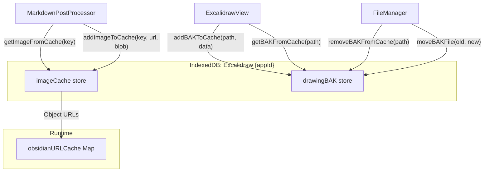
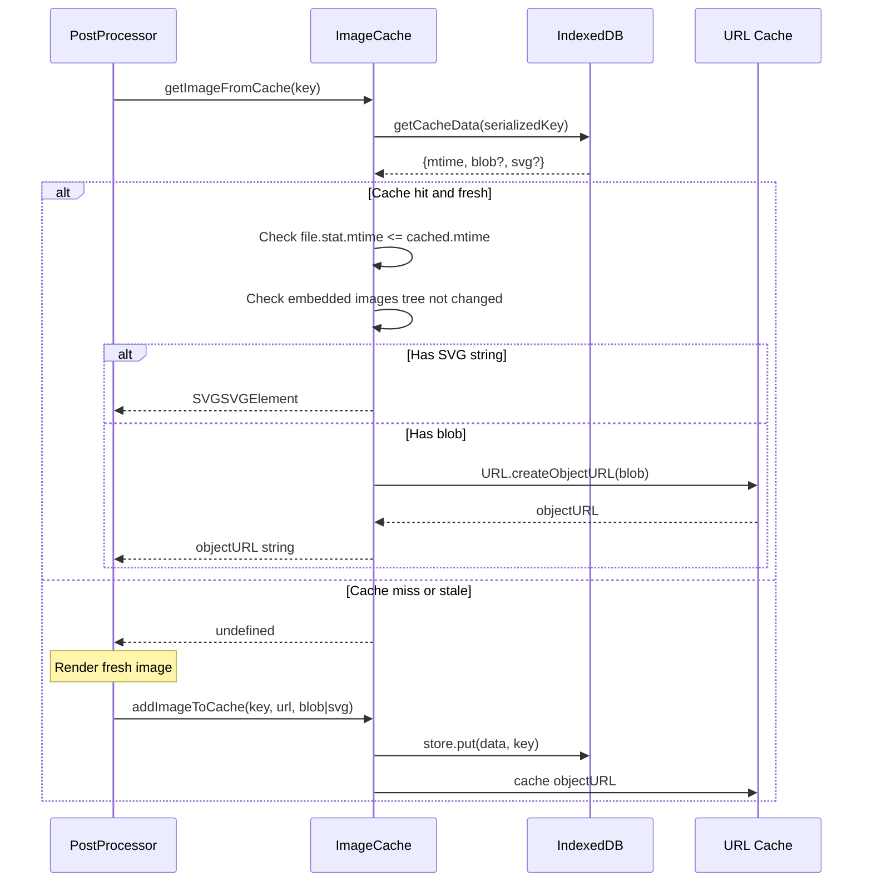
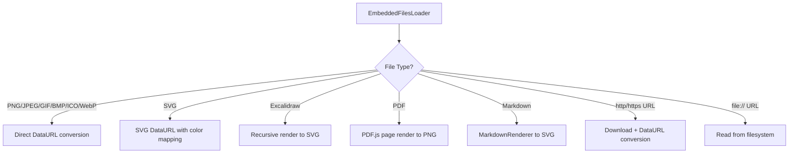
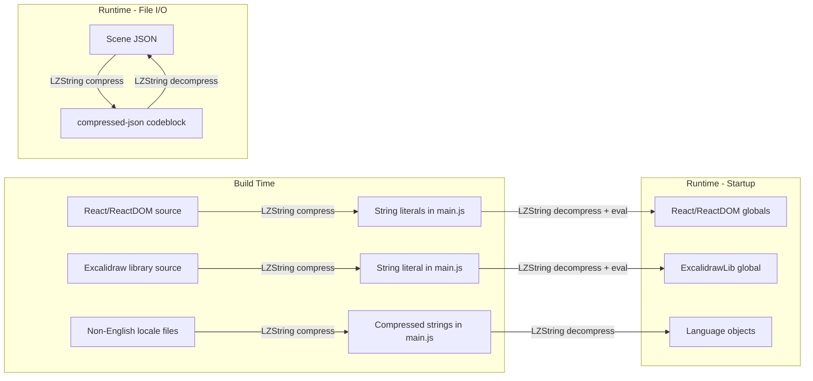
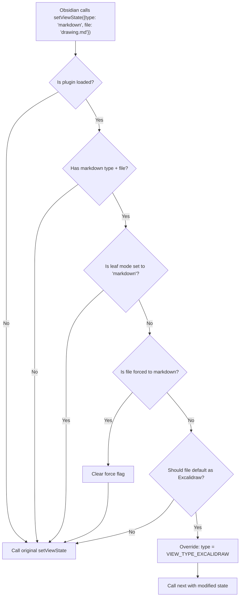
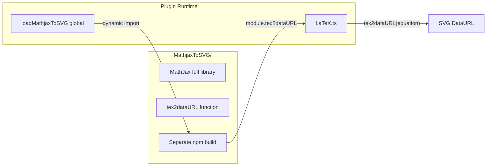

# Advanced Topics -- Deep Cuts & Edge Cases

This document covers the sophisticated subsystems that power the Excalidraw plugin's most advanced
features: image caching, embedded file loading, compression, monkey patching, PDF support, LaTeX
rendering, editor extensions, debug utilities, and more.

---

## Table of Contents

1. [Image Caching](#1-image-caching)
2. [EmbeddedFileLoader Deep Dive](#2-embeddedfileloader-deep-dive)
3. [Compression Architecture](#3-compression-architecture)
4. [Monkey Patches](#4-monkey-patches)
5. [Obsidian Canvas Integration](#5-obsidian-canvas-integration)
6. [PDF Support](#6-pdf-support)
7. [LaTeX Rendering](#7-latex-rendering)
8. [Editor Extensions (CodeMirror 6)](#8-editor-extensions-codemirror-6)
9. [Debug Utilities](#9-debug-utilities)
10. [Mermaid Diagram Support](#10-mermaid-diagram-support)
11. [Font System](#11-font-system)
12. [Color Mapping for Embeds](#12-color-mapping-for-embeds)
13. [Error Handling Architecture](#13-error-handling-architecture)
14. [Backup and Crash Recovery](#14-backup-and-crash-recovery)

---

## 1. Image Caching

**File:** `src/shared/ImageCache.ts` (525 lines)

### Architecture Overview

The image cache uses **IndexedDB** (not localStorage) to persistently store rendered previews of
Excalidraw drawings. This dramatically improves performance for reading mode, since without the
cache, every `![[drawing]]` embed would require a full scene render.



### Object Stores

| Store | Purpose | Key | Value |
|---|---|---|---|
| `imageCache` | Rendered SVG/PNG previews for reading mode | Composite string key | `{ mtime: number, blob?: Blob, svg?: string }` |
| `drawingBAK` | Backup copies of drawing scene data | File path (string) | JSON string of the drawing |

### Cache Key Structure

```typescript
// src/shared/ImageCache.ts:16-25
export type ImageKey = {
  filepath: string;
  blockref: string;
  sectionref: string;
  isDark: boolean;
  previewImageType: PreviewImageType;
  scale: number;
  isTransparent: boolean;
  inlineFonts: boolean;
} & FILENAMEPARTS;
```

The key is serialized into a string (line 27-36):

```
filepath#blockref#sectionref#isDark#hasGroupref#hasArearef#hasFrameref#
hasClippedFrameref#hasSectionref#inlineFonts#previewImageType#scale[#t]
```

Example: `drawings/my-drawing.md##0#false#false#false#false#false#true#1#1`

### Cache Lifecycle



### Initialization

```typescript
// src/shared/ImageCache.ts:72-165
public async initializeDB(plugin: ExcalidrawPlugin): Promise<void> {
  // Opens IndexedDB with name "Excalidraw {appId}"
  // Creates object stores if they don't exist
  // Schedules cache purges:
  //   - purgeInvalidCacheFiles: 60 seconds after init
  //   - purgeInvalidBackupFiles: 120 seconds after init
}
```

The 60/120 second delays are intentional -- purging is deferred to avoid slowing down startup.

### Cache Purging

**Image cache purge** (`purgeInvalidCacheFiles`, line 167-217):
- Iterates all cache entries via cursor
- Deletes entries where:
  - The key format is legacy (fewer `#` separators than current format)
  - The file no longer exists in the vault
  - The file has been modified since the cache entry was created
  - The entry has neither blob nor SVG data

**Backup purge** (`purgeInvalidBackupFiles`, line 219-259):
- Iterates all backup entries
- Deletes entries where the file no longer exists in the vault

### Performance: Race Condition on First Access

During the first access after startup, the cache might be slow to respond (IndexedDB is
initializing). The code handles this with a timeout race:

```typescript
// src/shared/ImageCache.ts:312-319
const cachedData = this.fullyInitialized
  ? await this.getCacheData(key)
  : await Promise.race([
      this.getCacheData(key),
      new Promise<undefined>((_, reject) => setTimeout(() => {
        reject(undefined);
      }, 100))
    ]);
this.fullyInitialized = true;
```

The first access has a 100ms timeout. If IndexedDB does not respond in time, the cache returns
`undefined` and the image is rendered fresh (then cached).

### objectURL Management

The cache maintains an in-memory map (`obsidanURLCache`) of `objectURL`s created from blobs:

```typescript
// src/shared/ImageCache.ts:47
private obsidanURLCache = new Map<string, string>();
```

When the cache is destroyed, all objectURLs are revoked to prevent memory leaks:

```typescript
// src/shared/ImageCache.ts:58
this.obsidanURLCache.forEach((url) => URL.revokeObjectURL(url));
```

### Legacy LocalStorage Cleanup

Early versions of the plugin used `localStorage` for caching. The module includes automatic
cleanup code that runs once per vault:

```typescript
// src/shared/ImageCache.ts:482-525
export const purgeLegacyLocalStorageImageCache = (): string | null => {
  // Checks for a purge marker in localStorage
  // If not found, scans all localStorage keys for legacy cache entries
  // Deletes them and sets the marker
};
```

This is invoked at module load time (line 523-525).

---

## 2. EmbeddedFileLoader Deep Dive

**File:** `src/shared/EmbeddedFileLoader.ts` (~800+ lines)

### Architecture

The `EmbeddedFilesLoader` is responsible for loading all types of embedded content in Excalidraw
drawings: images, PDFs, Excalidraw files, markdown files, URLs, and local files.



### EmbeddedFile Class (line 122-288)

Represents a single embedded file. Key properties:

```typescript
// src/shared/EmbeddedFileLoader.ts:122-139
export class EmbeddedFile {
  public file: TFile = null;
  public isSVGwithBitmap: boolean = false;
  private img: string = "";            // base64 (light theme)
  private imgInverted: string = "";    // base64 (dark theme)
  public mtime: number = 0;
  public mimeType: MimeType;
  public size: Size = { height: 0, width: 0 };
  public linkParts: LinkParts;
  public filenameparts: FILENAMEPARTS;
  public isHyperLink: boolean = false;
  public isLocalLink: boolean = false;
  public hyperlink: DataURL;
  public colorMap: ColorMap | null = null;
  public pdfPageViewProps: PDFPageViewProps;
}
```

**Dual image storage:** SVGs that contain embedded bitmaps (`isSVGwithBitmap = true`) need
separate light and dark versions because the bitmap colors cannot be inverted with a CSS filter.
Hence `img` (light) and `imgInverted` (dark).

### File Type Resolution

The constructor resolves the file path and determines the type:

```typescript
// src/shared/EmbeddedFileLoader.ts:157-199
// Hyperlinks: http://, https://, ftp://, ftps://
if (imgPath.startsWith("https://") || ...) {
  this.isHyperLink = true;
  this.hyperlink = imgPath as DataURL;
  return;
}

// Local file links: file://
if (imgPath.startsWith("file://")) {
  this.isLocalLink = true;
  this.hyperlink = imgPath as DataURL;
  return;
}

// Vault files: resolve via Obsidian's metadata cache
this.file = this.plugin.app.metadataCache.getFirstLinkpathDest(
  this.linkParts.path, hostPath
);
```

### Recursion Guard

When Excalidraw drawings embed other Excalidraw drawings, infinite loops are possible (A embeds B,
B embeds A). The loader prevents this with a depth parameter:

```typescript
// Passed through createSVG() calls:
// depth starts at 0, increments each recursion
const svg = await createSVG(
  file.path, false, exportSettings, this,
  forceTheme, null, null, elements, this.plugin,
  depth + 1,  // <-- incremented
  getExportPadding(this.plugin, file),
);
```

Additionally, for markdown embeds, a module-level Set acts as a watchdog:

```typescript
// src/shared/EmbeddedFileLoader.ts:51
const markdownRendererRecursionWatchdog = new Set<TFile>();
```

The file is added to the Set before rendering and removed after. If the file is already in the
Set, rendering is aborted.

### Color Mapping

For SVG and Excalidraw embeds, colors can be remapped between themes:

```typescript
// src/shared/EmbeddedFileLoader.ts:61-120
const replaceSVGColors = (svg: SVGSVGElement | string, colorMap: ColorMap | null) => {
  if (!colorMap) return svg;
  // For each [oldColor, newColor] in colorMap:
  //   Replace fill="oldColor" with fill="newColor"
  //   Replace stroke="oldColor" with stroke="newColor"
  //   Handle both attribute and style-based colors
};
```

Color maps are specified in link syntax:
```
[[file.excalidraw|colorMap={"#000000":"#ffffff","#ffffff":"#000000"}]]
```

### Excalidraw SVG Generation (line 332-473)

When an embedded file IS an Excalidraw drawing, `getExcalidrawSVG()` renders it:

1. Determines export settings (background, theme, mask mode)
2. Checks the image cache for a pre-rendered SVG
3. If not cached: calls `createSVG()` with the loader itself (enabling recursive loading)
4. Applies color mapping if specified
5. Handles bitmap inversion for dark mode:
   - Finds all `<image>` elements that are not SVG
   - Applies `THEME_FILTER` to their `<use>` references
6. Caches the result

```typescript
// src/shared/EmbeddedFileLoader.ts:422-437
// Bitmap inversion for dark theme
const imageList = svg.querySelectorAll("image:not([href^='data:image/svg'])");
if (imageList.length > 0) {
  hasSVGwithBitmap = true;
}
if (hasSVGwithBitmap && isDark && !Boolean(maybeSVG)) {
  imageList.forEach((i) => {
    const id = i.parentElement?.id;
    if (id.endsWith("-invert-bitmap")) return;
    svg.querySelectorAll(`use[href='#${id}']`).forEach((u) => {
      u.setAttribute("filter", THEME_FILTER);
    });
  });
}
```

### PDF Document Management

The loader maintains a per-instance map of loaded PDF documents:

```typescript
// src/shared/EmbeddedFileLoader.ts:291-292
private pdfDocsMap: Map<string, any> = new Map();
private pdfDocs: Set<any> = new Set();
```

After each `getObsidianImage()` call, the PDF documents are destroyed in `finally`:

```typescript
// src/shared/EmbeddedFileLoader.ts:316-330
public async getObsidianImage(inFile, depth) {
  try {
    return await this._getObsidianImage(inFile, depth);
  } finally {
    this.emptyPDFDocsMap();  // Destroy all loaded PDFs
  }
}
```

---

## 3. Compression Architecture

### Overview

LZString compression is used pervasively throughout the codebase for three distinct purposes:



### Scene Data Compression

When `settings.compress` is `true` (default), scene JSON is compressed before saving:

**Markdown format:**
````markdown
## Drawing
```compressed-json
H4sIAAAAAAAA/+1dW3PbNhZ+...compressed base64...
```
%%
````

vs. uncompressed:
````markdown
## Drawing
```json
{
  "type": "excalidraw",
  "version": 2,
  "source": "...",
  "elements": [...]
}
```
%%
````

### Web Worker for Compression

**File:** `src/shared/Workers/compression-worker.ts` (121 lines)

Compression can be CPU-intensive for large drawings. A Web Worker runs compression off the main
thread:

```typescript
// src/shared/Workers/compression-worker.ts:49-55
let worker: Worker | null = null;

export function initCompressionWorker() {
  if (!worker) {
    worker = new Worker(createWorkerBlob(workerCode));
  }
}
```

The worker is created from a Blob URL containing inlined LZString source code (line 12). This
avoids needing a separate worker file.

### Worker Communication

```typescript
// src/shared/Workers/compression-worker.ts:63-100
export async function runCompressionWorker(
  data: string,
  action: 'compress' | 'decompress'
): Promise<string> {
  const messageId = messageCounter++;
  return new Promise((resolve, reject) => {
    pendingOperations.set(messageId, { resolve, reject });
    worker.postMessage({ messageId, data, action });
  });
}
```

Multiple concurrent operations are supported via `messageId` tracking. Each operation gets a
unique ID, and the response handler matches responses to their pending promises:

```typescript
worker.onmessage = function(e) {
  const { messageId, compressed, decompressed, error } = e.data;
  const handlers = pendingOperations.get(messageId);
  if (handlers) {
    if (error) handlers.reject(new Error(error));
    else handlers.resolve(compressed || decompressed);
    pendingOperations.delete(messageId);
  }
};
```

### Worker Support Detection

```typescript
// src/shared/Workers/compression-worker.ts:107-120
export let IS_WORKER_SUPPORTED = false;
function canCreateWorkerFromBlob() {
  try {
    const blob = new Blob(["self.onmessage = function() {}"]);
    const url = URL.createObjectURL(blob);
    const worker = new Worker(url);
    worker.terminate();
    URL.revokeObjectURL(url);
    IS_WORKER_SUPPORTED = true;
  } catch (e) {
    IS_WORKER_SUPPORTED = false;
  }
}
canCreateWorkerFromBlob();
```

On platforms where Blob Workers are not supported (some mobile WebViews), the flag is `false`
and compression falls back to the main thread.

### Compression in the Worker

The worker formats compressed output in 256-character chunks separated by double newlines:

```javascript
// Inside the worker (line 19-24):
const compressed = LZString.compressToBase64(data);
let result = '';
const chunkSize = 256;
for (let i = 0; i < compressed.length; i += chunkSize) {
  result += compressed.slice(i, i + chunkSize) + '\n\n';
}
```

This chunking makes the compressed data more readable in the markdown file and avoids extremely
long lines.

### Language Compression

Non-English locale files are compressed at build time by the rollup postprocess plugin. At
runtime, `PLUGIN_LANGUAGES` is a compressed string that is decompressed to produce the language
objects.

---

## 4. Monkey Patches

**File:** `src/core/main.ts:963-1063`

### What Is Monkey Patching?

Monkey patching is the technique of modifying or extending existing methods at runtime. The plugin
uses the `monkey-around` npm package, which provides safe patching with automatic cleanup.

```typescript
import { around, dedupe } from "monkey-around";
```

### Primary Patch: WorkspaceLeaf.setViewState()

**Location:** `src/core/main.ts:1021-1060`

This is the most important monkey patch. It intercepts Obsidian's view state changes to force
Excalidraw files to open in `ExcalidrawView` instead of `MarkdownView`.

```typescript
setViewState(next) {
  return function (state: ViewState, ...rest: any[]) {
    const markdownViewLoaded =
      self._loaded &&              // Plugin is running
      state.type === "markdown" && // Obsidian wants markdown view
      state.state?.file;           // Has a file

    if (
      markdownViewLoaded &&
      self.excalidrawFileModes[this.id || state.state.file] !== "markdown"
    ) {
      const filepath = state.state.file as string;
      if (
        self.forceToOpenInMarkdownFilepath !== filepath &&
        fileShouldDefaultAsExcalidraw(filepath, this.app)
      ) {
        // Override: open as Excalidraw instead of Markdown
        const newState = { ...state, type: VIEW_TYPE_EXCALIDRAW };
        self.excalidrawFileModes[filepath] = VIEW_TYPE_EXCALIDRAW;
        return next.apply(this, [newState, ...rest]);
      }
      self.forceToOpenInMarkdownFilepath = null;
    }

    // For markdown-loaded Excalidraw files: fold the data section
    if (markdownViewLoaded) {
      setTimeout(() => {
        foldExcalidrawSection(leaf.view);
      }, 500);
    }

    return next.apply(this, [state, ...rest]);
  };
}
```

**Decision flow:**



### Patch: WorkspaceLeaf.detach()

**Location:** `src/core/main.ts:1006-1019`

Cleans up the `excalidrawFileModes` entry when a leaf is closed:

```typescript
detach(next) {
  return function () {
    const state = this.view?.getState();
    if (state?.file && self.excalidrawFileModes[this.id || state.file]) {
      delete self.excalidrawFileModes[this.id || state.file];
    }
    return next.apply(this);
  };
}
```

### Patch: Workspace.getActiveViewOfType()

**Location:** `src/core/main.ts:967-987`

Provides compatibility with the Templater plugin. When Templater calls
`getActiveViewOfType(MarkdownView)` while an Excalidraw view is active, this patch checks if
there is an active embeddable (an embedded markdown file being edited inside Excalidraw) and
returns its editor:

```typescript
getActiveViewOfType(old) {
  return dedupe(key, old, function (...args) {
    const result = old.apply(this, args);
    const maybeEAView = self.app?.workspace?.activeLeaf?.view;
    if (!(maybeEAView instanceof ExcalidrawView)) return result;

    // Check if caller is Templater
    if (!isCallerFromTemplaterPlugin(new Error().stack)) return result;

    // If there's an active embeddable being edited, return its editor
    const leafOrNode = maybeEAView.getActiveEmbeddable();
    if (leafOrNode?.node?.isEditing) {
      return { file: leafOrNode.node.file, editor: leafOrNode.node.child.editor };
    }
    return result;
  });
}
```

### Patch: WorkspaceLeaf.getRoot() (Hover Editor compatibility)

**Location:** `src/core/main.ts:989-998`

Only applied if the "Hover Editor" plugin is NOT installed:

```typescript
getRoot(old) {
  return function () {
    const top = old.call(this);
    return top.getRoot === this.getRoot ? top : top.getRoot();
  };
}
```

### Why Monkey Patching?

Obsidian does not provide an API for:
- "Always open files with this frontmatter in this view type"
- "Intercept view creation for certain file types"

The monkey patch is the ONLY way to achieve this behavior. The Kanban plugin uses the same
approach (credited in comment at line 387).

### Cleanup

All patches are registered via `this.register(around(...))`, which means Obsidian's cleanup
mechanism automatically removes them when the plugin is unloaded.

---

## 5. Obsidian Canvas Integration

**File:** `src/view/managers/CanvasNodeFactory.ts`

### Purpose

Creates custom "canvas nodes" -- Obsidian's internal canvas objects -- for embedding editable
content within Excalidraw. This allows markdown files, PDFs, and other content to be edited
in-place inside an Excalidraw drawing.

### How It Works

```typescript
// src/view/managers/CanvasNodeFactory.ts:40-67
export class CanvasNodeFactory {
  leaf: WorkspaceLeaf;
  canvas: ObsidianCanvas;
  nodes = new Map<string, ObsidianCanvasNode>();

  public async initialize() {
    const canvasPlugin = app.internalPlugins.plugins["canvas"];
    if (!canvasPlugin._loaded) {
      await canvasPlugin.load();
    }
    // Create a hidden WorkspaceSplit to host canvas nodes
    const rootSplit = new WorkspaceSplit(app.workspace, "vertical");
    this.leaf = app.workspace.createLeafInParent(rootSplit, 0);
    this.canvas = canvasPlugin.views.canvas(this.leaf).canvas;
  }
}
```

The factory:
1. Loads Obsidian's internal canvas plugin
2. Creates a hidden workspace split
3. Uses the canvas plugin's API to create file nodes
4. Attaches nodes to container elements inside Excalidraw

### ObsidianCanvasNode Interface

```typescript
// src/view/managers/CanvasNodeFactory.ts:31-38
export interface ObsidianCanvasNode {
  startEditing: Function;
  child: any;
  isEditing: boolean;
  file: TFile;
  detach: Function;
  isEditable: Function;
}
```

### createFileNote (line 69+)

Creates a canvas node for a specific file:

```typescript
public createFileNote(file: TFile, subpath: string,
  containerEl: HTMLDivElement, elementId: string): ObsidianCanvasNode {
  // Remove existing node for this element if any
  if (this.nodes.has(elementId)) {
    this.canvas.removeNode(this.nodes.get(elementId));
    this.nodes.delete(elementId);
  }
  // Create Obsidian canvas file node
  const node = this.canvas.createFileNode({
    pos: {x: 0, y: 0}, file, subpath, save: false
  });
  node.setFilePath(file.path, subpath);
  node.render();
  // Remove the content blocker (allows editing)
  node.containerEl.querySelector(".canvas-node-content-blocker")?.remove();
  // Attach to the container in the Excalidraw view
  containerEl.appendChild(node.contentEl);
  this.nodes.set(elementId, node);
  return node;
}
```

---

## 6. PDF Support

### Overview

PDF support is one of the most complex features. PDFs can be:
1. Embedded as full documents in embeddable elements
2. Embedded as rendered page images
3. Cropped and annotated

### Page Rendering

PDF pages are rendered via PDF.js (Obsidian's built-in PDF renderer). The `getPDFDoc()` function
in `src/utils/fileUtils.ts` loads a PDF document, and individual pages are rendered to canvas
elements, then converted to PNG DataURLs.

### Page Selection Syntax

```
[[file.pdf#page=3]]           -- Embed page 3 as image
[[file.pdf#page=3&rect=...]]  -- Embed page 3 with crop rectangle
```

### PDFPageViewProps

Each embedded PDF page stores its rendering properties:

```typescript
// From src/types/embeddedFileLoaderTypes.ts
type PDFPageViewProps = {
  page: number;
  rect?: { x: number; y: number; width: number; height: number };
  rotation?: number;
};
```

These are stored on the `EmbeddedFile` instance (`pdfPageViewProps` field, line 139 of
`EmbeddedFileLoader.ts`).

### PDF Document Lifecycle

The `EmbeddedFilesLoader` maintains a map of loaded PDF documents per loading session:

```typescript
// src/shared/EmbeddedFileLoader.ts:291-292
private pdfDocsMap: Map<string, any> = new Map();
private pdfDocs: Set<any> = new Set();
```

Documents are destroyed after each `getObsidianImage()` call in the `finally` block:

```typescript
public emptyPDFDocsMap() {
  this.pdfDocs.forEach((pdfDoc) => {
    try { pdfDoc.destroy(); } catch (e) { ... }
  });
  this.pdfDocs.clear();
  this.pdfDocsMap.clear();
}
```

### PDF Annotation Workflow

When a user runs the "Annotate Image" command on a PDF embed:
1. The active PDF page number is determined via `getActivePDFPageNumberFromPDFView()`
2. A new Excalidraw drawing is created with the PDF page as a locked background image
3. The user draws annotations on top
4. The original link is updated to point to the annotation file

### PDF Crop Workflow

The "Crop Image" command for PDFs:
1. Gets the active page from the embedded PDF viewer
2. Creates a crop file using `carveOutPDF()` from `src/utils/carveout.ts`
3. Opens the crop editor (a specialized Excalidraw view with crop handles)

---

## 7. LaTeX Rendering

**File:** `src/shared/LaTeX.ts` (71 lines)

### Architecture

LaTeX rendering uses MathJax, loaded on demand from a separately built sub-package:



### Lazy Loading

MathJax is large. It is loaded only when the user first inserts or renders a LaTeX equation:

```typescript
// src/shared/LaTeX.ts:8-27
declare const loadMathjaxToSVG: Function;
let mathjaxLoaded = false;
let tex2dataURLExternal: Function;
let clearVariables: Function;
let loadMathJaxPromise: Promise<void> | null = null;

const loadMathJax = async () => {
  if (!loadMathJaxPromise) {
    loadMathJaxPromise = (async () => {
      if (!mathjaxLoaded) {
        const module = await loadMathjaxToSVG();
        tex2dataURLExternal = module.tex2dataURL;
        clearVariables = module.clearMathJaxVariables;
        mathjaxLoaded = true;
      }
    })();
  }
  return loadMathJaxPromise;
};
```

The `loadMathJaxPromise` pattern ensures the library is loaded only once, even if multiple
equations trigger loading simultaneously.

### tex2dataURL

```typescript
// src/shared/LaTeX.ts:52-65
export async function tex2dataURL(
  tex: string,
  scale: number = 4,
  plugin: ExcalidrawPlugin,
): Promise<{
  mimeType: MimeType;
  fileId: FileId;
  dataURL: DataURL;
  created: number;
  size: { height: number; width: number };
}> {
  await loadMathJax();
  return tex2dataURLExternal(tex, scale, plugin);
}
```

Returns a DataURL (base64-encoded SVG) along with metadata about the rendered equation.

### Equation Storage

Equations are stored in the drawing's `equationsMaster` map:

```typescript
// src/core/main.ts:139
public equationsMaster: Map<FileId, string> = null; // fileId -> formula
```

In the markdown file, equations appear in the "Embedded Files" section as image references. The
rendered SVG is stored as a DataURL in the image element's data.

### updateEquation

Called when a user edits an existing equation:

```typescript
// src/shared/LaTeX.ts:29-50
export const updateEquation = async (
  equation: string, fileId: string, view: ExcalidrawView, addFiles: Function
) => {
  await loadMathJax();
  const data = await tex2dataURLExternal(equation, 4, view.app);
  if (data) {
    const files = [{
      mimeType: data.mimeType, id: fileId as FileId,
      dataURL: data.dataURL, created: data.created,
      size: data.size, hasSVGwithBitmap: false, shouldScale: true,
    }];
    addFiles(files, view);
  }
};
```

### clearMathJaxVariables

Called during plugin unload to free MathJax memory:

```typescript
// src/shared/LaTeX.ts:67-71
export const clearMathJaxVariables = () => {
  if (clearVariables) {
    clearVariables();
  }
};
```

**Called from:** `src/core/main.ts:1252`

---

## 8. Editor Extensions (CodeMirror 6)

### EditorHandler

**File:** `src/core/editor/EditorHandler.ts` (53 lines)

Manages CodeMirror 6 extensions registered by the plugin:

```typescript
// src/core/editor/EditorHandler.ts:7-9
const editorExtensions: {[key: string]: Extension} = {
  [EDITOR_FADEOUT]: HideTextBetweenCommentsExtension,
};
```

Currently there is one extension: `fadeOutExcalidrawMarkup`.

```typescript
// src/core/editor/EditorHandler.ts:22-26
setup(): void {
  this.plugin.registerEditorExtension(this.activeEditorExtensions);
  this.updateCMExtensionState(
    EDITOR_FADEOUT,
    this.plugin.settings.fadeOutExcalidrawMarkup
  );
}
```

### Fadeout Extension

**File:** `src/core/editor/Fadeout.ts` (66 lines)

Hides the Excalidraw data section when viewing an Excalidraw file in markdown editing mode. This
prevents users from accidentally editing the JSON data.

```typescript
// src/core/editor/Fadeout.ts:4-8
const o30 = Decoration.line({ attributes: {class: "ex-opacity-30"} });
const o15 = Decoration.line({ attributes: {class: "ex-opacity-15"} });
const o8  = Decoration.line({ attributes: {class: "ex-opacity-8"} });
const o5  = Decoration.line({ attributes: {class: "ex-opacity-5"} });
const o0  = Decoration.line({ attributes: {class: "ex-opacity-0"} });
```

**Opacity gradient:**

| Lines from marker | Opacity | CSS Class |
|---|---|---|
| Line 0 (the `%%` marker) | 30% | `ex-opacity-30` |
| Line 1 | 15% | `ex-opacity-15` |
| Lines 2-5 | 8% | `ex-opacity-8` |
| Lines 6-11 | 5% | `ex-opacity-5` |
| Line 12+ | 0% (invisible) | `ex-opacity-0` |

### How the Marker Is Found

The extension searches for three possible markers:

```typescript
// src/core/editor/Fadeout.ts:14-16
reExcalidrawData = /^%%(?:\r\n|\r|\n)# Excalidraw Data$/gm;
reTextElements = /^%%(?:\r\n|\r|\n)# Text Elements$/gm;
reDrawing = /^%%(?:\r\n|\r|\n)##? Drawing$/gm;
```

It first checks for `# Excalidraw Data`, then falls back to `# Text Elements`, then to
`## Drawing`. The first match determines where fading begins.

### Implementation as CM6 ViewPlugin

```typescript
// src/core/editor/Fadeout.ts:10-65
export const HideTextBetweenCommentsExtension = ViewPlugin.fromClass(
  class {
    decorations: DecorationSet;
    isExcalidraw: boolean;

    constructor(view: EditorView) {
      // Check if this is an Excalidraw file by looking for frontmatter
      this.isExcalidraw = view.state.doc.toString()
        .search(/^excalidraw-plugin: /m) > 0;
      if (!this.isExcalidraw) {
        this.decorations = Decoration.none;
        return;
      }
      this.decorations = this.updateDecorations(view);
    }

    updateDecorations(view: EditorView) {
      // Find the start marker
      // Build a RangeSet of line decorations with gradient opacity
      // Return the decoration set
    }

    update(update: ViewUpdate) {
      if (this.isExcalidraw && update.docChanged) {
        this.decorations = this.updateDecorations(update.view);
      }
    }
  },
  { decorations: (x) => x.decorations }
);
```

### Toggling the Extension

```typescript
// src/core/editor/EditorHandler.ts:28-48
updateCMExtensionState(extensionIdentifier: string, extensionState: boolean) {
  const extension = editorExtensions[extensionIdentifier];
  if (extensionState == true) {
    this.activeEditorExtensions.push(extension);
    // Tag it with an ID for later removal
    this.activeEditorExtensions[this.activeEditorExtensions.length - 1].exID = extensionIdentifier;
  } else {
    // Find and remove by ID
    for (let i = 0; i < this.activeEditorExtensions.length; i++) {
      if (ext.exID === extensionIdentifier) {
        this.activeEditorExtensions.splice(i, 1);
        break;
      }
    }
  }
  this.plugin.app.workspace.updateOptions();
}
```

---

## 9. Debug Utilities

**File:** `src/utils/debugHelper.ts` (74 lines)

### DEBUGGING Flag

```typescript
// src/utils/debugHelper.ts:3-9
export function setDebugging(value: boolean) {
  DEBUGGING = (process.env.NODE_ENV === 'development') ? value : false;
}
export let DEBUGGING = false;
```

In production builds, `setDebugging()` always sets `DEBUGGING = false` regardless of input.
The `process.env.NODE_ENV === 'development'` check is resolved at build time by rollup's
replace plugin.

### debug() Function

```typescript
// src/utils/debugHelper.ts:12-15
export const debug = (fn: Function, fnName: string, ...messages: unknown[]) => {
  console.log(fnName, ...messages);
};
```

The first argument `fn` is the function being debugged (useful for stack traces in dev tools).
The second argument is a human-readable name. Additional arguments are logged.

### Usage Pattern Throughout Codebase

```typescript
(process.env.NODE_ENV === 'development') && DEBUGGING && debug(
  this.onActiveLeafChangeHandler,
  `onActiveLeafChangeEventHandler`,
  leaf
);
```

This three-part guard ensures:
1. `process.env.NODE_ENV === 'development'` -- stripped in production (dead code elimination)
2. `DEBUGGING` -- runtime toggle, can be enabled/disabled
3. `debug(...)` -- the actual log call

### Timestamp Utilities

For performance profiling:

```typescript
// src/utils/debugHelper.ts:17-38
let timestamp: number[] = [];
let tsOrigin: number = 0;

export function tsInit(msg: string) {
  tsOrigin = Date.now();
  timestamp = [tsOrigin, tsOrigin, tsOrigin, tsOrigin, tsOrigin];
  console.log("0ms: " + msg);
}

export function ts(msg: string, level: number) {
  const now = Date.now();
  const diff = now - timestamp[level];
  timestamp[level] = now;
  const elapsedFromOrigin = now - tsOrigin;
  console.log(`L${level} (${elapsedFromOrigin}ms) ${diff}ms: ${msg}`);
}
```

Supports 5 independent timer levels (L0-L4) for nested timing.

### CustomMutationObserver

```typescript
// src/utils/debugHelper.ts:40-74
export class CustomMutationObserver {
  constructor(callback: MutationCallback, name: string) { ... }

  observe(target: Node, options: MutationObserverInit) {
    const wrappedCallback: MutationCallback = async (mutationsList, observer) => {
      const startTime = performance.now();
      await this.originalCallback(mutationsList, observer);
      const endTime = performance.now();
      const executionTime = endTime - startTime;
      if (executionTime > durationThreshold) {
        console.log(
          `Excalidraw ${this.name} MutationObserver callback took ${executionTime}ms`
        );
      }
    };
    this.observer = new MutationObserver(wrappedCallback);
    this.observer.observe(target, options);
  }

  disconnect() { ... }
}
```

Wraps a standard `MutationObserver` with timing. Used by all observers in the ObserverManager
when `DEBUGGING` is true.

### durationThreshold

```typescript
// src/utils/debugHelper.ts:1
export const durationThreshold = 0; // ms
```

Currently set to 0, meaning ALL observer callbacks are logged in debug mode. Change this to
filter out fast callbacks (e.g., set to 5 to only log callbacks taking >5ms).

---

## 10. Mermaid Diagram Support

### Overview

Mermaid diagrams can be embedded in Excalidraw drawings. Text elements containing mermaid syntax
are detected and either:
1. Converted to native Excalidraw elements via `mermaidToExcalidraw()`
2. Rendered as SVG images

### Tracking

The plugin maintains a master map of all mermaid diagrams:

```typescript
// src/core/main.ts:140
public mermaidsMaster: Map<FileId, string> = null; // fileId -> mermaidText
```

### Mermaid Loading

Mermaid is loaded lazily via:

```typescript
// src/core/main.ts:241-243
public async getMermaid() {
  return await loadMermaid();
}
```

The `loadMermaid` function is imported from `src/constants/constants.ts` and handles the dynamic
import of the mermaid library.

### Mermaid Processing Utilities

From `src/utils/mermaidUtils.ts`:

| Function | Purpose |
|---|---|
| `shouldRenderMermaid(text)` | Detects if text contains mermaid syntax |
| `getMermaidText(element)` | Extracts mermaid code from an element |
| `getMermaidImageElements(...)` | Returns mermaid elements that need rendering |

### mermaidToExcalidraw

The `mermaidToExcalidraw` function (imported from `src/constants/constants.ts`) converts mermaid
diagrams to native Excalidraw elements (rectangles, arrows, text). This is a feature from the
Excalidraw library itself.

---

## 11. Font System

### Overview

The plugin handles custom fonts in several ways:
1. **Fourth font ("Local Font")**: A user-configurable custom font loaded from the vault
2. **CJK fonts**: Chinese, Japanese, Korean font support loaded from vault assets
3. **Font metrics**: Measured and cached for proper text layout

### Font Initialization

**File:** `src/core/main.ts:538-593`

```typescript
public async initializeFonts() {
  // 1. Load CJK fonts
  const cjkFontDataURLs = await getCJKDataURLs(this);
  // Inject @font-face declarations for Xiaolai font

  // 2. Load fourth font from vault
  const font = await getFontDataURL(
    this.app,
    this.settings.experimantalFourthFont,
    "", "Local Font"
  );

  // 3. Measure font metrics
  let fontMetrics = await getFontMetrics(fourthFontDataURL, "Local Font");

  // 4. Register font with Excalidraw library
  this.packageManager.getPackageMap().forEach(({excalidrawLib}) => {
    excalidrawLib.registerLocalFont(
      {metrics: fontMetrics}, fourthFontDataURL
    );
  });

  // 5. Add @font-face to all open documents
  for (const ownerDocument of this.getOpenObsidianDocuments()) {
    await this.addFonts([
      `@font-face{font-family:'Local Font';src:url("${fourthFontDataURL}");...}`
    ], ownerDocument);
  }
}
```

### CJK Font Configuration

```typescript
// src/core/main.ts:251-264
public getCJKFontSettings() {
  const assetsFolder = this.settings.fontAssetsPath;
  if (typeof this.isLocalCJKFontAvailable === "undefined") {
    this.isLocalCJKFontAvailable = this.app.vault.getFiles()
      .some(f => f.path.startsWith(assetsFolder));
  }
  return {
    c: this.settings.loadChineseFonts,
    j: this.settings.loadJapaneseFonts,
    k: this.settings.loadKoreanFonts,
  };
}
```

### Multi-Window Font Loading

Fonts must be loaded into each window context. The `addFonts()` method (line 595-606) handles
this:

```typescript
public async addFonts(declarations: string[], ownerDocument: Document, styleId: string) {
  const newStylesheet = ownerDocument.createElement("style");
  newStylesheet.id = styleId;
  newStylesheet.textContent = declarations.join("");
  const oldStylesheet = ownerDocument.getElementById(styleId);
  ownerDocument.head.appendChild(newStylesheet);
  if (oldStylesheet) {
    ownerDocument.head.removeChild(oldStylesheet);
  }
  await ownerDocument.fonts.load('20px Local Font');
}
```

### Font Cleanup on Unload

```typescript
// src/core/main.ts:608-619
public removeFonts() {
  this.getOpenObsidianDocuments().forEach((ownerDocument) => {
    // Remove custom font stylesheet
    const oldCustomFont = ownerDocument.getElementById(FONTS_STYLE_ID);
    if (oldCustomFont) ownerDocument.head.removeChild(oldCustomFont);
    // Remove CJK font stylesheet
    const oldCJKFont = ownerDocument.getElementById(CJK_STYLE_ID);
    if (oldCJKFont) ownerDocument.head.removeChild(oldCJKFont);
  });
}
```

---

## 12. Color Mapping for Embeds

### Purpose

Color mapping allows embedded SVGs and Excalidraw drawings to have their colors remapped based
on the current theme. This is essential for maintaining readability when switching between light
and dark modes.

### Syntax

```
[[file.excalidraw|colorMap={"#000000":"#ffffff","#ffffff":"#000000"}]]
```

Special keys `"fill"` and `"stroke"` set the root SVG element's fill/stroke:

```
[[file.svg|colorMap={"fill":"red","stroke":"blue"}]]
```

### Implementation

```typescript
// src/shared/EmbeddedFileLoader.ts:61-120
const replaceSVGColors = (svg: SVGSVGElement | string, colorMap: ColorMap | null) => {
  if (!colorMap) return svg;

  if (typeof svg === 'string') {
    // String-based replacement for serialized SVGs
    for (const [oldColor, newColor] of Object.entries(colorMap)) {
      if (oldColor === "stroke" || oldColor === "fill") {
        // Special handling: set/replace attribute on root <svg>
      } else {
        // Replace fill="oldColor" and stroke="oldColor" globally
        svg = svg.replaceAll(new RegExp(`fill="${oldColor}"`, 'gi'), `fill="${newColor}"`);
        svg = svg.replaceAll(new RegExp(`stroke="${oldColor}"`, 'gi'), `stroke="${newColor}"`);
      }
    }
    return svg;
  }

  // DOM-based replacement for SVGSVGElement
  const childNodes = (node: ChildNode) => {
    if (node instanceof SVGElement) {
      const oldFill = node.getAttribute('fill')?.toLowerCase();
      const oldStroke = node.getAttribute('stroke')?.toLowerCase();
      if (oldFill && colorMap[oldFill]) node.setAttribute('fill', colorMap[oldFill]);
      if (oldStroke && colorMap[oldStroke]) node.setAttribute('stroke', colorMap[oldStroke]);
    }
    for (const child of node.childNodes) childNodes(child);
  };

  for (const child of svg.childNodes) childNodes(child);
  return svg;
};
```

### Where Color Maps Are Applied

1. **EmbeddedFile constructor** (line 141-151): Color map is parsed from `colorMapJSON`
2. **getExcalidrawSVG()** (line 396-419): Applied after SVG is generated
3. **filesMaster** on the plugin: stores `colorMapJSON` per file ID

```typescript
// src/core/main.ts:105-112
type FileMasterInfo = {
  isHyperLink: boolean;
  isLocalLink: boolean;
  path: string;
  hasSVGwithBitmap: boolean;
  blockrefData: string;
  colorMapJSON?: string;
};
```

---

## 13. Error Handling Architecture

### ErrorHandler

The `PackageManager` uses an `errorHandler` utility for safe evaluation and error wrapping:

```typescript
// Used in PackageManager:
errorHandler.safeEval(code, context, window);
errorHandler.wrapWithTryCatch(fn, context, fallback);
errorHandler.handleError(error, context);
```

### Safe Eval Pattern

Instead of raw `eval()`, the codebase uses:

```typescript
// src/core/managers/PackageManager.ts:30-34
excalidrawLib = errorHandler.safeEval(
  `(function() {${this.EXCALIDRAW_PACKAGE};return ExcalidrawLib;})()`,
  "PackageManager constructor - excalidrawLib initialization",
  window
);
```

This wraps eval in error handling and provides context information for debugging.

### Fallback Pattern

The PackageManager implements a fallback pattern for resilience:

```typescript
// src/core/managers/PackageManager.ts:150-161
return errorHandler.wrapWithTryCatch(
  () => { /* create package */ },
  "PackageManager.getPackage",
  this.fallbackPackage  // <-- fallback value if creation fails
);
```

If creating a new package for a window fails, the main window's package is returned as a
fallback. This prevents complete plugin failure when a popout window has issues.

### Error Logging

Throughout the codebase, errors are logged via:

```typescript
import { errorlog } from "src/utils/utils";

errorlog({
  where: "FileManager.renameEventHandler",
  fn: this.plugin.ea.onImageExportPathHook,
  error: e,
});
```

---

## 14. Backup and Crash Recovery

### BAK Cache

The `drawingBAK` object store in IndexedDB stores backup copies of drawing scene data:

```typescript
// src/shared/ImageCache.ts:383-391
public async addBAKToCache(filepath: string, data: BackupData): Promise<void> {
  if (!this.isReady()) return;
  const transaction = this.db.transaction(this.backupStoreName, "readwrite");
  const store = transaction.objectStore(this.backupStoreName);
  store.put(data, filepath);
}
```

### When BAK Is Saved

BAK data is saved by `ExcalidrawView` during the save process. The full scene JSON is stored
before any compression or serialization.

### Recovery Flow

When a drawing loads with empty or corrupt scene data:

1. The view detects the empty state
2. It queries `imageCache.getBAKFromCache(filepath)`
3. If a backup exists, the user is prompted to restore
4. The backup data is used to reconstruct the drawing

### BAK Maintenance

- **On file rename**: BAK is moved to the new path (`FileManager.moveBAKFile`, line 537-553)
- **On file delete**: BAK is removed (`FileManager.removeBAKFromCache`, line 527-535)
- **On startup**: Invalid BAK entries (files that no longer exist) are purged after 120 seconds
  (`ImageCache.purgeInvalidBackupFiles`, line 219-259)

### BAK vs Image Cache

| Aspect | Image Cache (`imageCache`) | BAK Cache (`drawingBAK`) |
|---|---|---|
| **Purpose** | Rendered preview images | Raw scene data backup |
| **Key** | Composite (path+theme+scale+...) | File path only |
| **Value** | Blob or SVG string | JSON string |
| **Purge after** | 60 seconds | 120 seconds |
| **Written by** | MarkdownPostProcessor, EmbeddedFilesLoader | ExcalidrawView.save() |
| **Read by** | MarkdownPostProcessor, EmbeddedFilesLoader | ExcalidrawView.load() |

### Crash Scenario Example

```
1. User opens drawing.md in Excalidraw
2. ExcalidrawView saves BAK to IndexedDB
3. User makes changes
4. Obsidian crashes (or sync corrupts the file)
5. User reopens Obsidian
6. drawing.md is empty or corrupt
7. ExcalidrawView detects empty scene
8. Checks IndexedDB for BAK
9. Found! Offers to restore
10. User accepts, drawing is recovered
```

This safety net is especially valuable for users of Obsidian Sync or other cloud sync services
where file corruption can occasionally occur.
